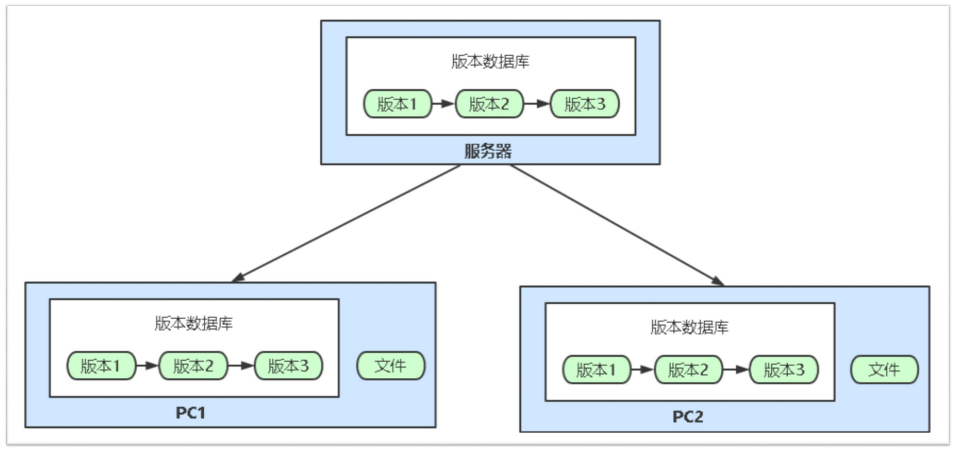

# Git

## 持续集成CI

1.开发的代码持续的集成到代码仓库里就是持续集成，不用等所有人都开发完毕在合并，可以多个开发人员同时工作。

2.开发将代码提交到代码仓库，由ci服务器自动将代码拉下来进行编译，测试，然后将结果返回给开发人员。

3.持续集成的目的是可以频繁的将开发的功能进行合并，提高工作效率。

## 持续交付CD

1.持续交付就是将编译开发好的代码持续的交付到测试环境进行测试。

2.在预发布环境我们可以对代码进行质量扫描和漏洞扫描，并且将测试结果返回给测试人员。

3.如果测试的代码有问题，测试人员就通知开发人员进行修复，如果没有问题则进入下一个部署环节。

## 持续部署CD

1.代码测试没有问题之后就可以进入预发布环境进行进一步测试，如果预发布环境也没有问题可以通过jenkins服务器持续的部署到生产服务器

2.如果新部署的服务发现有问题，通过jenkins服务器可以快速的回滚到正常的代码。

## 简介

git是一个分布式的版本控制软件




git安装：

详见：https://git-scm.com/book/zh/v2/%E8%B5%B7%E6%AD%A5-%E5%AE%89%E8%A3%85-Git

## git的使用

要想让git对一个目录进行版本控制需要以下步骤：

1. 进入目录

2. 初始化`git init`

3. 文件状态`git status`（新增和修改过的文件都是红色的）

4. 提交文件到暂存区`git add .`

5. 个人信息配置

   ```shell
   git config --global user.email "you@email.com"
   git config --global user.email "your name"
   ```

6. 生成版本`git commit -m '描述信息'`

7. 查看版本记录`git log`


扩展新功能：

```shell
git add .
git commit -m 'xxx'
```


回滚：

回滚到之前的版本

```shell
git log
git reset --hard 版本号
```

回滚到之后的版本

```shell
git reflog
git reset --hard 版本号
git reset --hard^ #回滚到上一个版本
```


分支：

可以把你的工作从开发主线上分离开来，以免影响开发主线

查看分支`git branch`

创建分支`git branch 分支名称`

切换分支`git checkout 分支名称`

合并指定分支到当前分支`git merge 要合并的分支`（切换分支再合并）

删除分支`git branch -d 分支名称`


上传代码到远程代码仓库：

给远程仓库起别名`git remote add origin 远程仓库地址`

向远程推送代码`git push -u origin 分支`

初次在公司电脑下载代码

```shell
git clone 远程仓库地址（内部已实现`git remote add origin 远程仓库地址`）
git checkout 分支
```

继续开发

```shell
git checkout dev
git merge master
修改代码
提交代码
git add .
git commit -m 'xxx'
git push origin dev
```


Tag标签管理

为了能清晰管理版本，在公司不会直接使用commit来做版本，会基于tag来实现：v1.0、v1.2、v2.0版本

```shell
git tag -a v1.0 -m '版本信息' #本地创建tag信息
git tag -d v1.0 #删除tag
git push origin --tags #将本地tag信息推送到远程仓库
git pull origin --tags #更新本地tag版本信息

git checkout v1.0 #切换tag
git clone -b v0.1 地址 #指定tag下载代码
```


## 多人协同开发工作流

**开发**

1. 注册gitlab账号

2. 被邀请加入组织（默认对组织中的项目有读取权限），成为某个项目的合作者

3. 在自己电脑下载代码并开发

   ```shell
   git clone https://github.com/oldboy-org/dbhot.git
   cd dbhot
   git checkout dev
   git checkout -b feature
   写代码……
   
   git add .
   git commit -m '斗地主功能开发完成'
   git push origin feature
   ```

**code review**

1. 配置代码review后才能合并到dev分支
2. 提交code review申请
3. 组长做code review

**提测上线**

1. 合并feature分支

   ```shell
   git checkout dev
   git merge feature
   ```

2. 在dev分支打tag

   ```shell
   git tag -a v2 -m '第二版斗地主功能'
   git push origin --tags
   ```

5. 部署dev分支到开发环境测试

4. QA测试通过，从dev生成release，并打上tag

5. merge到master分支，master打tag，部署到生产环境

   

   