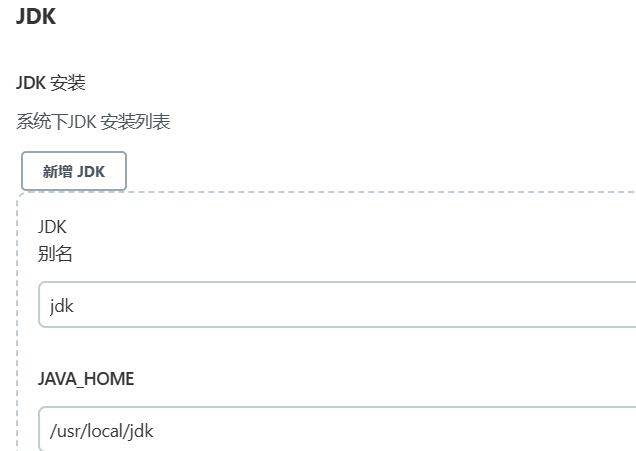

docker安装jenkins

```shell
docker run -u root --name jenkins-blueocean -d \
-p 8080:8080 -p 50000:50000 \
-v /usr/local/jenkins_home:/var/jenkins_home \
-v /var/run/docker.sock:/var/run/docker.sock \
--restart=always --privileged=true \
jenkinsci/blueocean

#参数含义
-u root：以root用户创建容器容器，否则容易出现权限问题
–name ：指定容器运行后的名字
-d：后台运行容器
-p：端口映射，宿主机:容器
-v：端口映射
–restart=always：跟随Docker自动重启，可以说是必须的
–privileged=true：让当前用户拥有root权限。


#提取初始密码
docker logs -f jenkins-blueocean
```


全局工具配置



