## jenkins工作流程

先定义一个流水线项目，指定项目的git位置

- 流水线启动
  - 先去git位置拉取代码
  - 解析代码里的jenkinsfile文件
  - 按照jenkinsfile指定的流水线开始加工项目

## 配置gitlab凭证

**为了免密git pull和push，需要配置gitlab凭证**

在jenkins服务器使用root用户生成公钥和私钥

```shell
ssh-keygen -t rsa
```

把生成的**公钥**放在Gitlab中

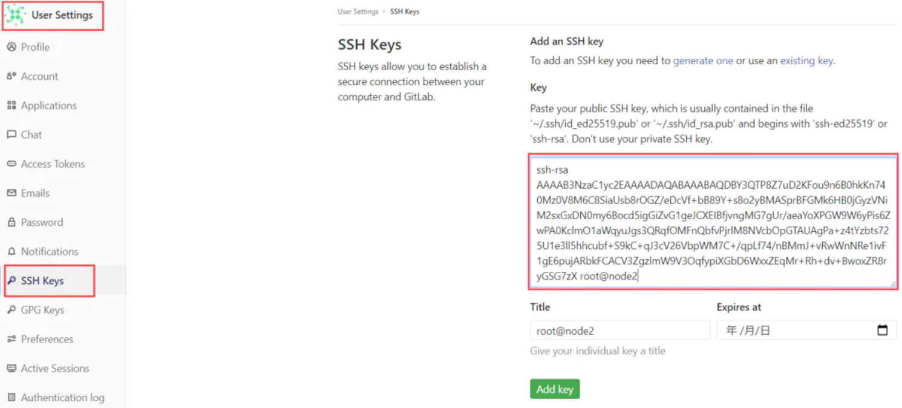

在Jenkins中添加凭证，配置**私钥**


**注意git地址要填写ssh协议的地址**

在jenkins的job里使用凭证**连接gitlab**：

配置前先说一个坑：

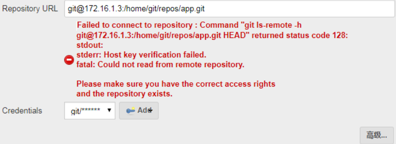

这是因为 jenkins 我们 yum 装的运行用户是 jenkins 用户，此处是 jenkins 用户去 git 仓库进行拉取，而 jenkins 用户的话默认是 /bin/false 的，不但不能登录，也没有 git 命令权限，所以肯定是失败的。

解决此问题两种办法：

- 更改jenkins用户为root用户；

- 更改jenkins用户为正常的普通用户/bin/bash，将其的公钥加入到git服务器的git用户中。

### 配置阿里云镜像仓库凭证

jenkins需要把构建好的docker镜像上传到镜像仓库

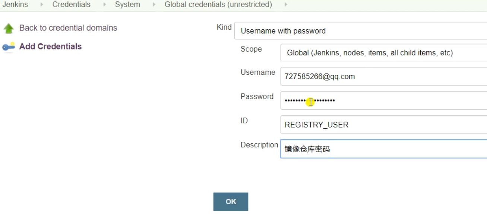

## 参数化构建

我们可以在jenkins定义变量，把jenkins的一些命令参数化，便于管理jenkinsfile


**choice parameter**

pipeline：

```groovy
pipeline {
    parameters {
        choice(name:'OP',choices:'publish\nrollback',description: 'publish(发布新版本时选择，部署后自动生成新tag) rollback(回滚时选择，需要同时选择回滚的tag)')
    }
}
```

jenkins流水线项目显示：

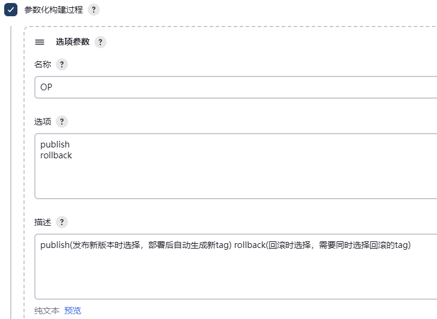

效果：

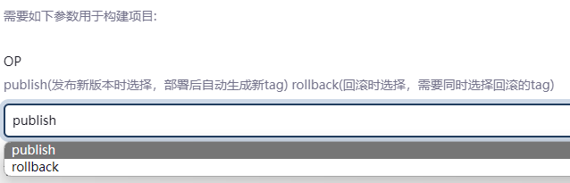


**git parameter**

pipeline：

```groovy
pipeline {
    parameters {
        gitParameter (branch:'', branchFilter: 'origin/(.*)', defaultValue: 'master', description: '选择将要构建的标签', name: 'TAG', quickFilterEnabled: false, selectedValue: 'TOP', sortMode: 'DESCENDING_SMART', tagFilter: '*', type: 'PT_TAG', useRepository: xxx.git)
    }
}
```

jenkins流水线项目显示：

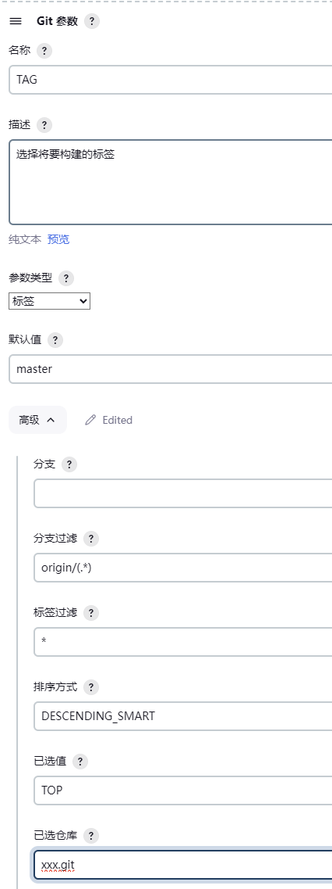

效果：

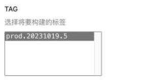


**list git branches**

定义变量：

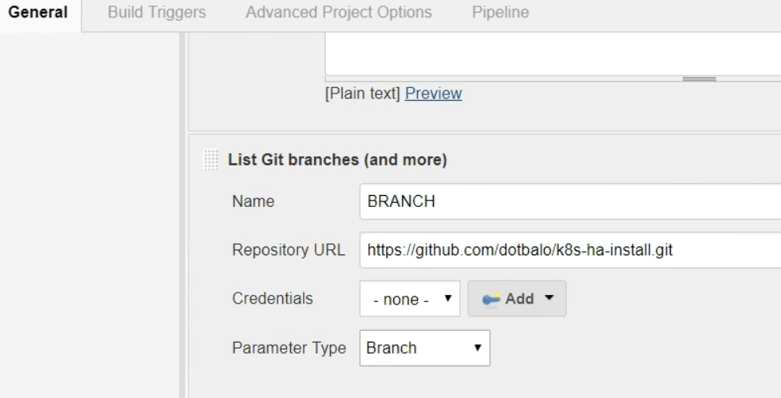

效果：

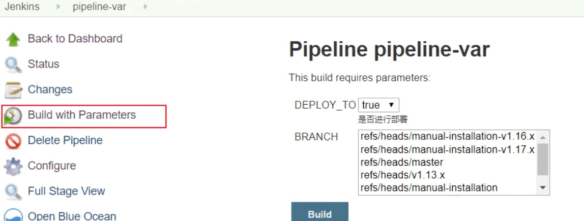

可以用正则只显示/refs/heads/后面的内容：

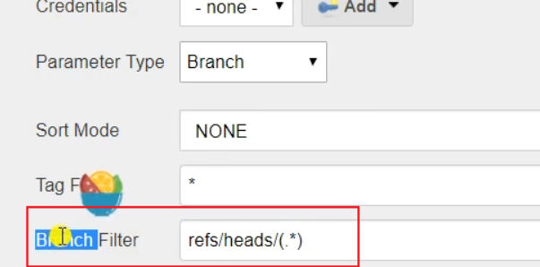


**string parameter**

定义变量：


效果：

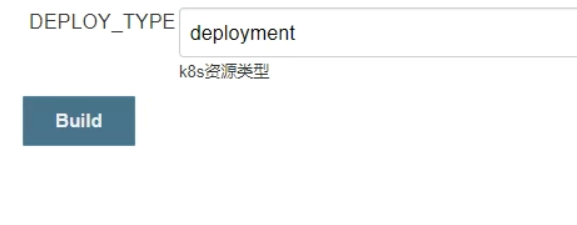