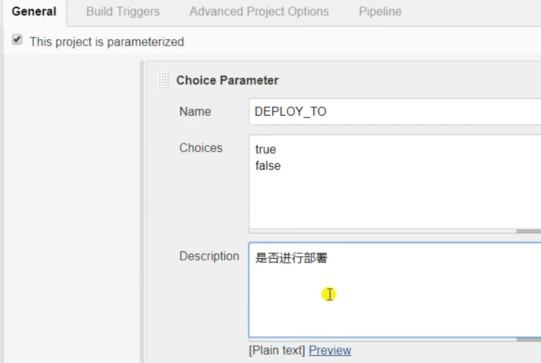
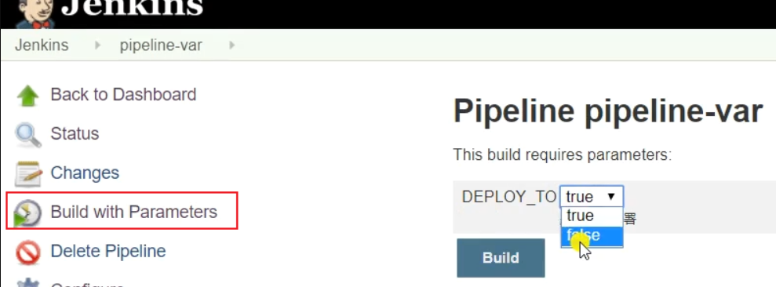
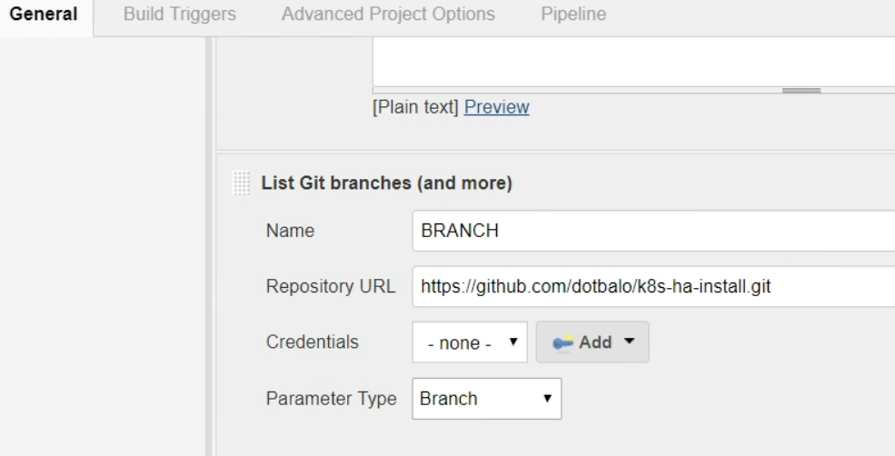
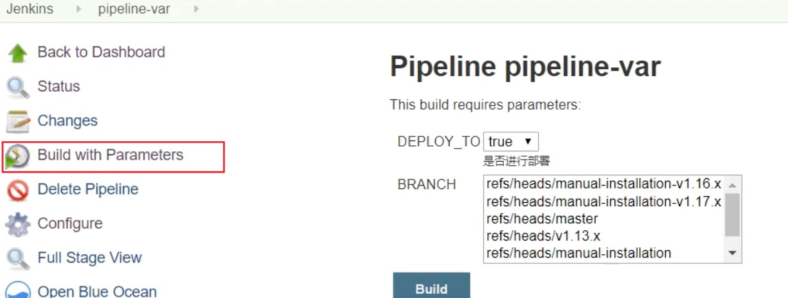
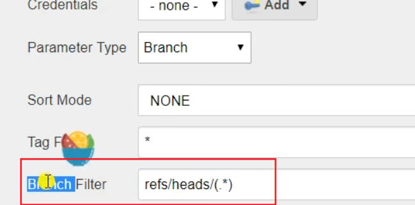
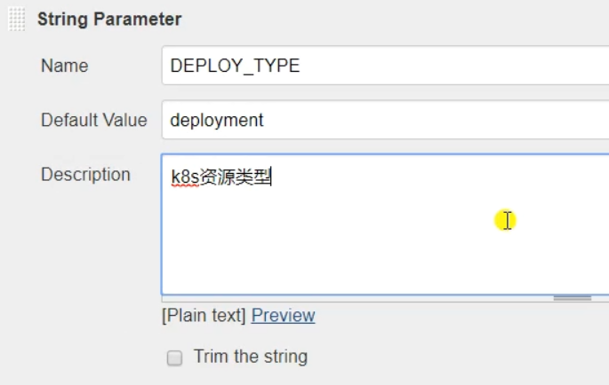
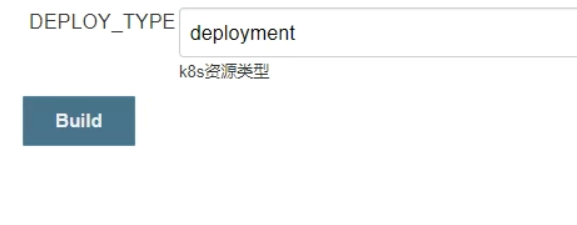

# 变量使用

不同的jenkinsfile有差别不大的命令，我们可以在jenkins定义变量，把jenkins的一些命令参数化，便于管理jenkinsfile

**choice parameter**

jenkins中定义变量：

效果：

**git parameter**

**list git branches**

定义变量：

效果：

可以用正则只显示/refs/heads/后面的内容：

**string parameter**

定义变量：

效果：

