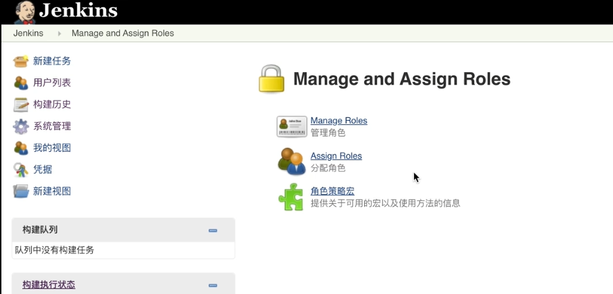
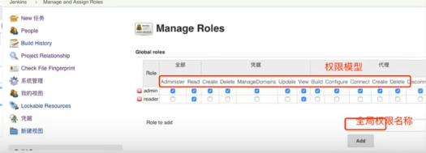
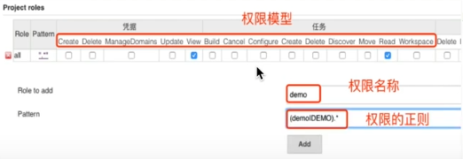
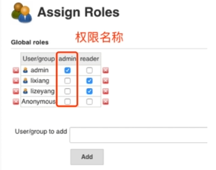
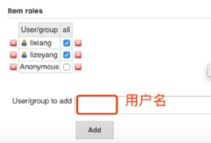

# 用户权限管理

用户认证方式：

- 默认jenkins自带数据库
- LDAP认证
- ActiveDictory认证
- Gitlab认证

## 用户的权限管理

安装授权插件Role-Based Strategy用户项目授权

安装 Role-Based Strategy 插件后，系统管理 中多了如图下所示的一个功能，用户权限的划分就是靠他来做的

1、Manage Roles（管理角色）

针对角色赋予不同权限，后面要将角色授予用户。角色就**相当于一个组**。其里面又有Global roles（全局）、Project roles（项目）、Slave roles（），来进行不同划分。

Global roles：

Project roles：

2、Assigin roles（分配角色）

给用户分配全局权限：

给用户分配项目权限：

注：全局权限优先