## 基于分支自动发布

测试环境一般会经常发布，可以做自动发布，代码合并到测试环境分支后会触发jenkins的webhook机制来自动编译和发布到测试环境


1. 需要安装**Generic Webhook Trigger**插件

2. 配置jenkins流水线项目

   勾选构建触发器的Generic Webhook Trigger，复制地址

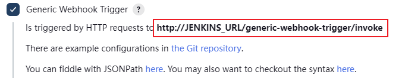

​        配置token，这里可以自己随机填写

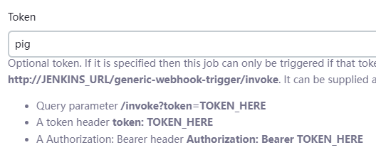

​        勾选这两项可以有效的帮助我们debug

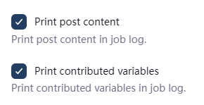

​        pipeline

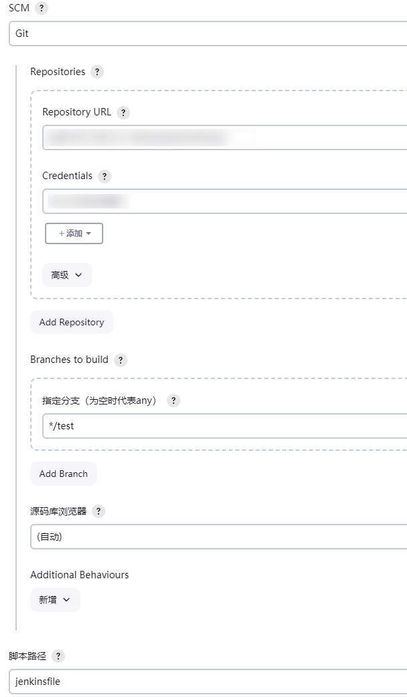


3. 打开需要自动触发的gitlab库，配置webhook，把上面复制的地址粘贴到这里，push events填写要触发的测试环境分支

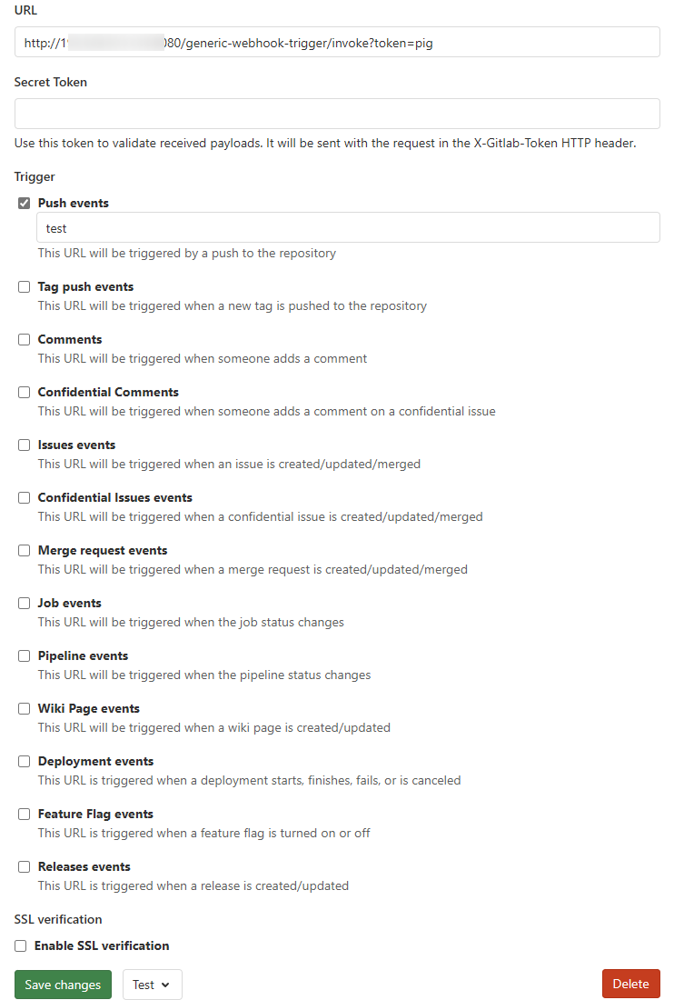

可以点击测试，配置成功会提示 Hook executed successfully: HTTP 200

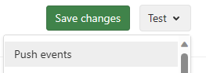

现在只要push到test分支就会自动执行pipeline

## 自动打tag发布

在生产环境中，为了更安全和能够快速回滚，可以采用自动打tag发布，这样可以基于tag快速回滚。

生产发布是基于master分支，发布成功后会自动将当前master分支打上tag，当需要回滚时，基于tag发布即可。


自动打tag涉及到tag的取名规则，这里使用**version number**插件，它能获取当天的年月日，可以用它来取名


jenkinsfile大致编写框架：

```groovy
pipeline {
    agent any
    environment {
        //项目地址
        GIT_URL = 'git@xxx.git'
        //自动打tag的命名格式：prod.yyyyMMdd.构建次数
        VERSION = VersionNumber versionPrefix:'prod.', versionNumberString: '${BUILD_DATE_FORMATTED, "yyyyMMdd"}.${BUILDS_TODAY}'
    }
    parameters {
        choice(name:'OP',choices:'publish\nrollback',description: 'publish(发布新版本时选择，部署后自动生成新tag) rollback(回滚时选择，需要同时选择回滚的tag)')
        gitParameter (branch:'', branchFilter: 'origin/(.*)', defaultValue: 'master', description: '选择将要构建的标签', name: 'TAG', quickFilterEnabled: false, selectedValue: 'TOP', sortMode: 'DESCENDING_SMART', tagFilter: '*', type: 'PT_TAG', useRepository: 'git@xxx.git')
    }
    stages{
        //编译
        stage('build'){
            steps {
                script {
                    //如果选择发布
                    if (params.OP == 'publish') {
                        //拉取master分支代码
                        checkout([$class: 'GitSCM', branches: [[name: "master"]], 
                              extensions: [], 
                              userRemoteConfigs: [[credentialsId: '	508c558c-f04d-4ed2-8654-6b6aa0cbaadc', url: "${GIT_URL}"]]])
                        //编译代码
                        sh """
                        ...
                        """
                    } else {
                        //如果没有选择tag回滚
                        if (params.TAG == '') {
                            error("回滚操作必须指定tag版本")
                        }
                        //拉取指定tag代码
                        checkout([$class: 'GitSCM', branches: [[name: "${TAG}"]], 
                              extensions: [], 
                              userRemoteConfigs: [[credentialsId: '	508c558c-f04d-4ed2-8654-6b6aa0cbaadc', url: "${GIT_URL}"]]])                        //编译代码
                        sh """
                        ...
                        """
                    }
                }
            }
        }
        //发布
        stage('deploy'){
            steps {
                sh """
                ...
                """
            }
        }
        //打tag
        stage('tag'){
            steps {
                script {
                    if (params.OP == 'publish') {
                        sh """
                        //进入拉取代码的目录
                        cd /var/jenkins_home/workspace/test1
                        //打tag
                        git tag $VERSION
                        git push --tags
                        """
                    }
                }
            }
        }
    }
}

```

## 基于docker容器化发布

1. 安装插件

2. 创建流水线job

3. 添加发布方式参数

   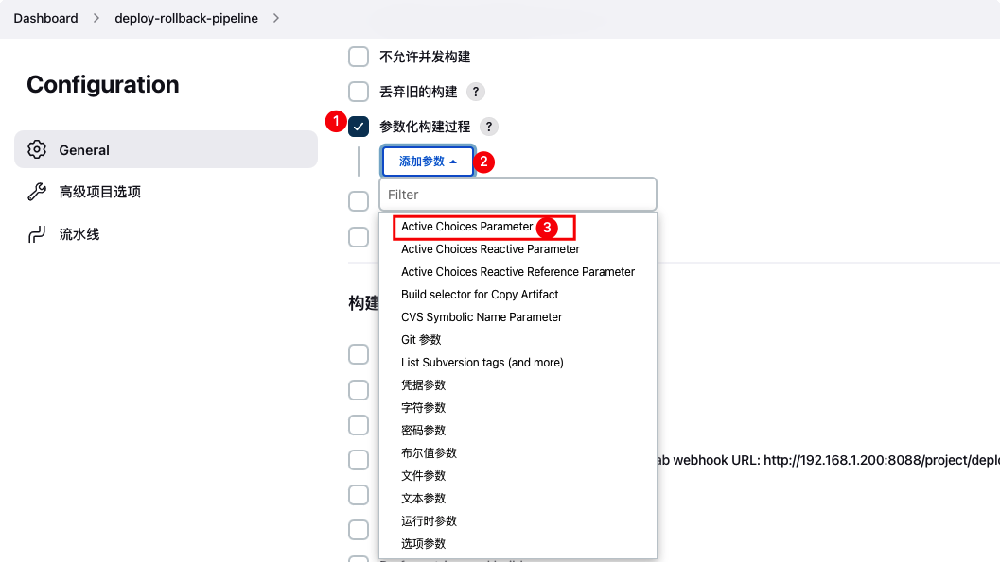

   填写参数

   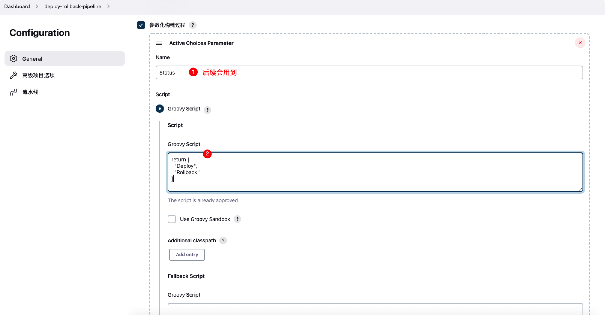

   groovy script内容如下

   ```groovy
   return [
     "Deploy",
     "Rollback"
   ]
   ```

4. 添加发布版本号参数

   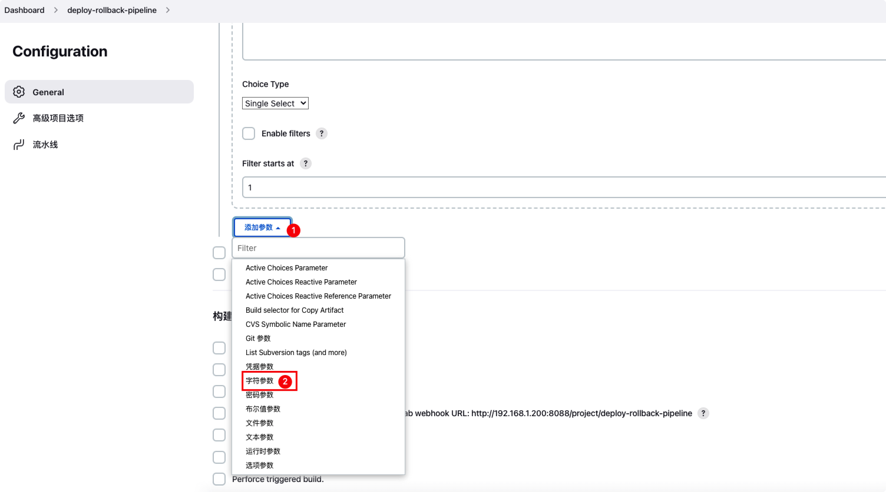

   填写参数

   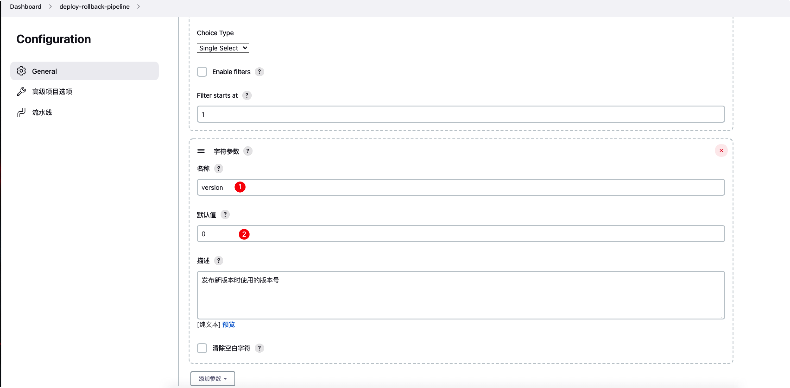

5. 添加回滚版本号参数

   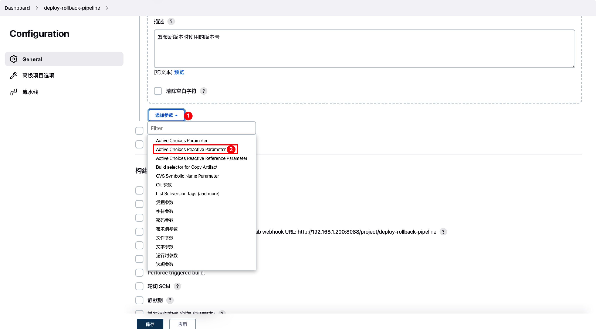

   填写参数

   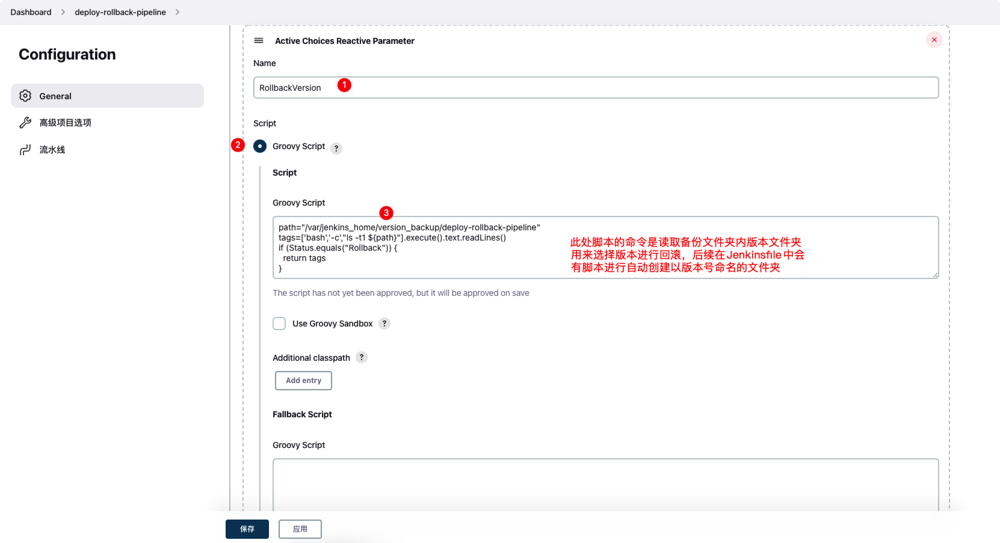

   Groovy Script 内容

   ```groovy
   # 指定当前job的备份文件夹 /var/jenkins_home/version_backup/first-gitlab-project-pipeline
   path="/var/jenkins_home/version_backup/first-gitlab-project-pipeline"
   tags=['bash','-c',"ls -t1 ${path}"].execute().text.readLines()
    
   if (Status.equals("Rollback")) {
     return tags
   } 
   ```

   下方还有个参数需要填写

   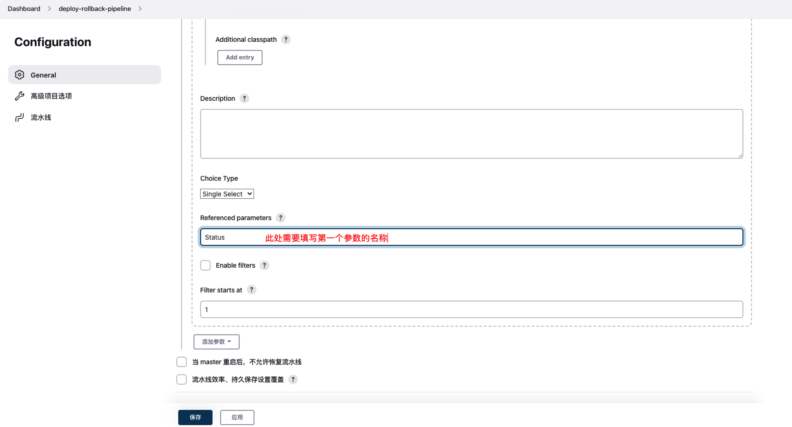

6. 部署脚本准备

   在项目根目录创建deploy.sh，并根据以下内容根据自己的情况进行补充脚本和参数

   ```shell
   aliyun_url=$1
   aliyun_repo=$2
   aliyun_username=$3
   aliyun_passwd=$4
   project_name=$5
   tag=$6
   port=$7
   
   imageName=$aliyun_url/$aliyun_repo/$project_name:$tag
   
   containerId=`docker ps -a | grep ${project_name} | awk '{print $1}'`
   if [ "$containerId" != "" ] ; then
       docker stop $containerId
       docker rm $containerId
       echo "Delete Container Success"
   fi
   
   imageId=`docker images | grep ${project_name} | awk '{print $3}'`
   
   if [ "$imageId" != "" ] ; then
       docker rmi -f $imageId
       echo "Delete Image Success"
   fi
   
   docker image prune -f
   
   docker login -u $aliyun_username -p $aliyun_passwd $aliyun_url
   
   docker pull $imageName
   
   docker run -d -p $port:$port --name $project_name $imageName
   
   echo "Start Container Success"
   echo $project_name
   ```

7. 准备jenkinsfile

   ```groovy
   pipeline {
       agent any
   
       environment{
           //项目地址
           GIT_URL = 'git@xxx.git'
           
           aliyunHost = '阿里云镜像仓库地址'
           aliyunRepo = '阿里云镜像仓库命名空间'
           aliyunUser = '账号'
           aliyunPasswd = '密码'
           // 打包的容器的名称（项目名）
           projectName = '项目名称'
           // 容器内外的端口
           port = '8099'
       }
   
       // 存放所有任务的合集
       stages {
           // 拉取git代码
           stage('拉取Git代码') {
               steps {
                   script {
                       if(params.Status.equals("Deploy")){
                       	//拉取master分支代码
                           checkout([$class: 'GitSCM', branches: [[name: "master"]], 
                                 extensions: [], 
                                 userRemoteConfigs: [[credentialsId: '	508c558c-f04d-4ed2-8654-6b6aa0cbaadc', url: "${GIT_URL}"]]])
                       }
                       if(params.Status.equals("Rollback")){
                           echo "Rollback: jump checkout"
                       }
                   }
               }
           }
           // 构建代码
           stage('构建代码') {
               steps {
                   script {
                       if(params.Status.equals("Deploy")){
                      			// 此处完成maven项目打包，和创建以当前版本号为名称的文件夹
                           sh '''/var/jenkins_home/apache-maven-3.6.3/bin/mvn clean package
                           echo "mkdir -p /var/jenkins_home/${JOB_NAME}/${version}"
                           mkdir -p /var/jenkins_home/version_backup/${JOB_NAME}/${version}'''
                       }
                       if(params.Status.equals("Rollback")){
                           echo "Rollback: jump package"
                       }
                   }
               }
           }
           // 制作自定义镜像并发布
           stage('制作自定义镜像并发布') {
               steps {
                   script {
                       if(params.Status.equals("Deploy")){
                       		// 此处完成docker镜像打包并上传到阿里云镜像仓库
                           withCredentials([usernamePassword(credentialsId: "${registry_auth}", passwordVariable: 'aliyunPasswd', usernameVariable: 'aliyunUser')]) {
                               sh """
                               docker login -u ${aliyunUser} -p '${aliyunPasswd}' ${aliyunHost}
                               for service in \$(echo ${service} |sed 's/,/ /g');do
                               service_name=\${service%:*}
                               image_name=${aliyunHost}/${aliyunRepo}/\${service_name}:${version}
                               cd \${service_name}
                               docker build -t \${image_name} .
                               docker image prune -f
                               docker push \${image_name}
                               cd ${WORKSPACE}
                           done
                       }
                       if(params.Status.equals("Rollback")){
                           echo "Rollback: jump build docker image"
                       }
                   }
               }
           }
           // 执行部署脚本
           stage('执行部署脚本') {
               steps {
                   script {
                       if(params.Status.equals("Deploy")){
                       		// 此处使用 version 参数进行部署，需要使用流水线语法生成自己的命令，execCommand后使用的部署脚本命令需要使用双引号包裹，具体原因未知
                           sshPublisher(publishers: [sshPublisherDesc(configName: 'test-ssh-1.83', transfers: [sshTransfer(cleanRemote: false, excludes: '', execCommand: "sh /home/wangx/Downloads/deploy-rollback-pipeline/pipeline/deploy.sh ${aliyunHost} ${aliyunRepo} ${aliyunUser} ${aliyunPasswd} ${projectName} ${version} ${port}", execTimeout: 120000, flatten: false, makeEmptyDirs: false, noDefaultExcludes: false, patternSeparator: '[, ]+', remoteDirectory: '/home/wangx/Downloads/deploy-rollback-pipeline/pipeline', remoteDirectorySDF: false, removePrefix: '', sourceFiles: 'deploy.sh')], usePromotionTimestamp: false, useWorkspaceInPromotion: false, verbose: false)])
                       }
                       if(params.Status.equals("Rollback")){
                       		// 此处使用 RollbackVersion 进行回滚，execCommand后使用的部署脚本命令需要使用双引号包裹，具体原因未知
                           sshPublisher(publishers: [sshPublisherDesc(configName: 'test-ssh-1.83', transfers: [sshTransfer(cleanRemote: false, excludes: '', execCommand: "sh /home/wangx/Downloads/first-gitlab-project/pipeline/deploy.sh ${aliyunHost} ${aliyunRepo} ${aliyunUser} ${aliyunPasswd} ${projectName} ${RollbackVersion} ${port}", execTimeout: 120000, flatten: false, makeEmptyDirs: false, noDefaultExcludes: false, patternSeparator: '[, ]+', remoteDirectory: '/home/wangx/Downloads/first-gitlab-project/pipeline', remoteDirectorySDF: false, removePrefix: '', sourceFiles: 'deploy.sh')], usePromotionTimestamp: false, useWorkspaceInPromotion: false, verbose: false)])
                       }
                   }
               }
           }
           // 清理工作空间
           stage('Clean') {
               steps {
                 cleanWs(
                     cleanWhenAborted: true,
                     cleanWhenFailure: true,
                     cleanWhenNotBuilt: true,
                     cleanWhenSuccess: true,
                     cleanWhenUnstable: true,
                     cleanupMatrixParent: true,
                     // 这个选项是关闭延时删除，立即删除
                     disableDeferredWipeout: true,
                     deleteDirs: true
                 )
               }
           }
       }
   }
   ```

8. 发布

   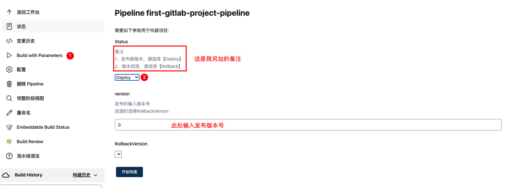

9. 回滚

   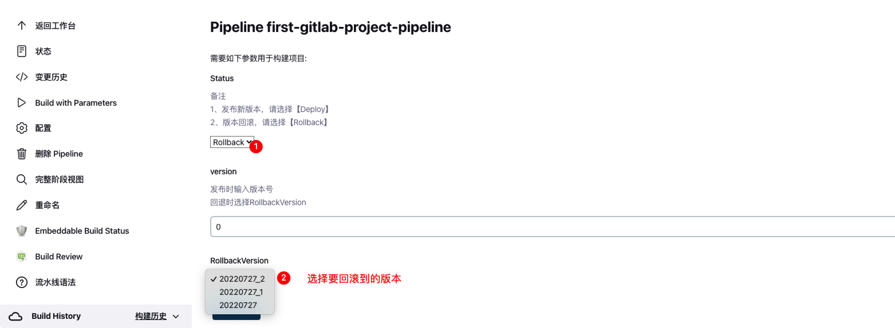


## maven构建项目


```groovy
   //maven编译
           stage('MavenBuild') {
             steps {
                 script {
                     mvnHome = tool "maven"
                     sh "${mvnHome}/bin/mvn clean package"
                 }
             }
           }
```

## sonarqube代码检测

## 制作并推送镜像

```shell
    #把打包好的jar包做成镜像
    stage('Build image') {
      steps {
                withCredentials([usernamePassword(credentialsId: 'REGISTRY_USER', passwordVariable: 'Password', usernameVariable: 'Username')]) {
          sh """
          docker build -t ${HARBOR_ADDRESS}/${REGISTRY_DIR}/${IMAGE_NAME}:${tag} .
          docker login -u ${Username} -p ${Password} ${HARBOR_ADDRESS}
          docker push ${HARBOR_ADDRESS}/${REGISTRY_DIR}/${IMAGE_NAME}:${tag}
          """
        }
      }
    }
```

