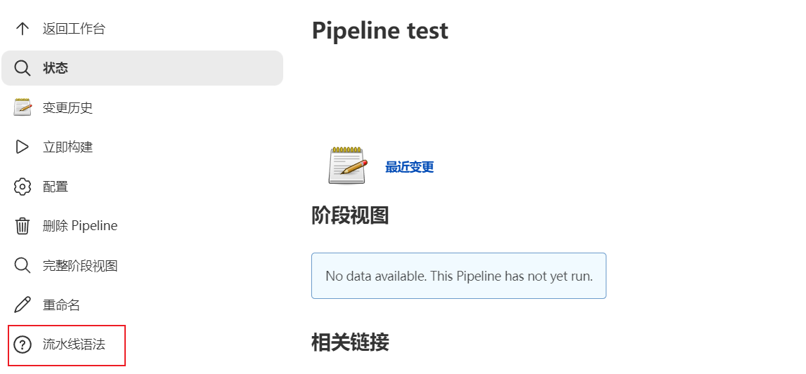
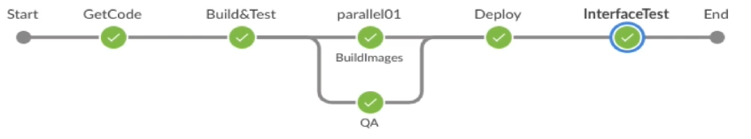
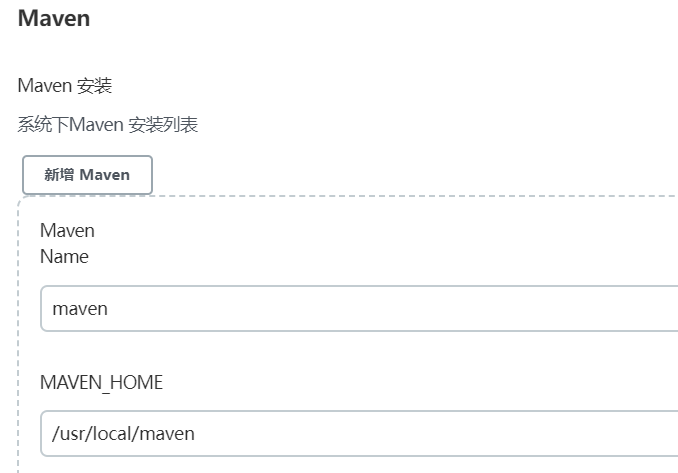
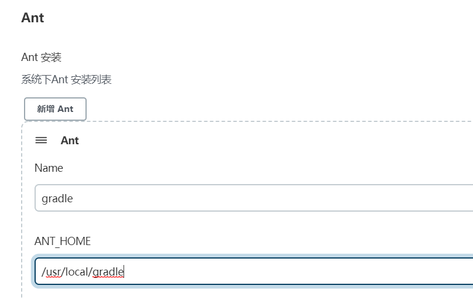

## 流水线设计

jenkins创建一个流水线job，里面有pipeline语法生成器




UAT测试流水线：

代码→编译→单测→打包→扫描→镜像→发布→接口测试→邮件通知



1. jenkins拉取代码

   ```groovy
   //手动拉取代码
           stage('pulling Code') {
               steps {
                   script {
                       //git分支，凭证id，git仓库地址
                       checkout([$class: 'GitSCM', branches: [[name: "${BRANCH}"]], 
                                 extensions: [], 
                                 userRemoteConfigs: [[credentialsId: 'gitlab-admin-user', url: "${REPO_URL}"]]])
                   }
               }
           }
   ```

2. jenkins执行构建和扫描
   1. 代码编译
   
      
   
      
   
   ```groovy
      //maven编译
              stage('MavenBuild') {
                steps {
                    script {
                        mvnHome = tool "maven"
                        sh "${mvnHome}/bin/mvn ${buildshell}"
                    }
                }
              }
      
      //gradle编译
              stage('GradleBuild') {
                steps {
                    script {
                        gradleHome = tool "gradle"
                        sh "${gradleHome}/bin/gradle ${buildshell}"
                    }
                }
              }
   ```
   
   2. 代码扫描
   
3. 根据dockerfile生成镜像，然后push镜像到镜像仓库

   ```groovy
   stage('Build images') {
       steps {
           script {
               withCredentials([usernamePassword(credentialsId: 'REGISTRY_USER', passwordVariable: 'Password', usernameVariable: 'Username')]) {
                   sh """
                      docker login -u ${Username} -p ${Password} ${HARBOR_ADDRESS}
                      docker build -t ${HARBOR_ADDRESS}/${REGISTRY_DIR}/${IMAGE_NAME}:${TAG} .
                      sleep 1
                      docker push ${HARBOR_ADDRESS}/${REGISTRY_DIR}/${IMAGE_NAME}:${TAG}
                      sleep 1
                      docker rmi ${HARBOR_ADDRESS}/${REGISTRY_DIR}/${IMAGE_NAME}:${TAG}
                   """
               }
           }
       }
   }
   ```
   

4. jenkins slave kubectl set命令更新镜像
   1. 只更新镜像
   2. helm更新