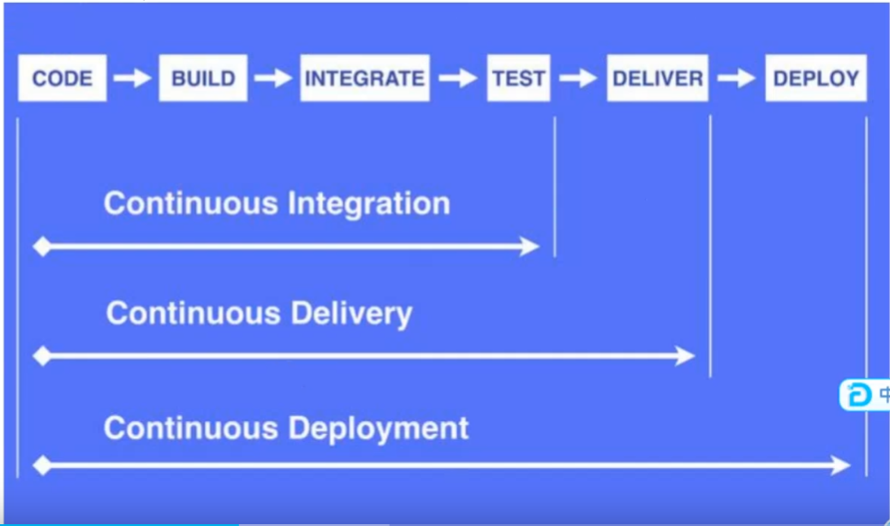
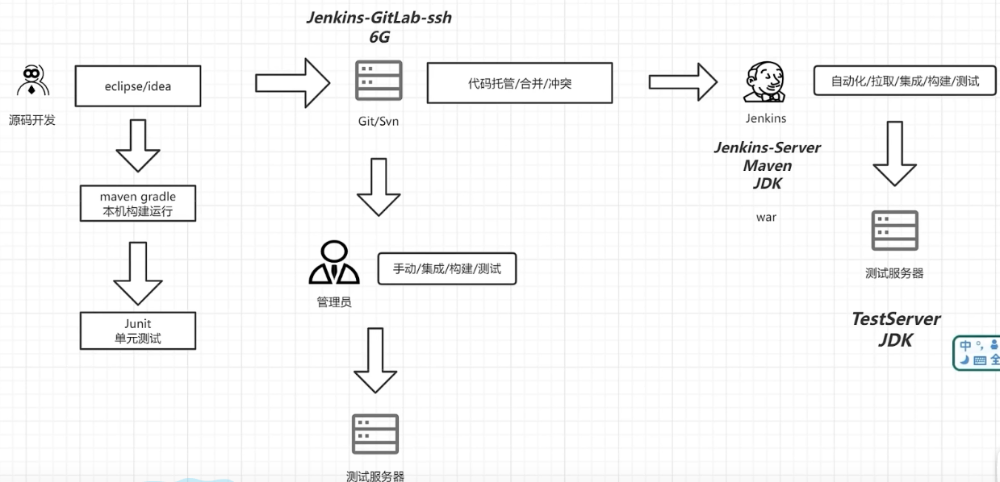

## CICD

devops：注重开发和运维的沟通合作，通过自动化流程来使得软件构建、测试、发布更加快捷、频繁和可靠

CICD：

持续集成和持续交付，也称为 CI/CD，是一组流程：

- 持续集成
- 持续交付
- 持续部署

**持续集成**是帮助开发人员更频繁的将代码合并到共享分支或主干中，合并后自动触发构建应用。运行不同级别的代码扫描和自动化测试。

**持续交付**是将通过集成测试的代码合并到一个可以随时部署到生产环境的代码库。

**持续部署**将代码自动部署到生产环境

一个最小化的持续集成系统组成要素：

版本管理系统：一般用git作为版本控制库，版本管理软件用gitlab

构建脚本&工具：每个项目都需要有构建脚本来实现对整个项目的自动化构建，比如java的项目可以用gradle

CI服务器：CI服务器可以检测项目中的代码变动，并及时通过构建机器运行构建脚本

## 工作流程

传统流程：

- 项目一开始分配好模块给相应的开发人员
- 开发人眼开发好一个模块后就进行单元测试
- 等所有模块都开发好后对所有代码进行集成
- 集成后的项目部署到测试环境，交给测试人员进行集成测试
- 如果有bug就提交给相应责任人进行修改，然后再重新集成、部署和测试
- 通过后就部署到生产环境
- 如果测试不通过再重复分配bug-》修改bug-》集成代码-》部署测试环境-》集成测试的流程

## 发布类型

### 蓝绿发布

蓝绿部署中，一共有两套系统：一套是正在提供服务系统（旧版），标记为”绿色“；另一套是准备发布的系统（新版、备用），标记为“蓝色”。两套系统都是功能完善的，并且正在运行的系统。

蓝色系统确定达到上线标准之后，直接将用户切换到蓝色系统。这段时间内观察蓝色系统（新系统）工作状态，如果出现问题，直接切换回绿色系统。

当确信对外提供服务的蓝色系统工作正常，不对外提供服务的绿色系统已经不再需要的时候，蓝色系统正式成为对外提供服务系统，成为新的绿色系统。原先的绿色系统可以销毁，将资源释放出来，用于部署下一个蓝色系统。

#### 蓝绿发布特点

1. 蓝绿部署的目的是**减少发布时的中断时间、能够快速撤回发布**。
2. 两套系统没有耦合的时候才能百分百保证不干扰

#### 蓝绿发布注意事项

如果目标系统相当复杂，那么如何切换、两套系统的**数据一致性**等，都需要仔细考虑。

当你切换到蓝色环境时，需要妥当处理未完成的业务和新的业务。如果你的数据库后端无法处理，会是一个比较麻烦的问题；

- 需要提前考虑数据库与应用部署同步迁移 /回滚的问题。
- 蓝绿部署需要有基础设施支持。
- 在非隔离基础架构（ VM 、 Docker 等）上执行蓝绿[部署，蓝色环境和绿色环境有被摧毁的风险。

### 滚动发布

一般是取出一个或者多个服务器停止服务，执行更新，并重新将其投入使用。周而复始，直到集群中所有的实例都更新成新版本。

如上图, 将更新后的功能部署在Server1 上, 然后Server1去替换正在运行的Server, 替换下来的物理机又可以继续部署Server2的新版本, 然后去替换正在工作的Server2 , 以此类推, 直到替换完所有的服务器, 至此 ,服务更新完成。

#### 滚动发布特点

1. 这种部署方式相对于蓝绿部署，更加节约资源——它不需要运行两个集群、两倍的实例数。
2. 回滚困难

#### 滚动发布注意事项

1. 没有一个确定ok的环境，修改了现有的环境。
3. 回滚困难。举个例子，在某一次发布中，我们需要更新100个实例，每次更新10个实例，每次部署需要5分钟。当滚动发布到第80个实例时，发现了问题，需要回滚，这个回滚却是一个痛苦，并且漫长的过程。
3. 有的时候，我们还可能对系统进行动态伸缩，如果部署期间，系统自动扩容/缩容了，我们还需判断到底哪个节点使用的是哪个代码。尽管有一些自动化的运维工具，但是依然令人心惊胆战。

### 灰度发布／金丝雀发布

灰度发布, 也叫金丝雀发布。是指在黑与白之间，能够平滑过渡的一种发布方式。

金丝雀发布就是把应用程序的某个新版本部署到生产环境中的部分服务器中，从而快速得到反馈。就像通过金丝雀发现矿井是否有氧气一样，金丝雀发布可以快速而有效地发现软件新版本存在的问题。