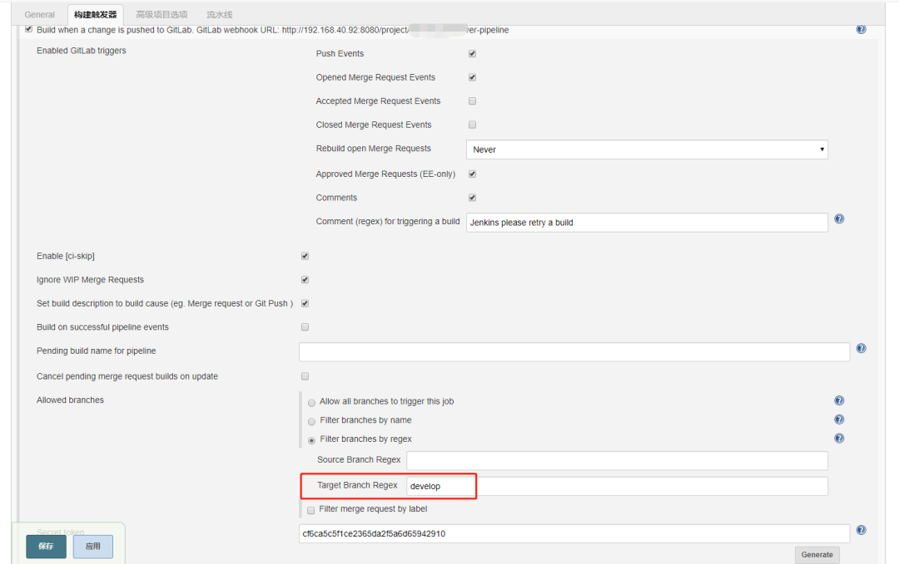
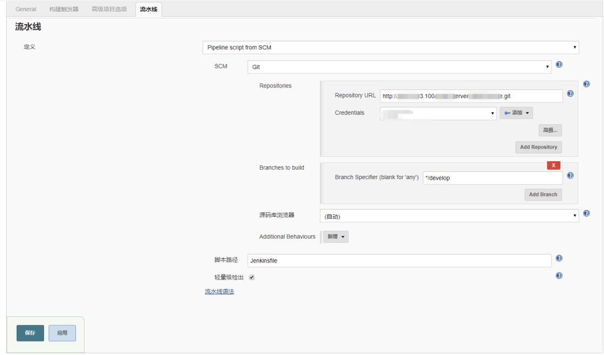
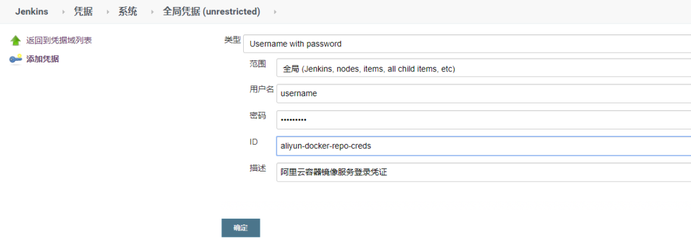
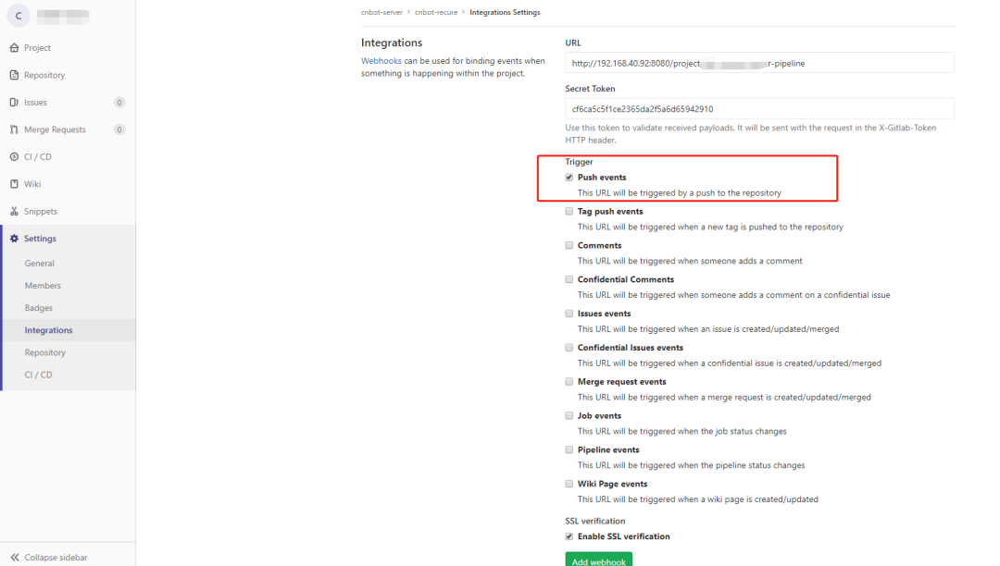

# Gitlab+Jenkins+k8s+Helm 的自动化部署实践


## Jenkins配置

### 任务配置

1. 创建流水线

2. 配置构建触发器，将目标分支设置为 develop 分支，生成一个 token，如图

   

   记下这里的“GitLab webhook URL”及token值，在Gitlab配置中使用。

3. 配置流水线

   

### 凭据配置

在 Jenkinsfile 文件中，我们使用到了两个访问凭证——Docker Registry凭证与本地K8s的kube凭证

容器仓库凭证：



添加 K8s 集群的访问凭证，在 master 节点上将 /root/.kube/config 文件内容进行 base64 编码

```shell
base64 /root/.kube/config > kube-config-base64.txt
```

使用编码后的内容在 Jenkins 中创建一个 Secret text 类型的凭据

## Gitlab配置

在 Gitlab 项目的 Settings - Integrations 页面配置一个 webhook，在 URL 与 Secret Token 中填入前面 Jenkins 触发器部分的“GitLab webhook URL”及token值，选中“Push events”作为触发事件



开发、测试环境选择“Push events”则在开发人员push代码，或merge代码到develop，pre-release分支时，就会触发开发或测试环境的Jenkins pipeline任务完成自动化构建；生产环境选择“Tag push events”，在往master分支push tag时触发自动化构建

## Jenkinsfile

```groovy
pipeline {
    agent any
    environment {
        GIT_REPO = "${env.gitlabSourceRepoName}"  //从Jenkins Gitlab插件中获取Git项目的名称
        GIT_BRANCH = "${env.gitlabTargetBranch}"  //如果符合条件的tag指向最新提交则只是显示tag的名字，否则会有相关的后缀来描述该tag之后有多少次提交以及最新的提交commit-id
        GIT_TAG = sh(returnStdout: true,script: 'git describe --tags --always').trim()  //commit id或tag名称
        DOCKER_REGISTER_CREDS = credentials('aliyun-docker-repo-creds') //docker registry凭证
        KUBE_CONFIG_LOCAL = credentials('local-k8s-kube-config')  //开发测试环境的kube凭证
        KUBE_CONFIG_PROD = credentials('prod-k8s-kube-config') //生产环境的kube凭证

        DOCKER_REGISTRY = "registry.cn-hangzhou.aliyuncs.com" //Docker仓库地址
        DOCKER_NAMESPACE = "your-namespace"  //命名空间
        DOCKER_IMAGE = "${DOCKER_REGISTRY}/${DOCKER_NAMESPACE}/${GIT_REPO}" //Docker镜像地址

        INGRESS_HOST_DEV = "dev.your-site.com"    //开发环境的域名
        INGRESS_HOST_TEST = "test.your-site.com"  //测试环境的域名
        INGRESS_HOST_PROD = "prod.your-site.com"  //生产环境的域名
    }
    parameters {
        string(name: 'ingress_path', defaultValue: '/your-path', description: '服务上下文路径')
        string(name: 'replica_count', defaultValue: '1', description: '容器副本数量')
    }
    stages {
        stage {
            stage('Code Analyze') {
                agent any
                steps {
                    echo "1. 代码静态检查"
                }
            }
            stage('Maven Build') {
                agent {
                    docker {
                        image 'maven:3-jdk-8-alpine'
                        args '-v $HOME/.m2:/root/.m2'
                    }
                }
                steps {
                    echo "2. 代码编译打包"
                    sh 'mvn clean package -Dfile.encoding=UTF-8 -DskipTests=true'
                }
            }
            stage('Docker Build') {
                agent any
                steps {
                    echo "3. 构建Docker镜像"
                    //登录Docker仓库
                    sh "sudo docker login -u ${DOCKER_REGISTER_CREDS_USR} -p ${DOCKER_REGISTER_CREDS_PSW} ${DOCKER_REGISTRY}"
                    script {
                        def profile = "dev"
                        if (env.gitlabTargetBranch == "develop") {
                            image_tag = "dev." + env.GIT_TAG
                        } else if (env.gitlabTargetBranch == "pre-release") {
                            image_tag = "test." + env.GIT_TAG
                            profile = "test"
                        } else if (env.gitlabTargetBranch == "master") {
                            // master分支则直接使用Tag
                            image_tag = env.GIT_TAG
                            profile = "prod"
                        }
                        //通过--build-arg将profile进行设置，以区分不同环境进行镜像构建
                        sh "docker build  --build-arg profile=${profile} -t ${DOCKER_IMAGE}:${image_tag} ."
                        sh "sudo docker push ${DOCKER_IMAGE}:${image_tag}"
                        sh "docker rmi ${DOCKER_IMAGE}:${image_tag}"
                    }
                }
            }
            stage('Helm Deploy') {
                agent {
                    docker {
                        image 'lwolf/helm-kubectl-docker'
                        args '-u root:root'
                    }
                }
                steps {
                    echo "4. 部署到K8s"
                    sh "mkdir -p /root/.kube"
                    script {
                        def kube_config = env.KUBE_CONFIG_LOCAL
                        def ingress_host = env.INGRESS_HOST_DEV
                        if (env.gitlabTargetBranch == "pre-release") {
                            ingress_host = env.INGRESS_HOST_TEST
                        } else if (env.gitlabTargetBranch == "master") {
                            ingress_host = env.INGRESS_HOST_PROD
                            kube_config = env.KUBE_CONFIG_PROD
                        }
                        sh "echo ${kube_config} | base64 -d > /root/.kube/config"
                        //根据不同环境将服务部署到不同的namespace下，这里使用分支名称
                        sh "helm upgrade -i --namespace=${env.gitlabTargetBranch} --set replicaCount=${params.replica_count} --set image.repository=${DOCKER_IMAGE} --set image.tag=${image_tag} --set nameOverride=${GIT_REPO} --set ingress.hosts[0].host=${ingress_host} --set ingress.hosts[0].paths={${params.ingress_path}} ${GIT_REPO} ./helm/"
                    }
                }
            }
        }
    }
}
```


```groovy
pipeline {
    agent any
    eviironment {
        GIT_REPO = "${env.gitlabSourceRepoName}"  //从Jenkins Gitlab插件中获取Git项目的名称
        GIT_BRANCH = "${env.gitlabTargetBranch}"  //如果符合条件的tag指向最新提交则只是显示tag的名字，否则会有相关的后缀来描述该tag之后有多少次提交以及最新的提交commit-id
        GIT_TAG = sh(returnStdout: true,script: 'git describe --tags --always').trim()  //commit id或tag名称
    }
    parameters {
        string(name: 'ingress_path', defaultValue: '/your-path', description: '服务上下文路径')
        string(name: 'replica_count', defaultValue: '1', description: '容器副本数量')
    }
    stages {
        stage {
            stage('Code Analyze') {
                agent any
                steps {
                    echo "1. 代码静态检查"
                }
            }
            stage('Maven Build') {
                steps {
                    echo "2. 代码编译打包"
                }
            }
            stage('Docker Build') {
                agent any
                steps {
                    echo "3. 构建Docker镜像"
                    }
                }
            }
            stage('Helm Deploy') 
                steps {
                    echo "4. 部署到K8s"
                }
            }
        }
    }
}
```

