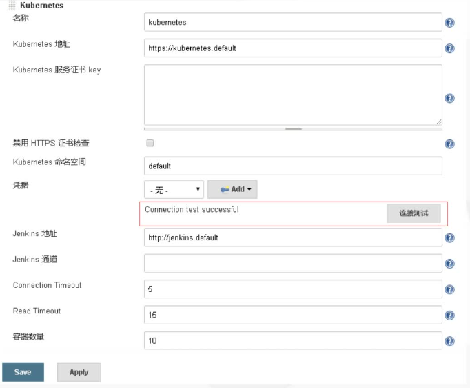

# Gitlab+Jenkins+k8s+Helm 的自动化部署实践

## jenkins在k8s中动态创建代理

自定义构建jenkins slave镜像

```dockerfile
FROM centos:7
LABEL maintainer lizhenliang

RUN yum install -y java-1.8.0-openjdk maven curl git libtool-ltdl-devel && \
    yum clean all && \
    rm -rf /var/cache/yum/* && \
    mkdir -p /usr/share/jenkins
    
COPY slave.jar /usr/share/jenkins/slave.jar
COPY jenkins-slave /usr/bin/jenkins-slave
COPY setting.xml /etc/maven/setting.xml
RUN chomd +x /usr/bin/jenkins-slave
COPY helm kubectl /usr/bin

ENTRYPOINT ["jenkins-slave"]
```

jenkins安装kubernetes插件



## Jenkins配置

### 任务配置

1. 创建流水线

2. 配置构建触发器，将目标分支设置为 develop 分支，生成一个 token，如图

   

   记下这里的“GitLab webhook URL”及token值，在Gitlab配置中使用。

3. 配置流水线

   

### 凭据配置

在 Jenkinsfile 文件中，我们使用到了两个访问凭证——Docker Registry凭证与本地K8s的kube凭证

容器仓库凭证：


添加 K8s 集群的访问凭证，在 master 节点上将 /root/.kube/config 文件内容进行 base64 编码

```shell
base64 /root/.kube/config > kube-config-base64.txt
```

使用编码后的内容在 Jenkins 中创建一个 Secret text 类型的凭据

## Gitlab配置

在 Gitlab 项目的 Settings - Integrations 页面配置一个 webhook，在 URL 与 Secret Token 中填入前面 Jenkins 触发器部分的“GitLab webhook URL”及token值，选中“Push events”作为触发事件


开发、测试环境选择“Push events”则在开发人员push代码，或merge代码到develop，pre-release分支时，就会触发开发或测试环境的Jenkins pipeline任务完成自动化构建；生产环境选择“Tag push events”，在往master分支push tag时触发自动化构建

## Jenkinsfile


```groovy
#!/usr/bin/env groovy
//镜像仓库地址
def registry = "registry.cn-shenzhen.aliyuncs.com"
//项目名称
def project = ""
//项目地址
def git_url = ""
//服务域名
def gateway_domain_name = ""
def portal_domain_name = ""
//凭证id
def image_pull_secret = "registry-pull-secret"
def registry_auth = ""
def git_auth = ""
def k8s_auth = ""

pipeline {
    //动态创建slave
    agent {
      kubernetes {
          label "jenkins-slave"
          yaml """
kind: pod
metadata:
  name: jenkins-slave
spec:
  containers:
  - name: jnlp
    image: "${registry}//jenkins-slave-jdk:1.8"
    imagePullPolicy: Always
    volumeMounts:
    - name: docker-cmd
      mountPath: /usr/bin/docker
    - name: docker-sock
      mountPath: /var/run/docker.sock
    - name: maven-cache
      mountPath: /root/.m2
  volumes:
  - name: docker-cmd
    hostPath:
      path: /usr/bin/docker
  - name: docker-sock
    hostPath:
      path: /var/run/docker.sock
  - name: maven-cache
    hostPath:
      path: /tmp/m2
"""
      }
    }
    
    //参数化构建
    parameters {
        //git参数，从git地址获取分支，来选择发布的分支
        gitParameter branch: '', branchFilter: '.*', defaultValue: '', description: '选择发布的分支', name: 'Branch', quichFilterEnabled: false, selecteValue: 'NONE', sortMode: 'NONE', tagFilter: '*', type: 'PT_BRANCH'
        //extended choice，通过复选框来勾选要发布的微服务
        extendedChoice defaultValue: '', description: '选择发布的分支', multiSelectDelimiter: ',', name: 'Service', type: 'PT_CHECKBOX', value: 'gateway-service:9999,portal-service:8080,product-service:8010,order-service:8020,stock-service:8030'
        //choice
        choice choices: ['ms', 'demo'], description: '部署模板', name: 'Template'
        choice choices: ['1', '3', '5', '7'], description: '副本数', name: 'ReplicaCount'
        choice choices: ['ms'], description: '命名空间', name: 'Namespace'
    }


    stages {
        stage('拉取代码') {
            steps {
                //引用参数化构建的分支、定义的gitlab凭证id、定义的项目地址
                checkout([$class: 'GitSCM', branches: [[name: '${params.Branch}']], doGenerateSubmoduleConfigurations: false, extensions: [], submoduleCfg: [], userRemoteConfigs: [[credentialsId: '${git_auth}', url: '${git_url}']]])
            }
        }
        stage('代码编译') {
            steps {
                sh """
                  mvn clean package -Dmaven.test.skip=true
                """
            }
        }
        stage('构建镜像') {
            steps {
                //通过凭证转换成阿里云镜像服务的账号和密码变量
                withCredentials([usernamePassword(credentialsId: "${registry_auth}", passwordVariable: 'password', usernameVariable: 'username')]) {
                    sh """
                        #登录镜像仓库
                        docker login -u ${username} -p '${password}' ${registry}
                        #制作和上传镜像
                        for service in \$(echo ${service} |sed 's/,/ /g');do
                            service_name=\${service%:*}
                            image_name=${registry}/${project}/\${service_name}:${BUILD_NUMBER}
                            cd \${service_name}
                            if ls |grep biz &>/dev/null;then
                                cd \${service_name}-biz
                            fi
                            docker build -t \${image_name} .
                            docker push \${image_name}
                            cd ${WORKSPACE}
                        done
                    """
                    configfileProvider([configFile(fileId: "${k8s_auth}", targetLocation: "admin.kubeconfig")]){
                        sh """
                           #添加镜像拉取认证
                           kubectl create secret docker-registry ${image_pull_secret}
                           --docker-username=${username} --docker-password=${password}
                           --docker-server=${registry} -n ${Namespace} --kubeconfig
                           admin.kubeconfig |true
                           #添加私有chart仓库
                           helm repo add --username ${username} --password ${password}
                           myrepo http://${registry}/chartrepo/${project}
                        """
                    }
				}
            }
        }
        stage('Helm部署到k8s') {
            steps {
                sh """
                    common_args="-n ${Namespace} --kubeconfig admin.kubeconfig"
                    
                    for serivce in \$(echo ${Service} |sed 's/,/ /g');do
                        service_name=\${service%:*}
                        service_port=\${service#*:}
                        image=${registry}/${project}/\${service_name}
                        tag=${BUILD_NUMBER}
                        
                        #helm参数
                        helm_args="\{service_name} --set image.repository=\${image} --set image.tag=\${tag} --set replicaCount=${replicaCount} --set imagePullSecrets[0].name=${image_pull_secret} --set service.targetPort=\${service_port} myrepo/${Template}"
                        
                        #是否为新部署
                        if helm history \${service_name} \${common_agrs} &>/dev/null;then
                            action=upgrade
                        else
                            action=install
                        fi
                        
                        #针对服务启用ingress
                        if [ \${service_name} == "gateway-service" ];then
                            helm \${action} \${helm_args} \
                            --set ingress.enabled=true \
                            --set ingress.host=${gateway_domain_name} \
                            \${common_args}
                        elif [ \${service_name} == "portal-service" ];then
                            helm \${action} \${helm_args} \
                            --set ingress.enabled=true \
                            --set ingress.host=${portal_domain_name} \
                            \${common_args}
                        else
                            helm \${action} \${helm_args} \${common_args}
                        fi
                    done
                """
            }
        }
    }
}
```

