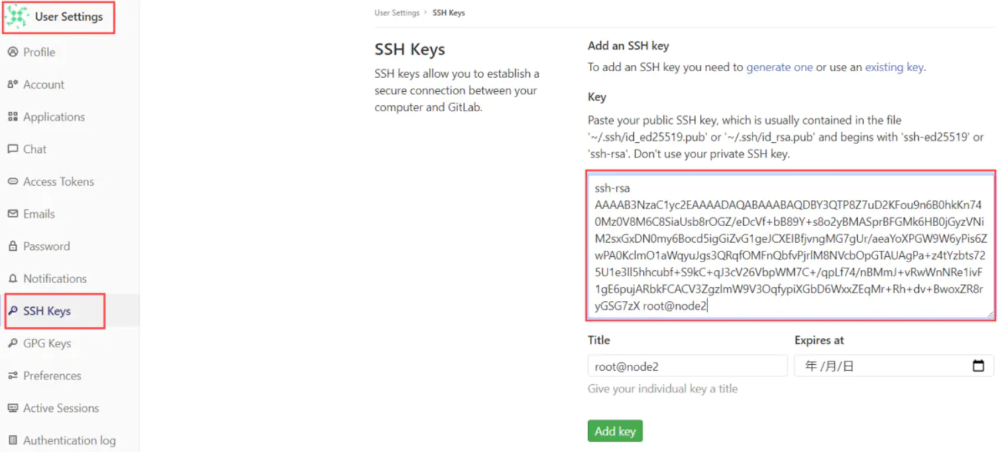
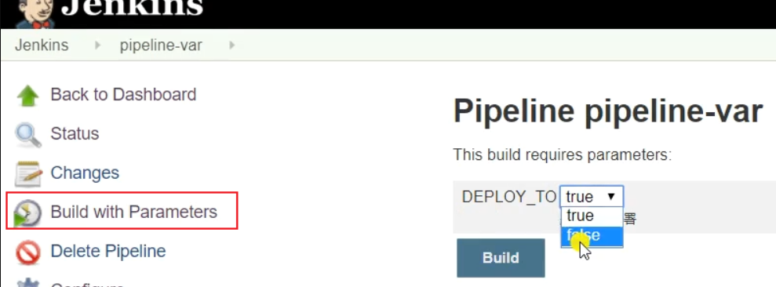
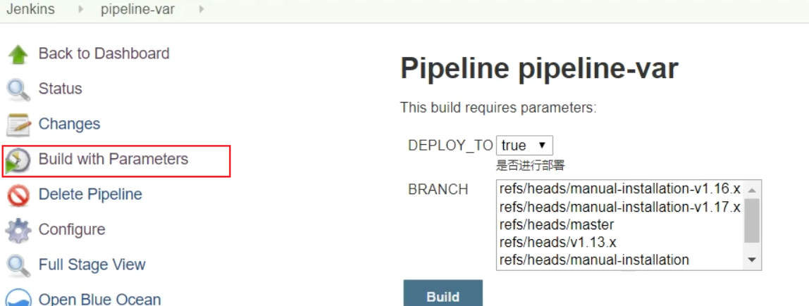
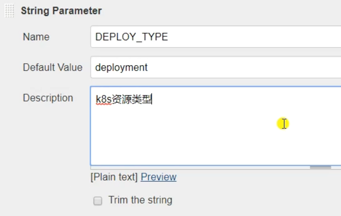

## 配置gitlab凭证

在jenkins服务器使用root用户生成公钥和私钥

```shell
ssh-keygen -t rsa
```

把生成的**公钥**放在Gitlab中



在Jenkins中添加凭证，配置**私钥**


在jenkins的job里使用凭证**连接gitlab**：

配置前先说一个坑：


这是因为 jenkins 我们 yum 装的运行用户是 jenkins 用户，此处是 jenkins 用户去 git 仓库进行拉取，而 jenkins 用户的话默认是 /bin/false 的，不但不能登录，也没有 git 命令权限，所以肯定是失败的。

解决此问题两种办法：

- 更改jenkins用户为root用户；

- 更改jenkins用户为正常的普通用户/bin/bash，将其的公钥加入到git服务器的git用户中。

### 配置阿里云镜像仓库凭证

jenkins需要把构建好的docker镜像上传到镜像仓库


## 参数化构建

我们可以在jenkins定义变量，把jenkins的一些命令参数化，便于管理jenkinsfile

**choice parameter**

jenkins中定义变量：


效果：




**git parameter**


**list git branches**

定义变量：


效果：



可以用正则只显示/refs/heads/后面的内容：


**string parameter**

定义变量：



效果：

