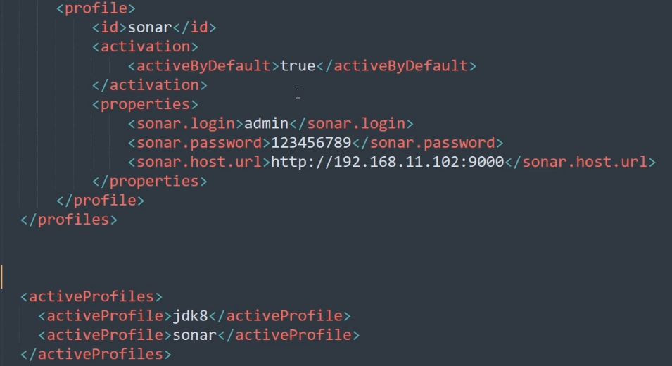
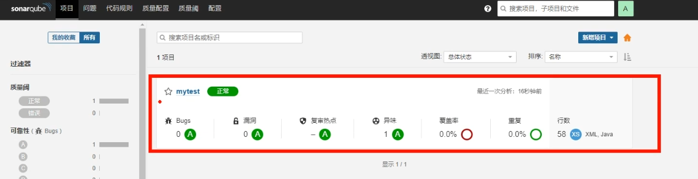
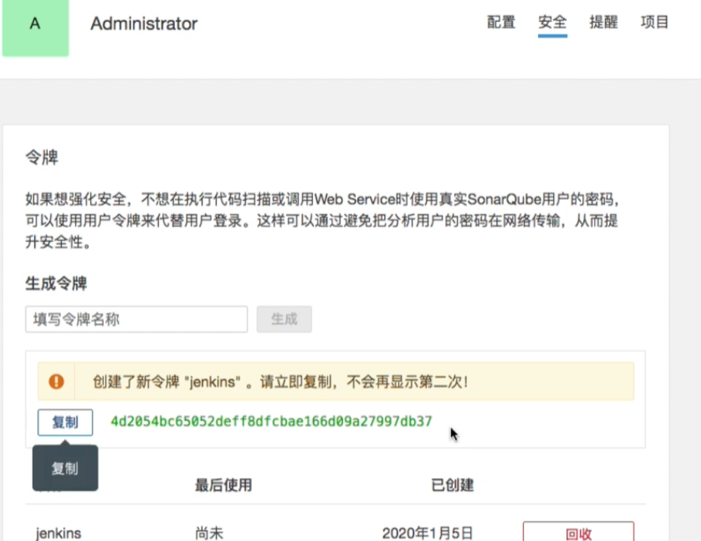

# sonarqube

## 介绍和安装

安装：

[SonarScanner | SonarQube Docs](https://docs.sonarqube.org/latest/analysis/scan/sonarscanner/)

```shell
wget https://binaries.sonarsource.com/Distribution/sonar-scanner-cli/sonar-scanner-cli-4.6.1.2450-linux.zip
unzip sonar-scanner-cli-4.6.1.2450-linux.zip -d /usr/local
vim /etc/profile
export SONAR_HOME=/usr/local/sonar-scanner-cli-4.6.1.2450-linux/
export PATH=$PATH:$SONAR_HOME/bin
source /etc/profile
sonar-scanner -h
```


## 基本使用

第一种方法：

修改maven的setting文件



对代码进行质量检测

```shell
mvn -v
mvn sonar:sonar
```

检测完后可以发现多了一个检测项目




第二种方法：

```shell
sonar-sonar -Dsonar.sources=./ -Dsonar.projectName=xxx -Dsonar.login=admin -Dsonar.password=admin -Dsonar.projectKey=xxx -Dsonar.java.binaries=./target
```

## sonarqube整合到jenkins

1. jenkins安装sonarqube scaner插件

2. sonarqube生成token

   

3. 在jenkins配置sonarqube

   

   

4. 

   

   

   

