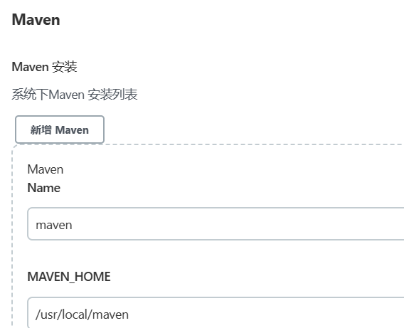

docker安装jenkins

```shell
docker run --name jenkins \
--restart=always \
-p 8080:8080 \
-p 50000:50000 \
-v /var/jenkins:/var/jenkins_home \
-v /usr/local/jdk:/usr/local/jdk \
-v /usr/local/maven:/usr/local/maven \
-e JENKINS_UC=https://mirrors.cloud.tencent.com/jenkins/ \
-e JENKINS_UC_DOWNLOAD=https://mirrors.cloud.tencent.com/jenkins/ \
-d jenkins/jenkins:2.346.1

docker run --name jenkins \
--restart=always \
-u root \
-p 8080:8080 \
-p 50000:50000 \
-v jenkins-data:/var/jenkins_home \
-v /var/run/docker.sock:/var/run/docker.sock \
-d jenkinsci/blueocean

#提取初始密码
docker logs -f jenkins
```

到安装插件的时候会提示jenkins离线，这时候要修改配置

```shell
cd /var/jenkins/updates/
sed -i "s/www.google.com/www.baidu.com/g" default.json
chattr +i default.json

cd /var/jenkins
vim hudson.model.UpdateCenter.xml把https改成http

#然后重启jenkins
docker restart jenkins
```


全局工具配置


