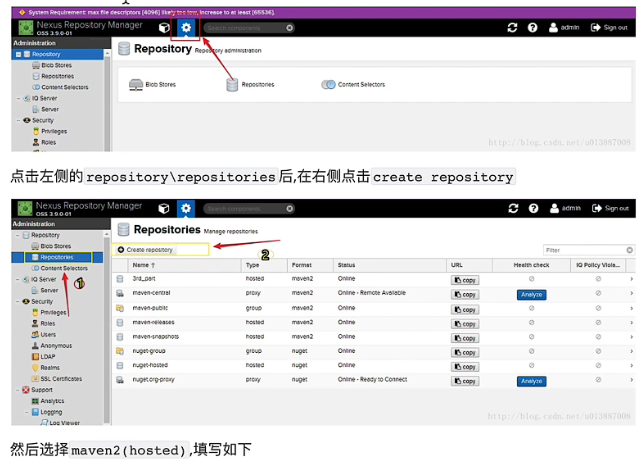

1. 拉取镜像(最新)

   ```shell
docker pull sonatype/nexus3:latest
   ```

2. 启动

   ```shell
   docker run -d -p 666:8081 --name nexus -e INSTALL4J_ADD_VM_PARAMS="-Xms512m -Xmx512m -XX:MaxDirectMemorySize=1200m" -v /root/nexus-data:/nexus-data sonatype/nexus3
   
   
   #这里启动后用docker logs -f nexus发现报错
   ls: cannot access 'java': Operation not permitted
   mkdir: cannot create directory '../sonatype-work/nexus3/log': Permission denied
   mkdir: cannot create directory '../sonatype-work/nexus3/tmp': Permission denied
   OpenJDK 64-Bit Server VM warning: Cannot open file ../sonatype-work/nexus3/log/jvm.log due to No such file or directory
   Warning:  Cannot open log file: ../sonatype-work/nexus3/log/jvm.log
   Warning:  Forcing option -XX:LogFile=/tmp/jvm.log
   ...
   于是增加参数--privileged=true
   修改映射目录权限chmod 777 /root/nexus-data
   ```

   浏览器访问http://xxx:666

   账号：admin

   密码在/root/nexus-data/admin.password

## 界面介绍


左边：

search：搜索上传的依赖

browse：浏览我们创建的仓库

upload：上传依赖


设置：

repositories：所有仓库


## 仓库介绍

nexus仓库分三种类型：

proxy：代理仓库，比如代理到maven中央仓库

hosted：宿主仓库，即自己的私人仓库

group：仓库组，由多个仓库组成，要下载依赖时会遍历每个仓库去找


仓库格式有两种：

maven2（java关注这个就好）

nuget

## 向nexus3私服上传jar包

创建3rd_part库




创建3rd_part管理用户


