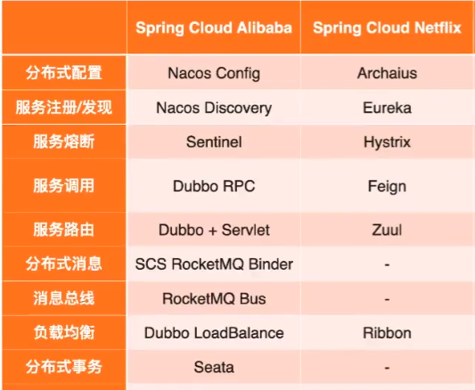
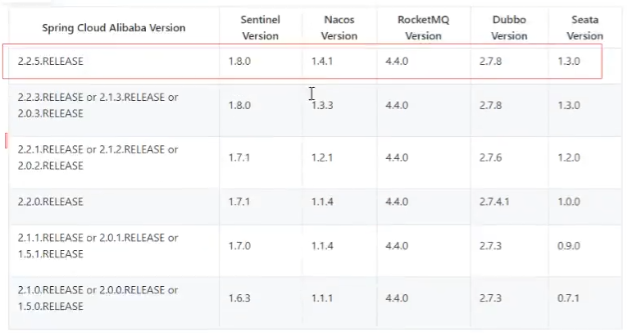
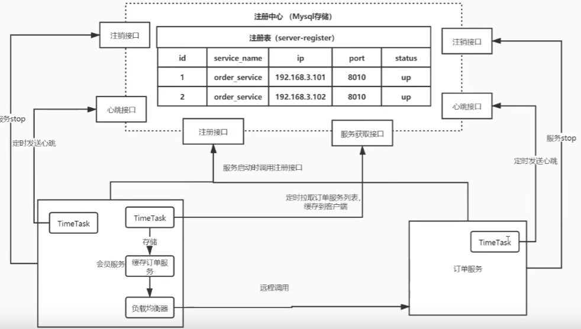
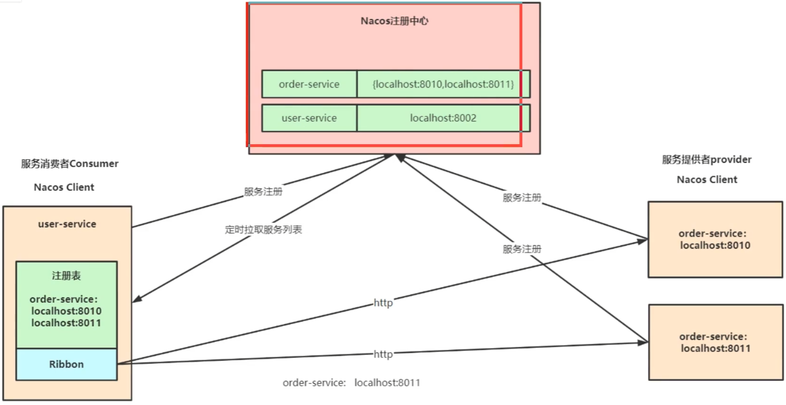

## 微服务概念

什么是微服务？

一个电商系统有订单模块、商品模块、支付模块等，在微服务架构里会把这些模块拆成一个一个细小的服务，每一个服务独立部署；服务之间的调用链路错综复杂，springcloud提供了一系列组件，让我们能够协调和治理服务之间的调用

微服务架构问题：

这么多服务，如何管理它们（服务治理 注册中心【服务注册 发现 剔除】） nacos

服务之间如何通讯（restful rpc dubbo fegin）

客户端如何访问这些服务（网关） gateway

服务一旦出错如何自处理（容错）

服务一旦出错如何排错（链路追踪）

## 架构

alibaba和netflix（停更）这两套的区别

组件版本关系：

## Nacos

集注册中心和配置中心的平台

注册中心就是把所有服务注册进去，后面用服务名就可以调用服务了而不需要用服务的ip地址

配置中心就是管理所有服务的公用配置文件

### nacos注册中心

原理：

服务启动后调用注册接口，注册到注册中心，服务会定时拉取服务列表缓存到客户端中

如何防止调用到有问题的服务，这就引入了心跳机制，比如服务每5s发送心跳给注册中心，如果注册中心5s后没收到，就会把该服务的状态改为down，如果30s还没收到就把该服务的信息剔除；如果服务终止掉还会调用注销借口注销掉该服务

部署：

单机

集群

### nacos配置中心

## 负载均衡器Ribbon

服务端负载均衡

例如nginx，通过nginx进行负载均衡，先发送请求，然后通过负载均衡算法，在多个服务之间选择一个进行访问

客户端负载均衡

例如springcloud的ribbon，客户端会有一个服务器地址列表，在发送请求前通过负载均衡算法选择一个服务器，然后进行访问

## 微服务调用组件Feign

springcloud openfeign对feign进行了增强，使其支持spring mvc注解，另外还整合了ribbon和nacos

## 微服务组件Sentinel

当服务挂掉时我们首先想到什么：

- 激增流量打垮

  激增流量导致cpu/load飙高

- 不稳定服务依赖

  慢sql查询卡爆连接池

  业务调用持续出现异常

常用容错机制：

- 超时机制

- 服务限流

- 服务熔断

  远程服务不稳定或网络抖动时暂时关闭，就叫服务熔断

- 服务降级

  有服务熔断就有服务降级

  就是当某个服务熔断后，服务将不再被调用，

下载sentinel的jar包并启动

## 分布式事务组件Seata

## 网关组件Gateway

## 链路追踪SkyWalking

