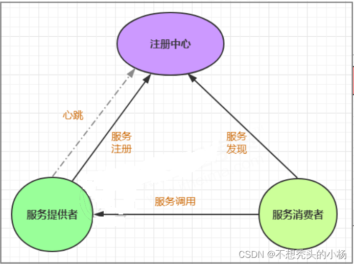

# 微服务

单体架构：

比如一个电商系统，里面包含商品、订单等模块，把它们做成一个web项目部署在一台tomcat服务器上


微服务：

简单说就是把单体应用进一步拆分，拆分成更小的服务，每个服务都是一个可以独立运行的项目

## 常见概念

### 服务治理

服务治理就是服务的自动化管理，其核心是服务的自动注册与发现

**服务注册**：服务实例将自身信息注册到注册中心，并在注册中心形成一张注册清单

服务发现：服务实例通过注册中心获取到其他服务实例的信息，通过这些信息去请求它们提供的服务

服务剔除：服务注册中心需要以**心跳30s 90s**的方式去监测清单中 的服务是否可用，如果不可用，需要在服务清单中剔除不可用的服务。




常见的注册中心有：Zookeeper、Eureka（闭源）、Consul、Nacos

### 服务调用

目前主流的远程调用技术有基于http的RESTful接口

### 服务网关

外部客户端可能需要调用多个服务的接口才能完成一个业务需求，所以需要API网关

将所有API调用统一接入到API网关层

### 服务容错

一个请求经常会涉及到调用多个服务，如果其中某个服务不可用，没有做服务容错就很可能造成一连串的服务不可用，这就是雪崩效应

### 链路追踪

一次请求往往涉及到多个服务，需要对一次请求涉及的多个服务链路进行日志记录，性能监控

## nacos

nacos的作用就是一个注册中心，用来管理注册上来的各个微服务

### 搭建nacos

第1步: 安装nacos

> 下载地址: https://github.com/alibaba/nacos/releases
>
> 下载tar.gz格式的安装包，然后进行解压缩操作 

第2步: 启动nacos

```shell
sh startup.sh -m standalone
```

第3步: 访问nacos

打开浏览器输入http://localhost:8848/nacos，即可访问服务， 默认密码是nacos/nacos 


为了确保高可用，我们一般都会对其进行集群的部署。Nacos规定集群中Nacos节点的数量需要大于等于3个，如果集群中启动多个默认配置下的Nacos节点，数据存储是存在一致性问题的。为了解决这个问题，Nacos采用了集中式存储的方式来支持集群化部署，目前只支持MySQL的存储；此外，我们还需要借助Nginx实现负载均衡。

## 负载均衡

**负载均衡：**

根据负载均衡发生位置的不同,一般分为**服务端负载均衡**和**客户端负载均衡**。

服务端负载均衡指的是发生在服务提供者一方,比如常见的nginx负载均衡

而客户端负载均衡指的是发生在服务请求的一方，也就是在发送请求之前已经选好了由哪个实例处理请求

在微服务调用关系中一般会选择客户端负载均衡，也就是在服务调用的一方来决定服务由哪个提供者执行


基于Ribbon实现服务调用


基于OpenFeign实现服务调用：

OpenFeign是Spring Cloud提供的一个声明式的伪Http客户端， 它使得调用远程服务就像调用本地服务一样简单， 只需要创建一个接口并添加一个注解即可。

Nacos很好的兼容了Feign， Feign负载均衡默认集成了 Ribbon， 所以在Nacos下使用Fegin默认就实现了负载均衡的效果。


