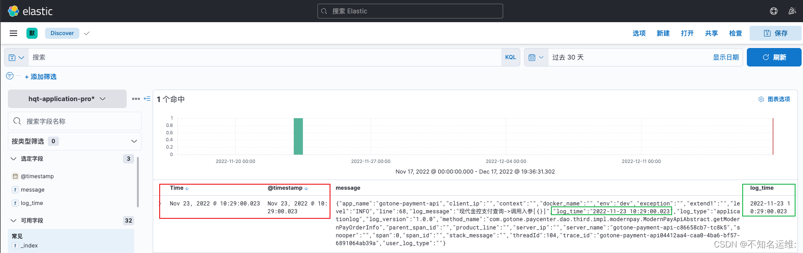

# logstash

Logstash主要对日志进行**过滤处理**，也能用来做日志收集。**但日志采集一般不用**logstash

logstash内部主要分为三个组件，输入（input），过滤器（filter），输出（output）

logstash的工作流程：input插件 ---> filter ---> output插件，如无需对数据进行额外处理，filter可省略；

默认logstash用logstash用户启动，日志需要给logstash用户读权限


Input：**输入**，输出数据可以是Stdin、File、TCP、Redis、Syslog等。 

Filter：**过滤**，将日志格式化。有丰富的过滤插件：Grok正则捕获、Date时间处理、Json编解码、Mutate数据修改等。 

Output：**输出**，输出目标可以是Stdout、File、TCP、Redis、ES等。

## input

https://www.elastic.co/guide/en/logstash/current/input-plugins.html

file示例

```shell
vim messages.conf
input {
    #从文件中来
    file {
        #读取messages文件
    	path =>"/var/log/messages"
    	#排除不想读取的文件
    	exclude =>"1.log"
    	#增加标签
    	tags =>"123"
    	#定义类型
    	type =>"syslog"
    	#读取文件的起始位置，默认是end
    	start_position => beginning
    }
}
filter {
}
output {
    stdout {
        codec => rubydebug
	}
}

[root@logstash logstash]# bin/logstash -f config/messages.conf
输出：
{
          "path" => "/var/log/messages",
    "@timestamp" => 2021-10-24T08:55:20.108Z,
      "@version" => "1",
          "host" => "logstash",
       "message" => "Oct 24 16:53:32 logstash journal: g_simple_action_set_enabled: assertion 'G_IS_SIMPLE_ACTION (simple)' failed",
          "type" => "syslog",
          "tags" => [
        [0] "123"
    ]
}
```

**beats示例**

```shell
vim logstash_from_filebeat.conf
#从beats输入
input {
    beats {
    	port =>5044
    }
}
filter {
    ...
}
output {
    ...
}
```

redis示例

```shell
vim logstash_from_redis.conf
input {
	redis {
		host => "192.168.10.10"
		port => 6379
		password => "123456"
		db => "0"
		data_type => "list"
		key => "filebeat"
	}
}
...
```

## fileter

https://www.elastic.co/guide/en/logstash/current/filter-plugins.html

### json插件

通常情况，Logstash收集到的数据都会转成json格式，但是默认logstash只是对收集到的格式化数据转成json，如果收到的数据仅仅是一个字符串是不会转换成Json.

例如：

```json
{
   "message": {\"age\":22,"\id\":1,\"username\":\"张三\"} 
}
```

message字段的内容是一个json字符串，不是格式化的Json格式，如果数据导入到Elasticsearch，message字段也是一个字符串，不是一个Json对象；json filter插件可以解决这种问题。

logstash配置：

```json
filter {
  json {
      # 指定需要转换成json格式的字段
      source => "message"
      # 指定转换成json的数据，保存到哪个字段，如果字段存在会覆盖
      target => "parsed_json"
      # 如果遇到错误的json,是否跳过json filter过滤器
      skip_on_invalid_json => true
  }
}
```

格式化数据后，输出如下：

```json
{
   "message": {\"age\":22,"\id\":1,\"username\":\"张三\"} 
   "parsed_json": {
   		"age":22,
        "id": 1,
        "username": “张三”
   }
}
```

### mutate插件

**可以重命名，删除，替换和修改事件中的字段**

logstash配置：

```json
filter {
    mutate {
        #提取parsed_json的age字段的值赋给添加的新字段age
    	add_field => { "age" => "%{[parsed_json][age]}" }
        #移除字段message
        remove_field  => [ "message" ]  
    }
}
```

输出如下：

```json
{
   "parsed_json": {
   		"age":22,
        "id": 1,
        "username": “张三”
   }
   "age": 22
}
```

### date插件

如下是我们要收集的一条json格式的日志

```json
{"app_name":"gotone-payment-api","client_ip":"","context":"","docker_name":"","env":"dev","exception":"","extend1":"","level":"INFO","line":68,"log_message":"现代金控支付查询->调用入参[{}]","log_time":"2022-11-23 00:00:00.051","log_type":"applicationlog","log_version":"1.0.0","method_name":"com.gotone.paycenter.dao.third.impl.modernpay.ModernPayApiAbstract.getModernPayOrderInfo","parent_span_id":"","product_line":"","server_ip":"","server_name":"gotone-payment-api-c86658cb7-tc8k5","snooper":"","span":0,"span_id":"","stack_message":"","threadId":104,"trace_id":"gotone-payment-apib4a65777-ce6b-4bcc-8aef-71a7cfffaf2c","user_log_type":""}
```


如上图所示，日志写入ES的时间与日志产生的时间不一致，当发生事故时，就会影响排错的效率，所以需要将这个写入ES的时间改为日志产生的时间log_time

```json
filter {

  json {
    source => "message"
  }


  date {
    #匹配时间字段并解析
    match => [ "log_time", "yyyy-MM-dd HH:mm:ss.SSS" ]
    #将匹配到的时间字段解析后存储到目标字段，默认字段为"@timestamp"
    target => "@timestamp"
    timezone => "Asia/Shanghai"
  }

}
```


执行案例后效果如下




注意：下面这两种格式有区别！！

```json
#第一种日志输出例如：
"timestamp":"22/Dec/2022:10:14:39 +0800"

date {
    match => [ "timestamp", "dd/MMM/yyyy:HH:mm:ss Z" ]
    target => "@timestamp"
    timezone => "Asia/Shanghai"
  }

#第二种日志输出例如：
"AccessTime":"[22/Dec/2022:10:10:28 +0800]" 
其实这一种跟上一种是一回事，只不过是加了中括号，需要使用grok转义以下即可
grok {
    match => [ "message","%{HTTPDATE:AccessTime}" ]
  }
date {
    match => [ "AccessTime", "dd/MMM/yyyy:HH:mm:ss Z" ]
    target => "@timestamp"
    timezone => "Asia/Shanghai"
}
```


### grok插件

复杂

匹配非结构化的日志然后结构化输出，使用一整行日志无法分析，需要提取单独的字段，分析哪个IP访问量大，分析Nginx的响应状态码

https://github.com/logstash-plugins/logstash-patterns-core/blob/master/patterns

[Grok Debugger](http://grokdebug.herokuapp.com/)

```
普通正则表达式符号
 . 表示任意一个字符，* 表示前面一个字符出现0次或者多次
 [abc]表示中括号内任意一个字符，[^abc]表示非中括号内的字符
 [0-9]表示数字，[a-z]表示小写字母，[A-Z]表示大写字母，[a-zA-Z]表示所有字母，[a-zA-Z0-9]表示所有字母+数字
 [^0-9]表示非数字
 ^xx表示以xx开头，xx$表示以xx结尾
 \s表示空白字符，\S表示非空白字符，\d表示数字
```

```
扩展正则表达式，在普通正则基础上再进行扩展
 ?表示前面字符出现0或者1次，+前面字符出现1或者多次
 {a}表示前面字符匹配a次，{a,b}表示前面字符匹配a到b次
 {,b}表示前面字符匹配0次到b次，{a,}前面字符匹配a或a+次
 string1|string2表示匹配string1或者string2
```

示例：

```shell
input {
    file {
        path => "/usr/local/nginx/logs/access.log"
        type => "system"
        start_position => "beginning"
    }
}
filter {
	grok {
		match => { "message" => "%{HTTPD_COMBINEDLOG}" }
		#@timestamp时间是指logstash读取到日志的时间而不是日志生产的时间，要用日志的真实时间戳
	}
	date {
		#匹配timestamp字段
		match => ["timestamp","dd/MMM/yyy:HH:mm:ss Z"]
		#将匹配到的数据写到@timestamp字段中
		target => "@timestamp"
	}
}
output {
    stdout {
        codec => rubydebug
	}
}
```

自定义模式：

```shell
# vi /opt/patterns
ID [0-9A-Z]{10,11}

filter {
	grok {
		patterns_dir =>"/opt/patterns"
		match => {
			"message" => "%{IP:client} %{WORD:method} %{URIPATHPARAM:request} %{NUMBER:bytes} %{NUMBER:duration} %{ID:id}" 
		}
	}
}
```

多模式匹配：

```shell
filter {
	grok {
	patterns_dir =>"/opt/patterns"
	#match多模式匹配
	match => [
		"message", "%{IP:client} %{WORD:method} %{URIPATHPARAM:request} %{NUMBER:bytes} %{NUMBER:duration} %{ID:id}",
		"message", "%{IP:client} %{WORD:method} %{URIPATHPARAM:request} %{NUMBER:bytes} %{NUMBER:duration} %{TAG:tag}"
	]
	}
}
```

## output

发送到elasticsearch

```shell
output {
  if "xxx" in [tags] {
    elasticsearch {
      #elasticsearch地址，多个以','隔开
      hosts => "192.168.71.132:9200"
      #创建的elasticsearch索引名
      index => "xxx-%{+YYYY.MM.dd}"
    }
  }
}
```

## 配置文件

vim logstash.yml

```yaml
# If using queue.type: persisted, the interval in milliseconds when a checkpoint is forced on the head page
# Default is 1000, 0 for no periodic checkpoint.
#启用持久队列(queue.type: persisted)后，执行检查点的时间间隔，单位ms，默认1000ms
queue.checkpoint.interval: 1000
# ------------ Dead-Letter Queue Settings --------------
#是否启用插件支持的DLQ功能的标志，默认false
dead_letter_queue.enable: false
#dead_letter_queue.enable为true时，每个死信队列的最大大小
#若死信队列的大小超出该值，则被删除，默认1024mb
dead_letter_queue.max_bytes: 1024mb
#死信队列存储路径，默认path.data/dead_letter_queue
path.dead_letter_queue:
# ------------ Debugging Settings --------------
#日志输出级别，选项：fatal,error,warn,info,debug,trace,默认info
log.level: info
#日志格式，选项:json,plain,默认plain
log.format:
#日志路径，默认LOGSTASH_HOME/logs
path.logs:
# ------------ Other Settings --------------
#插件存储路径
path.plugins: []
#是否启用每个管道在不同日志文件中的日志分隔
#默认false
pipeline.separate_logs: false
```


