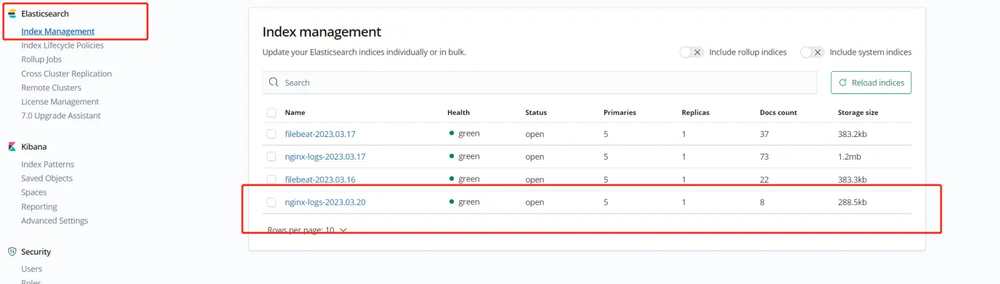
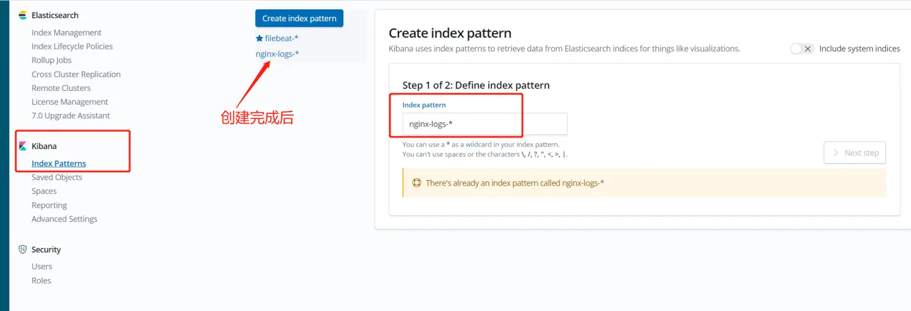
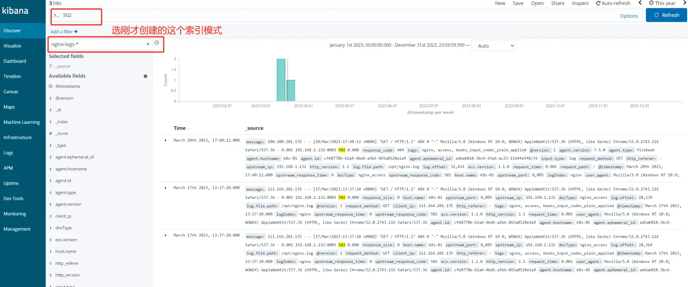

# 案例

## 收集nginx访问日志

**准备工作：**

首先在nginx中定义一个自己想要的格式，如：

```nginx
log_format  access_ty  '$remote_addr - $remote_user [$time_local] "$request" '
          '$status $body_bytes_sent "$http_referer" '
      '$http_user_agent $http_x_forwarded_for $request_time  $upstream_addr $upstream_status $upstream_response_time';
```

在conf中定义访问日志时来引用`access_ty`这个自定义名字即可

```nginx
access_log  /var/log/nginx/access_test.log access_ty;
```

访问一下，得出日志数据如下，这个就作为我们的测试数据了：

```
100.100.201.135 - - [20/Mar/2023:17:40:12 +0800] "GET / HTTP/1.1" 404 0 "-" Mozilla/5.0 (Windows NT 10.0; WOW64) AppleWebKit/537.36 (KHTML, like Gecko) Chrome/52.0.2743.116 Safari/537.36 - 0.001  192.168.1.132:8005 404 0.000
```

**思路：**

filebeat定义日志路径，将收集到的日志数据发送到logstash进行过滤处理

logstash通过grok正则将字段进行分解，可自定义某些冗余字段对其删除

处理后将数据发送到es，es中创建对应的索引

kibana创建与es对应的index patterns在界面可进行查看

**filebeat配置：**

```yaml
filebeat.prospectors:
- type: log
  paths:
    - /usr/local/nginx/logs/access.log
  tags: ["nginx", "access"]
  fields:
    logIndex: nginx
    docType: nginx_access
  fields_under_root: true
  
output.logstash:
  enabled: true
  hosts: ["192.168.2.113:5044"]
```

**logstash配置：**

注意：这个grok正则配置要根据自己的格式来，这里用的都是内置封装好的正则。调试的方法可以去kibana或者grok在线网站去将 测试数据和grok规则 调试匹配好再写到配置文件中 ，节省时间。

```
%{IPV4:client_ip} - - \[%{HTTPDATE:timestamp}\] \"%{WORD:request_method} %{DATA:request_path} HTTP/%{NUMBER:http_version}\" %{NUMBER:response_code} %{NUMBER:response_size} \"%{DATA:http_referer}\" %{DATA:user_agent} - %{NUMBER:request_time:float}  %{IPV4:upstream_ip}:%{NUMBER:upstream_port:int} %{NUMBER:upstream_response_code:int} %{NUMBER:upstream_response_time:float}
```

配置文件：

```yaml
input {
    beats {
        port => 5044
        client_inactivity_timeout => 36000 #filebeat连接logstash超时时间
    }
}

filter {
#  if [type] == "nginx_access"{
     grok {
          match => { "message" => %{IPV4:client_ip} - - \[%{HTTPDATE:timestamp}\] \"%{WORD:request_method} %{DATA:request_path} HTTP/%{NUMBER:http_version}\" %{NUMBER:response_code} %{NUMBER:response_size} \"%{DATA:http_referer}\" %{DATA:user_agent} - %{NUMBER:request_time:float}  %{IPV4:upstream_ip}:%{NUMBER:upstream_port:int} %{NUMBER:upstream_response_code:int} %{NUMBER:upstream_response_time:float} }
     }
     date {
        match => [ "timestamp", "dd/MMM/yyyy:HH:mm:ss Z" ]
        target => "@timestamp" #将匹配到的timestamp写入到@timestap
        remove_field => [ "timestamp" ] #匹配到结果以后去除timestamp字段
     }
#  } 
}

output {
    elasticsearch {
        hosts => ["http://192.168.2.114:9200","http://192.168.2.115:9200","http://192.168.2.116:9200"]
        index => "nginx-logs-%{+YYYY.MM.dd}"
        document_type => "%{[@metadata][type]}"
        user => "logstash_server"
        password => "123456"
    }
#    stdout { codec => rubydebug } #在输出控制台调试
}
```

**kibana配置查看**

kibana上查看es索引应该是有了



在对应es的索引创建kibana的`index pattern`



在写入一次测试数据。再次查看，成功收集到了




## 收集springboot日志

项目添加依赖：


配置filebeat.yml

```shell
filebeat.prospectors:
- type: log
  paths:
    - /usr/local/tomcat/logs/catalina.out
  # tags: ["tomcat"]
  #字段
  fields:
    app: www
    type: tomcat-catalina
  fields_under_root: true
  #多行匹配
  multiline:
    #以[为首
    pattern: '^\['
    #如果不是[开头就合并到上一行
    negate: true
    #合并在尾部
    match: after

output.redis:
  hosts: ["192.168.0.215"]
  password: "123456"
  key: "filebeat"
  db: 0
  datatype: list
```

logstash配置同上
