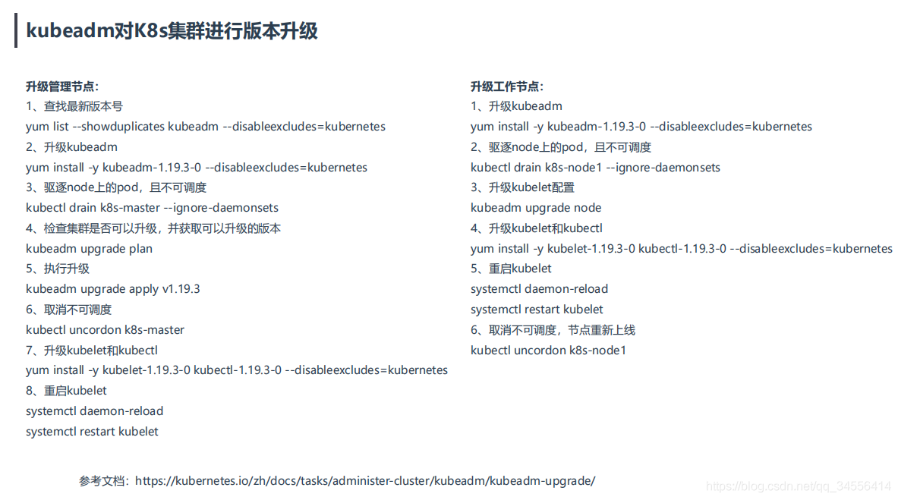

 **升级策略：**

- 始终保持最新
-  每半年升级一次，这样会落后社区1~2个小版本
- **一年升级一次，或者更长，落后版本太多**

升级流程：

升级管理节点→升级工作节点

注意事项：

- 升级前必须备份所有组件及数据，例如etcd
- 千万不要跨多个小版本进行升级，比如现在有1.19，1.20，1.21，1.22，不要从1.19到1.22，因为官方对每个API版本的改动只兼容两个小版本，比如从1.19到1.22跨越多个版本，那么可能导致在1.22里面弃用了某个api，或者某个参数，那么原先在1.19当中可以使用的功能在1.22当中导致不可以使用。所以建议一个一个小版本升级，如1.19-->1.20，1.20可以正常使用再到1.21

## 升级管理节点

查看当前版本 

[root@k8s-master ~]# kubectl get node
NAME         STATUS   ROLES    AGE    VERSION
k8s-master   Ready    master   274d   v1.19.0
k8s-node1    Ready    <none>   274d   v1.19.0
k8s-node2    Ready    <none>   274d   v1.19.0
1、查找最新版本号  查看kubeadm工具

[root@k8s-master ~]# yum list --showduplicates kubeadm --disableexcludes=kubernetes
Loaded plugins: fastestmirror
Repodata is over 2 weeks old. Install yum-cron? Or run: yum makecache fast
Determining fastest mirrors
 * base: mirrors.ustc.edu.cn
 * extras: mirrors.ustc.edu.cn
 * updates: mirrors.bfsu.edu.cn
Installed Packages
kubeadm.x86_64                                         1.19.0-0                                           @kubernetes
Available Packages
kubeadm.x86_64                                         1.18.10-0                                          kubernetes 
kubeadm.x86_64                                         1.18.12-0                                          kubernetes 
kubeadm.x86_64                                         1.19.0-0                                           kubernetes 
kubeadm.x86_64                                         1.19.1-0                                           kubernetes 
kubeadm.x86_64                                         1.19.2-0                                           kubernetes 
kubeadm.x86_64                                         1.19.3-0                                           kubernetes 
kubeadm.x86_64                                         1.19.4-0                                           kubernetes
2、升级kubeadm工具
[root@k8s-master ~]# yum install -y kubeadm-1.19.4-0 --disableexcludes=kubernetes

[root@k8s-master ~]# kubeadm version
kubeadm version: &version.Info{Major:"1", Minor:"19", GitVersion:"v1.19.4", GitCommit:"d360454c9bcd1634cf4cc52d1867af5491dc9c5f", GitTreeState:"clean", BuildDate:"2020-11-11T13:15:05Z", GoVersion:"go1.15.2", Compiler:"gc", Platform:"linux/amd64"}
3、驱逐node上的pod，且不可调度（除了demosets之外的pod都会驱逐）
[root@k8s-master ~]# kubectl drain k8s-master --ignore-daemonsets
node/k8s-master cordoned
WARNING: ignoring DaemonSet-managed Pods: kube-system/calico-node-6hgrq, kube-system/kube-proxy-xth6p
node/k8s-master drained

#可以看到节点为不可调度，pod不会分配到该节点
[root@k8s-master ~]# kubectl get node
NAME         STATUS                     ROLES    AGE    VERSION
k8s-master   Ready,SchedulingDisabled   master   274d   v1.19.0
k8s-node1    Ready                      <none>   274d   v1.19.0
k8s-node2    Ready                      <none>   274d   v1.19.0
4、检查集群是否可以升级，并获取可以升级的版本
[root@k8s-master ~]# kubeadm upgrade plan
[upgrade/config] Making sure the configuration is correct:
[upgrade/config] Reading configuration from the cluster...
[upgrade/config] FYI: You can look at this config file with 'kubectl -n kube-system get cm kubeadm-config -oyaml'
[preflight] Running pre-flight checks.
[upgrade] Running cluster health checks
[upgrade] Fetching available versions to upgrade to
[upgrade/versions] Cluster version: v1.19.0
[upgrade/versions] kubeadm version: v1.19.4
I0816 20:44:13.219092   56342 version.go:252] remote version is much newer: v1.22.0; falling back to: stable-1.19
[upgrade/versions] Latest stable version: v1.19.14
[upgrade/versions] Latest stable version: v1.19.14
[upgrade/versions] Latest version in the v1.19 series: v1.19.14
[upgrade/versions] Latest version in the v1.19 series: v1.19.14

Components that must be upgraded manually after you have upgraded the control plane with 'kubeadm upgrade apply':
COMPONENT   CURRENT       AVAILABLE
kubelet     3 x v1.19.0   v1.19.14

Upgrade to the latest version in the v1.19 series:

COMPONENT                 CURRENT   AVAILABLE
kube-apiserver            v1.19.0   v1.19.14
kube-controller-manager   v1.19.0   v1.19.14
kube-scheduler            v1.19.0   v1.19.14
kube-proxy                v1.19.0   v1.19.14
CoreDNS                   1.7.0     1.7.0
etcd                      3.4.9-1   3.4.13-0

You can now apply the upgrade by executing the following command:

	kubeadm upgrade apply v1.19.14

Note: Before you can perform this upgrade, you have to update kubeadm to v1.19.14.

_____________________________________________________________________

The table below shows the current state of component configs as understood by this version of kubeadm.
Configs that have a "yes" mark in the "MANUAL UPGRADE REQUIRED" column require manual config upgrade or
resetting to kubeadm defaults before a successful upgrade can be performed. The version to manually
upgrade to is denoted in the "PREFERRED VERSION" column.

API GROUP                 CURRENT VERSION   PREFERRED VERSION   MANUAL UPGRADE REQUIRED
kubeproxy.config.k8s.io   v1alpha1          v1alpha1            no
kubelet.config.k8s.io     v1beta1           v1beta1             no
_____________________________________________________________________
上面输出了升级命令

You can now apply the upgrade by executing the following command:

	kubeadm upgrade apply v1.19.14
5、执行升级  

[root@k8s-master ~]# kubeadm upgrade apply v1.19.4

[upgrade/successful] SUCCESS! Your cluster was upgraded to "v1.19.4". Enjoy!

[upgrade/kubelet] Now that your control plane is upgraded, please proceed with upgrading your kubelets if you haven't already done so.
6、取消不可调度
[root@k8s-master ~]# kubectl uncordon k8s-master
node/k8s-master uncordoned
 7、升级kubelet和kubectl

[root@k8s-master ~]# yum install -y kubelet-1.19.4-0 kubectl-1.19.4-0 --disableexcludes=kubernetes
8、重启kubelet
[root@k8s-master ~]# systemctl daemon-reload
[root@k8s-master ~]# systemctl restart kubelet

[root@k8s-master ~]# kubectl get node
NAME         STATUS   ROLES    AGE    VERSION
k8s-master   Ready    master   274d   v1.19.4
k8s-node1    Ready    <none>   274d   v1.19.0
k8s-node2    Ready    <none>   274d   v1.19.0
可以看到使用新的镜像拉起的 

[root@k8s-master ~]# kubectl get pod -n kube-system -o wide
NAME                                       READY   STATUS    RESTARTS   AGE     IP                NODE         NOMINATED NODE   READINESS GATES
calico-kube-controllers-5c6f6b67db-5wc2g   1/1     Running   0          8m52s   10.244.169.143    k8s-node2    <none>           <none>
calico-node-6hgrq                          1/1     Running   2          274d    192.168.179.102   k8s-master   <none>           <none>
calico-node-jxh4t                          1/1     Running   2          274d    192.168.179.103   k8s-node1    <none>           <none>
calico-node-xjklb                          1/1     Running   3          274d    192.168.179.104   k8s-node2    <none>           <none>
coredns-6d56c8448f-6x65s                   1/1     Running   0          8m52s   10.244.169.145    k8s-node2    <none>           <none>
coredns-6d56c8448f-xjt6g                   1/1     Running   0          8m53s   10.244.235.193    k8s-master   <none>           <none>
etcd-k8s-master                            1/1     Running   0          27m     192.168.179.102   k8s-master   <none>           <none>
kube-apiserver-k8s-master                  1/1     Running   0          25m     192.168.179.102   k8s-master   <none>           <none>
kube-controller-manager-k8s-master         1/1     Running   1          25m     192.168.179.102   k8s-master   <none>           <none>
kube-proxy-p77r2                           1/1     Running   0          24m     192.168.179.104   k8s-node2    <none>           <none>
kube-proxy-pghrf                           1/1     Running   0          23m     192.168.179.102   k8s-master   <none>           <none>
kube-proxy-vvpn4                           1/1     Running   0          24m     192.168.179.103   k8s-node1    <none>           <none>
kube-scheduler-k8s-master                  1/1     Running   1          25m     192.168.179.102   k8s-master   <none>           <none>
kuboard-74c645f5df-l7rmf                   1/1     Running   1          271d    10.244.169.138    k8s-node2    <none>           <none>
metrics-server-7dbf6c4558-lm972            1/1     Running   0          8m53s   192.168.179.104   k8s-node2    <none>           <none>

## 升级工作节点

1、升级kubeadm
[root@k8s-node1 ~]# yum install -y kubeadm-1.19.4-0 --disableexcludes=kubernetes
2、驱逐node上的pod，且不可调度
[root@k8s-master ~]# kubectl drain k8s-node1 --ignore-daemonsets --delete-local-data
node/k8s-node1 already cordoned
WARNING: ignoring DaemonSet-managed Pods: kube-system/calico-node-jxh4t, kube-system/kube-proxy-vvpn4
evicting pod kubernetes-dashboard/dashboard-metrics-scraper-7b59f7d4df-5tzgb
evicting pod kube-system/calico-kube-controllers-5c6f6b67db-q5qb6
evicting pod kube-system/coredns-6d56c8448f-ddt97
evicting pod kube-system/coredns-6d56c8448f-lwn8m
evicting pod kube-system/metrics-server-7dbf6c4558-sw8w8
pod/metrics-server-7dbf6c4558-sw8w8 evicted
pod/coredns-6d56c8448f-ddt97 evicted
pod/dashboard-metrics-scraper-7b59f7d4df-5tzgb evicted
pod/calico-kube-controllers-5c6f6b67db-q5qb6 evicted
pod/coredns-6d56c8448f-lwn8m evicted
node/k8s-node1 evicted
[root@k8s-master ~]# kubectl get node
NAME         STATUS                     ROLES    AGE    VERSION
k8s-master   Ready                      master   274d   v1.19.4
k8s-node1    Ready,SchedulingDisabled   <none>   274d   v1.19.0
k8s-node2    Ready                      <none>   274d   v1.19.0
3、升级kubelet配置
[root@k8s-master ~]# kubeadm upgrade node
[upgrade] Reading configuration from the cluster...
[upgrade] FYI: You can look at this config file with 'kubectl -n kube-system get cm kubeadm-config -oyaml'
[preflight] Running pre-flight checks
[preflight] Pulling images required for setting up a Kubernetes cluster
[preflight] This might take a minute or two, depending on the speed of your internet connection
[preflight] You can also perform this action in beforehand using 'kubeadm config images pull'
[upgrade] Upgrading your Static Pod-hosted control plane instance to version "v1.19.4"...
Static pod: kube-apiserver-k8s-master hash: 45ace2daaf2d9063c22f1e458122b22e
Static pod: kube-controller-manager-k8s-master hash: 3f1f0783a4c18b360e0847ad1bc080ce
Static pod: kube-scheduler-k8s-master hash: 6bfd1888d95f430b2d7d2b7faa87eade
[upgrade/etcd] Upgrading to TLS for etcd
[upgrade/etcd] Non fatal issue encountered during upgrade: the desired etcd version "3.4.13-0" is not newer than the currently installed "3.4.13-0". Skipping etcd upgrade
[upgrade/staticpods] Writing new Static Pod manifests to "/etc/kubernetes/tmp/kubeadm-upgraded-manifests966354998"
[upgrade/staticpods] Preparing for "kube-apiserver" upgrade
[upgrade/staticpods] Current and new manifests of kube-apiserver are equal, skipping upgrade
[upgrade/staticpods] Preparing for "kube-controller-manager" upgrade
[upgrade/staticpods] Current and new manifests of kube-controller-manager are equal, skipping upgrade
[upgrade/staticpods] Preparing for "kube-scheduler" upgrade
[upgrade/staticpods] Current and new manifests of kube-scheduler are equal, skipping upgrade
[upgrade] The control plane instance for this node was successfully updated!
[kubelet-start] Writing kubelet configuration to file "/var/lib/kubelet/config.yaml"
[upgrade] The configuration for this node was successfully updated!
[upgrade] Now you should go ahead and upgrade the kubelet package using your package manager.
4、升级kubelet和kubectl  

[root@k8s-node1 ~]# yum install -y kubelet-1.19.4-0 kubectl-1.19.4-0 --disableexcludes=kubernetes
Loaded plugins: fastestmirror
Loading mirror speeds from cached hostfile
 * base: mirrors.nju.edu.cn
 * extras: mirrors.nju.edu.cn
 * updates: mirrors.nju.edu.cn
Resolving Dependencies
--> Running transaction check
---> Package kubectl.x86_64 0:1.19.0-0 will be updated
---> Package kubectl.x86_64 0:1.19.4-0 will be an update
---> Package kubelet.x86_64 0:1.19.0-0 will be updated
---> Package kubelet.x86_64 0:1.19.4-0 will be an update
5、重启kubelet
[root@k8s-node1 ~]# systemctl daemon-reload
[root@k8s-node1 ~]# systemctl restart kubelet
6、取消不可调度，节点重新上线
[root@k8s-master ~]# kubectl get node
NAME         STATUS   ROLES    AGE    VERSION
k8s-master   Ready    master   274d   v1.19.4
k8s-node1    Ready    <none>   274d   v1.19.4
k8s-node2    Ready    <none>   274d   v1.19.0
master节点涉及etcd，controller-manager，等组件镜像更新了，而node节点只是将kubelet和kubectl软件包更新了
