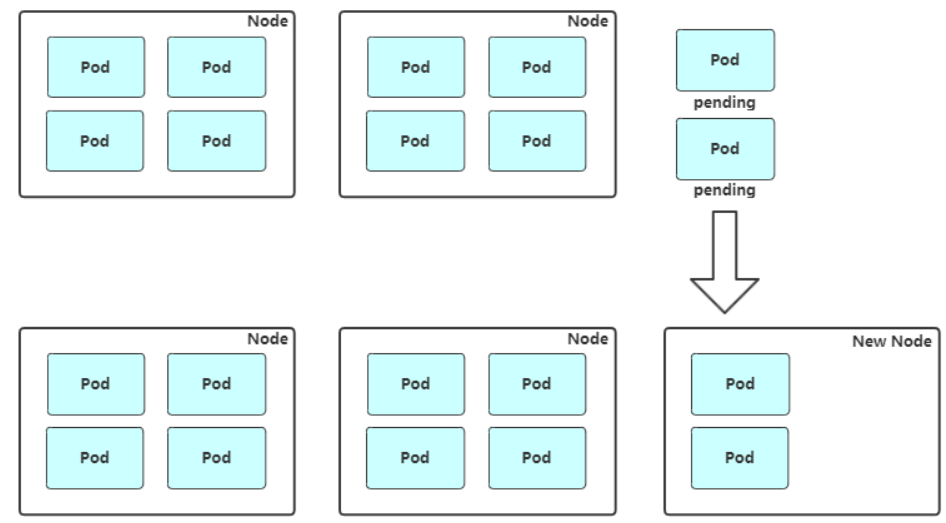
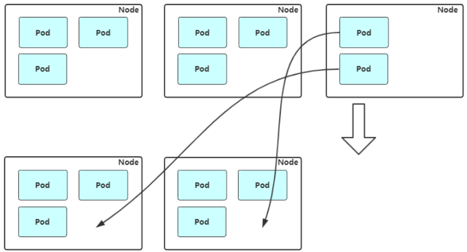

# 弹性伸缩

## kubernetes 弹性伸缩布局

有三种弹性伸缩：

- **CA**（Cluster Autoscaler）：Node级别自动扩/缩容

  cluster-autoscaler组件

- **HPA**（Horizontal Pod Autoscaler）：Pod个数自动扩/缩容

- VPA（Vertical Pod Autoscaler）：Pod配置自动扩/缩容，主要是CPU、内存

  addon-resizer组件

如果在云上建议 HPA 结合 cluster-autoscaler 的方式进行集群的弹性伸缩管理。

## Node 自动扩容/缩容

Cluster AutoScaler（要有支持的云供应商）

支持的云提供商：

- 阿里云：<https://github.com/kubernetes/autoscaler/blob/master/cluster-autoscaler/cloudprovider/alicloud/README.md>
- AWS： <https://github.com/kubernetes/autoscaler/blob/master/cluster-autoscaler/cloudprovider/aws/README.md>
- Azure： <https://github.com/kubernetes/autoscaler/blob/master/cluster-autoscaler/cloudprovider/azure/README.md>

**扩容：**Cluster AutoScaler 定期检测是否有充足的资源来调度新创建的 Pod，当资源不足时会调用 Cloud Provider 创建新的 Node。



**缩容：**Cluster AutoScaler 也会定期监测 Node 的资源使用情况，当一个 Node 长时间资源利用率都很低时（低于 50%）自动将其所在虚拟机从云服务商中删除。此时，原来的 Pod 会自动调度到其 Node 上面。



## Pod自动扩容/缩容（HPA）

Horizontal Pod Autoscaler（HPA，Pod水平自动伸缩），根据资源利用率或者自定义指标自动调整replication controller, deployment 或 replica set，实现部署的自动扩展和缩减，让部署的规模接近于实际服务的负载。HPA不适于无法缩放的对象，例如DaemonSet。

### 1、HPA基本原理

Kubernetes 中的 Metrics Server 持续采集所有 Pod 副本的指标数据。HPA 控制器通过 Metrics Server 的 API（Heapster 的 API 或聚合 API）获取这些数据，基于用户定义的扩缩容规则进行计算，得到目标 Pod 副本数量。当目标 Pod 副本数量与当前副本数量不同时，HPA 控制器就向 Pod 的副本控制器（Deployment、RC 或 ReplicaSet）发起 scale 操作，调整 Pod 的副本数量，完成扩缩容操作。如图所示。


在弹性伸缩中，冷却周期是不能逃避的一个话题， 由于评估的度量标准是动态特性，副本的数量可能会不断波动。有时被称为颠簸， 所以在每次做出扩容缩容后，冷却时间是多少。

在 HPA 中，**默认的扩容冷却周期是 3 分钟，缩容冷却周期是 5 分钟。**

可以通过调整kube-controller-manager组件启动参数设置冷却时间：

- --horizontal-pod-autoscaler-downscale-delay ：扩容冷却
- --horizontal-pod-autoscaler-upscale-delay ：缩容冷却

### 2、部署 Metrics Server

### 3、autoscaling/v1（CPU指标实践）

autoscaling/v1版本只支持CPU一个指标。

创建HPA策略：

```yaml
apiVersion: autoscaling/v1
kind: HorizontalPodAutoscaler
metadata:
  name: web
spec:
  maxReplicas: 5
  minReplicas: 1
  #表示当前要伸缩对象是谁
  scaleTargetRef:
    apiVersion: apps/v1
    kind: Deployment
    name: web
  #当整体的资源利用率超过50%的时候，会进行扩容
  targetCPUUtilizationPercentage: 50
```

检查扩容状态：

```
# kubectl get hpa
# kubectl top pods
# kubectl get pods
```

### 4、autoscaling/v2beta2（多指标）

为满足更多的需求， HPA 还有 autoscaling/v2beta1和 autoscaling/v2beta2两个版本。

这两个版本的区别是 autoscaling/v1beta1支持了 Resource Metrics（CPU）和 Custom Metrics（应用程序指标），而在 autoscaling/v2beta2的版本中额外增加了 External Metrics的支持。

```yaml
# kubectl get hpa.v2beta2.autoscaling -o yaml &gt; /tmp/hpa-v2.yaml
apiVersion: autoscaling/v2beta2
kind: HorizontalPodAutoscaler
metadata:
  name: web
  namespace: default
spec:
  scaleTargetRef:
    apiVersion: apps/v1
    kind: Deployment
    name: web
  minReplicas: 1
  maxReplicas: 10
  metrics:
  - resource:
    type: Resource
      name: cpu
      target:
        averageUtilization: 60
        type: Utilization
```

与上面v1版本效果一样，只不过这里格式有所变化。

v2还支持其他另种类型的度量指标，：Pods和Object。

```yaml
type: Pods
pods:
  metric:
    name: packets-per-second
  target:
    type: AverageValue
    averageValue: 1k
type: Object
object:
  metric:
    name: requests-per-second
  describedObject:
    apiVersion: networking.k8s.io/v1beta1
    kind: Ingress
    name: main-route
  target:
    type: Value
    value: 2k
```

metrics中的type字段有四种类型的值：Object、Pods、Resource、External。

- Resource：指的是当前伸缩对象下的pod的cpu和memory指标，只支持Utilization和AverageValue类型的目标值。
- Object：指的是指定k8s内部对象的指标，数据需要第三方adapter提供，只支持Value和AverageValue类型的目标值。
- Pods：指的是伸缩对象Pods的指标，数据需要第三方的adapter提供，只允许AverageValue类型的目标值。
- External：指的是k8s外部的指标，数据同样需要第三方的adapter提供，只支持Value和AverageValue类型的目标值。

```yaml
# hpa-v2.yaml
apiVersion: autoscaling/v2beta2
kind: HorizontalPodAutoscaler
metadata:
  name: web
  namespace: default
spec:
  scaleTargetRef:
    apiVersion: apps/v1
    kind: Deployment
    name: web
  minReplicas: 1
  maxReplicas: 10
  metrics:
  - type: Resource
    resource:
      name: cpu
      target:
        type: Utilization
        averageUtilization: 50
  - type: Pods
    pods:
      metric:
        name: packets-per-second
      target:
        type: AverageValue
        averageValue: 1k
  - type: Object
    object:
      metric:
        name: requests-per-second
      describedObject:
        apiVersion: networking.k8s.io/v1beta1
        kind: Ingress
        name: main-route
      target:
        type: Value
        value: 10k
```

