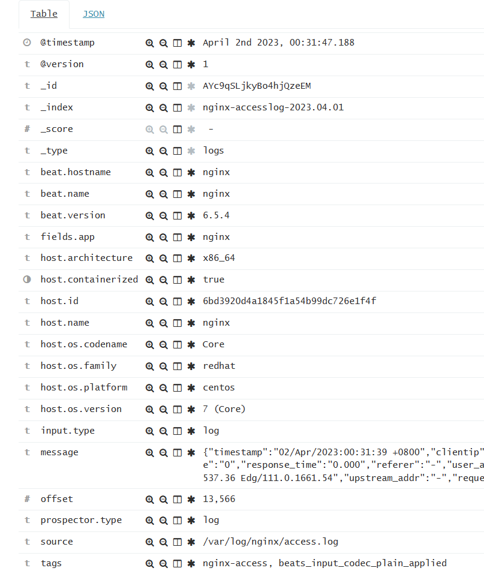
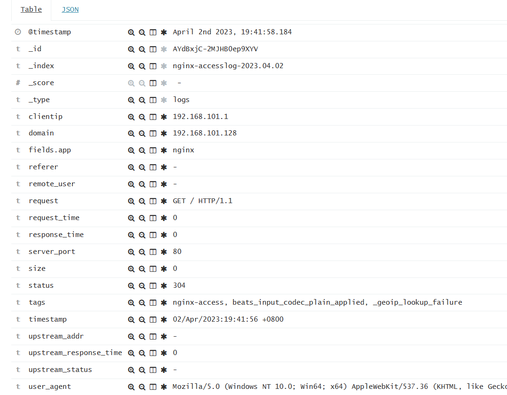

修改nginx日志格式为json

```shell
log_format json '{"timestamp":"$time_local",'
                 '"clientip":"$remote_addr",'
                 '"remote_user":"$remote_user",'
                 '"request":"$request",'
                 '"status":"$status",'
                 '"domain":"$host",'
                 '"size":"$body_bytes_sent",'
                 '"response_time":"$request_time",'
                 '"referer":"$http_referer",'
                 '"user_agent":"$http_user_agent",'
                 '"upstream_addr":"$upstream_addr",'
                 '"request_time":"$request_time",'
                 '"upstream_response_time":"$upstream_response_time",'
                 '"upstream_status":"$upstream_status",'
                 '"server_port":"$server_port"'
           '}';
```

json格式化后的日志：

```shell
{"timestamp":"29/Mar/2023:23:39:26 +0800","clientip":"192.168.101.1","remote_user":"-","request":"GET / HTTP/1.1","status":"304","domain":"192.168.101.128","size":"0","response_time":"0.000","referer":"-","user_agent":"Mozilla/5.0 (Windows NT 10.0; Win64; x64) AppleWebKit/537.36 (KHTML, like Gecko) Chrome/111.0.0.0 Safari/537.36 Edg/111.0.1661.54","upstream_addr":"-","request_time":"0.000","upstream_response_time":"-","upstream_status":"-","server_port":"80"}
```


filebeat配置

```yaml
filebeat.inputs:
- type: log
  enabled: true
  paths:
    - /var/log/nginx/access_json.log
  #json.keys_under_root: true #默认情况下，解码后的JSON放在输出文档中的“json”键下。 如果启用此设置，则会将键复制到输出文档的顶层。
  #json.overwrite_keys: true #如果启用了keys_under_root和此设置，则来自解码的JSON对象的值会覆盖Filebeat通常添加的字段（类型，源，偏移量等）以防冲突。
  tags: ["nginx-access"]
  fields:
    app: nginx

- type: log
  enabled: true
  paths:
    - /var/log/nginx/error.log
  tags: ["nginx-error"]
  fields:
    app: nginx

output.logstash:
  hosts: ["10.10.0.100:5044"]
```

不经过logstash的filter插件过滤有这么多字段：




logstash配置

```yaml
input {
  beats { port => 5044 }
}

filter {
    date { match => [ "timestamp","yyyy-MM-dd HH:mm:ss,SSS" ] } #使用 date 插件解析 timestamp 字段为日期时间格式
    #使用 json 插件从日志中提取JSON格式的数据，并且移除 message字段
    json {
        source => "message"
        remove_field => "message"
    }
    #使用 geoip 插件从日志中提取 clientip 字段的IP地址，并且查询 GeoLite2-City.mmdb 数据库，将IP地址转换为地理位置信息，并将结果放入 geoip 字段中。此外，还将 geoip.longitude 和 geoip.latitude 组合为 geoip.coordinates 字段。
    geoip {
         source => "clientip"
         target => "geoip"
         database => "/usr/local/logstash/config/GeoLite2-City.mmdb"
         add_field => [ "[geoip][coordinates]", "%{[geoip][longitude]}" ]
         add_field => [ "[geoip][coordinates]", "%{[geoip][latitude]}" ]
    }
    #使用 mutate 插件，将 geoip.coordinates 字段转换为浮点数类型，删除beat、host等字段，将 upstream_response_time 等字段转换为float类型
    mutate {
        convert => [ "[geoip][coordinates]", "float" ]
        remove_field => ["beat","host","prospector","@version","offset","input","source"]
        convert => {"upstream_response_time" => "float"}
        convert => {"request_time" => "float"}
        convert => {"response_time" => "float"}
    }
}

output {
    if "nginx-access" in [tags] {
        elasticsearch {
          hosts => "10.0.0.101:9200"
          index => "nginx-accesslog-%{+YYYY.MM.dd}"
          #template_overwrite => true
       }
    }
    if "nginx-error" in [tags] {
        elasticsearch {
          hosts => "10.0.0.101:9200"
          index => "nginx-errorlog-%{+YYYY.MM.dd}"
          #template_overwrite => true
       }
    }   
}
```

过滤后的字段：



