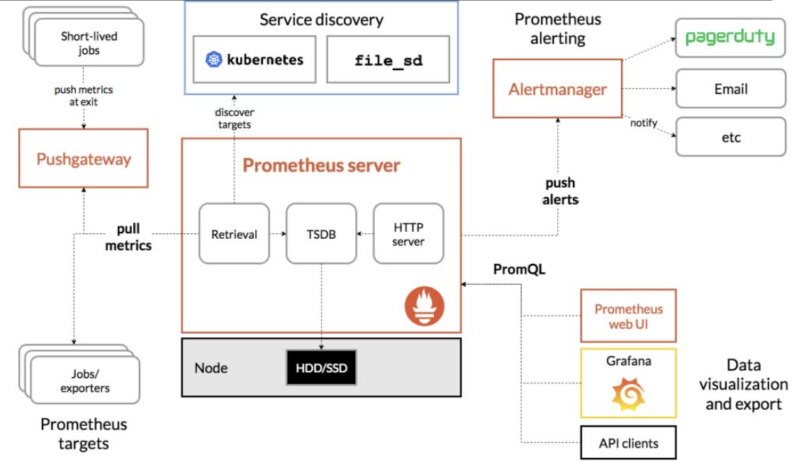

## prometheus介绍

CNCF继k8s的第二个项目，支持多种exporter采集数据，还支持pushgateway进行上报，prometheus性能足够支持上万台规模的集群。


监控系统没有绝对的好坏，最重要是适合自己的公司团队，能够利用最小的成本解决问题，实在不知道怎么选可以参考如下：

物理机、硬件设备用zabbix；**docker、k8s推荐用Prometheus**

云服务器厂商自带监控系统，有的监控不全，也可以搭配zabbix和prometheus

## prometheus特点

1. 多维度数据模型

   prometheus采集的数据都是**时间序列数据**，时间序列数据由**metric度量指标**和**labels键值对**组成。

   metrics指定监控目标系统的测量特征（如：http_requests_total-接收http请求的总数），相同的metrics通过打上不同的labels标签形成多维度数据模型（如：所有包含度量名称为/api/tracks的http请求，打上method=POST的标签，形成具体的http请求）

2. 灵活的查询语言promql

   可以对采集的metrics指标进行加法，乘法，连接等操作；

3. 通过http pull的方式采集时序数据

4. 可以通过pushgateway把时间序列数据推送到prometheus server

5. 可以通过服务发现或静态配置来发现目标服务对象（targets）

6. 每个采样数据占3.5bytes左右，300万的时间序列，30s间隔，保留60天，消耗磁盘约200G（官方数据）

## promtheus组件



1. prometheus server定期从活跃目标主机（targets）**拉取**监控指标数据，可通过配置静态job或动态服务发现的方式被Prometheus server采集目标主机数据；或者从pushgateway拉取监控指标数据
2. prometheus把采集的数据**保存**在本地或云存储
3. 通过配置告警规则，把触发的**告警发送**到alertmanager
4. 通过配置告警接收方，alertmanager把告警发送到邮件、微信或钉钉等
5. Prometheus自带的web ui界面提供PromQL查询语言，可查询监控数据
6. Grafana可接入prometheus数据源，把监控数据以图形化形式展示出

## 相关概念

### 理解时间序列

安装好Prometheus后会暴露一个/metrics的http服务，通过配置，Prometheus就可以采集到/metrics里面所有监控样本数据：

```shell
# HELP process_open_fds Number of open file descriptors.
# TYPE process_open_fds gauge
process_open_fds 25
```

### 样本

Prometheus会将采集到的监控样本数据以时间序列的方式保存在内存数据库中，并定期存储到硬盘上。


在时间序列中的每一个点称为样本，**样本由以下三部分组成：**

指标（metrics）：指标名称和标签集合

时间戳：精确到毫秒

样本值

表示方式：

```text
<----------------------------metric-------------------------><--timestamp--><-value->
process_open_fds{instance="localhost:9090", job="prometheus"} @1434417560938 39
process_open_fds{instance="localhost:9090", job="prometheus"} @1434417561287 33
<--metric_name--><------------------label------------------->
```

### 四种指标类型

指标格式：

```text
<metric name>{<label name>=<label value>, ...}
```

为了方便用户理解不通监控指标之间的差异，定义了四种指标类型

#### counter

Counter是计数器类型：

1、Counter用于累计值，例如记录请求次数、任务完成数、错误发生次数。

2、**一直增加，不会减少**。

3、重启进程后，会被重置。


例如：

```shell
http_response_total{method="GET",endpoint="/api/tracks"}100
http_response_total{method="GET",endpoint="/api/tracks"}160
```


Counter类型数据可以让用户方便的了解事件产生的速率的变化，在PromQL内置的相关操作函数可以提供相应的分析，比如以HTTP应用请求量来进行说明：

1、通过rate()函数获取HTTP请求量的增长率

rate(http_requests_total[5m])

2、查询当前系统中，访问量前10的HTTP地址

topk(10, http_requests_total)

#### Gauge

Gauge是测量器类型：

1、Gauge是常规数值，例如温度变化、内存使用变化。

2、**可变大，可变小。**

3、重启进程后，会被重置


例如：

```shell
memory_usage_bytes{host="master-01"} 100
memory_usage_bytes{host="master-01"} 30
memory_usage_bytes{host="master-01"} 50
memory_usage_bytes{host="master-01"} 80
```

#### histogram

histogram是柱状图，在Prometheus系统的查询语言中，有三种作用：

1、在一段时间范围内对数据进行采样（通常是请求持续时间或响应大小等），并将其计入可配置的存储桶（bucket）中.后续可通过指定区间筛选样本，也可以统计样本总数，最后一般将数据展示为直方图。

2、对每个采样点值累计和(sum)

3、对采样点的次数累计和(count)度量指标名称:[basename]_上面三类的作用度量指标名称_

_1、[basename]_bucket{le="上边界"},这个值为小于等于上边界的所有采样点数量

2、[basename]_sum_

_3、[basename]_count

小结：如果定义一个度量类型为Histogram，则Prometheus会自动生成三个对应的指标

```shell
1、在总共2次请求当中。http请求响应时间<=0.005秒的请求次数为0
io_namespace_http_requests_latency_seconds_histogram_bucket{path="/",method="GET",code="200",le="0.005",} 0.0
2、在总共2次请求当中。http请求响应时间<=0.01秒的请求次数为0
io_namespace_http_requests_latency_seconds_histogram_bucket{path="/",method="GET",code="200",le="0.01",} 0.0
3、在总共2次请求当中。http请求响应时间<=0.025秒的请求次数为0
io_namespace_http_requests_latency_seconds_histogram_bucket{path="/",method="GET",code="200",le="0.025",} 0.0
io_namespace_http_requests_latency_seconds_histogram_bucket{path="/",method="GET",code="200",le="0.05",} 0.0
io_namespace_http_requests_latency_seconds_histogram_bucket{path="/",method="GET",code="200",le="0.075",} 0.0
io_namespace_http_requests_latency_seconds_histogram_bucket{path="/",method="GET",code="200",le="0.1",} 0.0
io_namespace_http_requests_latency_seconds_histogram_bucket{path="/",method="GET",code="200",le="0.25",} 0.0
io_namespace_http_requests_latency_seconds_histogram_bucket{path="/",method="GET",code="200",le="0.5",} 0.0
io_namespace_http_requests_latency_seconds_histogram_bucket{path="/",method="GET",code="200",le="0.75",} 0.0
io_namespace_http_requests_latency_seconds_histogram_bucket{path="/",method="GET",code="200",le="1.0",} 0.0
io_namespace_http_requests_latency_seconds_histogram_bucket{path="/",method="GET",code="200",le="2.5",} 0.0
io_namespace_http_requests_latency_seconds_histogram_bucket{path="/",method="GET",code="200",le="5.0",} 0.0
io_namespace_http_requests_latency_seconds_histogram_bucket{path="/",method="GET",code="200",le="7.5",} 2.0
4、在总共2次请求当中。http请求响应时间<=10秒的请求次数为2
io_namespace_http_requests_latency_seconds_histogram_bucket{path="/",method="GET",code="200",le="10.0",} 2.0
io_namespace_http_requests_latency_seconds_histogram_bucket{path="/",method="GET",code="200",le="+Inf",} 2.0

所有样本值的大小总和，命名为<basename>_sum。
5、实际含义：发生的2次http请求总的响应时间为13.107670803000001秒
io_namespace_http_requests_latency_seconds_histogram_sum{path="/",method="GET",code="200",} 13.107670803000001

样本总数，命名为<basename>_count。值和<basename>_bucket{le="+Inf"}相同。
6、实际含义：当前一共发生了2次http请求
io_namespace_http_requests_latency_seconds_histogram_count{path="/",method="GET",code="200",} 2.0
```

注意：

bucket可以理解为是对数据指标值域的一个划分，划分的依据应该基于数据值的分布。注意后面的采样点是包含前面的采样点的，假设xxx_bucket{...,le="0.01"}的值为10，而xxx_bucket{...,le="0.05"}的值为30，那么意味着这30个采样点中，有10个是小于0.01s的，其余20个采样点的响应时间是介于0.01s和0.05s之间的。

可以通过histogram_quantile()函数来计算Histogram类型样本的分位数。分位数可能不太好理解，你可以理解为分割数据的点。我举个例子，假设样本的9分位数（quantile=0.9）的值为x，即表示小于x的采样值的数量占总体采样值的90%。Histogram还可以用来计算应用性能指标值（Apdexscore）。

#### summary

与Histogram类型类似，用于表示一段时间内的数据采样结果（通常是请求持续时间或响应大小等），但它直接存储了分位数（通过客户端计算，然后展示出来），而不是通过区间来计算。它也有三种作用：

1、对于每个采样点进行统计，并形成分位图。（如：正态分布一样，统计低于60分不及格的同学比例，统计低于80分的同学比例，统计低于95分的同学比例）

2、统计班上所有同学的总成绩(sum)

3、统计班上同学的考试总人数(count)

带有度量指标的[basename]的summary在抓取时间序列数据有如命名。

1、观察时间的φ-quantiles (0≤φ≤1),显示为[basename]{分位数="[φ]"}

2、[basename]_sum，是指所有观察值的总和_

_3、[basename]_count,是指已观察到的事件计数值

样本值的分位数分布情况，命名为<basename>{quantile="<φ>"}。

1、含义：这12次http请求中有50%的请求响应时间是3.052404983s

io_namespace_http_requests_latency_seconds_summary{path="/",method="GET",code="200",quantile="0.5",}3.052404983

2、含义：这12次http请求中有90%的请求响应时间是8.003261666s

io_namespace_http_requests_latency_seconds_summary{path="/",method="GET",code="200",quantile="0.9",}8.003261666

所有样本值的大小总和，命名为<basename>_sum。

1、含义：这12次http请求的总响应时间为51.029495508s

io_namespace_http_requests_latency_seconds_summary_sum{path="/",method="GET",code="200",}51.02949550

样本总数，命名为<basename>_count。_

_1、含义：当前一共发生了12次http请求

_io_namespace_http_requests_latency_seconds_summary_count{path="/",method="GET",code="200",}12.0

_现在可以总结一下Histogram与Summary的异同：

_它们都包含了<basename>_sum和<basename>_count指标Histogram需要通过<basename>_bucket来计算分位数，而Summary则直接存储了分位数的值。

prometheus_tsdb_wal_fsync_duration_seconds{quantile="0.5"} 0.012352463

prometheus_tsdb_wal_fsync_duration_seconds{quantile="0.9"} 0.014458005

prometheus_tsdb_wal_fsync_duration_seconds{quantile="0.99"} 0.017316173

prometheus_tsdb_wal_fsync_duration_seconds_sum 2.888716127000002

prometheus_tsdb_wal_fsync_duration_seconds_count 216

从上面的样本中可以得知当前Promtheus Server进行wal_fsync操作的总次数为216次，耗时2.888716127000002s。其中中位数（quantile=0.5）的耗时为0.012352463，9分位数（quantile=0.9）的耗时为0.014458005s。

#### 总结

与summary类型指标相似之处在于histogram类型的样本同样会反映当前指标的记录的总数（以\_count作为后缀）以及其值的总量（以_sum作为后缀）。不同在于histogram指标直接反映了在不同区间内样本的个数，区间通过标签len定义

### job和instances

**每一个暴露监控样本数据的http服务都称为一个instance**，例如当前主机上运行的node exporter可以被称为一个实例instance，**在配置文件里面表示为target**；而具有**相同采集目的的实例集合称为job**


实例的状态：

除了通过“up”表达式查询当前所有instance的状态外，还可以通过Prometheus UI中的targets页面查看当前所有采集的job，以及各个job下的所有instance状态

## 监控流程

1. 在被监控主机安装xxx_exporter来收集数据
2. 添加prometheus配置，去收集xxx_exporter提供的监控样本数据
3. 配置触发器（告警规则）
4. grafana添加dashboard

## prometheus对k8s监控

对于Kubernetes而言，我们可以把当中所有的资源分为几类：

基础设施层（Node）：集群节点，为整个集群和应用提供运行时资源

容器基础设施（Container）：为应用提供运行时环境

用户应用（Pod）：Pod中会包含一组容器，它们一起工作，并且对外提供一个（或者一组）功能

内部服务负载均衡（Service）：在集群内，通过Service在集群暴露应用功能，集群内应用和应用之间访问时提供内部的负载均衡

外部访问入口（Ingress）：通过Ingress提供集群外的访问入口，从而可以使外部客户端能够访问到部署在Kubernetes集群内的服务


因此，如果要构建一个完整的监控体系，我们应该考虑，以下5个方面：

集群节点状态监控：从集群中各节点的kubelet服务获取节点的基本运行状态；

集群节点资源用量监控：通过Daemonset的形式在集群中各个节点部署Node Exporter采集节点的资源使用情况；

节点中运行的容器监控：通过各个节点中kubelet内置的cAdvisor中获取个节点中所有容器的运行状态和资源使用情况；

如果在集群中部署的应用程序本身内置了对Prometheus的监控支持，那么我们还应该找到相应的Pod实例，并从该Pod实例中获取其内部运行状态的监控指标。

对k8s本身的组件做监控：apiserver、scheduler、controller-manager、kubelet、kube-proxy