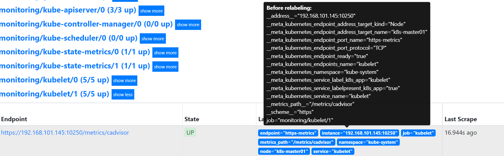
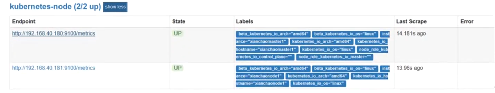
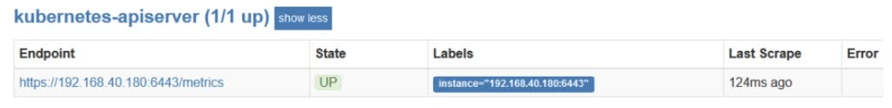

## 全局配置文件

```yaml
vim prometheus.yml
global:
	scrape_interval:     15s	#采集目标主机监控据的时间间隔，默认1m
	evaluation_interval: 15s	#触发告警检测的时间间隔（频率），默认1m
	scrape_timeout: 15s	#采集数据的超时时间，该值不能大于scrape_interval的值，默认10s。

#记录规则和告警规则（比如cpu超过多少发送告警）
rule_files:
    ...
    
#配置被监控端，称为target，每个target用job_name命名，又分静态配置和服务发现
scrape_configs:
    ...
    
#告警配置
alerting:
  alert_relabel_configs: # - 警报重新标记在发送到Alertmanager之前应用于警报,用途是确保一对具有不同外部标签的Prometheus服务器发送相同的警报。
  alertmanagers:
  - static_configs:
    - targets: ["localhost:9093"] #关联alertmanager
    
    [ timeout: <duration> | default = 10s ]     # Per-target Alertmanager timeout when pushing alerts.
    [ api_version: <string> | default = v2 ]    # The api version of Alertmanager.
    [ path_prefix: <path> | default = / ]       # Prefix for the HTTP path alerts are pushed to.
    [ scheme: <scheme> | default = http ]       # Configures the protocol scheme used for requests. 作者：WeiyiGeek 
```

## scrape_configs

```yaml
#采集对象的作业名称
- job_name: <job_name>

  #默认继承全局配置global，在这指定局部配置会覆盖全局配置
  [ scrape_interval: 15s ]
  [ scrape_timeout: 15s ]

  #指标路径
  [ metrics_path: /metrics ]
  #标签
  [ honor_labels: <boolean> | default = false ]

  #目标拉取协议
  [ scheme: <scheme> | default = http ]

  #参数
  params:
    [ <string>: [<string>, ...] ]

  #基础认证
  basic_auth:
    [ username: <string> ]
    [ password: <secret> ]
    [ password_file: <string> ]
  tls_config:
    [ <tls_config> ]
      [ ca_file: <filename> ]     # 用于验证API服务器证书的CA证书。
      [ cert_file: <filename> ]   # 用于向服务器进行客户端证书身份验证的证书和密钥文件。
      [ key_file: <filename> ]
      [ server_name: <string> ]   # 用于指示服务器的名称(https://tools.ietf.org/html/rfc4366#section-3.1)
      [ insecure_skip_verify: <boolean> ] # 禁用服务器证书验证。
  [ proxy_url: <string> ]

  #设置多种服务发现，最常见有以下两种方式
  ## 基于文件的服务发现提供了一种更通用的方法来配置静态目标，并充当插入自定义服务发现机制的接口(文件可以YAML或JSON格式提供,格式样例看下面的tips)
  file_sd_configs:
    - files:
      - my/path/tg_*.json
      [ refresh_interval: <duration> | default = 5m ] # 该静态文件刷新时间间隔
  # 基于kubernetes的服务发现,允许从 Kubernetes REST API 拉取集群pod相关信息并时刻保持同步。
  kubernetes_sd_configs:
    [ - <kubernetes_sd_config> ... ]
  ...

  #指定静态目标
  static_configs:
  - target: ['localhost:9090','localhost:9191']
    labels:
      [ <labelname>: <labelvalue> ... ]
        
  #重新标记  
  relabel_configs:
    ...
  
  metric_relabel_configs:
  ...
  
  [ sample_limit: <int> | default = 0 ] ## 每次刮取将被接受的刮取样品数量限制(0 means no limit)。
```

## 静态监控配置

```yaml
    - job_name: 'kubernetes-schedule'
      scrape_interval: 5s
      static_configs:
      - targets: ['192.168.40.180:10251'] #目标主机ip和端口
```

## relabel_configs

### 标签的作用

Prometheus中存储的数据为时间序列，是由Metric的名字和一系列的标签(键值对)唯一标识的, **不同的标签代表不同的时间序列**，即**通过指定标签查询指定数据** 

指标+标签实现了查询条件的作用，可以指定不同的标签过滤不同的数据

### Metadata标签

在Prometheus所有的Target实例中，都包含一些默认的Metadata标签信息。可以通过Prometheus UI的Targets页面中查看这些实例的Metadata标签的内容：



- **\__address__：当前Target实例的访问地址<host>:<port>**

- **\__scheme__：采集目标服务访问地址的HTTP Scheme，HTTP或者HTTPS**

- **\__metrics_path__：采集目标服务访问地址的访问路径**

上面这些标签将会告诉Prometheus如何从该Target实例中获取监控数据。

**使用promql是查询不到这些标签的，因为这些标签只是普罗米修斯内部去使用的，不会存储在时序数据库供我们查询**

### k8s服务发现

 k8s服务发现从以下的role方式进行目标发现

- node : 为每个群集节点发现一个目标，其地址默认为Kubelet的HTTP端口，地址类型顺序: NodeInternalIP, NodeExternalIP, NodeLegacyHostIP, and NodeHostName. 

  ```shell
  # Available meta labels: 此外instance节点的标签将设置为从API服务器检索到的节点名。
  __meta_kubernetes_node_name：节点对象的名称
  __meta_kubernetes_node_label_<labelname>：节点对象中的每个标签。
  __meta_kubernetes_node_labelpresent_<labelname> :是的对于节点对象中的每个标签。
  __meta_kubernetes_node_annotation_<annotationname>：来自节点对象的每个注释。
  __meta_kubernetes_node_annotationpresent_<annotationname> :是的对于节点对象中的每个注释。
  __meta_kubernetes_node_address_<address_type>：每个节点地址类型的第一个地址（如果存在）。 
  ```

- service : 为每个服务的每个服务端口发现一个目标。这对于服务的黑盒监视通常很有用。地址将设置为服务的Kubernetes DNS名称和相应的服务端口。 

  ```shell
  __meta_kubernetes_namespace：服务对象的命名空间。
  __meta_kubernetes_service_annotation_<annotationname>：来自服务对象的每个批注。
  __meta_kubernetes_service_annotationpresent_<annotationname>：“true”表示服务对象的每个注释。
  __meta_kubernetes_service_cluster_ip：服务的群集IP地址(不适用于ExternalName类型的服务）
  __meta_kubernetes_service_external_name：服务的DNS名称(适用于ExternalName类型的服务）
  __meta_kubernetes_service_label_<labelname>：来自服务对象的每个标签。
  __meta_kubernetes_service_labelpresent_<labelname> :是的对于服务对象的每个标签。
  __meta_kubernetes_service_name：服务对象的名称
  __meta_kubernetes_service_port_name：目标的服务端口的名称。
  __meta_kubernetes_service_port_protocol：目标的服务端口的协议。
  __meta_kubernetes_service_type：服务的类型 
  ```

- pod : 发现所有pod并将其容器作为目标公开。对于容器的每个声明端口，生成一个单独的目标。如果容器没有指定的端口，则为每个容器创建一个端口空闲目标，以便通过重新标记手动添加端口。 

  ```shell
  __meta_kubernetes_namespace：pod对象的命名空间。
  __meta_kubernetes_pod_name：pod对象的名称
  __meta_kubernetes_pod_ip：pod对象的pod IP。
  __meta_kubernetes_pod_label_<labelname>：pod对象中的每个标签。
  __meta_kubernetes_pod_labelpresent_<labelname> :是的对于pod对象中的每个标签。
  __meta_kubernetes_pod_annotation_<annotationname>：pod对象中的每个注释。
  __meta_kubernetes_pod_annotationpresent_<annotationname> :是的对于pod对象的每个注释。
  __meta_kubernetes_pod_container_init :是的如果容器是 初始化容器
  __meta_kubernetes_pod_container_name：目标地址指向的容器的名称。
  __meta_kubernetes_pod_container_port_name：容器端口的名称
  __meta_kubernetes_pod_container_port_number：集装箱端口号
  __meta_kubernetes_pod_container_port_protocol：集装箱港口的协议
  __meta_kubernetes_pod_ready：设置为是的或false吊舱准备就绪
  __meta_kubernetes_pod_phase：设置为悬而未决的 ,Running ,成功 ,Failed或未知在生命周期 .
  __meta_kubernetes_pod_node_name：pod被调度到的节点的名称。
  __meta_kubernetes_pod_host_ip：pod对象的当前主机IP。
  __meta_kubernetes_pod_uid：pod对象的UID。
  __meta_kubernetes_pod_controller_kind：pod控制器的对象类型。
  __meta_kubernetes_pod_controller_name：吊舱控制器的名称 
  ```

- endpoints : 从服务的列出的终结点发现目标。对于每个endpointaddress，每个端口都会发现一个目标。如果端点由一个pod支持，那么pod的所有附加容器端口（未绑定到端点端口）也会被发现作为目标。 

  ```shell
  _meta_kubernetes_namespace：endpoints对象的命名空间。
  __meta_kubernetes_endpoints_name：endpoints对象的名称。
  对于直接从端点列表中发现的所有目标（未从底层POD中额外推断出的目标），将附加以下标签：
  __meta_kubernetes_endpoint_hostname：终结点的主机名
  __meta_kubernetes_endpoint_node_name：承载终结点的节点的名称。
  __meta_kubernetes_endpoint_ready：设置为是的或false对于端点的就绪状态
  __meta_kubernetes_endpoint_port_name：终结点端口的名称
  __meta_kubernetes_endpoint_port_protocol：终结点端口的协议
  __meta_kubernetes_endpoint_address_target_kind：终结点地址目标的类型。
  __meta_kubernetes_endpoint_address_target_name：终结点地址目标的名称。
  如果端点属于服务，则role: service发现已附加
  对于由吊舱支持的所有目标role: pod发现已附加 
  ```

- ingress : 为每个入口的每个路径发现一个目标。这通常对黑盒监控入口很有用地址将设置为入口规范中指定的主机。 

  ```shell
  __meta_kubernetes_namespace：ingress对象的命名空间。
  __meta_kubernetes_ingress_name -入口对象的名称
  __meta_kubernetes_ingress_label_<labelname>：来自ingress对象的每个标签。
  __meta_kubernetes_ingress_labelpresent_<labelname> :是的对于ingress对象中的每个标签。
  __meta_kubernetes_ingress_annotation_<annotationname>：来自ingress对象的每个注释。
  __meta_kubernetes_ingress_annotationpresent_<annotationname> :是的对于ingress对象的每个注释。
  __meta_kubernetes_ingress_scheme：入口协议方案，https如果设置了TLSconfig。默认为http .
  __meta_kubernetes_ingress_path：从入口规范的路径默认为 / . 
  ```


### 重新标记标签

允许在采集之前对任何目标及其标签进行修改，**重新标记目的：为了更好的标识监控指标。**

重新标签的意义：

- 根据已有的标签生成新标签
- 删除标签
- 过滤采集的Target
- 添加新标签


relabel规则组成：

```yaml
relabel_configs:
  #源标签，对哪些源标签进行relabel
  [ source_labels: '[' <labelname> [, ...] ']' ]
  #分隔符，用于在连接源标签source_labels时分割它们
  [ separator: <string> | default = ; ]
  #目标标签，relabel后的标签名
  [ target_label: <labelname> ]
  #正则表达式，用于匹配串联的源标签
  [ regex: <regex> | default = (.*) ]
  #如果正则表达式匹配，则对其执行正则表达式替换的替换值
  [ replacement: <string> | default = $1 ]
  #执行的 relabeling 动作，可选值包括 replace、keep、drop、hashmod、labelmap、labeldrop 或者 labelkeep，默认值为 replace
  [ action: <relabel_action> | default = replace ]
```

relabel的action动作：

- replace：默认，通过regex匹配source_label的值，使用replacement来引用表达式匹配的分组，分组使用$1,$2...引用（正则匹配，提取字段重新创建新标签，注意这里是创建新的标签）
- keep：删除regex与连接不匹配的目标 source_labels 
- drop：删除regex与连接匹配的目标 source_labels， keep和drop就是让普罗米修斯采集和不采集哪些目标
- labeldrop：删除regex匹配的标签
- labelkeep：删除regex不匹配的标签
- labelmap：匹配regex所有标签名称，并将捕获的内容分组，**用第一个分组内容作为新的标签名**（使用正则提取出多个字段，使用匹配到的作为新标签名，但是标签的内容不会改变，相对于对原有标签换了个名字）


例子：

```yaml
#把地址http://node-ip:10250/metrics替换成http://node-ip:9100/metrics
    - job_name: 'kubernetes-node'
      kubernetes_sd_configs: ##使用的是k8s的服务发现
      - role: node
      relabel_configs:
      - action: replace
        source_labels: [__address__] #要替换的源标签，匹配地址
        regex: '(.*):10250' #匹配带有10250端口的url
        target_label: __address__ #获取__address__对应的值
        replacement: '${1}:9100' #替换_address_的值，把匹配到的ip:10250的ip保留，端口替换成9100
      - action: labelmap
        regex: __meta_kubernetes_node_label_(.+) #匹配到下面正则表达式的标签会被保留,如果不做regex正则的话，默认只是会显示instance标签
```



匹配到的所有标签：

```shell
__address__="192.168.40.180:10250"
__meta_kubernetes_node_address_Hostname="xianchaomaster1"
__meta_kubernetes_node_address_InternalIP="192.168.40.180"
__meta_kubernetes_node_annotation_kubeadm_alpha_kubernetes_io_cri_socket="/var/run/dockershim.sock"
__meta_kubernetes_node_annotation_node_alpha_kubernetes_io_ttl="0"
__meta_kubernetes_node_annotation_projectcalico_org_IPv4Address="192.168.40.180/24"
__meta_kubernetes_node_annotation_projectcalico_org_IPv4IPIPTunnelAddr="10.244.123.64"
__meta_kubernetes_node_annotation_volumes_kubernetes_io_controller_managed_attach_detach="true"
__meta_kubernetes_node_label_beta_kubernetes_io_arch="amd64"
__meta_kubernetes_node_label_beta_kubernetes_io_os="linux"
__meta_kubernetes_node_label_kubernetes_io_arch="amd64"
__meta_kubernetes_node_label_kubernetes_io_hostname="xianchaomaster1"
__meta_kubernetes_node_label_kubernetes_io_os="linux"
__meta_kubernetes_node_label_node_role_kubernetes_io_control_plane=""
__meta_kubernetes_node_label_node_role_kubernetes_io_master=""
__meta_kubernetes_node_name="xianchaomaster1"
__metrics_path__="/metrics"
__scheme__="http"
instance="xianchaomaster1"
job="kubernetes-node"
```


例子2：

```yaml
    - job_name: 'kubernetes-node-cadvisor' #抓取cAdvisor数据，是获取kubelet上/metrics/cadvisor接口数据来获取容器的资源使用情况
      kubernetes_sd_configs:
      - role: node
      scheme: https
      tls_config:
        ca_file: /var/run/secrets/kubernetes.io/serviceaccount/ca.crt
      bearer_token_file: /var/run/secrets/kubernetes.io/serviceaccount/token
      relabel_configs:
      - action: labelmap #把匹配到的标签保留
        regex: __meta_kubernetes_node_label_(.+) # 保留匹配到的具有__meta_kubernetes_node_label的标签
      - target_label: __address__ # 获取到的地址：__address__="192.168.40.180:10250"
        replacement: kubernetes.default.svc:443  # 把_address_的值替换成新的地址kubernetes.default.svc:443
      - source_labels: [_meta_kubernetes_node_name]
        regex: (.+) #把原始标签中__meta_kubernetes_node_name值匹配到
        target_label: __metrics_path__ #获取__metrics_path__对应的值
        replacement: /api/v1/nodes/${1}/proxy/metrics/cadvisor #把metrics替换成新的值api/v1/nodes/xianchaomaster1/proxy/metrics/cadvisor
        #${1}是__meta_kubernetes_node_name获取到的值
```

新的url就是https://kubernetes.default.svc:443/api/v1/nodes/xianchaomaster1/proxy/metrics/cadvisor


例子3:

```yaml
    - job_name: 'kubernetes-apiserver' 
      kubernetes_sd_configs:
      - role: endpoints # 使用k8s中的endpoint服务发现，采集apiserver 6443端口获取到的数据
      scheme: https
      tls_config:
        ca_file: /var/run/secrets/kubernetes.io/serviceaccount/ca.crt
      bearer_token_file: /var/run/secrets/kubernetes.io/serviceaccount/token
      relabel_configs:
      - source_labels: [__meta_kubernetes_namespace,__meta_kubernetes_service_name,__meta_kubernetes_endpoint_port_name]
        action: keep # 采集满足条件的实例，其他实例不采集
        regex: default;kubernetes;https # 正则匹配到的默认空间下的service名字是kubernetes，协议是https的endpoint类型保留下来
```




例子4:

```yaml
    - job_name: 'kubernetes-service-endpoints' 
      kubernetes_sd_configs:
      - role: endpoints
      relabel_configs:
      - source_labels: [__meta_kubernetes_service_annotation_prometheus_io_scrape]
        action: keep
        regex: true #只保留"prometheus.io/scrape: true"的标签，意思是说如果某个service具有prometheus.io/scrape = true annotation声明则抓取，nnotation本身也是键值结构，所以这里的源标签设置为键，而regex设置值true，当值匹配到regex设定的内容时则执行keep动作也就是保留，其余则丢弃。
      - source_labels: [__meta_kubernetes_service_annotation_prometheus_io_scheme]
        action: replace
        target_label: __scheme_
        regex: (https?) #重新设置scheme，匹配源标签__meta_kubernetes_service_annotation_prometheus_io_scheme也就是prometheus.io/scheme annotation，如果源标签的值匹配到regex，则把值替换为__scheme__对应的值。
      - source_labels: [__meta_kubernetes_service_annotation_prometheus_io_path]
        action: replace
        target_label: __metrics_path__
        regex: (.+)
```

应用中自定义暴露的指标，也许你暴露的API接口不是/metrics这个路径，那么你可以在这个POD对应的service中做一个"prometheus.io/path = /mymetrics"声明，上面的意思就是把你声明的这个路径赋值给__metrics_path__，其实就是让prometheus来获取自定义应用暴露的metrices的具体路径，不过这里写的要和service中做好约定，如果service中这样写prometheus.io/app-metricspath: '/metrics'那么你这里就要

```yaml
      - source_labels: [__address__,__meta_kubernetes_service_annotation_prometheus_io_port]
        action: replace
        target_label: __address__
        regex: ([^:]+)(?::\d+)?;(\d+)
        replacement: $1:$2
        #暴露自定义的应用的端口，就是把地址和你在service中定义的"prometheus.io/port =<port>"声明做一个拼接，然后赋值给__address__，这样prometheus就能获取自定义应用的端口，然后通过这个端口再结合__metrics_path__来获取指标，如果__metrics_path__值不是默认的/metrics那么就要使用上面的标签替换来获取真正暴露的具体路径。
      - action: labelmap #保留下面匹配到的标签
        regex: __meta_kubernetes_service_label_(.+)
      - source_labels: [__meta_kubernetes_namespace]
        action: replace #替换__meta_kubernetes_namespace变成kubernetes_namespace
        target_label: kubernetes_namespace
      - source_labels: [__meta_kubernetes_service_name]
        action: replace
        target_label: kubernetes_name
```
