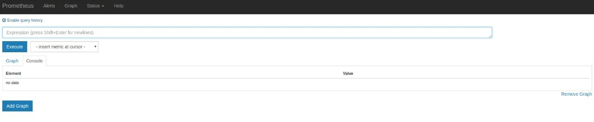

访问http://ip:9090，会默认跳转到Graph页面



在这里我们可以使用 Prometheus 自己开发的语言 PromQL对时序数据进行筛选和聚合，查询的监控数据有列表和曲线图两种展现形式（对应上图中 Console 和 Graph 这两个标签）

## 数据类型

promql表达式算出来的值有以下几种类型：

瞬时向量：指同一时刻的一组时间序列，每个时间序列包含一个样本，所有样本共享相同的时间戳，即每个时序只有一个点

区间向量：指任何一个时间范围内的一组时间序列，包含每个时间序列随时间变化的一系列数据点，这时每个时序有多个点

标量数据：一个浮点数

### 瞬时向量选择器

例如：选择指标名称为 http_requests_total 的所有时间序列：

```promql
http_requests_total
```

可以通过向花括号{}里附加一组标签来进一步过滤时间序列。

```promql
http_requests_total{job="prometheus",group="canary"}
```

匹配标签值时可以是等于，也可以使用正则表达式。总共有下面几种匹配操作符：

```shell
=	等于
!=	不等于
=~	匹配
!~	不匹配
```

选择指标名称为 http_requests_total，环境为 staging、testing 或 development，HTTP 方法为 GET 的时间序列：
```shell
http_requests_total{environment=~"staging|testing|development",method="GET"}
```

### 区间向量选择器

查询指标最近5分钟内的所有样本数据：

```shell
http_requests_total{}[5m]
```

除了使用m表示分钟以外，PromQL的时间范围选择器支持其它时间单位：

- s - 秒
- m - 分钟
- h - 小时
- d - 天
- w - 周
- y - 年

### 偏移向量选择器

如果我们想查询，5分钟前的瞬时样本数据，就可以使用位移操作，位移操作的关键字为**offset**

使用offset时间位移操作：

```shell
#前5分钟请求总数
http_request_total{} offset 5m
#前1小时1天内的请求总数
http_request_total{}[1d] offset 1d
```

offset 关键字需要紧跟在选择器{}后面。

```promql
sum(http_requests_total{method="GET"} offset 5m) // GOOD.
sum(http_requests_total{method="GET"}) offset 5m // INVALID.
```

## 二次运算符

+

-

*

/

% 模

^ 幂等


二次运算符支持瞬时向量/标量、瞬时向量/瞬时向量之间的操作

瞬时向量/标量：

node_memory_MemTotal_bytes / (1024*1024)

瞬时向量/瞬时向量:

node_memory_MemAvailable_bytes / node_memory_MemTotal_bytes * 100

## 聚合操作符

Prometheus还提供了下列内置的聚合操作符，这些操作符**作用于瞬时向量**。可以将瞬时表达式返回的样本数据进行聚合，形成一个新的时间序列。

- `sum` (求和)
- `min` (最小值)
- `max` (最大值)
- `avg` (平均值)
- `stddev` (标准差)
- `stdvar` (标准方差)
- `count` (计数)
- `count_values` (对value进行计数)
- `bottomk` (后n条时序)
- `topk` (前n条时序)
- `quantile` (分位数)

这些操作符被用于聚合所有标签维度，或者通过without或by来保留不同的维度


without用于从计算结果中移除列举的标签，而保留其它标签。by则正好相反，结果向量中只保留列出的标签，其余标签则移除。通过without和by可以按照样本的问题对数据进行聚合。

例如：

```
sum(http_requests_total) without (instance)
```

等价于

```
sum(http_requests_total) by (code,handler,job,method)
```

如果只需要计算整个应用的HTTP请求总量，可以直接使用表达式：

```
sum(http_requests_total)
```

## 函数

https://prometheus.io/docs/prometheus/latest/querying/functions/

### 计算counter指标增长率函数

counter类型的指标只增不减，为了更直观的表示样本数据的变化情况，需要计算样本的增长速率

通过增长率表示样本的变化情况

```shell
increase(node_load1[2m]) / 120 
或
rate(node_load1[2m]) / 120 #主机节点最近两分钟内的平均cpu使用率

#这里通过node_load1[2m]获取时间序列最近两分钟的所有样本，increase计算出最近两分钟的增长量，最后除以120s得到样本最近两分钟的平均增长率
```

需要注意rate或increase计算样本的平均增长率容易陷入“长尾问题”，而irate同样用于计算区间向量的计算率，但是其反应的是瞬时增长率，irate是通过区间向量中最后两个样本数据来计算区间向量的增长速率

当将 `rate()` 函数与[聚合运算符](https://prometheus.io/docs/prometheus/latest/querying/operators/#aggregation-operators)（例如 `sum()`）或随时间聚合的函数（任何以 `_over_time` 结尾的函数）一起使用时，**必须先执行 rate 函数，然后再进行聚合操作**，否则当采样目标重新启动时 **rate() 无法检测到计数器是否被重置。**

### 使用频率最高的函数


irate

用于计算指定时间范围内每秒瞬时增长率，是基于该时间范围内最后两个数据点来计算。rate和irate函数都用于计算某个指标在一定时间间隔内的变化速率。但是它们的计算方法有所不同：irate取的是在指定时间范围内的最后两个数据点来算速率，而rate会取指定时间范围内所有数据点，算出一组速率，然后取平均值作为结果。

例如，以下表达式返回区间向量中每个[时间序列](https://so.csdn.net/so/search?q=时间序列&spm=1001.2101.3001.7020)过去 5 分钟内最后两个样本数据的 HTTP 请求数的增长率：

```yaml
irate(http_requests_total{job="api-server"}[5m])
```

irate 只能用于绘制快速变化的计数器,当将 `irate()` 函数与[聚合运算符](https://prometheus.io/docs/prometheus/latest/querying/operators/#aggregation-operators)（例如 `sum()`）或随时间聚合的函数（任何以 `_over_time` 结尾的函数）一起使用时，***\*必须先执行 irate 函数，然后再进行聚合操作，否则当采样目标重新启动时 irate() 无法检测到计数器是否被重置。\****


sum

sum会把结果集的输出进行总加和

在实际工作中CPU大多是多核心，而node_cpu_seconds_total会将每个核的数据都单独显示出来，但我们关心的是CPU总的使用情况，因此可以使用sum()函数求和后得出一条总的数据

但是sum(increase(node_cpu[1m]))会把所有机器的cpu值都加起来，我们可以用by(instance)把sum按机器拆分出来


topk

取出排行前N的数值，N可以自定义


一般用于瞬时报警，而不是为了观察曲线

```promql
# 例如从所有主机中找出近5分钟网卡流量排名前3的主机(Counter类型数据)。
topk(3,rate(node_network_receive_bytes_total{device=~'ens.*'}[5m]))
```


count

把数值符合条件的输出数目进行加合

count(count_netstat_wait_connections>200)

一般用于一些模糊的监控判断

