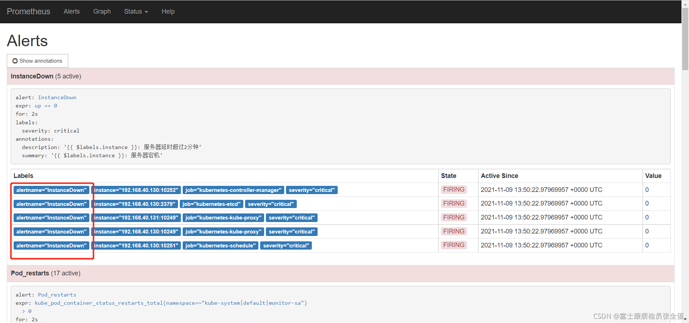

Alertmanager处理从Prometheus服务器发来的警报。然后，Alertmanager对这些告警进行去重(Deduplicating)、分组(Grouping)、静音(silencing)、抑制(inhibition)、聚合(aggregation )，然后路由到不同的接收器，如电子邮件、短信等给对应的联系人。

端口：9093

## alertmanager配置文件

在Alertmanager配置中一般会包含以下几个主要部分：

- 全局配置（global）：用于定义一些全局的公共参数，如全局的SMTP配置，Slack配置等内容；
- 模板（templates）：用于定义通知模板；
- 告警路由（route）：根据标签匹配，确定当前告警应该如何处理；
- 接收人（receivers）：接收人是一个抽象的概念，它可以是一个邮箱也可以是微信，Slack或者Webhook等，接收人一般配合告警路由使用；
- 抑制规则（inhibit_rules）：合理设置抑制规则可以减少垃圾告警的产生

其完整配置格式如下：

```yaml
global:
  # 当Alertmanager持续多长时间未接收到告警后标记告警状态为resolved（已解决）
  [ resolve_timeout: <duration> | default = 5m ]
  
  [ smtp_from: <tmpl_string> ] #指定从哪个邮箱发送报警
  [ smtp_smarthost: <string> ] #SMTP服务器地址+端口
  [ smtp_hello: <string> | default = "localhost" ]
  [ smtp_auth_username: <string> ] #发送邮箱的认证用户，不是邮箱名
  [ smtp_auth_password: <secret> ] #发送邮箱的授权码而不是登录密码
  [ smtp_auth_identity: <string> ]
  [ smtp_auth_secret: <secret> ]
  [ smtp_require_tls: <bool> | default = true ]
  [ slack_api_url: <secret> ]
  [ victorops_api_key: <secret> ]
  [ victorops_api_url: <string> | default = "https://alert.victorops.com/integrations/generic/20131114/alert/" ]
  [ pagerduty_url: <string> | default = "https://events.pagerduty.com/v2/enqueue" ]
  [ opsgenie_api_key: <secret> ]
  [ opsgenie_api_url: <string> | default = "https://api.opsgenie.com/" ]
  [ hipchat_api_url: <string> | default = "https://api.hipchat.com/" ]
  [ hipchat_auth_token: <secret> ]
  [ wechat_api_url: <string> | default = "https://qyapi.weixin.qq.com/cgi-bin/" ]
  [ wechat_api_secret: <secret> ]
  [ wechat_api_corp_id: <string> ]
  [ http_config: <http_config> ]

# - 从中读取自定义通知模板定义的文件,最后一个组件可以使用通配符匹配器,例如“templates/*.tmpl”。 
templates:
  [ - <filepath> ... ]

# - 配置告警分发策略
route: <route>

# 通知接收者列表
receivers:
  - <receiver> ...

# - 抑制规则列表: 当存在与另一组匹配器匹配的警报（源）时，禁止规则会使与一组匹配器匹配的警报（目标）静音。对于相等列表中的标签名称，目标警报和源警报必须具有相同的标签值。 
inhibit_rules:
  [ - <inhibit_rule> ... ]
```

### templates

### route

将类似的指标分组，比如说监控linux服务器会监控其负载，资源负载就是一个分组，这个分组下面会有cpu的指标，内存的指标。

每一个告警都会从配置文件中顶级的route进入路由树，需要注意的是顶级的route必须匹配所有告警(即不能有任何的匹配设置match和match_re)，每一个路由都可以定义自己的接受人以及匹配规则。

```yaml
# 所有报警信息进入后的根路由，用来设置报警的分发策略
route:
  receiver: 'default-receiver' # 默认情况下所有的告警都会发送给集群管理员default-receiver
  group_wait: 10s # 组告警等待时间。也就是告警产生后等待10s，如果有同组告警一起发出
  group_interval: 5m # 如果有不同的组，两组告警的间隔时间
  repeat_interval: 4h # 重复告警的间隔时间，减少相同邮件的发送频率
  group_by: ['alertname', 'cluster'] # 这里的标签列表是接收到报警信息后的重新分组标签，例如，接收到的报警信息里面有许多具有 cluster=A 和 alertname=LatncyHigh 这样的标签的报警信息将会批量被聚合到一个分组里面
  
  # 上面所有的属性都由所有子路由继承，并且可以在每个子路由上进行覆盖。
  routes:
  - receiver: 'database-pager' # 如果告警中包含service标签，并且service为MySQL或者Cassandra,则向database-pager发送告警通知，由于这里没有定义group_by等属性，这些属性的配置信息将从上级路由继承，database-pager将会接收到按cluster和alertname进行分组的告警通知。
    group_wait: 10s
    match_re: #可以用正则
      service: mysql|cassandra
  - receiver: 'frontend-pager'
    group_by: [product, environment] #按照标签product和environment对告警进行分组
    match:
      team: frontend
```



### receivers

每一个receiver具有一个全局唯一的名称，并且对应一个或者多个通知方式：

```yaml
name: <string>
email_configs:
  [ - <email_config>, ... ] #指定发送到哪个邮箱，需要写自己的邮箱地址，不应该跟smtp_from的邮箱名字重复
hipchat_configs:
  [ - <hipchat_config>, ... ]
pagerduty_configs:
  [ - <pagerduty_config>, ... ]
pushover_configs:
  [ - <pushover_config>, ... ]
slack_configs:
  [ - <slack_config>, ... ]
opsgenie_configs:
  [ - <opsgenie_config>, ... ]
webhook_configs:
  [ - <webhook_config>, ... ]
victorops_configs:
  [ - <victorops_config>, ... ]
```


## 发送报警到qq邮箱

