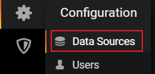
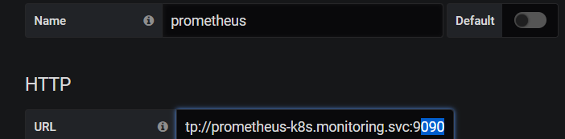
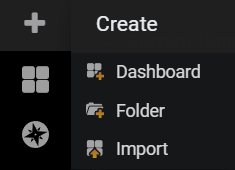
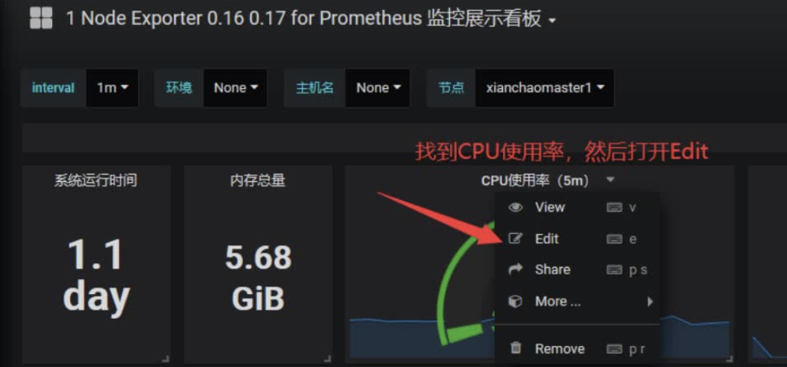
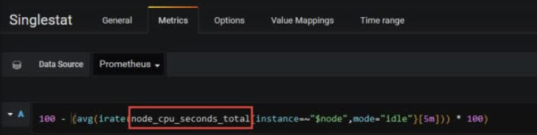
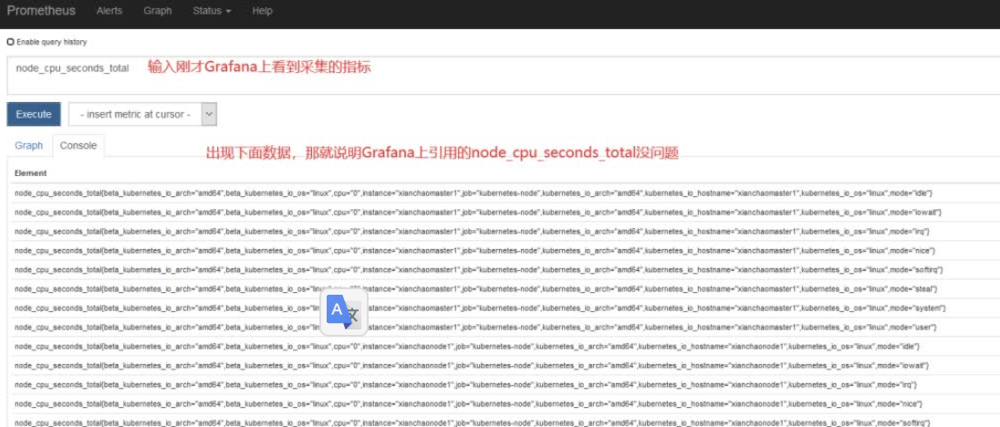
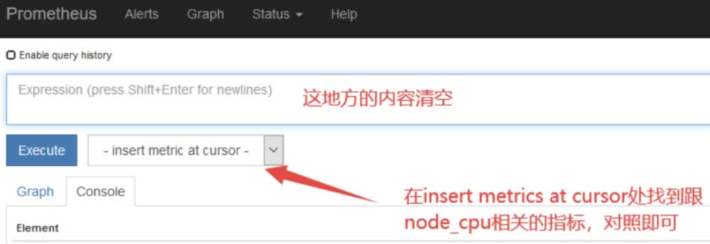

## 安装grafana

## 接入prometheus数据源

配置data sources

## 界面介绍

- 创建dashboard，一个dashboard包含多个panel

- 创建folder来分类dashboard
- import导入dashboard模板

查询指标，输入promql

## 导入模板

导入的监控模板，可在如下链接搜索

https://grafana.com/dashboards?dataSource=prometheus&search=kubernetes

扩展：如果Grafana导入Prometheus之后，发现仪表盘没有数据，如何排查？

1、打开grafana界面，找到仪表盘对应无数据的图标

Edit之后出现如下：

node_cpu_seconds_total就是grafana上采集的cpu的时间，需要到prometheus ui界面看看采集的指标是否是node_cpu_seconds_total

如果在prometheus ui界面输入node_cpu_seconds_total没有数据，那就看看是不是prometheus采集的数据是node_cpu_seconds_totals，怎么看呢？

