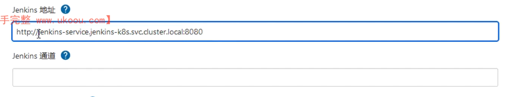
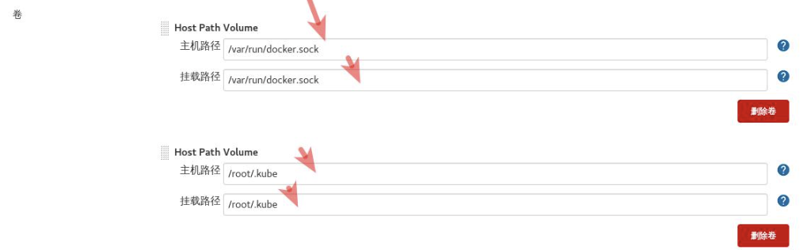
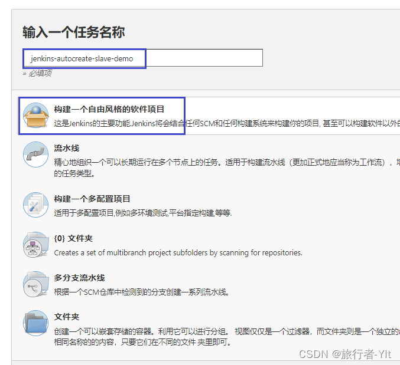

## 安装jenkins

### 安装jenkins master

创建sa并绑定权限

```yaml
cat clusterrolebinding.yaml 

apiVersion: v1
kind: ServiceAccount
metadata:
  name: jenkins-k8s-sa
  namespace: jenkins-k8s

---

kind: ClusterRole
apiVersion: rbac.authorization.k8s.io/v1beta1
metadata:
  name: jenkins
rules:
  - apiGroups: ["extensions", "apps"]
    resources: ["deployments"]
    verbs: ["create", "delete", "get", "list", "watch", "patch", "update"]
  - apiGroups: [""]
    resources: ["services"]
    verbs: ["create", "delete", "get", "list", "watch", "patch", "update"]
  - apiGroups: [""]
    resources: ["pods"]
    verbs: ["create","delete","get","list","patch","update","watch"]
  - apiGroups: [""]
    resources: ["pods/exec"]
    verbs: ["create","delete","get","list","patch","update","watch"]
  - apiGroups: [""]
    resources: ["pods/log"]
    verbs: ["get","list","watch"]
  - apiGroups: [""]
    resources: ["secrets"]
    verbs: ["get"]

---

apiVersion: rbac.authorization.k8s.io/v1beta1
kind: ClusterRoleBinding
metadata:
  name: jenkins
roleRef:
  apiGroup: rbac.authorization.k8s.io
  kind: ClusterRole
  name: jenkins
subjects:
  - kind: ServiceAccount
    name: jenkins-k8s-sa
    namespace: jenkins-k8s
```

部署jenkins

```yaml
kind: Deployment
apiVersion: apps/v1
metadata:
  name: jenkins
  namespace: jenkins-k8s
spec:
  replicas: 1
  revisionHistoryLimit: 10
  selector:
    matchLabels:
      app: jenkins
  template:
    metadata:
      labels:
        app: jenkins
    spec:
      serviceAccount: jenkins-k8s-sa
      containers:
        - name: jenkins
          image: jenkins/jenkins:2.332.3
          imagePullPolicy: IfNotPresent
          ports:
            - containerPort: 8080
              name: web
              protocol: TCP
            - containerPort: 50000
              name: agent
              protocol: TCP
          resources:
            limits:
              cpu: 1000m
              memory: 2Gi
            requests:
              cpu: 500m
              memory: 512Mi
          livenessProbe:
            httpGet:
              path: /login
              port: 8080
            initialDelaySeconds: 60
            timeoutSeconds: 5
            failureThreshold: 12
          readinessProbe:
            httpGet:
              path: /login
              port: 8080
            initialDelaySeconds: 60
            timeoutSeconds: 5
            failureThreshold: 12
          volumeMounts:
            - name: jenkins-home
              mountPath: /var/lib/jenkins
      volumes:
        - name: jenkins-home
          hostPath: 
            path: /data/devops/jenkins
            type: Directory 
---
apiVersion: v1
kind: Service
metadata:
  name: jenkins-service
  namespace: jenkins-k8s
  labels:
    app: jenkins
spec:
  selector:
    app: jenkins
  type: NodePort
  ports:
    - name: web
      port: 8080
      targetPort: web
      nodePort: 30002
    - name: agent
      port: 50000
      targetPort: agent
```

### 优化jenkins插件安装

修改配置文件地址

```shell
cd /data/devops/jenkins/updates
ll
总用量 2872
-rw-r--r-- 1 1000 1000 2639693 6月   5 23:44 default.json
-rw-r--r-- 1 1000 1000    5569 6月   5 23:58 hudson.tasks.Ant.AntInstaller
-rw-r--r-- 1 1000 1000    6040 6月   5 23:44 hudson.tasks.Maven.MavenInstaller
-rw-r--r-- 1 1000 1000  279724 6月   5 23:58 hudson.tools.JDKInstaller

sed -i 's/http:\/\/updates.jenkinsci.org\/download/https:\/\/mirrors.tuna.tsinghua.edu.cn\/jenkins/g' default.json
sed -i 's/http:\/\/www.google.com/https:\/\/www.baidu.com/g' default.json
```

修改页面插件下载地址

**系统管理 --> 插件管理 --> 高级，把站点升级改为国内插件下载地址**：

https://mirrors.tuna.tsinghua.edu.cn/jenkins/updates/update-center.json


Git: gitlab支持

Pipeline: 流水线支持

Git Parameter: Git参数化构建

kubernetes: 连接Kubernetes动态创建Slave代理

Config File Provider: 用于存储kubectl用于连接k8s集群的kubeconfig配置文件

Extended Choice Parameter: 扩展选择框参数，支持多选

Groovy Postbuild: Groovy 支持

Role-based Authorization Strategy: 矩阵

Kubernetes :k8s 部署

Maven Integration : 支持maven 打包

NodeJs: 支持node

### 配置k8s动态创建jenkins slave pod的模板

1. 配置Kubernetes plugin

   安装kubernetes插件：

   Manage Jenkins------>插件管理------>可选插件------>搜索 kubernetes

   管理jenkins-->系统配置-->Cloud，点击连接测试，连接成功会出现k8s版本号。

   这里不需要凭证是因为jenkins是在k8s内部搭建的，所以不需要k8s凭证，如果是在外部搭建就需要

   jenkins通道：这个参数是Jenkins Master和Jenkins Slave之间通信必须配置的




2. 构建jenkins-slave镜像

   jenkins 官方有jenkins-slave 制作好的镜像，可以直接 docker pull jenkins/jnlp-slave

   官方的镜像好处就是不需要再单独安装maven,kubectl 这样的命令了，如果要用gradle构建项目，则需要安装gradle，jdk等，构建镜像所需要Dockerfile如下：

   ```dockerfile
   FROM centos:7
   MAINTAINER liang
   ENV JAVA_HOME=/usr/local/java
   ENV PATH=$JAVA_HOME/bin:/usr/local/gradle/bin:$PATH
   
   RUN yum install -y maven curl git libtool-ltdl-devel && \
       yum clean all && \
       rm -rf /var/cache/yum/* && \
       mkdir -p /usr/share/jenkins
   COPY jdk-11.0.9 /usr/local/java
   COPY gradle6.4 /usr/local/gradle
   COPY slave.jar /usr/share/jenkins/slave.jar 
   COPY jenkins-slave /usr/bin/jenkins-slave
   COPY settings.xml /etc/maven/settings.xml
   RUN chmod +x /usr/bin/jenkins-slave
   COPY kubectl /usr/bin
   ENTRYPOINT ["jenkins-slave"]
   ```

   这里用别人做好的镜像cnych/Jenkins:jnlp6


使容器能够使用宿主机docker和kubectl



## 测试动态的生成 Jenkins-Slave

创建一个测试的任务




```shell
echo "测试 Kubernetes 动态生成 jenkins slave"
echo "==============docker in docker==========="
docker info

echo "=============kubectl============="
kubectl get pods
```

现在我们直接在页面点击做成的 Build now 触发构建即可，然后观察 Kubernetes 集群中 Pod 的变化

```shell
kubectl get po -n jenkins-k8s -w
```

查看输出也可以看到

