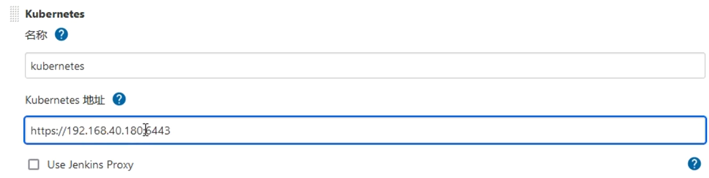
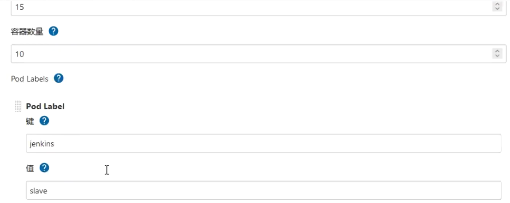
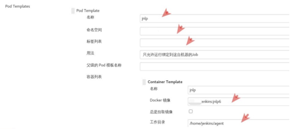

## 安装jenkins

## 安装jenkins master

```yaml
kind: Deployment
apiVersion: apps/v1
metadata:
  labels:
    k8s-app: jenkins
  name: jenkins
  namespace: jenkins-k8s
spec:
  replicas: 1
  revisionHistoryLimit: 10
  selector:
    matchLabels:
      k8s-app: jenkins
  template:
    metadata:
      labels:
        k8s-app: jenkins
      namespace: devops
      name: jenkins
    spec:
      containers:
        - name: jenkins
          image: jenkins/jenkins:2.381
          imagePullPolicy: IfNotPresent
          ports:
            - containerPort: 30080
              name: web
              protocol: TCP
            - containerPort: 30081
              name: agent
              protocol: TCP
          resources:
            limits:
              cpu: 1000m
              memory: 2Gi
            requests:
              cpu: 500m
              memory: 512Mi
          livenessProbe:
            httpGet:
              path: /login
              port: 30080
            initialDelaySeconds: 60
            timeoutSeconds: 5
            failureThreshold: 12
          readinessProbe:
            httpGet:
              path: /login
              port: 30080
            initialDelaySeconds: 60
            timeoutSeconds: 5
            failureThreshold: 12
          volumeMounts:
            - name: jenkins-home
              mountPath: /var/lib/jenkins
          env:
            - name: JENKINS_HOME
              value: /var/lib/jenkins
            - name: JENKINS_OPTS 
              value: --httpPort=30080
            - name: JENKINS_SLAVE_AGENT_PORT
              value: "30081"
      volumes:
        - name: jenkins-home
          hostPath: 
            path: /data/devops/jenkins
            type: Directory
      serviceAccountName: jenkins
---
apiVersion: v1
kind: ServiceAccount
metadata:
  labels:
    k8s-app: jenkins
  name: jenkins
  namespace: devops
---
kind: Service
apiVersion: v1
metadata:
  labels:
    k8s-app: jenkins
  name: jenkins
  namespace: devops
spec:
  type: NodePort
  ports:
    - name: web
      port: 30080
      targetPort: 30080
      nodePort: 30080
    - name: slave
      port: 30081
      targetPort: 30081
      nodePort: 30081
  selector:
    k8s-app: jenkins
---
kind: Role
apiVersion: rbac.authorization.k8s.io/v1
metadata:
 name: jenkins
 namespace: devops
rules:
 - apiGroups: [""]
   resources: ["pods","configmaps","namespaces"]
   verbs: ["create","delete","get","list","patch","update","watch"]
 - apiGroups: [""]
   resources: ["pods/exec"]
   verbs: ["create","delete","get","list","patch","update","watch"]
 - apiGroups: [""]
   resources: ["pods/log"]
   verbs: ["get","list","watch"]
 - apiGroups: [""]
   resources: ["secrets"]
   verbs: ["get"]
---
apiVersion: rbac.authorization.k8s.io/v1
kind: RoleBinding
metadata:
 name: jenkins
 namespace: devops
roleRef:
 apiGroup: rbac.authorization.k8s.io
 kind: Role
 name: jenkins
subjects:
 - kind: ServiceAccount
   name: jenkins
   namespace: devops
```

### 配置k8s动态创建jenkins slave pod的模板

创建sa并绑定权限

```yaml
cat clusterrolebinding.yaml 

apiVersion: v1
kind: ServiceAccount
metadata:
  name: jenkins-k8s-sa
  namespace: jenkins-k8s

---

kind: ClusterRole
apiVersion: rbac.authorization.k8s.io/v1beta1
metadata:
  name: jenkins
rules:
  - apiGroups: ["extensions", "apps"]
    resources: ["deployments"]
    verbs: ["create", "delete", "get", "list", "watch", "patch", "update"]
  - apiGroups: [""]
    resources: ["services"]
    verbs: ["create", "delete", "get", "list", "watch", "patch", "update"]
  - apiGroups: [""]
    resources: ["pods"]
    verbs: ["create","delete","get","list","patch","update","watch"]
  - apiGroups: [""]
    resources: ["pods/exec"]
    verbs: ["create","delete","get","list","patch","update","watch"]
  - apiGroups: [""]
    resources: ["pods/log"]
    verbs: ["get","list","watch"]
  - apiGroups: [""]
    resources: ["secrets"]
    verbs: ["get"]

---

apiVersion: rbac.authorization.k8s.io/v1beta1
kind: ClusterRoleBinding
metadata:
  name: jenkins
roleRef:
  apiGroup: rbac.authorization.k8s.io
  kind: ClusterRole
  name: jenkins
subjects:
  - kind: ServiceAccount
    name: jenkins-k8s-sa
    namespace: jenkins-k8s
```


配置kubernetes

管理jenkins-->系统配置-->Cloud

配置： Kubernetes 地址、Kubernetes 命名空间、凭据、Jenkins 地址、Jenkins 通道、Pod Labels






Name: 给所加的k8s集群设置名字

Kubernetes URL： 集群的api-server出口地址，可以通过kubectl cluster info 查看

Credentials： 选择添加的凭证。

Test Connection：测试连接


配置： Pod Templates 中 名称、命名空间、标签列表、容器列表（名称、docker 镜像、工作目录）、卷（这里选择 hostpath，挂载 /var/run/docker.sock 和 /root/.kube 目录）



容器需要用到docker命令和kubectl命令


Service Account写前面创建的sa：jenkins-k8s-sa

### 添加镜像仓库凭据

系统管理-->manage credentials-->点击stores scoped to jenkins下的第一行jenkins后的全局