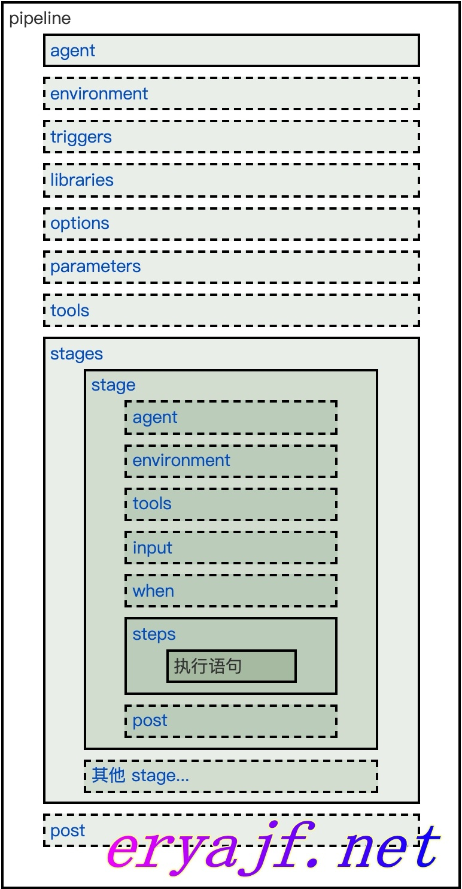
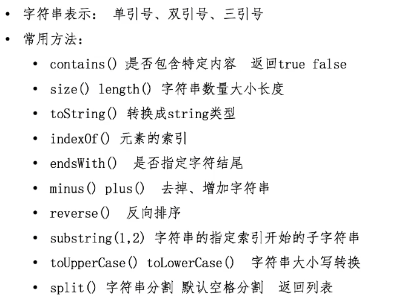
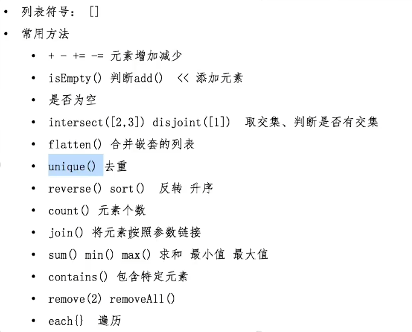
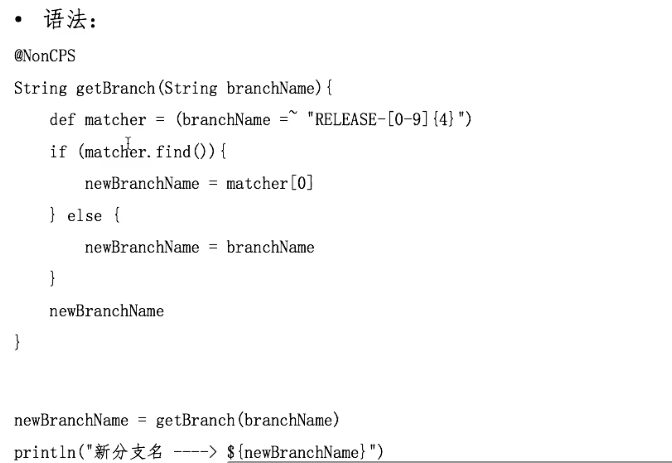

Pipeline是一套运行于jenkins上的工作流框架，将原本独立运行于单个或多个节点的任务连接起来


pipeline脚本由groovy语言实现，但不用专门学习groovy

pipeline支持两种语法：

Declarative声明式(新版本 Jenkins 推荐)

Scripted pipeline脚本式


## 声明式语法

文档：https://www.jenkins.io/zh/doc/book/pipeline/syntax/

中文文档（不够全但够用）：https://www.jenkins.io/zh/doc/book/pipeline/syntax/


安装声明式插件Pipeline:Declarative


整体框架：



声明式语法包括以下核心流程：

1. pipeline：声明其内容为声明式脚本，声明式流水线必须包含在一个 Pipeline 块中
2. agent：整个流水线或特定阶段步骤执行的节点（job运行的slave或master节点）
3. stages：阶段的集合，包囊所有的阶段（如打包、部署等各个阶段）
4. stage：阶段，被stages包囊，一个stages可以有多个stage
5. steps：步骤，为每个阶段的最小执行单元，被stage包囊
6. post：执行构建后的操作，根据构建结果来执行对应的操作

简单的例子：

```groovy
pipeline {
    agent {
        node {
        	label "master" //指定pipeline要在master标签的节点运行
        	customWorkspace "${workspace}" //指定运行工作目录（可选）
        }
    }
    stages {
    	stage("GetCode"){ //阶段名称
      	steps { //步骤
        	timeout(time:5, unit:"MINUTES") //步骤超时时间
        	script{ //填写运行代码
          	println('获取代码')
          }
        }
      }
    }
    //构建后操作
    post { ①
        always { ②
            script{
                println("always")
            }
        }
        success {
            script{
                currentBuild.description += "\n 构建成功！" //currentBuild是全局变量
            }
        }
        failure {
            script{
                currentBuild.description += "\n 构建失败！"
            }
        }
    }
}
```

### Sections（章节）

Declarative Pipeline里的Sections通常包含一个或多个Directives或Steps。

#### agent

Agent 表示整个流水线或特定阶段中的步骤和命令执行的位置，该部分**必须在 pipeline 块的顶层被定义**，也可以在 stage 中再次定义，但是 **stage 级别是可选的**。

```groovy
agent {
    node {
        label "master" //指定pipeline要在master标签的节点运行
        customWorkspace "${workspace}" //指定运行工作目录（可选）
    }
}
```

##### 参数列表

**any**

在任何agent上执行Pipeline。例如：agent any 

**none**

不会为整个Pipeline运行分配全局agent ，每个stage部分将需要定义其自己的agent。

**label**

在指定标签的agent上执行Pipeline或stage，节点需要提前配置标签

例如：agent { label 'my-defined-label' }

**node**

和label类似，agent { node { label 'labelName' } }，等同于 agent { label 'labelName' }，但node也允许其他选项如customWorkspace（设置默认工作目录）

如：node {
      label 'role-master'
      customWorkspace "/tmp/zhangzhuo/data"
     }

**docker**

定义此参数时，执行Pipeline或stage时会动态提供一个docker节点去运行基于Docker的Pipelines。docker还可以接受一个args参数，直接传递给docker run指令调用。

比如使用 maven 镜像进行打包，同时可以指定 args

```groovy
agent {
    docker {
        image 'maven:3-alpine'
        label 'my-defined-label'
        args  '-v /tmp:/tmp'
    }
}
```

**kubernetes**

为每个启动的agent创建一个pod，并在每次构建后停止它。

支持使用 Kubernetes 创建 Slave，也就是常说的动态 Slave

```groovy
pipeline {
  agent {
    kubernetes {
        //label "jenkins-slave"
        cloud 'kubernetes-default' //指定哪个k8s集群
        slaveConnectTimeout 1200 //slave连接超时时间
        //workspaceVolume emptyDirWorkspaceVolume() //临时目录，任务执行结束后会随着 pod 删除被删除，主要功能多个任务 container 共享 jenkins 工作目录
        //workspaceVolume persistentVolumeClaimWorkspaceVolume(claimName: "jenkins-agent", mountPath: "/", readOnly: "false") //挂载已有 pvc
        //workspaceVolume nfsWorkspaceVolume(serverAddress: "192.168.10.254", serverPath: "/nfs", readOnly: "false") //挂载 nfs 服务器目录
        //workspaceVolume dynamicPVC(storageClassName: "nfs-client", requestsSize: "1Gi", accessModes: "ReadWriteMany") //动态申请 pvc，任务执行结束后删除
        //workspaceVolume hostPathWorkspaceVolume(hostPath: "/opt/workspace", readOnly: false) //挂载 node 节点本机目录，注意挂载本机目录注意权限问题，可以先创建设置 777 权限，否则默认 kubelet 创建的目录权限为 755 默认其他用户没有写权限，执行流水线会报错。
        yaml """
apiversion: v1
kind: Pod
metadata:
  name: jenkins-slave
spec:
  containers:
  - args: [\'$(JENKINS_SECRET)\',\'$(JENKINS_NAME)\']
    name: jnlp
    image: 'reigstry.cn-beijing.aliyuncs.com/citools/jnlp:apline' #和jenkins master进行通信
    imagePullPolicy: ifNotPresent
    volumeMounts:
      - name: "volume-2"
        mountPath: "/etc/localtime"
        readOnly: false
  - command:
      - "cat"
    env:
      - name: "LANGUAGE"
        value: "en_US:en"
      - name: "LC_ALL"
        value: "en_US.UTF-8"
      - name: "LANG"
        value: "en_US.UTF-8"
    image: 'reigstry.cn-beijing.aliyuncs.com/citools/maven:3.5.3' #用来构建的
    imagePullPolicy: ifNotPresent
    name: build
    tty: true
    volumeMounts:
      - name: "volume-2"
        mountPath: "/etc/localtime"
        readOnly: false
      - name: "volume-maven-repo"
        mountPath: "/root/.m2/"
        readOnly: false
  - command:
      - "cat"
    env:
      - name: "LANGUAGE"
        value: "en_US:en"
      - name: "LC_ALL"
        value: "en_US.UTF-8"
      - name: "LANG"
        value: "en_US.UTF-8"
    image: 'reigstry.cn-beijing.aliyuncs.com/citools/kubectl:1.17.4' #用来构建的
    imagePullPolicy: ifNotPresent
    name: kubectl
    tty: true
    volumeMounts:
      - name: "volume-2"
        mountPath: "/etc/localtime"
        readOnly: false
      - name: "volume-docker"
        mountPath: "/var/run/docker.sock"
        readOnly: false
      - name: "volume-kubeconfig"
        mountPath: "/root/.kube"
        readOnly: false
  - command:
      - "cat"
    env:
      - name: "LANGUAGE"
        value: "en_US:en"
      - name: "LC_ALL"
        value: "en_US.UTF-8"
      - name: "LANG"
        value: "en_US.UTF-8"
    image: 'reigstry.cn-beijing.aliyuncs.com/citools/docker:19.03.9-git' #用来构建的
    imagePullPolicy: ifNotPresent
    name: docker
    tty: true
    volumeMounts:
      - name: "volume-2"
        mountPath: "/etc/localtime"
        readOnly: false
      - name: "volume-docker"
        mountPath: "/var/run/docker.sock"
        readOnly: false
      - name: "volume-hosts"
        mountPath: "/etc/hosts"
        readOnly: false    
  restartPolicy: "Never"
  securityContext: {}
  volumes:
    - hostPath:
        path: "/var/run/docker.sock"
      name: "volume-docker"
    - hostPath:
        path: "/etc/hosts"
      name: "volume-hosts"
    - name: "volume-maven-repo"
      emptyDir: {}
    - name: "volume-kubeconfig"
      secret:
        secretName: "multi-kube-config"
"""
        }
}
}
```


##### 通用选项

这些是可以应用于两个或多个agent中的选项。除非明确定义，否则非必需。

**label**

string字符串。标记在哪里运行pipeline或stage

此选项适用于node，docker和dockerfile，并且在node中是必需的。

**customWorkspace**

string字符串。自定义运行的工作空间,它可以是相对路径，在这种情况下，自定义工作区将位于node节点工作空间的根目录下，也可以是绝对路径。例如：

```
agent {
    node {
        label 'my-defined-label'
        customWorkspace '/some/other/path'
    }
}
```

#### stages和steps

- 包含一系列一个或多个 `stage` 指令, `stages` 部分是流水线描述的大部分"work" 的位置。 建议 `stages` 至少包含一个 stage指令用于连续交付过程的每个离散部分,比如构建, 测试, 和部署。只能有一次，在pipeline代码块内。


- `steps` 部分在给定的 `stage` 指令中执行的定义了一系列的一个或多个`steps` 。

##### 样例

```groovy
pipeline {
    agent {...}
    stages {
        //下载代码
        stage("GetCode"){ //阶段名称
            steps { //步骤
                timeout(time:5, unit:"MINUTES") //步骤超时时间
                script{ //填写运行代码
                    println('获取代码')
                }
            }
        }
        //构建代码
        stage("Build"){
            ...
        }
    }
}
```

#### post

用于定义在整个流水线执行结果的情况，通常可配合通知进行对项目构建状态的告知。

##### 参数列表

**always**

总是执行脚本片段

**changed**

只有当前Pipeline运行的状态与先前完成的Pipeline的状态不同时，才能运行。

**failure**

只有当前Pipeline处于“**失败**”状态时才运行，通常用红色指示的Web UI表示。

**success**

只有当前Pipeline具有“**成功**”状态时才运行，通常用蓝色或绿色指示的Web UI表示。

**unstable**

只有当前Pipeline具有“**不稳定**”状态，一般由测试失败，代码违例等引起，才能运行。通常用黄色指示的Web UI表示。

**aborted**

只有当前Pipeline处于“**中止**”状态时，才会运行，通常是由于Pipeline被手动中止。通常用灰色指示的Web UI表示。

correnBuild是一个全局变量

- description：构建描述

##### 样例

```groovy
pipeline {
    agent {...}
    stages {
        ...
    }
    //构建后操作
    post { ①
        always { ②
            script{
                println("always")
            }
        }
        success {
            script{
                currentBuild.description += "\n 构建成功！" //currentBuild是全局变量
            }
        }
        failure {
            script{
                currentBuild.description += "\n 构建失败！"
            }
        }
    }
}
```

①post章节通常会放在pipeline末端。

②post代码块里包括steps章节的内容。

### Directives （指令）

#### environment

Environment 主要用于在流水线中配置的一些环境变量，根据配置的位置决定环境变量的作用域。可以定义在 pipeline 中作为全局变量，也可以配置在 stage 中作为该 stage 的环境变量。

该指令支持一种特殊的方法`credentials()`，可通过标识符访问Jenkins环境中预定义好的Credential凭证。对于“Secret Text”类型的凭据，`credentials()`可以将该 Secret 中的文本内容赋值给环境变量，对于类型为标准的账号密码型的凭证，指定的环境变量为 username 和 password，并且也会定义两个额外的环境变量，分别为`MYVARNAME_USR`和`MYVARNAME_PSW`。

##### 样例

```groovy
//基本变量的使用
pipeline {
    agent any
    environment {
        project="admin-pipeline"
        git_url = "git@10.3.0.42:jenkins-learn/breeze-college.git"
        remote_port="22"
        remote_user="root"
        remote_ip="10.3.0.42"
        project_dir="/data/www/${project}"
        version_dir="/release/$project/${project}_${BUILD_ID}"
    }
}
//使用变量引用secret凭证，这里会自动创建HARBOR_USR、HARBOR_PSW、HARBOR三个变量
pipeline {
    agent any
  environment {
      HARBOR = credentials('harbor-account')
  }
}
```

#### options

Jenkins 流水线支持很多内置指令，比如 retry 可以对失败的步骤进行重复执行 n 次，可以根据不同的指令实现不同的效果。比较常用的指令如下:

- buildDiscarder

  保存多少个流水线的构建记录，可以有效控制Jenkins主机存储空间。

  ```groovy
  options{
      // 表示保留10次构建历史
      buildDiscarder(logRotator(numToKeepStr: '10'))
  }
  ```

- disableConcurrentBuilds

  不允许同时执行流水线，防止并行流水线同时访问共享资源导致流水线失败。

  ```groovy
  options {
  		disableConcurrentBuilds()
  }
  ```

- disableResume ：如果控制器重启，禁止流水线自动恢复。

- newContainerPerStage：agent 为 docker 或 dockerfile 时，每个阶段将在同一个节点的新容器中运行，而不是所有的阶段都在同一个容器中运行。

- retry：流水线失败后重试次数。

- timeout

  设置流水线的超时时间，超过流水线时间，job 会自动终止。如果不加 unit 参数默认为 分。

  ```groovy
  options {
  		// 设置流水线运行的超过10分钟，Jenkins将中止流水线
  		timeout(time: 10, unit: 'MINUTES')
  }
  ```

- timestamps

  为控制台输出时间戳

  ```groovy
  options {
      timestamps()
  }
  ```


Option 除了写在 Pipeline 顶层，还可以写在 stage 中，但是写在 stage 中的 option 仅支持 retry、 timeout、timestamps，或者是和 stage 相关的声明式选项，比如 skipDefaultCheckout。

#### parameters

parameters 指令提供用户在触发 Pipeline 时应提供的参数列表，也就是在以往的free style风格中最常用到的参数化构建，我们不必在每次新建项目之后，一步一步在web界面中配置需要的参数，而是可以直接通过声明式进行参数化风格定义，这样极大简化了配置工作。

只能有一次，在pipeline代码块内。

##### 参数列表

**string**

字符串类型的参数, 例如:

```
parameters { 
string(name: 'DEPLOY_ENV', defaultValue: 'staging', description: '')
}
```

**booleanParam**

布尔型的参数, 例如:

```
parameters {
 booleanParam(name: 'DEBUG_BUILD', defaultValue: true, description: '') 
}
```

截至发稿，Jenkins社区目前已支持[booleanParam, choice, credentials, file, text, password, run, string]这几种参数类型，其他高级参数化类型也在陆续完善中。

##### 样例

```groovy
//Jenkinsfile (Declarative Pipeline)
pipeline {
    agent any
    parameters {
        string(name: 'branch', defaultValue: 'master', description: '请输入将要构建的代码分支')
        choice(name: 'mode', choices: ['deploy','rollback'], description: '请选择发布或者回滚？')
        string(name: 'version_id', defaultValue: '0', description: '回滚时用，默认回滚到上一次构建，如需要回滚到更早构建，请输入对应构建ID，只支持最近五次构建的回滚,部署请忽略此参数')
    }
}
```

#### tools

定义部署流程中常用的一些工具，这些工具在`管理Jenkins`--->`Global Tool Configuration`中添加，然后在项目中引用。

| **需要** | 否                            |
| -------- | ----------------------------- |
| **参数** | 无                            |
| **允许** | 在pipeline块内或stage指令内。 |

**支持的Tools**

- maven
- jdk
- gradle

##### 样例

```groovy
//Jenkinsfile (Declarative Pipeline)
pipeline {
    agent any
    tools {
        maven 'maven'
    }
    stages {
        stage('Example') {
            steps {
                sh 'mvn --version'
            }
        }
    }
}
```

#### when

When 指令允许流水线根据给定的条件决定是否应该执行该 stage，when 指令必须包含至少 一个条件。如果 when 包含多个条件，所有的子条件必须都返回 True，stage 才能执行。

when指令有一些内置的条件判断关键字，这些关键字用好了，会给生产带来极大的效率提升:

##### 内置条件

**branch**

当正在构建的分支与给定的分支匹配时，执行这个 stage。注意，branch 只适用于多分支流水线

```groovy
stage('deploy to test'){
    steps{
        script{
            if (env.GIT_BRANCH == 'test'){
                echo "deploy to test env"
            }
        }
    }
}
//可以用when来代替上边的代码
stage('deploy to test'){
    when {
        branch 'test'
    }
    steps{
        echo "deploy to test env"
    }
}
```

**environment**

当指定的环境变量和给定的变量匹配时，则执行这个stage

```groovy
when{
    environment name: 'mode',value: 'deploy'
}
```

**expression**

当指定的Groovy表达式求值为true时执行阶段。

```groovy
when {
	expression { return params.DEBUG_BUILD }
}

```

**not**

当嵌套条件是错误时，执行这个阶段，必须包含一个条件，例如:

```groovy
when {
		not { branch 'master' }
}
```

**allOf**

当所有的嵌套条件都正确时，才执行。例如:

```groovy
when {
		allOf {
				branch 'master';
				environment name: 'DEPLOY_TO', value: 'production'
		}
}
```

**anyOf**

当至少有一个嵌套条件为真时，执行这个阶段，必须包含至少一个条件，例如:

```groovy
when {
		anyOf {
				branch 'master';
				branch 'dev'
		}
} 
```

#### triggers

`triggers`指令用于定义流水线触发的一些机制与条件。常规情况下，我们的项目都是基于手动点击部署，这种策略尤其适用于线上环境，但在测试环境，乃至于预发环境，应该对自动构建有更高的集成度，使开发者只关注于开发，而不必过多纠结构建的过程。

目前流水线支持的触发器有三种：`cron`, `pollSCM` 和 `upstream`。

- cron

  采用与Linux系统一样的定时任务管理方案

- pollSCM

  定期对代码仓库进行检测，如果有变化，则自动触发构建

- upstream

  当B项目的执行依赖A项目的执行结果是，A就是B的上游项目

- gitlab

  ```groovy
  pipeline {
      agent any
      triggers{
          gitlab( triggerOnPush: true, //当Gitlab触发push事件时，是否执行构建。
                  triggerOnMergeRequest: true, //当Gitlab触发mergeRequest事件时，是否执行构建。
                  branchFilterType: 'All', //只有符合条件的分支才会触发构建，必选，否则无法实现触发。
                  secretToken: "028d848ab64f")
      }
      stages {
          stage('build') {
              steps {
                  echo '提交触发的构建'
              }
          }
      }
  }
  ```

  - 如果只接受固定分支的触发请求，语法如下：

    ```groovy
    	triggers{
            gitlab( triggerOnPush: true,
                    triggerOnMergeRequest: true,
    								branchFilterType: "NameBasedFilter",
                    includeBranchesSpec: "release",
                    secretToken: "${env.git_token}")
        }
    ```

  - 如果想通过正则匹配到某些分支进行触发，语法如下：

    ```groovy
    triggers{
        gitlab( triggerOnPush: true,
                triggerOnMergeRequest: true,
    							branchFilterType: "RegexBasedFilter",
                sourceBranchRegex: "test.*",
                secretToken: "${env.git_token}")
    }
    ```

  所有触发器同样都需要先手动执行一次，让Jenkins加载其中的配置，对应的指令才会生效。


### Parallel(并行)

在声明式流水线中可以使用 Parallel 字段，即可很方便的实现并发构建，比如对分支 A、B、 C 进行并行处理

另外，通过在某个stage中设置“failFast true”，可实现当这个stage运行失败的时候，强迫所有parallel stages中止运行（详见下面的例子）。

##### 样例

```groovy
pipeline {
  agent any
  stages {
    stage('Non-Parallel Stage') {
      steps {
        echo 'This stage will be executed first.'
      }
    }
    stage('Parallel Stage') {
      failFast true         //表示其中只要有一个分支构建执行失败，就直接推出不等待其他分支构建
      parallel {
        stage('Branch A') {
          steps {
            echo "On Branch A"
          }
        }
        stage('Branch B') {
          steps {
            echo "On Branch B"
          }
        }
        stage('Branch C') {
          stages {
            stage('Nested 1') {
              steps {
                echo "In stage Nested 1 within Branch C"
              }
            }
            stage('Nested 2') {
              steps {
               echo "In stage Nested 2 within Branch C"
              }
            }
          }
        }
      }
    }
  }
}
```

#### script

script步骤中可以引用script Pipeline语句，并在Declarative Pipeline中执行。对于大多数用例，script在Declarative Pipeline中的步骤不是必须的，但它可以提供一个有用的加强。

##### 样例

```groovy
//Jenkinsfile (Declarative Pipeline)
pipeline {
    agent any
    stages {
        stage('Example') {
            steps {
                echo 'Hello World'
                script {
                    def browsers = ['chrome', 'firefox']
                    for (int i = 0; i < browsers.size(); ++i) {
                        echo "Testing the ${browsers[i]} browser"
                    }
                }
            }
        }
    }
}
```

## jenkinsfile

### 静态变量

Jenkins 有许多内置变量可以直接在 Jenkinsfile 中使用，可以通过 `JENKINS_URL/pipeline/syntax/globals#env` 获取完整列表。目前比较常用的环境变量如下

- BUILD_ID：当前构建的 ID，与 Jenkins 版本 1.597+中的 BUILD_NUMBER 完全相同
- BUILD_NUMBER：当前构建的 ID，和 BUILD_ID 一致
- BUILD_TAG：用来标识构建的版本号，格式为：`jenkins-${JOB_NAME}-${BUILD_NUMBER}`， 可以对产物进行命名，比如生产的 jar 包名字、镜像的 TAG 等；
- BUILD_URL：本次构建的完整 URL
- JOB_NAME：本次构建的项目名称
- NODE_NAME：当前构建节点的名称；
- JENKINS_URL：Jenkins 完整的 URL，需要在 SystemConfiguration 设置；
- WORKSPACE：执行构建的工作目录。


示例如果一个流水线名称为`print_env`，第 2 次构建，各个变量的值。

```text
BUILD_ID：2
BUILD_NUMBER：2
BUILD_TAG：jenkins-print_env-2
BUILD_URL：http://192.168.10.16:8080/job/print_env/2/
JOB_NAME：print_env
NODE_NAME：built-in
JENKINS_URL：http://192.168.10.16:8080/
WORKSPACE：/bitnami/jenkins/home/workspace/print_env
```

上述变量会保存在一个 Map 中，可以使用 env.BUILD_ID 或 env.JENKINS_URL 引用某个内置变量

### 动态变量

动态变量是根据某个指令的结果进行动态赋值，变量的值根据指令的执行结果而不同

- returnStdout：将命令的执行结果赋值给变量，比如下述的命令返回的是 clang，此时 CC 的值为“clang”。
- returnStatus：将命令的执行状态赋值给变量，比如下述命令的执行状态为 1，此时 EXIT_STATUS 的值为 1。

```
//Jenkinsfile (Declarative Pipeline)
pipeline {
  agent any
  environment {
    // 使用 returnStdout
    CC = """${sh(
         returnStdout: true,
         script: 'echo -n "clang"'   //如果使用shell命令的echo赋值变量最好加-n取消换行
         )}"""
    // 使用 returnStatus
    EXIT_STATUS = """${sh(
         returnStatus: true,
         script: 'exit 1'
         )}"""
  }
  stages {
    stage('Example') {
      environment {
        DEBUG_FLAGS = '-g'
      }
      steps {
        sh 'printenv'
      }
    }
  }
}
```

## groovy基础语法

groovy是一种功能强大，可选类型和动态语言

### 数据类型

### string



### list



### 函数

def定义函数

语法：

```groovy
def PrintMes(value){
    println(value)
    //xxx
    return value
}
```

### 正则表达式



