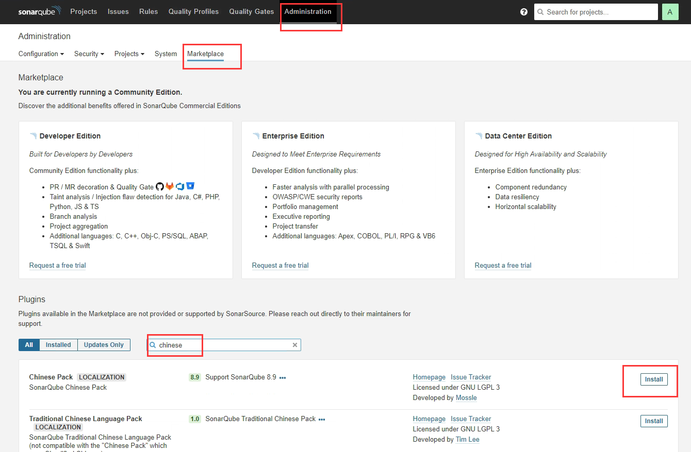
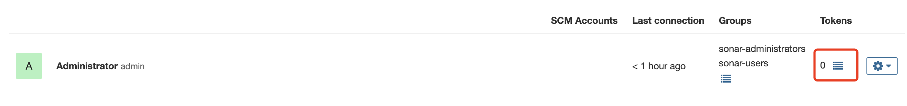
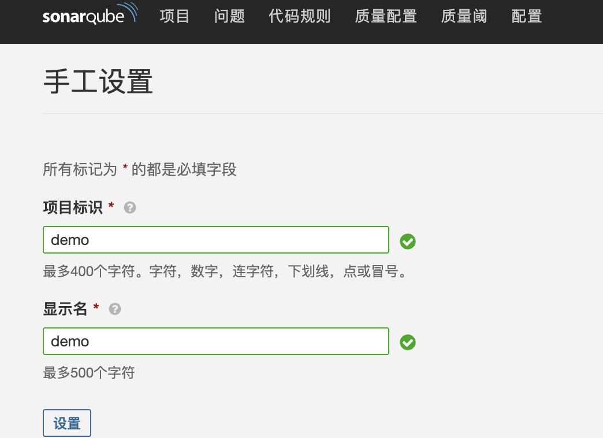
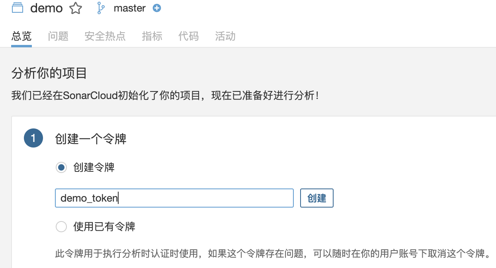
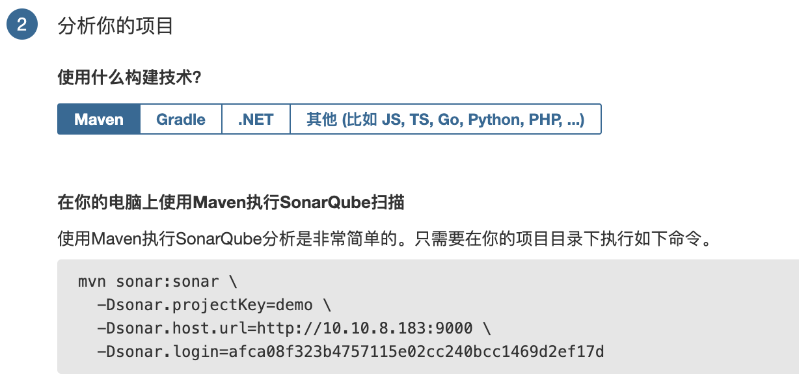

## 简介

SonarQube是一种自动代码审查工具，用于检测代码中的错误和代码异常。SonarQube 支持多种插件，实现和Jenkins等CI&CD工具的集成。


架构组成：

- SonarQube Server。包括三个主要部分：
  - Web Server: UI 界面
  - Search Server :为UI提供搜索功能，基于ElasticSearch实现
  - Compute Engine Server：处理代码分析报告,并将之存储到 SonarQube Database。
- SonarQube Database: 负责存储 SonarQube 的配置，以及项目的质量快照等
- SonarQube Plugin: 可以在 SonarQube Server 安装丰富的插件，实现支持各种开发语言、SCM、集成、身份验证和治理等功能
- Code analysis Scanners: 代码扫描器，是SonarQube Server的客户端, 将代码扫描后得出报告提交给 SonarQube Server

## 安装sonarqube

[SonarScanner | SonarQube Docs](https://docs.sonarqube.org/latest/analysis/scan/sonarscanner/)

官网上已经声明 sonarQube 7.9 版本以上不再支持 mysql 了，我们为了以后升级新版本不做数据库迁移，**尽量使用 postgresql** 


安装postgresql数据库:

```shell
docker pull postgres:11

mkdir -p /home/apps/postgres/{postgresql,data}

docker run -d --name postgres -p 5432:5432 \
-v /home/apps/postgres/postgresql:/var/lib/postgresql \
-v /home/apps/postgres/data:/var/lib/postgresql/data \
-v /etc/localtime:/etc/localtime:ro \
-e POSTGRES_USER=sonar \
-e POSTGRES_PASSWORD=sonar \
-e POSTGRES_DB=sonar \
-e TZ=Asia/Shanghai \
--restart always \
--privileged=true \
postgres:11
```

#数据库操作：

```shell
# 进入docker容器
docker exec -it postgres /bin/bash
 
# 用户登录(sonar)
psql -U sonar
 
# 创建新用户
create user admin with password '123456';
 
# 创建数据库，指定用户
create database testDB with owner admin;
 
# 退出
\q
 
# 查看用户
\du
 
# 列出数据库
\l
 
# 删除用户
drop user admin;
 
# 删除数据库
drop database dbtest;
```

安装sonarqube：

```shell
docker pull sonarqube:8.9.2-community

mkdir -p /home/apps/sonarqube/{extensions,logs,data}

---
vim /etc/sysctl.conf
 
# 增加以下配置
vm.max_map_count=262144
fs.file-max=65536
 
# 使配置生效
sysctl -p
---

docker run -d --name sonarqube -p 9000:9000 \
--link postgres \
-v /home/apps/sonarqube/extensions:/opt/sonarqube/extensions \
-v /home/apps/sonarqube/logs:/opt/sonarqube/logs \
-v /home/apps/sonarqube/data:/opt/sonarqube/data \
-e SONARQUBE_JDBC_URL=jdbc:postgresql://postgres:5432/sonar \
-e SONARQUBE_JDBC_USERNAME=sonar \
-e SONARQUBE_JDBC_PASSWORD=sonar \
--restart always \
--privileged=true \
sonarqube:8.9.2-community
```

访问sonarqube，http:ip:9000，账号密码admin/admin

## 管理sonarqube

**sonarqube安装中文插件：**

Administration->Marketplace->搜索chinese，安装完会提示restart server需要重启sonarqube



**权限管理**

Sonarqube默认是不允许匿名访问的，需要给Jenkins创建相关访问令牌

点击配置->权限->用户




## Jenkins服务器部署扫描器sonar-scanner

```shell
#在Jenkins服务器部署sonar-scanner
wget https://binaries.sonarsource.com/Distribution/sonar-scanner-cli/sonar-scanner-cli-4.8.0.2856-linux.zip
unzip sonar-scanner-cli-4.8.0.2856-linux.zip
mv sonar-scanner-4.8.0.2856-linux /usr/local/sonar-scanner

##配置sonar-scanner连接sonarqube服务器
vim /usr/local/sonar-scanner/conf/sonar-scanner.properties
#指向SonarQube服务器的地址和端口
sonar.host.url=http://xxx.xxx.xxx.xxx:9000
sonar.sourceEncoding=UTF-8
```

## jenkins接入sonarqube

 Jenkins借助于SonarQube Scanner插件将SonarQube提供的代码质量检查能力集成到pipeline上，从而确保质量阈检查失败时，能够避免继续进行后续的操作，例如发布等。一般流程如下：

- Jenkins Pipeline启动
- SonarQube Scanner分析代码，并将报告发送至SonarQubeServer
- SonarQube Server分析代码检测的结果是否符合预定义的质量阈
- SonarQube Server将通过(passed)或者失败(failed)的结果发送回Jenkins上的SonarQube Scanner插件暴露的 Webhook
- 质量阈相关的阶段成功通过则Jenkins pipeline继续后面的Stage，否则Pipeline将终止


 配置Jenkins使用sonar-scanner进行代码质量扫描，并将结果报告给SonarQube Server的主要步骤如下：

- 在 Jenkins上安装SonarQube插件
- 配置Jenkins对接到SonarQube Server
- 配置Jenkins的全局工具sonar-scanner
- 在SonarQube上添加回调Jenkins的Webhook
- 在Jenkins项目上调用sonar-scanner进行代码质量扫描
- 通过SonarQube确认扫描结果的评估


1.**jenkins安装sonarqube插件**

系统管理-->插件管理-->可选插件：搜索sonar，找到Sonarqube Scanner

安装之后重启jenkins即可

2.**添加SonarQube的地址和验证令牌**

创建sonarqube凭证


点击系统管理->系统配置


3.**Jenkins添加Sonar Scanner扫描器**

点击系统管理->全局工具配置

4.**Pipeline 集成 SonarQube 实现代码检测通知 Jenkins**

实现当Sonarqube检测失败时，不会继续进行后面的构建编译等步骤。

在SonarQube上添加webhook(网络调用)，以便于Jenkins通过SonarQube Quality Gate插件调用其"质量阈"信息，决定是否继续执行下面的构建步骤。       

点击配置->网络调用->创建


pipeline

```groovy
pipeline {
  agent any 
  stages {
    stage("SonarQube analysis"){
      steps {
      //注意:下面的SonarQube-Server和系统配置SonarQube installations的Name必须一致, 大小写敏感
        withSonarQubeEnv("SonarQube-Server"){ 
          //执行mvn的命令时使用SonarQube-Scanner检测代码
          sh 'mvn sonar:sonar'
        }
      }
    }
    stage("Quality Gate") {
      steps {
        //代码检测失败,将不再继续执行后面的任务,直接退出,报告返回的超时时长设为5分钟
        timeout(time: 5,unit: 'MINUTES'){ 
          waitForQualityGate abortPipeline: true
        }
      }
    }
    stage('Build') { 
      steps {
        sh 'mvn clean package -Dmaven.test.skip=true'
      }
    }
    stage('Test') { 
      steps {
        echo "Test"
      }
    }
    stage('Deploy') { 
      steps {
        echo "Deploy"
      }
    }
  }
  post {
    always {
      mail to:"xxx@xx.com",
      subject:"Status of pipeline: ${currentBuild.fullDisplayName}",
      body:"${env.BUILD_URL} has result ${currentBuild.result}"
    }
  }
}
```


## sonarqube的使用

创建项目



设置token



使用对应项目（maven or gradle？）的命令可以将代码上传到sonarqueb



上传后如图


