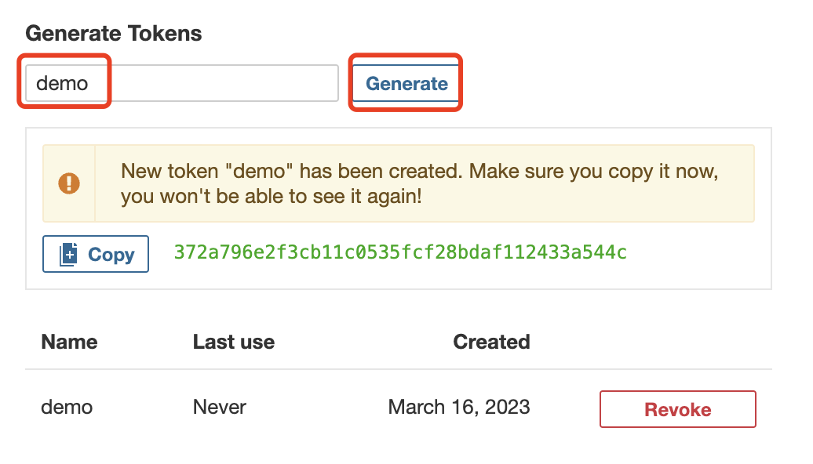
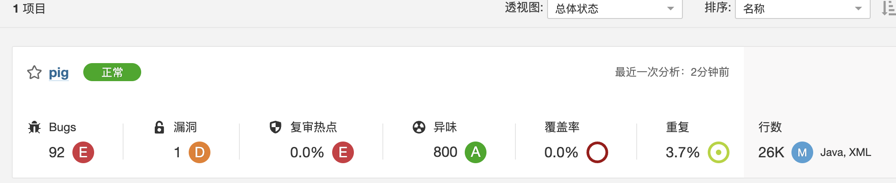

## 安装sonarqube

[SonarScanner | SonarQube Docs](https://docs.sonarqube.org/latest/analysis/scan/sonarscanner/)

官网上已经声明 sonarQube 7.9 版本以上不再支持 mysql 了，我们为了以后升级新版本不做数据库迁移，**尽量使用 postgresql** 


安装postgresql数据库:

```shell
docker pull postgres:11

mkdir -p /home/apps/postgres/{postgresql,data}

docker run -d --name postgres -p 5432:5432 \
-v /home/apps/postgres/postgresql:/var/lib/postgresql \
-v /home/apps/postgres/data:/var/lib/postgresql/data \
-v /etc/localtime:/etc/localtime:ro \
-e POSTGRES_USER=sonar \
-e POSTGRES_PASSWORD=sonar \
-e POSTGRES_DB=sonar \
-e TZ=Asia/Shanghai \
--restart always \
--privileged=true \
postgres:11
```

#数据库操作：

```shell
# 进入docker容器
docker exec -it postgres /bin/bash
 
# 用户登录(sonar)
psql -U sonar
 
# 创建新用户
create user admin with password '123456';
 
# 创建数据库，指定用户
create database testDB with owner admin;
 
# 退出
\q
 
# 查看用户
\du
 
# 列出数据库
\l
 
# 删除用户
drop user admin;
 
# 删除数据库
drop database dbtest;
```

安装sonarqube：

```shell
docker pull sonarqube:8.9.2-community

mkdir -p /home/apps/sonarqube/{extensions,logs,data}

---
vim /etc/sysctl.conf
 
# 增加以下配置
vm.max_map_count=262144
fs.file-max=65536
 
# 使配置生效
sysctl -p
---

docker run -d --name sonarqube -p 9000:9000 \
--link postgres \
-v /home/apps/sonarqube/extensions:/opt/sonarqube/extensions \
-v /home/apps/sonarqube/logs:/opt/sonarqube/logs \
-v /home/apps/sonarqube/data:/opt/sonarqube/data \
-e SONARQUBE_JDBC_URL=jdbc:postgresql://postgres:5432/sonar \
-e SONARQUBE_JDBC_USERNAME=sonar \
-e SONARQUBE_JDBC_PASSWORD=sonar \
--restart always \
--privileged=true \
sonarqube:8.9.2-community
```

## jenkins接入sonarqube

1.**jenkins安装sonarqube插件**

系统管理-->插件管理-->可选插件：搜索sonar，找到Sonarqube Scanner

安装之后重启jenkins即可


访问sonarqube，http:ip:9000，账号密码admin/admin


2.**创建token**

Administration-->Security-->Users




3.**在jenkins配置sonarqube**


## sonarqube的使用

**sonarqube安装中文插件：**

Administration->Marketplace->搜索chinese，安装完会提示restart server需要重启sonarqube


创建项目


设置token


使用对应项目（maven or gradle？）的命令可以将代码上传到sonarqueb


上传后如图



