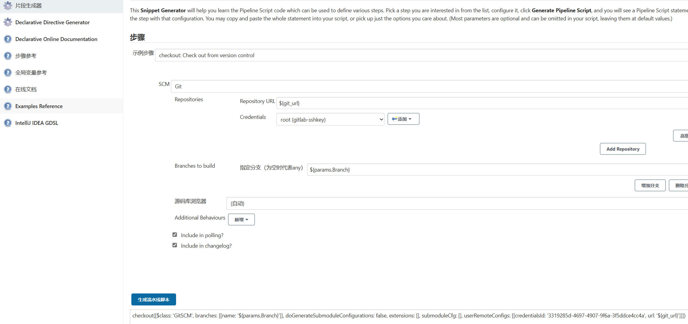
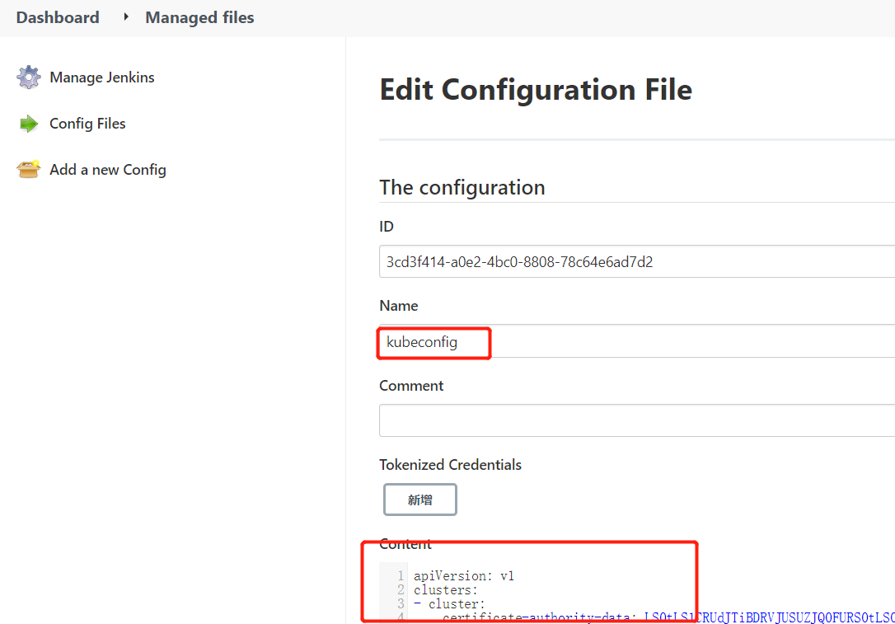
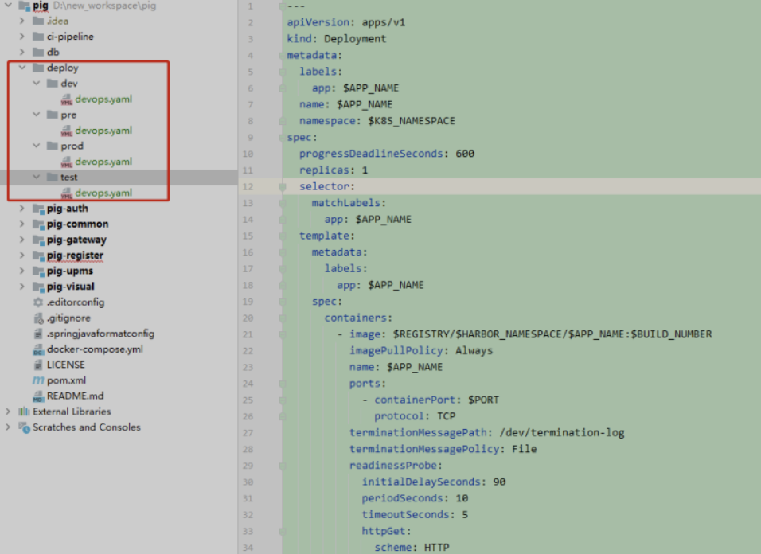

基于k8s的cicd流程

CI：开发代码-->提交代码到gitlab-->jenkins拉取代码-->sonarqube代码扫描-->制作docker镜像并上传到-->部署在k8s测试环境

CD：jenkins pipeline发布到生产环境


一、拉取代码

**添加gitlab凭证：**

把jenkins宿主机的ssh公钥添加到gitlab，这样可以拉取任何项目的代码

jenkins创建gitlab凭证（把jenkins宿主机的私钥添加进去）

用pipeline语法生成器，生成拉取代码步骤的pipeline语法：




```groovy
        stage('拉取代码') {
            steps {
                //引用参数化构建的分支、定义的gitlab凭证id、定义的项目地址
                checkout([$class: 'GitSCM', branches: [[name: '${params.Branch}']], doGenerateSubmoduleConfigurations: false, extensions: [], submoduleCfg: [], userRemoteConfigs: [[credentialsId: '${git_auth}', url: '${git_url}']]])
            }
        }
```

二、sonarqube扫描

```groovy
        stage('sonarqube代码质量检查') {
            steps {
                //下面的SonarQube-Server和系统配置SonarQube installations的Name必须一致, 大小写敏感
                withSonarQubeEnv("SonarQube-Server"){ 
                    //执行mvn的命令时使用SonarQube-Scanner检测代码
                    sh 'mvn sonar:sonar'
                }
            }
        }
```

三、制作镜像并上传到镜像仓库

**添加镜像仓库凭证**

```groovy
        stage('项目编译') {
            steps {
                sh """
                  mvn clean package -Dmaven.test.skip=true
                """
            }
        }

        stage('构建镜像') {
            steps {
                //通过凭证转换成阿里云镜像服务的账号和密码变量
                withCredentials([usernamePassword(credentialsId: "${registry_auth}", passwordVariable: 'password', usernameVariable: 'username')]) {
                    sh """
                        #登录镜像仓库
                        docker login -u ${username} -p '${password}' ${registry}
                        #制作和上传镜像
                        for service in \$(echo ${service} |sed 's/,/ /g');do
                            service_name=\${service%:*}
                            image_name=${registry}/${project}/\${service_name}:${BUILD_NUMBER}
                            cd \${service_name}
                            if ls |grep biz &>/dev/null;then
                                cd \${service_name}-biz
                            fi
                            docker build -t \${image_name} .
                            docker push \${image_name}
                            cd ${WORKSPACE}
                        done
                    """
				}
            }
        }
```

四、部署到dev环境

在k8s中为用户admin授权，生成kubeconfig文件。或者直接复制/root/.kube/config（这是一个kubeconfig文件）

Jenkins-slave镜像已经有kubectl命令，只需要kubeconfig就可以连接k8s集群

把生成的kubeconfig文件放到Jenkins中：需要安装Config File Provider插件

将生成的kubeconfig文件内容复制进去，复制ID号，在pipeline脚本定义变量：def k8s_auth = "ID号"



```groovy
        stage('部署到dev环境') {
            steps {
                withCredentials([usernamePassword(credentialsId: "${registry_auth}", passwordVariable: 'password', usernameVariable: 'username')]) {
                    sh """
                        kubectl apply -f deploy.yaml -n ${Namespace} --kubeconfig=admin.kubeconfig
                    """
            }
        }
```

五、定义环境变量，进行参数化构建，以及一些脚本优化

**动态创建jenkins-slave**

每次maven 打包会产生依赖的库文件，为了加快每次编译打包的速度，我们可以创建一个pvc或挂载目录，用来存储maven每次打包产生的依赖文件。以及我们需要将 k8s 集群 node 主机上的docker 命令挂载到Pod 中，用于镜像的打包 ，推送，修改后的jenkins-salve如下

```groovy
      kubernetes {
          label "jenkins-slave"
          yaml """
kind: pod
metadata:
  name: jenkins-slave
spec:
  containers:
  - name: jnlp
    image: "${registry}/jenkins-slave-jdk:1.8"
    imagePullPolicy: Always
    env: 
    - name: TZ
      value: Asia/Shanghai
    volumeMounts:
    - name: docker-cmd
      mountPath: /usr/bin/docker
    - name: docker-sock
      mountPath: /var/run/docker.sock
    - name: maven-cache
      mountPath: /root/.m2
    - name: gradle-cache
      mountPath: /root/.gradle
  volumes:
  - name: docker-cmd
    hostPath:
      path: /usr/bin/docker
  - name: docker-sock
    hostPath:
      path: /var/run/docker.sock
  - name: maven-cache
    hostPath:
      path: /tmp/m2
  - name: gradle-cache
    hostPath: 
      path: /tmp/gradle
"""
      }
```

**定义环境变量**

```groovy
def registry = "registry.cn-shenzhen.aliyuncs.com"
//项目名称
def project = ""
//项目地址
def git_url = ""
//服务域名
def gateway_domain_name = ""
def portal_domain_name = ""
//凭证id
def image_pull_secret = "registry-pull-secret"
def registry_auth = ""
def git_auth = ""
def k8s_auth = ""
```

**参数化构建交互内容**

```groovy
代码分支（prod，dev，test）
发布环境（prod，dev，test）


    parameters {
        choice (choices: ['dev','test','prod'], name: 'Environments', description: '请选择要发布的环境：dev开发环境、test测试环境、pre预发布环境、pre2灰度环境、prod 生产环境')
        choice (choices: ['no', 'yes'], name: 'sonarQube', description: '是否进行sonarQube代码质量检查,默认为no')
        choice (choices: ['pig-gateway', 'pig-auth', 'pig-register', 'pig-upms-biz','pig-codegen', 'pig-monitor', 'pig-sentinel-dashboard', 'pig-xxl-job-admin','all'], name: 'ServicesDeploy', description: '请选择要构建的服务,支持单个服务发布或全部服务发布')
    }
```

代码中创建devops.yaml文件



内容如下：

```yaml
---
apiVersion: apps/v1
kind: Deployment
metadata:
  labels:
    app: $APP_NAME
  name: $APP_NAME
  namespace: $K8S_NAMESPACE
spec:
  progressDeadlineSeconds: 600
  replicas: 1
  selector:
    matchLabels:
      app: $APP_NAME
  template:
    metadata:
      labels:
        app: $APP_NAME
    spec:
      containers:
        - image: $registry_namespace/$registry_namespace/$APP_NAME:$BUILD_NUMBER
          imagePullPolicy: Always
          name: $APP_NAME
          ports:
            - containerPort: $PORT
              protocol: TCP
          terminationMessagePath: /dev/termination-log
          terminationMessagePolicy: File
      dnsPolicy: ClusterFirst
      restartPolicy: Always
      terminationGracePeriodSeconds: 30
---
apiVersion: v1
kind: Service
metadata:
  labels:
    app: $APP_NAME
  name: $APP_NAME
  namespace: $K8S_NAMESPACE
spec:
  ports:
    - name: http
      port: $PORT
      protocol: TCP
      targetPort: $PORT
  selector:
    app: $APP_NAME
  sessionAffinity: None
  type: ClusterIP
```

完整jenkinsfile如下：

```groovy
#!/usr/bin/env groovy
//镜像仓库地址
def registry = "registry.cn-shenzhen.aliyuncs.com"
//镜像仓库命名空间
def registry_namespace = "xxx"
//镜像编号
def BUILD_NUMBER = ""
//项目地址
def git_url = ""
//凭证id
def image_pull_secret = ""
def registry_auth = ""
def git_auth = ""
def k8s_auth = ""

pipeline {
  //动态创建slave
  kubernetes {
    label "jenkins-slave"
    yaml """
kind: pod
metadata:
  name: jenkins-slave
spec:
  containers:
  - name: jnlp
    image: "${registry}/jenkins-slave-jdk:1.8"
    imagePullPolicy: Always
    env: 
    - name: TZ
      value: Asia/Shanghai
    volumeMounts:
    - name: docker-cmd
      mountPath: /usr/bin/docker
    - name: docker-sock
      mountPath: /var/run/docker.sock
    - name: maven-cache
      mountPath: /root/.m2
    - name: gradle-cache
      mountPath: /root/.gradle
  volumes:
  - name: docker-cmd
    hostPath:
      path: /usr/bin/docker
  - name: docker-sock
    hostPath:
      path: /var/run/docker.sock
  - name: maven-cache
    hostPath:
      path: /tmp/m2
  - name: gradle-cache
    hostPath: 
      path: /tmp/gradle
"""
  }
  
  //参数化构建
  parameters {
    choice (choices: ['dev','test','prod'], name: 'Environments', description: '请选择要发布的环境：dev开发环境、test测试环境、pre预发布环境、pre2灰度环境、prod 生产环境')
    choice (choices: ['no', 'yes'], name: 'sonarQube', description: '是否进行sonarQube代码质量检查,默认为no')
    choice (choices: ['pig-gateway', 'pig-auth', 'pig-register', 'pig-upms-biz','pig-codegen', 'pig-monitor', 'pig-sentinel-dashboard', 'pig-xxl-job-admin','all'], name: 'ServicesDeploy', description: '请选择要构建的服务,支持单个服务发布或全部服务发布')
  }
  
  stages {
    stage('拉取代码') {
      steps {
        //引用参数化构建的分支、定义的gitlab凭证id、定义的项目地址
        checkout([$class: 'GitSCM', branches: [[name: '${params.Branch}']], doGenerateSubmoduleConfigurations: false, extensions: [], submoduleCfg: [], userRemoteConfigs: [[credentialsId: '${git_auth}', url: '${git_url}']]])
      }
    }
    stage('sonarqube代码质量检查') {
      steps {
        //下面的SonarQube-Server和系统配置SonarQube installations的Name必须一致, 大小写敏感
        withSonarQubeEnv("SonarQube-Server"){
          //执行mvn的命令时使用SonarQube-Scanner检测代码
          sh 'mvn sonar:sonar'
        }
      }
    }
    stage('项目编译') {
      steps {
        sh """
        mvn clean package -Dmaven.test.skip=true
        """
      }
    }
    stage('构建镜像') {
      steps {
        for (service in ServicesBuild) {
          def workspace = "pig-"
          println "当前构建的镜像是：${service}"
          if("${service}".trim() == "pig-gateway" || "${service}".trim() == "pig-auth" || "${service}".trim() == "pig-register"){
            workspace = "${workspace}" + "${service}".trim().split("-")[1]
          }
          if("${service}".trim() == "pig-codegen" || "${service}".trim() == "pig-monitor" || "${service}".trim() == "pig-sentinel-dashboard" || "${service}".trim() == "pig-xxl-job-admin"){
            workspace = "pig-visual/" + "${service}".trim()
          }
          if("${service}".trim() == "pig-upms-biz"){
            workspace = "pig-upms/" + "${service}".trim()
          }
          //通过凭证转换成阿里云镜像服务的账号和密码变量
          withCredentials([usernamePassword(credentialsId: "${registry_auth}", passwordVariable: 'password', usernameVariable: 'username')]) {
              sh "cd ${workspace} && docker build -f Dockerfile -t $registry/$registry_namespace/${service}:$BUILD_NUMBER ."
              sh "docker login -u ${username} -p '${password}' ${registry}"
              sh "docker push $registry/$registry_NAMESPACE/${service}:$BUILD_NUMBER"
          }
        }
      }
    }
    stage('部署到dev环境') {
      steps {
        for (service in ServicesBuild) {
          //自定义的全局变量,也就是整个流水线可以去使用
          env.APP_NAME = "${service}"
          if("${service}".trim() == "pig-gateway") {
            env.PORT = 9999
          }
          if("${service}".trim() == "pig-auth") {
            env.PORT = 3000
          }
          if("${service}".trim() == "pig-register") {
            env.PORT = 8848
          }
          if("${service}".trim() == "pig-upms-biz") {
            env.PORT = 4000
          }
          if("${service}".trim() == "pig-codegen") {
            env.PORT = 5002
          }
          if("${service}".trim() == "pig-monitor") {
            env.PORT = 5001
          }
          if("${service}".trim() == "pig-sentinel-dashboard") {
            env.PORT = 5003
          }
          if("${service}".trim() == "pig-xxl-job-admin") {
            env.PORT = 5004
          }
          println "即将部署的服务是 $APP_NAME"
          withCredentials([usernamePassword(credentialsId: "${registry_auth}", passwordVariable: 'password', usernameVariable: 'username')]) {
            //通过${service}来判断最终选择哪个 deploy 来部署
            if("${service}".trim() == "pig-register") {
              sh "envsubst < deploy/${params.Environments}/nacos-devops.yaml | kubectl apply -f -"
            }else{
              sh "envsubst < deploy/${params.Environments}/devops.yaml | kubectl apply -f -"
            }
          }
        }
      }
  }
}
```


```groovy
#!/usr/bin/env groovy
//镜像仓库地址
def registry = "registry.cn-shenzhen.aliyuncs.com"
//项目名称
def project = ""
//项目地址
def git_url = ""
//服务域名
def gateway_domain_name = ""
def portal_domain_name = ""
//凭证id
def image_pull_secret = "registry-pull-secret"
def registry_auth = ""
def git_auth = ""
def k8s_auth = ""

pipeline {
    //动态创建slave
    agent {
      kubernetes {
          label "jenkins-slave"
          yaml """
kind: pod
metadata:
  name: jenkins-slave
spec:
  containers:
  - name: jnlp
    image: "${registry}//jenkins-slave-jdk:1.8"
    imagePullPolicy: Always
    volumeMounts:
    - name: docker-cmd
      mountPath: /usr/bin/docker
    - name: docker-sock
      mountPath: /var/run/docker.sock
    - name: maven-cache
      mountPath: /root/.m2
  volumes:
  - name: docker-cmd
    hostPath:
      path: /usr/bin/docker
  - name: docker-sock
    hostPath:
      path: /var/run/docker.sock
  - name: maven-cache
    hostPath:
      path: /tmp/m2
"""
      }
    }
    
    //参数化构建
    parameters {
        //git参数，从git地址获取分支，来选择发布的分支
        gitParameter branch: '', branchFilter: '.*', defaultValue: '', description: '选择发布的分支', name: 'Branch', quichFilterEnabled: false, selecteValue: 'NONE', sortMode: 'NONE', tagFilter: '*', type: 'PT_BRANCH'
        //extended choice，通过复选框来勾选要发布的微服务
        extendedChoice defaultValue: '', description: '选择发布的分支', multiSelectDelimiter: ',', name: 'Service', type: 'PT_CHECKBOX', value: 'gateway-service:9999,portal-service:8080,product-service:8010,order-service:8020,stock-service:8030'
        //choice
        choice choices: ['ms', 'demo'], description: '部署模板', name: 'Template'
        choice choices: ['1', '3', '5', '7'], description: '副本数', name: 'ReplicaCount'
        choice choices: ['ms'], description: '命名空间', name: 'Namespace'
    }


    stages {
        stage('拉取代码') {
            steps {
                //引用参数化构建的分支、定义的gitlab凭证id、定义的项目地址
                checkout([$class: 'GitSCM', branches: [[name: '${params.Branch}']], doGenerateSubmoduleConfigurations: false, extensions: [], submoduleCfg: [], userRemoteConfigs: [[credentialsId: '${git_auth}', url: '${git_url}']]])
            }
        }
        stage('代码编译') {
            steps {
                sh """
                  mvn clean package -Dmaven.test.skip=true
                """
            }
        }
        stage('构建镜像') {
            steps {
                //通过凭证转换成阿里云镜像服务的账号和密码变量
                withCredentials([usernamePassword(credentialsId: "${registry_auth}", passwordVariable: 'password', usernameVariable: 'username')]) {
                    sh """
                        #登录镜像仓库
                        docker login -u ${username} -p '${password}' ${registry}
                        #制作和上传镜像
                        for service in \$(echo ${service} |sed 's/,/ /g');do
                            service_name=\${service%:*}
                            image_name=${registry}/${project}/\${service_name}:${BUILD_NUMBER}
                            cd \${service_name}
                            if ls |grep biz &>/dev/null;then
                                cd \${service_name}-biz
                            fi
                            docker build -t \${image_name} .
                            docker push \${image_name}
                            cd ${WORKSPACE}
                        done
                    """
                    configfileProvider([configFile(fileId: "${k8s_auth}", targetLocation: "admin.kubeconfig")]){
                        sh """
                           #添加镜像拉取认证
                           kubectl create secret docker-registry ${image_pull_secret}
                           --docker-username=${username} --docker-password=${password}
                           --docker-server=${registry} -n ${Namespace} --kubeconfig
                           admin.kubeconfig |true
                           #添加私有chart仓库
                           helm repo add --username ${username} --password ${password}
                           myrepo http://${registry}/chartrepo/${project}
                        """
                    }
				}
            }
        }
        stage('Helm部署到k8s') {
            steps {
                sh """
                    common_args="-n ${Namespace} --kubeconfig admin.kubeconfig"
                    
                    for serivce in \$(echo ${Service} |sed 's/,/ /g');do
                        service_name=\${service%:*}
                        service_port=\${service#*:}
                        image=${registry}/${project}/\${service_name}
                        tag=${BUILD_NUMBER}
                        
                        #helm参数
                        helm_args="\{service_name} --set image.repository=\${image} --set image.tag=\${tag} --set replicaCount=${replicaCount} --set imagePullSecrets[0].name=${image_pull_secret} --set service.targetPort=\${service_port} myrepo/${Template}"
                        
                        #是否为新部署
                        if helm history \${service_name} \${common_agrs} &>/dev/null;then
                            action=upgrade
                        else
                            action=install
                        fi
                        
                        #针对服务启用ingress
                        if [ \${service_name} == "gateway-service" ];then
                            helm \${action} \${helm_args} \
                            --set ingress.enabled=true \
                            --set ingress.host=${gateway_domain_name} \
                            \${common_args}
                        elif [ \${service_name} == "portal-service" ];then
                            helm \${action} \${helm_args} \
                            --set ingress.enabled=true \
                            --set ingress.host=${portal_domain_name} \
                            \${common_args}
                        else
                            helm \${action} \${helm_args} \${common_args}
                        fi
                    done
                """
            }
        }
    }
}
```

