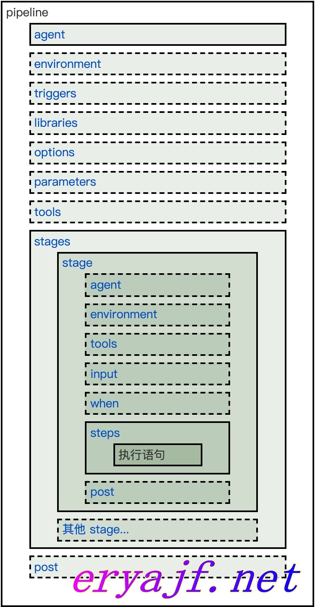
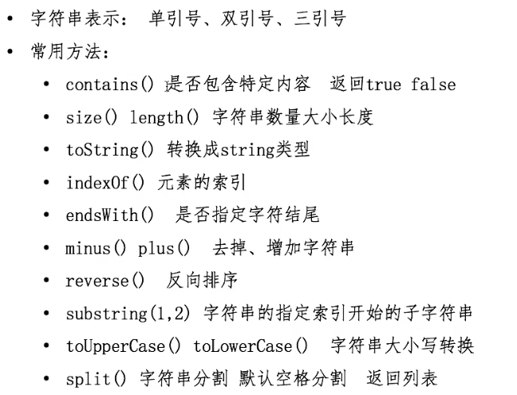
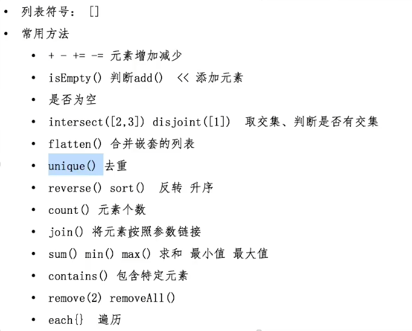
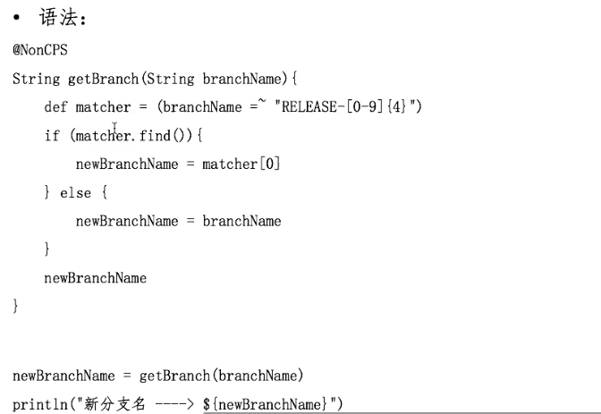

Pipeline是一套运行于jenkins上的工作流框架，将原本独立运行于单个或多个节点的任务连接起来


pipeline脚本由groovy语言实现，但不用专门学习groovy

pipeline支持两种语法：

Declarative声明式

Scripted pipeline脚本式


## 声明式语法

文档：https://www.jenkins.io/zh/doc/book/pipeline/syntax/

中文文档（不够全但够用）：https://www.jenkins.io/zh/doc/book/pipeline/syntax/


安装声明式插件Pipeline:Declarative


整体框架：



声明式语法包括以下核心流程：

1. pipeline：声明其内容为声明式脚本
2. agent：执行的节点（job运行的slave或master节点）
3. stages：阶段的集合，包囊所有的阶段（如打包、部署等各个阶段）
4. stage：阶段，被stages包囊，一个stages可以有多个stage
5. steps：步骤，为每个阶段的最小执行单元，被stage包囊
6. post：执行构建后的操作，根据构建结果来执行对应的操作

简单的例子：

```groovy
pipeline {
    agent {
        node {
        	label "master" //指定pipeline要在master标签的节点运行
        	customWorkspace "${workspace}" //指定运行工作目录（可选）
        }
    }
    stages {
    	stage("GetCode"){ //阶段名称
      	steps { //步骤
        	timeout(time:5, unit:"MINUTES") //步骤超时时间
        	script{ //填写运行代码
          	println('获取代码')
          }
        }
      }
    }
    //构建后操作
    post { ①
        always { ②
            script{
                println("always")
            }
        }
        success {
            script{
                currentBuild.description += "\n 构建成功！" //currentBuild是全局变量
            }
        }
        failure {
            script{
                currentBuild.description += "\n 构建失败！"
            }
        }
    }
}
```

### Sections（章节）

Declarative Pipeline里的Sections通常包含一个或多个Directives或Steps。

#### agent

```groovy
//指定在什么节点运行pipeline。在pipeline代码块的顶层agent必须进行定义，但在stage级使用是可选的。
agent {
    node {
        label "master" //指定pipeline要在master标签的节点运行
        customWorkspace "${workspace}" //指定运行工作目录（可选）
    }
}
```

##### 参数列表

**any**

在任何agent上执行Pipeline。例如：agent any 

**none**

不会为整个Pipeline运行分配全局agent ，每个stage部分将需要定义其自己的agent。

**label**

在指定标签的agent上执行Pipeline或stage。

例如：agent { label 'my-defined-label' }

**node**

agent { node { label 'labelName' } }，等同于 agent { label 'labelName' }，但node也允许其他选项（如customWorkspace）。

**docker**

定义此参数时，执行Pipeline或stage时会动态提供一个docker节点去运行基于Docker的Pipelines。docker还可以接受一个args参数，直接传递给docker run指令调用。

例如：agent { docker 'maven:3-alpine' }或

```groovy
agent {
    docker {
        image 'maven:3-alpine'
        label 'my-defined-label'
        args  '-v /tmp:/tmp'
    }
}
```

**kubernetes**

为每个启动的agent创建一个pod，并在每次构建后停止它

```groovy
pipeline {
  agent {
    kubernetes {
        #label "jenkins-slave"
        cloud 'kubernetes-default' #指定哪个k8s集群
        slaveConnectTimeout 1200 #slave连接超时时间
        yaml """
apiversion: v1
kind: Pod
metadata:
  name: jenkins-slave
spec:
  containers:
  - args: [\'$(JENKINS_SECRET)\',\'$(JENKINS_NAME)\']
    name: jnlp
    image: 'reigstry.cn-beijing.aliyuncs.com/citools/jnlp:apline' #和jenkins master进行通信
    imagePullPolicy: ifNotPresent
    volumeMounts:
      - name: "volume-2"
        mountPath: "/etc/localtime"
        readOnly: false
  - command:
      - "cat"
    env:
      - name: "LANGUAGE"
        value: "en_US:en"
      - name: "LC_ALL"
        value: "en_US.UTF-8"
      - name: "LANG"
        value: "en_US.UTF-8"
    image: 'reigstry.cn-beijing.aliyuncs.com/citools/maven:3.5.3' #用来构建的
    imagePullPolicy: ifNotPresent
    name: build
    tty: true
    volumeMounts:
      - name: "volume-2"
        mountPath: "/etc/localtime"
        readOnly: false
      - name: "volume-maven-repo"
        mountPath: "/root/.m2/"
        readOnly: false
  - command:
      - "cat"
    env:
      - name: "LANGUAGE"
        value: "en_US:en"
      - name: "LC_ALL"
        value: "en_US.UTF-8"
      - name: "LANG"
        value: "en_US.UTF-8"
    image: 'reigstry.cn-beijing.aliyuncs.com/citools/kubectl:1.17.4' #用来构建的
    imagePullPolicy: ifNotPresent
    name: kubectl
    tty: true
    volumeMounts:
      - name: "volume-2"
        mountPath: "/etc/localtime"
        readOnly: false
      - name: "volume-docker"
        mountPath: "/var/run/docker.sock"
        readOnly: false
      - name: "volume-kubeconfig"
        mountPath: "/root/.kube"
        readOnly: false
  - command:
      - "cat"
    env:
      - name: "LANGUAGE"
        value: "en_US:en"
      - name: "LC_ALL"
        value: "en_US.UTF-8"
      - name: "LANG"
        value: "en_US.UTF-8"
    image: 'reigstry.cn-beijing.aliyuncs.com/citools/docker:19.03.9-git' #用来构建的
    imagePullPolicy: ifNotPresent
    name: docker
    tty: true
    volumeMounts:
      - name: "volume-2"
        mountPath: "/etc/localtime"
        readOnly: false
      - name: "volume-docker"
        mountPath: "/var/run/docker.sock"
        readOnly: false
      - name: "volume-hosts"
        mountPath: "/etc/hosts"
        readOnly: false    
  restartPolicy: "Never"
  securityContext: {}
  volumes:
    - hostPath:
        path: "/var/run/docker.sock"
      name: "volume-docker"
    - hostPath:
        path: "/etc/hosts"
      name: "volume-hosts"
    - name: "volume-maven-repo"
      emptyDir: {}
    - name: "volume-kubeconfig"
      secret:
        secretName: "multi-kube-config"
"""
        }
}
}
```


##### 通用选项

这些是可以应用于两个或多个agent中的选项。除非明确定义，否则非必需。

**label**

string字符串。标记在哪里运行pipeline或stage

此选项适用于node，docker和dockerfile，并且在node中是必需的。

**customWorkspace**

string字符串。自定义运行的工作空间,它可以是相对路径，在这种情况下，自定义工作区将位于node节点工作空间的根目录下，也可以是绝对路径。例如：

```
agent {
    node {
        label 'my-defined-label'
        customWorkspace '/some/other/path'
    }
}
```

#### stages和steps

- 包含一系列一个或多个 `stage` 指令, `stages` 部分是流水线描述的大部分"work" 的位置。 建议 `stages` 至少包含一个 stage指令用于连续交付过程的每个离散部分,比如构建, 测试, 和部署。只能有一次，在pipeline代码块内。


- `steps` 部分在给定的 `stage` 指令中执行的定义了一系列的一个或多个`steps` 。

##### 样例

```groovy
pipeline {
    agent {...}
    stages {
        //下载代码
        stage("GetCode"){ //阶段名称
            steps { //步骤
                timeout(time:5, unit:"MINUTES") //步骤超时时间
                script{ //填写运行代码
                    println('获取代码')
                }
            }
        }
        //构建代码
        stage("Build"){
            ...
        }
    }
}
```

#### post

用于定义在整个流水线执行结果的情况，通常可配合通知进行对项目构建状态的告知。

##### 参数列表

**always**

总是执行脚本片段

**changed**

只有当前Pipeline运行的状态与先前完成的Pipeline的状态不同时，才能运行。

**failure**

只有当前Pipeline处于“**失败**”状态时才运行，通常用红色指示的Web UI表示。

**success**

只有当前Pipeline具有“**成功**”状态时才运行，通常用蓝色或绿色指示的Web UI表示。

**unstable**

只有当前Pipeline具有“**不稳定**”状态，一般由测试失败，代码违例等引起，才能运行。通常用黄色指示的Web UI表示。

**aborted**

只有当前Pipeline处于“**中止**”状态时，才会运行，通常是由于Pipeline被手动中止。通常用灰色指示的Web UI表示。

correnBuild是一个全局变量

- description：构建描述

##### 样例

```groovy
pipeline {
    agent {...}
    stages {
        ...
    }
    //构建后操作
    post { ①
        always { ②
            script{
                println("always")
            }
        }
        success {
            script{
                currentBuild.description += "\n 构建成功！" //currentBuild是全局变量
            }
        }
        failure {
            script{
                currentBuild.description += "\n 构建失败！"
            }
        }
    }
}
```

①post章节通常会放在pipeline末端。

②post代码块里包括steps章节的内容。

### Directives （指令）

#### environment

用于设置环境变量，以便于代码复用。变量的声明可以在pipeline以及stage区域当中。


该指令支持一种特殊的方法credentials()，可通过标识符访问Jenkins环境中预定义好的Credential凭证。

对于“Secret Text”类型的凭据，credentials()方法需确保指定的环境变量包含Secret Text内容，对于“Standard username and password"”类型的凭证，指定的环境变量需要设置为username:password。

| **需要** | 否                            |
| -------- | ----------------------------- |
| **参数** | 无                            |
| **允许** | 在pipeline块内或stage指令内。 |

##### 样例

```groovy
pipeline {
    agent any
    environment {
        project="admin-pipeline"
        git_url = "git@10.3.0.42:jenkins-learn/breeze-college.git"
        remote_port="22"
        remote_user="root"
        remote_ip="10.3.0.42"
        project_dir="/data/www/${project}"
        version_dir="/release/$project/${project}_${BUILD_ID}"
    }
}
```

#### options

用来配置Jenkins应用自身的一些配置项，常见参数如下

| **需要** | 否                               |
| -------- | -------------------------------- |
| **参数** | 无                               |
| **允许** | 只能有一次，在pipeline代码块内。 |

##### 参数列表

- buildDiscarder

  保存最近历史构建记录的数量，可以有效控制Jenkins主机存储空间。

  ```groovy
  options{
      // 表示保留10次构建历史
      buildDiscarder(logRotator(numToKeepStr: '10'))
  }
  ```

- disableConcurrentBuilds

  不允许同时执行流水线，被用来防止同时访问共享资源等。

  ```groovy
  options {
  		disableConcurrentBuilds()
  }
  ```

- skipDefaultCheckout

  在`agent` 指令中，跳过从源代码控制中检出代码的默认情况。

  ```groovy
  options {
  		// 跳过默认的代码检出
  		skipDefaultCheckout()
  }
  ```

- timeout

  设置Pipeline运行的超时时间。

  ```groovy
  options {
  		// 设置流水线运行的超过10分钟，Jenkins将中止流水线
  		timeout(time: 10, unit: 'MINUTES')
  }
  ```

- timestamps

  预定义由Pipeline生成的所有控制台输出时间。例如：

  ```groovy
  options {
      timestamps()
  }
  ```

  

##### 样例

```groovy
options {
    timestamps()
	disableConcurrentBuilds()
	timeout(time: 10, unit: 'MINUTES')
    buildDiscarder(logRotator(numToKeepStr: '10'))
}
```


#### parameters

parameters 指令提供用户在触发 Pipeline 时应提供的参数列表，也就是在以往的free style风格中最常用到的参数化构建，我们不必在每次新建项目之后，一步一步在web界面中配置需要的参数，而是可以直接通过声明式进行参数化风格定义，这样极大简化了配置工作。

只能有一次，在pipeline代码块内。

##### 参数列表

**string**

string类型的参数, 例如:

```
parameters { 
string(name: 'DEPLOY_ENV', defaultValue: 'staging', description: '')
}
```

**booleanParam**

boolean类型的参数, 例如:

```
parameters {
 booleanParam(name: 'DEBUG_BUILD', defaultValue: true, description: '') 
}
```

截至发稿，Jenkins社区目前已支持[booleanParam, choice, credentials, file, text, password, run, string]这几种参数类型，其他高级参数化类型也在陆续完善中。

##### 样例

```groovy
//Jenkinsfile (Declarative Pipeline)
pipeline {
    agent any
    parameters {
        string(name: 'branch', defaultValue: 'master', description: '请输入将要构建的代码分支')
        choice(name: 'mode', choices: ['deploy','rollback'], description: '请选择发布或者回滚？')
        string(name: 'version_id', defaultValue: '0', description: '回滚时用，默认回滚到上一次构建，如需要回滚到更早构建，请输入对应构建ID，只支持最近五次构建的回滚,部署请忽略此参数')
    }
}
```

#### tools

定义部署流程中常用的一些工具，这些工具在`管理Jenkins`--->`Global Tool Configuration`中添加，然后在项目中引用。

| **需要** | 否                            |
| -------- | ----------------------------- |
| **参数** | 无                            |
| **允许** | 在pipeline块内或stage指令内。 |

**支持的Tools**

- maven
- jdk
- gradle

##### 样例

```groovy
//Jenkinsfile (Declarative Pipeline)
pipeline {
    agent any
    tools {
        maven 'maven'
    }
    stages {
        stage('Example') {
            steps {
                sh 'mvn --version'
            }
        }
    }
}
```

#### when

`when` 指令允许流水线根据给定的条件决定是否应该执行阶段。 `when` 指令必须包含至少一个条件。 如果 `when` 指令包含多个条件, 所有的子条件必须返回True，阶段才能执行。

when指令有一些内置的条件判断关键字，这些关键字用好了，会给生产带来极大的效率提升:

##### 内置条件

**branch**

这个参数是针对于项目分值来做判断的，在配置多分支构建的场景下，使用会比较方便。

```groovy
stage('deploy to test'){
    steps{
        script{
            if (env.GIT_BRANCH == 'test'){
                echo "deploy to test env"
            }
        }
    }
}
//可以用when来代替上边的代码
stage('deploy to test'){
    when {
        branch 'test'
    }
    steps{
        echo "deploy to test env"
    }
}
```

**environment**

如果环境变量的值与我们定义的相同，则执行

```groovy
when{
    environment name: 'mode',value: 'deploy'
}
```

**expression**

当指定的Groovy表达式求值为true时执行阶段。

```groovy
when {
	expression { return params.DEBUG_BUILD }
}

```

**not**

当嵌套条件是错误时，执行这个阶段，必须包含一个条件，例如:

```groovy
when {
		not { branch 'master' }
}
```

**allOf**

当所有的嵌套条件都正确时，才执行。例如:

```groovy
when {
		allOf {
				branch 'master';
				environment name: 'DEPLOY_TO', value: 'production'
		}
}
```

**anyOf**

当至少有一个嵌套条件为真时，执行这个阶段，必须包含至少一个条件，例如:

```groovy
when {
		anyOf {
				branch 'master';
				branch 'dev'
		}
} 
```

**triggers**

`triggers`指令用于定义流水线触发的一些机制与条件。常规情况下，我们的项目都是基于手动点击部署，这种策略尤其适用于线上环境，但在测试环境，乃至于预发环境，应该对自动构建有更高的集成度，使开发者只关注于开发，而不必过多纠结构建的过程。

目前流水线支持的触发器有三种：`cron`, `pollSCM` 和 `upstream`。

- cron

  采用与Linux系统一样的定时任务管理方案

- pollSCM

  定期对代码仓库进行检测，如果有变化，则自动触发构建

- upstream

  当B项目的执行依赖A项目的执行结果是，A就是B的上游项目

- gitlab

  ```groovy
  pipeline {
      agent any
      triggers{
          gitlab( triggerOnPush: true, //当Gitlab触发push事件时，是否执行构建。
                  triggerOnMergeRequest: true, //当Gitlab触发mergeRequest事件时，是否执行构建。
                  branchFilterType: 'All', //只有符合条件的分支才会触发构建，必选，否则无法实现触发。
                  secretToken: "028d848ab64f")
      }
      stages {
          stage('build') {
              steps {
                  echo '提交触发的构建'
              }
          }
      }
  }
  ```

  - 如果只接受固定分支的触发请求，语法如下：

    ```groovy
    	triggers{
            gitlab( triggerOnPush: true,
                    triggerOnMergeRequest: true,
    								branchFilterType: "NameBasedFilter",
                    includeBranchesSpec: "release",
                    secretToken: "${env.git_token}")
        }
    ```

  - 如果想通过正则匹配到某些分支进行触发，语法如下：

    ```groovy
    triggers{
        gitlab( triggerOnPush: true,
                triggerOnMergeRequest: true,
    							branchFilterType: "RegexBasedFilter",
                sourceBranchRegex: "test.*",
                secretToken: "${env.git_token}")
    }
    ```

  所有触发器同样都需要先手动执行一次，让Jenkins加载其中的配置，对应的指令才会生效。


### Parallel(并行)

Declarative Pipeline的stages中可能包含多个嵌套的stage, 对相互不存在依赖的stage可以通过并行的方式执行，以提升pipeline的运行效率。

另外，通过在某个stage中设置“failFast true”，可实现当这个stage运行失败的时候，强迫所有parallel stages中止运行（详见下面的例子）。

##### 样例

```groovy
//Jenkinsfile (Declarative Pipeline)
pipeline {
    agent any
    stages {
        stage('Non-Parallel Stage') {
            steps {
                echo 'This stage will be executed first.'
            }
        }
        stage('Parallel Stage') {
            when {
                branch 'master'
            }
            failFast true
            parallel {
                stage('Branch A') {
                    agent {
                        label "for-branch-a"
                    }
                    steps {
                        echo "On Branch A"
                    }
                }
                stage('Branch B') {
                    agent {
                        label "for-branch-b"
                    }
                    steps {
                        echo "On Branch B"
                    }
                }
            }
        }
    }
}
```

#### script

script步骤中可以引用script Pipeline语句，并在Declarative Pipeline中执行。对于大多数用例，script在Declarative Pipeline中的步骤不是必须的，但它可以提供一个有用的加强。

##### 样例

```groovy
//Jenkinsfile (Declarative Pipeline)
pipeline {
    agent any
    stages {
        stage('Example') {
            steps {
                echo 'Hello World'
                script {
                    def browsers = ['chrome', 'firefox']
                    for (int i = 0; i < browsers.size(); ++i) {
                        echo "Testing the ${browsers[i]} browser"
                    }
                }
            }
        }
    }
}
```

## groovy基础语法

groovy是一种功能强大，可选类型和动态语言

### 数据类型

### string



### list



### 函数

def定义函数

语法：

```groovy
def PrintMes(value){
    println(value)
    //xxx
    return value
}
```

### 正则表达式



