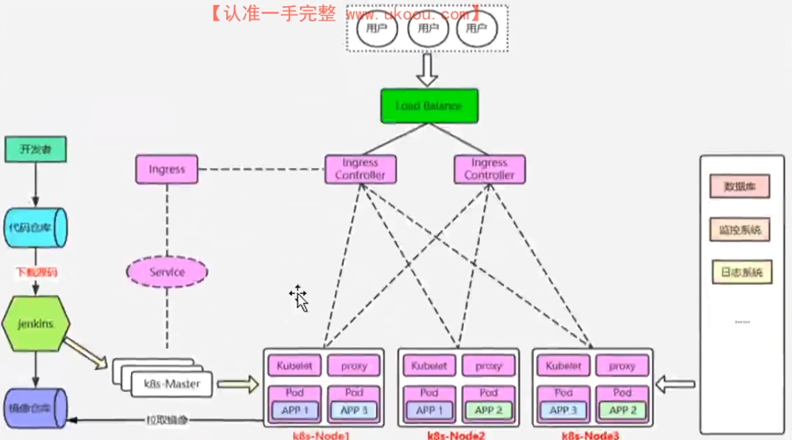
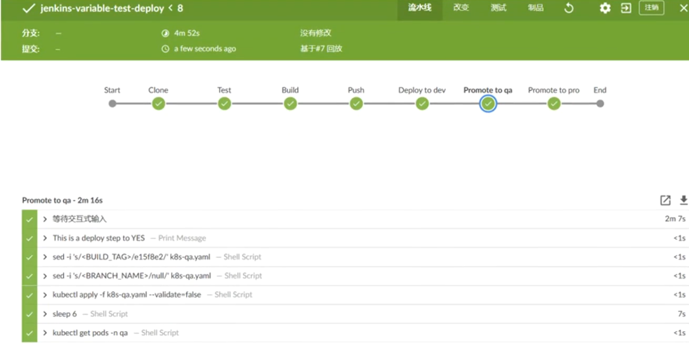

基于jenkins+k8s+harbor+git等技术助力devops在企业落地

神州泰岳k8s+devops+微服务生态体系建设与实践

开发提交代码到代码仓库，jenkins要做集成工作，主jenkins检测到有代码更新，就调用k8s的apiserver创建一个jenkins-slave的pod，让这个jenins-slave的pod去拉取代码编译打包成镜像，推送到镜像仓库，然后k8s编写资源清单文件把代码发布到开发、测试、生产环境

整个devops流程图

