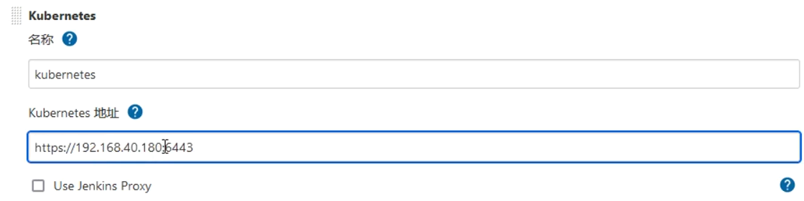
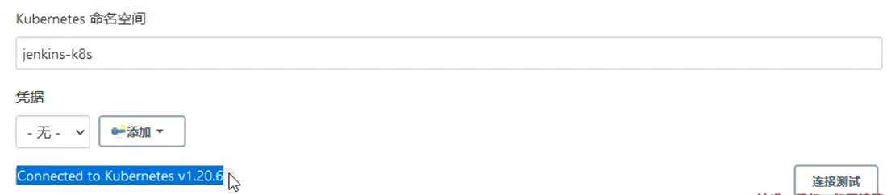
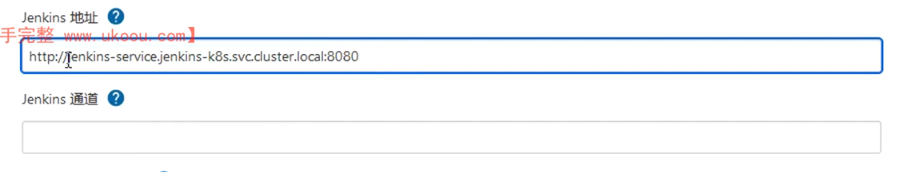
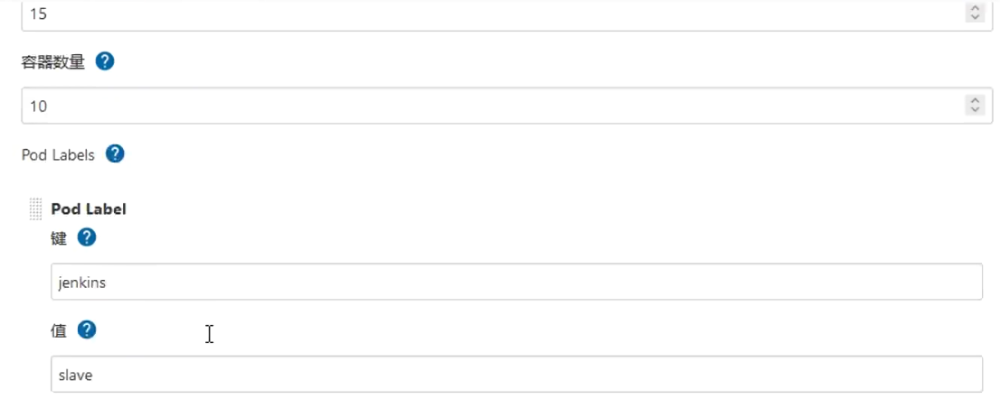
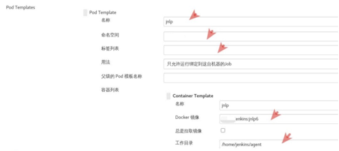
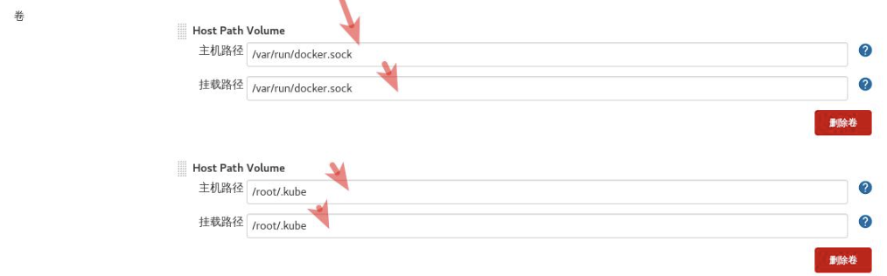

## 安装jenkins

### 配置k8s动态创建jenkins slave pod的模板

创建sa并绑定权限

```yaml
cat clusterrolebinding.yaml 

apiVersion: v1
kind: ServiceAccount
metadata:
  name: jenkins-k8s-sa
  namespace: jenkins-k8s

---

kind: ClusterRole
apiVersion: rbac.authorization.k8s.io/v1beta1
metadata:
  name: jenkins
rules:
  - apiGroups: ["extensions", "apps"]
    resources: ["deployments"]
    verbs: ["create", "delete", "get", "list", "watch", "patch", "update"]
  - apiGroups: [""]
    resources: ["services"]
    verbs: ["create", "delete", "get", "list", "watch", "patch", "update"]
  - apiGroups: [""]
    resources: ["pods"]
    verbs: ["create","delete","get","list","patch","update","watch"]
  - apiGroups: [""]
    resources: ["pods/exec"]
    verbs: ["create","delete","get","list","patch","update","watch"]
  - apiGroups: [""]
    resources: ["pods/log"]
    verbs: ["get","list","watch"]
  - apiGroups: [""]
    resources: ["secrets"]
    verbs: ["get"]

---

apiVersion: rbac.authorization.k8s.io/v1beta1
kind: ClusterRoleBinding
metadata:
  name: jenkins
roleRef:
  apiGroup: rbac.authorization.k8s.io
  kind: ClusterRole
  name: jenkins
subjects:
  - kind: ServiceAccount
    name: jenkins-k8s-sa
    namespace: jenkins-k8s
```

创建凭证


配置kubernetes

管理jenkins-->系统配置-->Cloud

配置： Kubernetes 地址、Kubernetes 命名空间、凭据、Jenkins 地址、Jenkins 通道、Pod Labels









Name: 给所加的k8s集群设置名字

Kubernetes URL： 集群的api-server出口地址，可以通过kubectl cluster info 查看

Credentials： 选择添加的凭证。

Test Connection：测试连接


配置： Pod Templates 中 名称、命名空间、标签列表、容器列表（名称、docker 镜像、工作目录）、卷（这里选择 hostpath，挂载 /var/run/docker.sock 和 /root/.kube 目录）



容器需要用到docker命令和kubectl命令



Service Account写前面创建的sa：jenkins-k8s-sa

### 添加镜像仓库凭据

系统管理-->manage credentials-->点击stores scoped to jenkins下的第一行jenkins后的全局