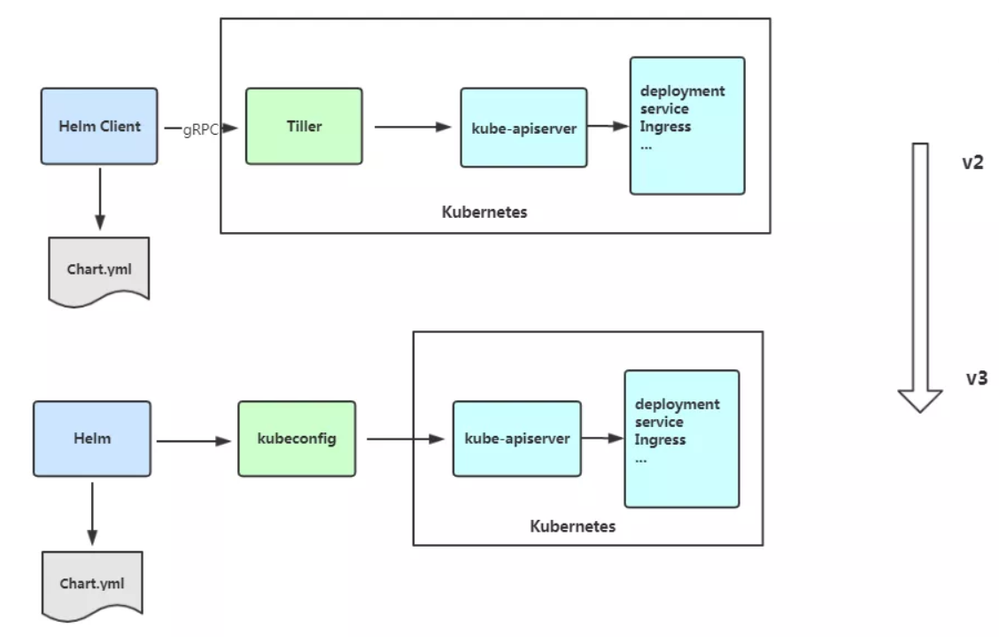
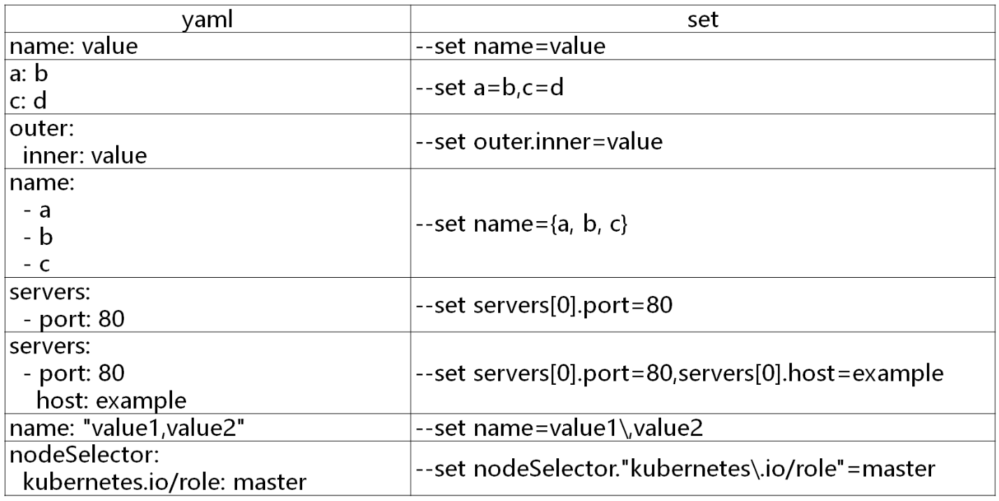

# Helm

## Helm安装

K8s 版本支持的各个 helm 版本对照表：

https://helm.sh/zh/docs/topics/version_skew/

Helm安装文档

[Helm | Installing Helm](https://helm.sh/docs/intro/install/)

Helm安装包

[Releases · helm/helm (github.com)](https://github.com/helm/helm/releases)


```
wget https://get.helm.sh/helm-v3.0.0-linux-amd64.tar.gz
tar zxvf helm-v3.0.0-linux-amd64.tar.gz 
mv linux-amd64/helm /usr/bin/
```

## 为什么用helm

K8S上的应用对象，都是由特定的资源描述组成，包括deployment、service等。都保存各自文件中或者集中写到一个配置文件。然后kubectl apply –f 部署。

如果应用只由一个或几个这样的服务组成，上面部署方式足够了。

而对于一个复杂的应用，会有很多类似上面的资源描述文件，例如微服务架构应用，组成应用的服务可能多达十个，几十个。如果有更新或回滚应用的需求，可能要修改和维护所涉及的大量资源文件，而这种组织和管理应用的方式就显得力不从心了。

## 概念

Helm 是 **kubernetes的 包管理工具** ， 相当于 linux 环境下的 yum/apg-get 命令 。


概念：

- **helm：**一个命令行客户端工具，主要用于Kubernetes应用chart的创建、打包、发布和管理。

- **Chart：**应用描述，一系列用于描述 k8s 资源相关文件的集合。

- **Release：**基于Chart的部署实体，一个 chart 被 Helm 运行后将会生成对应的一个 release；将在k8s中创建出真实运行的资源对象。

  

**Helm v3的变化：**

1. 架构变化（Tiller删除）

   

2. `Release`名称可以在不同命名空间重用

3. 支持将 Chart 推送至 Docker 镜像仓库中  

4. 使用JSONSchema验证chart values  

5. 其他

   1）为了更好地协调其他包管理者的措辞 `Helm CLI `个别更名

   ```
   helm delete` 更名为 `helm uninstall
   helm inspect` 更名为 `helm show
   helm fetch` 更名为 `helm pull
   ```

   但以上旧的命令当前仍能使用。

   2）移除了用于本地临时搭建 `Chart Repository `的 `helm serve` 命令。

   3）自动创建名称空间

   在不存在的命名空间中创建发行版时，Helm 2创建了命名空间。Helm 3遵循其他Kubernetes对象的行为，如果命名空间不存在则返回错误。

   4） 不再需要`requirements.yaml`, 依赖关系是直接在`chart.yaml`中定义。 

## 命令

| **命令**   | **描述**                                                     |
| ---------- | ------------------------------------------------------------ |
| create     | 创建一个chart并指定名字                                      |
| dependency | 管理chart依赖                                                |
| get        | 下载一个release。可用子命令：all、hooks、manifest、notes、values |
| history    | 获取release历史                                              |
| install    | 安装一个chart                                                |
| list       | 列出release                                                  |
| package    | 将chart目录打包到chart存档文件中                             |
| pull       | 从远程仓库中下载chart并解压到本地  # helm pull stable/mysql --untar |
| repo       | 添加，列出，移除，更新和索引chart仓库。可用子命令：add、index、list、remove、update |
| rollback   | 从之前版本回滚                                               |
| search     | 根据关键字搜索chart。可用子命令：hub、repo                   |
| show       | 查看chart详细信息。可用子命令：all、chart、readme、values    |
| status     | 显示已命名版本的状态                                         |
| template   | 本地呈现模板                                                 |
| uninstall  | 卸载一个release                                              |
| upgrade    | 更新一个release                                              |
| version    | 查看helm客户端版本                                           |

## 使用

### 配置chart仓库

- 微软仓库（http://mirror.azure.cn/kubernetes/charts/）这个仓库强烈推荐，基本上官网有的chart这里都有。
- 阿里云仓库（https://kubernetes.oss-cn-hangzhou.aliyuncs.com/charts  ）

```shell
#先添加常用的chart源
helm repo add stable http://mirror.azure.cn/kubernetes/charts

#查看chart源列表
helm repo list
NAME      	URL                                                   
stable      	http://mirror.azure.cn/kubernetes/charts

#查看安装的charts
helm list -n ingress-nginx
NAME         	NAMESPACE    	REVISION	UPDATED                                	STATUS  	CHART              	APP VERSION
ingress-nginx	ingress-nginx	2       	2022-02-20 22:32:33.553648308 +0800 CST	deployed	ingress-nginx-3.6.0	0.40.2

#删除存储库
helm repo remove aliyun
```

### 用chart部署一个应用

```shell
#查找chart
helm search repo
helm search repo mysql

#查看chart信息：
helm show chart stable/mysql

#安装包
helm install db stable/mysql
#调试，只打印不部署
helm install <release名称> --dry-run .

#查看发布状态：
helm status db
```

### 安装前自定义chart配置选项

上面部署的mysql并没有成功，这是因为并不是所有的chart都能按照默认配置运行成功，可能会需要一些环境依赖，例如PV。

所以我们需要自定义chart配置选项，安装过程中有两种方法可以传递配置数据：

- --values（或-f）：指定带有覆盖的YAML文件。这可以多次指定，最右边的文件优先
- --set：在命令行上指定替代。如果两者都用，--set优先级高

```shell
# cat config.yaml 
persistence:
  enabled: true
  storageClass: "managed-nfs-storage"
  accessMode: ReadWriteOnce
  size: 8Gi
mysqlUser: "k8s"
mysqlPassword: "123456"
mysqlDatabase: "k8s"

helm install db -f config.yaml stable/mysql
helm install db --set persistence.storageClass="managed-nfs-storage" stable/mysql
```

把chart包下载下来查看详情：

```shell
helm pull stable/mysql --untar #将nginx包从创库拉到当前目录
#查看结构
[root@master charts]# tree nginx/
nginx/
├── Chart.yaml #Chart的基本信息，包括chart版本，名称等
├── charts #依赖其他包的charts文件
├── README.md
├── templates #存放应用一系列 k8s 资源的 yaml 模板
│   ├── deployment.yaml
│   ├── _helpers.tpl #下划线开头，定义一些可重用的模板片断，可以被其他模板引用
│   ├── ingress.yaml
│   ├── NOTES.txt #用于介绍Chart帮助信息
│   ├── server-block-configmap.yaml
│   ├── servicemonitor.yaml
│   ├── svc.yaml
│   └── tls-secrets.yaml
└── values.yaml #存放全局变量，templates 下的文件可以调用

2 directories, 13 files
```

values yaml与set使用：



### 构建一个Helm Chart

```shell
# helm create mychart
Creating mychart
# tree mychart/
mychart/
├── charts
├── Chart.yaml
├── templates
│   ├── deployment.yaml
│   ├── _helpers.tpl
│   ├── ingress.yaml
│   ├── NOTES.txt
│   └── service.yaml
└── values.yaml
```

- Chart.yaml：用于描述这个 Chart的基本信息，包括名字、描述信息以及版本等。
- values.yaml ：用于存储 templates 目录中模板文件中用到变量的值。
- Templates： 目录里面存放所有yaml模板文件。
- charts：目录里存放这个chart依赖的所有子chart。
- NOTES.txt ：用于介绍Chart帮助信息， helm install 部署后展示给用户。例如：如何使用这个 Chart、列出缺省的设置等。
- _helpers.tpl：下划线开头,放置模板助手的地方，可以在整个 chart 中重复使用

创建Chart后，接下来就是将其部署：

```
helm install web mychart/
```

也可以打包推送的charts仓库共享别人使用。

```
# helm package mychart/
mychart-0.1.0.tgz
```

### 升级、回滚和删除

发布新版本的chart时，或者当您要更改发布的配置时，可以使用该`helm upgrade` 命令。

```
# helm upgrade --set imageTag=1.17 web mychart
# helm upgrade -f values.yaml web mychart
```

如果在发布后没有达到预期的效果，则可以使用`helm rollback `回滚到之前的版本。

例如将应用回滚到第一个版本：

```
# helm rollback web 2
```

卸载发行版，请使用以下`helm uninstall`命令：

```
# helm uninstall web
```

查看历史版本配置信息

```
# helm get --revision 1 web
```

## Helm模板

### 内置对象

- **Release**：这个对象描述了 release 本身。它里面有几个对象：

  - Release.Name：release 名称
  - Release.Time：release 的时间
  - Release.Namespace：release 的 namespace（如果清单未覆盖）
  - Release.Service：release 服务的名称（始终是 Tiller）。
  - Release.Revision：此 release 的修订版本号，从1开始累加。
  - Release.IsUpgrade：如果当前操作是升级或回滚，则将其设置为 true。
  - Release.IsInstall：如果当前操作是安装，则设置为 true。

- **Values**：从`values.yaml`文件和用户提供的文件传入模板的值。默认情况下，Values 是空的。

- Chart：`Chart.yaml`文件的内容。所有的 Chart 对象都将从该文件中获取。chart 指南中[Charts Guide](https://github.com/kubernetes/helm/blob/master/docs/charts.md#the-chartyaml-file)列出了可用字段，可以前往查看。

- Files：这提供对 chart 中所有非特殊文件的访问。虽然无法使用它来访问模板，但可以使用它来访问 chart 中的其他文件。请参阅 "访问文件" 部分。

  - Files.Get 是一个按名称获取文件的函数（.Files.Get config.ini）
  - Files.GetBytes 是将文件内容作为字节数组而不是字符串获取的函数。这对于像图片这样的东西很有用。

- Capabilities：这提供了关于 Kubernetes 集群支持的功能的信息。

  - Capabilities.APIVersions 是一组版本信息。
  - Capabilities.APIVersions.Has $version 指示是否在群集上启用版本（batch/v1）。
  - Capabilities.KubeVersion 提供了查找 Kubernetes 版本的方法。它具有以下值：Major，Minor，GitVersion，GitCommit，GitTreeState，BuildDate，GoVersion，Compiler，和 Platform。
  - Capabilities.TillerVersion 提供了查找 Tiller 版本的方法。它具有以下值：SemVer，GitCommit，和 GitTreeState。

- Template：包含有关正在执行的当前模板的信息

- Name：到当前模板的文件路径（例如 mychart/templates/mytemplate.yaml）

- BasePath：当前 chart 模板目录的路径（例如 mychart/templates）。

  

除了系统自带的变量，我们也可以**自定义模板变量**

{{- $relname := .Release.Name }}

引用自定义变量:

{{ $relname }}

### Values

**Values**对象是为chart模板提供值，这个对象的值有4个来源：

- chart包中的value.yaml
- 父chart包中的value.yaml
- 通过helm install或helm upgrade的-f或--values参数传入的自定义yaml文件
- 通过--set参数传入的值

```yaml
cat mychart/values.yaml 
replicaCount: 1
image:
  repository: nginx
  pullPolicy: IfNotPresent
  tag: "1.16"
selectorLabels: "nginx"

cat mychart/templates/deployment.yaml 
...
metadata:
  name: {{ .Release.Name }}
...
spec:
  replicas: {{ .Values.replicaCount }}
        
helm install web1 --dry-run mychart/
metadata:
  name: web1
...
spec:
  replicas: 1
```

### 表达式

模板表达式：

{{ .Release.Name }}, 通过双括号注入,小数点开头表示从最顶层命名空间引用

{{- 模版表达式 -}} ， 表示去掉表达式输出结果前面和后面的空行，去掉前面空行可以这么写{{- 模版表达式 }}, 去掉后面空格 {{ 模版表达式 -}}

### 变量和变量作用域

默认情况最左面的点( . ), 代表全局作用域，用于引用全局对象，中间的点，很像是js中对json对象中属性的引用方式。

helm全局作用域中有两个重要的全局对象：Values和Release

### 函数和管道

前面讲的value，其实就是将值传给模板引擎进行渲染，模板引擎还支持对拿到的数据进行二次处理

常用函数：http://masterminds.github.io/sprig/strings.html

• quote：将值转换为字符串，即加双引号

   ```yaml
cat mychart/values.yaml         
nodeSelector:
  gpu: true

cat mychart/templates/deployment.yaml
apiVersion: apps/v1
...
      nodeSelector:
        gpu: {{ .Values.nodeSelector.gpu | quote }}

helm install web1 --dry-run mychart/
apiVersion: apps/v1
...
      nodeSelector:
        gpu: "true"
   ```

• default：设置默认值，如果获取的值为空则为默认值( 以防止忘记定义而导致模板文件缺少字段无法创建资源，这时可以为字段定义一个默认值。)

```yaml
cat mychart/values.yaml         
namespace: ""

cat mychart/templates/deployment.yaml
apiVersion: apps/v1
...
metadata:
  namespace: {{ .Values.namespace | default "default" }}

helm install web1 --dry-run mychart/
apiVersion: apps/v1
...
metadata:
  namespace: default
```

• toYaml：引用一块YAML内容

• indent和nindent：缩进字符串,nindent用的多，一般是结合引用内容块，也就是从另外一块yaml当中将其引用过来

```yaml
#在values.yaml里写结构化数据，引用内容块，结合上面的nindent换行缩进
#像健康检查，资源配额resources，或者端口，这都是一块一块的内容，可以通过toYaml引用

cat mychart/values.yaml
resources:
  limits:
    cpu: 100m
    memory: 128Mi
  requests:
    cpu: 100m
    memory: 128Mi

cat mychart/templates/deployment.yaml
apiVersion: apps/v1
...
    spec:
      containers:
      - name: web
        resources:
          {{- toYaml .Values.resources | nindent 10 }}
          
helm install web1 --dry-run mychart/
apiVersion: apps/v1
...
    spec:
      containers:
      - name: web
        resources:
          limits:
            cpu: 100m
            memory: 128Mi
          requests:
            cpu: 100m
            memory: 128Mi
```

• 其他函数：upper、title等

### 流程控制语句

**with**主要就是用来修改 . 作用域的

适用于多次引用同个多层级里的内容

```yaml
{{ .Values.a.b.c.repository }}
{{ .Values.a.b.c.pullPolicy }}
转成：
{{- with .Values.a.b.c }}
{{ .repository }}
{{ .pullPolicy }}
{{- end }}

cat values.yaml
controller:
  image:
    repository: registry.cn-beijing.aliyuncs.com/dotbalo/controller
    tag: "v0.40.2"
    pullPolicy: IfNotPresent
    runAsUser: 101
    allowPrivilegeEscalation: true

cat templates/daemonset.yaml
      containers:
        - name: controller
          {{- with .Values.controller.image }}
          image: "{{.repository}}:{{ .tag }}{{- if (.digest) -}} @{{.digest}} {{- end -}}"
          {{- end }}
          
helm install ingress-nginx --dry-run .
      containers:
        - name: controller
          image: "registry.cn-beijing.aliyuncs.com/dotbalo/controller:v0.40.2"
```

变量赋值

```yaml
cat configmap.yaml
apiVersion: v1
kind: ConfigMap
metadata:
  name: {{ .Release.Name }}-configmap
data:
  # 由于下方的with语句引入相对命令空间,无法通过.Release引入,提前定义relname变量
  {{- $name := .Release.Name }}
  {{- with .Values.data  }}
  drink: {{ .drink }}
  release: {{ $name }}
  # 或者可以使用$符号,引入全局命名空间
  release: {{ $.Release.Name }}
  {{- end }}
  
#default：定义变量默认的值
```

**if**语法

操作符：and/eq/or/not

例子：

```yaml
#例子1
cat values.yaml
rbac:
  create: true
  scope: false
  
cat clusterrole.yaml
#如果.Values.rbac.create的值为真且.Values.rbac.scope不为真
{{- if and .Values.rbac.create (not .Values.rbac.scope) -}}
xxxx
{{- end }}

#例子2
cat values.yaml
controller:
  kind: DaemonSet
  
cat controller-daemonset.yaml
{{- if or (eq .Values.controller.kind "DaemonSet") (eq .Values.controller.kind "Both") -}}
xxx
{{- end }}
```

**range**主要用于循环遍历数组类型

语法1（遍历map类型，用于遍历键值对象）:

 ```yaml
#变量$key代表对象的属性名，$val代表属性值
 {{- range $key, $val := 键值对象 }}
 {{ $key }}: {{ $val | quote }}
 {{- end}} 

cat values.yaml
controller:
  containerPort:
    http: 80
    https: 443

cat templates/controller-daemonset.yaml
spec:
  template:
    spec:
      containers:
        - name: controller
          ports:
          {{- range $key, $value := .Values.controller.containerPort }}
            - name: {{ $key }}
              containerPort: {{ $value }}
              protocol: TCP
          {{- end }}

#渲染后
spec:
  template:
    spec:
      containers:
        - name: controller
          ports:
            - name: http
              containerPort: 80
              protocol: TCP
            - name: https
              containerPort: 443
              protocol: TCP
 ```

语法2（数组类型遍历）：

```yaml
{{- range 数组 }}
{{ . | title | quote }} # . (点)，引用数组元素值。
{{- end }}

cat values.yaml
pizzaToppings:
  - mushrooms
  - cheese
  - peppers
  - onions

cat templates/test.yaml
{{- range .Values.pizzaToppings }}
- {{ . | quote }} 
{{- end }}

渲染后：
- "Mushrooms"
- "Cheese"
- "Peppers"
- "Onions"
```

### 公共模板

在templates目录中默认**下划线开头的文件为公共模板(_helpers.tpl)**，define定义,template引入

template是语句无法在后面接管道符来对引入变量做定义,include可以

语法：

```yaml
定义模版:
{{ define "模版名字" }}
模版内容
{{ end }}

引用模版:
{{ include "模版名字" 作用域}}
```

例子：

```yaml
#公共模板
cat templates/_helpers.tpl
{{- define "ingress-nginx.labels" -}}
helm.sh/chart: {{ include "ingress-nginx.chart" . }}
{{ include "ingress-nginx.selectorLabels" . }}
{{- if .Chart.AppVersion }}
app.kubernetes.io/version: {{ .Chart.AppVersion | quote }}
{{- end }}
app.kubernetes.io/managed-by: {{ .Release.Service }}
{{- end -}}
...
{{- define "ingress-nginx.chart" -}}
#以占位符的方式，输出.Chart.Name-.Chart.Version，取前63个字符，去掉末尾的-
{{- printf "%s-%s" .Chart.Name .Chart.Version | replace "+" "_" | trunc 63 | trimSuffix "-" -}}
{{- end -}}
...
{{- define "ingress-nginx.selectorLabels" -}}
app.kubernetes.io/name: {{ include "ingress-nginx.name" . }}
app.kubernetes.io/instance: {{ .Release.Name }}
{{- end -}}
...
{{- define "ingress-nginx.name" -}}
# 如果.Values.nameOverride为空的，那么就取默认default的值 .Chart.Name
{{- default .Chart.Name .Values.nameOverride | trunc 63 | trimSuffix "-" -}}
{{- end -}}

#Chart
cat Chart.yaml
appVersion: 0.40.2
name: ingress-nginx
version: 3.6.0


cat templates/clusterrole.yaml
metadata:
  labels:
    {{- include "ingress-nginx.labels" . | nindent 4 }}

#渲染后
helm install ingress-nginx --dry-run .
metadata:
  labels:
    helm.sh/chart: ingress-nginx-3.6.0
    app.kubernetes.io/name: ingress-nginx
    app.kubernetes.io/instance: ingress-nginx
    app.kubernetes.io/version: "0.40.2"
    app.kubernetes.io/managed-by: Helm
```

## 手动编写helm模板

helm 基于java 的chart 模板开发

```shell
helm create java
cd java ;rm -fr templates/*
```

修改values.yaml

```yaml
# Default values for java. 
# This is a YAML-formatted file. 
# Declare variables to be passed into your templates. 
 
replicaCount: 1 
namespace: neighbour 
label: {} 
annotations: {} 
 
#image 
image: 
  repository: nginx 
  pullPolicy: IfNotPresent 
  imageUrl: harbor.test.com/neiour/bl-test 
  tag: "v1" 
 
imagePullSecrets: [] 
nameOverride: "" 
fullnameOverride: "" 
 
#pod更新策略 
strategy: 
  rollingUpdate: 
    maxSurge: 1 
    maxUnavailable: 0 
 
#java 应用配置参数 
jarInfo: 
  name: "/opt/neighbour-group.jar" 
  port: 10051 
  version: v1 
  args: ['-XX:+UnlockExperimentalVMOptions','-XX:+UseCGroupMemoryLimitForHeap','-XX:MaxRAMFraction=1'] 
  env: 
  - name: NACOS_CONFIG_ADDR 
    value: "nacos-headless.nacos.svc.cluster.local:8848" 
  - name: SEATA_CONFIG_ADDR 
    value: "seata-server.default.svc.cluster.local:8091" 
  - name: enable_multi_nacos 
    value: "true" 
  - name: additional_nacos_address 
    value: http://nacos-headless.nacos.svc.cluster.local:8848  
  addenv: {} 
 
# 资源限制 
resources: 
  limits: 
    cpu: 1 
    memory: 1 
  requests: 
    cpu: 100Mi 
    memory: 200Mi 
 
#探针 
readinessProbe: 
  initialDelaySeconds: 15 
  periodSeconds: 10 
 
livenessProbe: 
  initialDelaySeconds: 25 
  periodSeconds: 10 
  failureThreshold: 3 
 
#节点亲和度 
nodeSelector: {} 
##污点 
tolerations: [] 
##容忍 
affinity: {} 
 
serviceAccount: 
  # Specifies whether a service account should be created 
  create: true 
  # Annotations to add to the service account 
  annotations: {} 
  # The name of the service account to use. 
  # If not set and create is true, a name is generated using the fullname template 
  name: ""

podAnnotations: {}

podSecurityContext: {}
  # fsGroup: 2000

securityContext: {}
  # capabilities:
  #   drop:
  #   - ALL
  # readOnlyRootFilesystem: true
  # runAsNonRoot: true
  # runAsUser: 1000

service:
  type: ClusterIP
  port: 80
  protocol: TCP
  annotations: {}

ingress:
  enabled: false
  className: ""
  annotations: {}
    # kubernetes.io/ingress.class: nginx
    # kubernetes.io/tls-acme: "true"
  hosts:
    - host: chart-example.local
      paths:
        - path: /
          pathType: ImplementationSpecific
  tls: []
  #  - secretName: chart-example-tls
  #    hosts:
  #      - chart-example.local
```

编辑templates/deployment.yaml

```yaml
kind: Deployment
apiVersion: apps/v1
metadata:
  name: {{ .Release.Name }}
  namespace: {{ .Values.namespace | default "neighbour" }}
  labels:
    app: {{ .Release.Name }}
    {{- with .values.label }}
    {{ toYaml . | indent 4 }}
    {{- end }}
  annotations:
    {{ toYaml .Values.annotations | indent 4 }}
spec:
  revisionHistoryLimit: 10
  replicas: {{ .Values.replicaCount }}
  strategy: {{ toYaml .Values.strategy | nindent 4 }}
  selector:
    matchLabels:
      app: {{ .Release.Name }}
  template:
    metadata:
      annotations: {{ toYaml .Values.image.annotations | nindent 8 }}
      labels:
        app: {{ .Release.Name }}
    spec:
      containers:
      - name: {{ .Release.Name }}
        {{- with .Values.image }}
        image: {{ .imageUrl }}:{{ .tag }}
        imagePullPolicy: {{ .pullPolicy }}
        {{- end }}
        command: ["java","-Djava.security.egd=file:/dev/./urandom","-jar",{{ .Values.jarInfo.name | quote }}]
        args:
        {{- range .Values.jarInfo.args }}
        - {{ .| quote}}
        {{- end }}
        ports:
        - containerPort: {{ .Values.jarInfo.port }}
        env:
        - name: NEIGHBOUR_VERSION
          value: {{ .Values.jarInfo.version }}
        {{- with .Values.jarInfo.env }}
        {{ toYaml . | indent 8 }}
        {{- end }}
        resources: {{ toYaml .Values.resources | nindent 10 }}
        readinessProbe:
          tcpSocket:
            port: {{ .Values.jarInfo.port }}
          {{- with .Values.readinessProbe }}
{{ toYaml . |indent 10 }}
          {{- end }}
        livenessProbe:
          tcpSocket:
            port: {{ .Values.jarInfo.port }}
          {{- with .Values.livenessProbe }}
{{ toYaml . |indent 10 }}
          {{- end }}
---
apiVersion: v1
kind: Service
metadata:
  name: {{ .Release.Name }}
  annotations: {{ toYaml .Values.service.annotations | nindent 4 }}
spec:
  type: {{ .Values.service.type }}
  ports:
  - port: {{ .Values.service.port }}
    targetPort: {{ .Values.jarInfo.port }}
    {{- if and .Values.service.type (eq .Values.service.type "nodePort") }}
    nodePort: {{ .Values.service.port }}
    {{- end }}
  selector:
    app: {{ .Release.Name }}
```

## 开发helm chart包

在开发 Helm Chart 包之前我们最需要做的的就是要知道我们自己的应用应该如何使用、如何部署

现在我们开始创建一个新的 Helm Chart 包。直接使用 `helm create` 命令即可：

```shell
helm create my-ghost
tree my-ghost/
my-ghost/
├── charts
├── Chart.yaml
├── templates
│   ├── deployment.yaml
│   ├── _helpers.tpl
│   ├── hpa.yaml
│   ├── ingress.yaml
│   ├── NOTES.txt
│   ├── serviceaccount.yaml
│   ├── service.yaml
│   └── tests
│       └── test-connection.yaml
└── values.yaml
```

可以删掉下面的这些使用不到的文件：

```shell
templates/tests/test-connection.yaml
templates/serviceaccount.yaml
templates/ingress.yaml
templates/hpa.yaml
templates/NOTES.txt
```

然后修改 `templates/deployment.yaml` 模板文件：

```yaml
apiVersion: apps/v1
kind: Deployment
metadata:
  name: ghost
spec:
  selector:
    matchLabels:
      app: ghost-app
  replicas: {{ .Values.replicaCount }}
  template:
    metadata:
      labels:
        app: ghost-app
    spec:
      containers:
        - name: ghost-app
          image: {{ .Values.image }}
          ports:
            - containerPort: 2368
          env:
            - name: NODE_ENV
              value: {{ .Values.node_env | default "production" }}
            {{- if .Values.url }}
            - name: url
              value: http://{{ .Values.url }}
            {{- end }}
```

同样修改 `templates/service.yaml` 模板文件的内容：

```yaml
apiVersion: v1
kind: Service
metadata:
  name: ghost
spec:
  selector:
    app: ghost-app
  type: {{ .Values.service.type }}
  ports:
    - protocol: TCP
      targetPort: 2368
      port: {{ .Values.service.port }}
      {{- if (and (or (eq .Values.service.type "NodePort") (eq .Values.service.type "LoadBalancer")) (not (empty .Values.service.nodePort))) }}
      nodePort: {{ .Values.service.nodePort }}
      {{- else if eq .Values.service.type "ClusterIP" }}
      nodePort: null
      {{- end }}
```

现在的灵活性更大了，比如可以控制环境变量、服务的暴露方式等等。

上面我们的模板还有很多改进的地方，比如资源对象的名称我们是固定的，这样我们就没办法在同一个命名空间下面安装多个应用了，所以**一般我们也会根据 Chart 名称或者 Release 名称来替换资源对象的名称。**

前面默认创建的模板中包含一个 `_helpers.tpl` 的文件，该文件中包含一些和名称、标签相关的命名模板，我们可以直接使用

然后我们可以将 Deployment 的名称和标签替换掉：

```yaml
apiVersion: apps/v1
kind: Deployment
metadata:
  name: {{ include "my-ghost.fullname" . }}
  labels:
  {{ include "my-ghost.labels" . | indent 4 }}
spec:
  selector:
    matchLabels:
      {{ include "my-ghost.selectorLabels" . | indent 6 }}
  replicas: {{ .Values.replicaCount }}
  template:
    metadata:
      labels:
        {{ include "my-ghost.selectorLabels" . | indent 8 }}
    ...
```

同样对 Service 也做相应的改造：

```yaml
apiVersion: v1
kind: Service
metadata:
  name: {{ include "my-ghost.fullname" . }}
  labels:
    {{ include "my-ghost.labels" . | indent 4 }}
spec:
  selector:
    {{ include "my-ghost.selectorLabels" . | indent 4 }}
  ...
```

由于 Kubernetes 的版本迭代非常快，所以我们**在开发 Chart 包的时候有必要考虑到对不同版本的 Kubernetes 进行兼容**，最明显的就是 Ingress 的资源版本。Kubernetes 在 1.19 版本为 Ingress 资源引入了一个新的 API：`networking.k8s.io/v1`，这与之前的 `networking.k8s.io/v1beta1` beta 版本使用方式基本一致，但是和前面的 `extensions/v1beta1` 这个版本在使用上有很大的不同，资源对象的属性上有一定的区别，所以要兼容不同的版本，我们就需要对模板中的 Ingress 对象做兼容处理。

在 Chart 包的 `_helpers.tpl` 文件中添加几个用于判断集群版本或 API 的命名模板：

```yaml
{{/* Allow KubeVersion to be overridden. */}}
{{- define "my-ghost.kubeVersion" -}}
  {{- default .Capabilities.KubeVersion.Version .Values.kubeVersionOverride -}}
{{- end -

{{/* Get Ingress API Version */}}
{{- define "my-ghost.ingress.apiVersion" -}}
  {{- if and (.Capabilities.APIVersions.Has "networking.k8s.io/v1") (semverCompare ">= 1.19-0" (include "my-ghost.kubeVersion" .)) -}}
      {{- print "networking.k8s.io/v1" -}}
  {{- else if .Capabilities.APIVersions.Has "networking.k8s.io/v1beta1" -}}
    {{- print "networking.k8s.io/v1beta1" -}}
  {{- else -}}
    {{- print "extensions/v1beta1" -}}
  {{- end -}}
{{- end -}}

{{/* Check Ingress stability */}}
{{- define "my-ghost.ingress.isStable" -}}
  {{- eq (include "my-ghost.ingress.apiVersion" .) "networking.k8s.io/v1" -}}
{{- end -}}

{{/* Check Ingress supports pathType */}}
{{/* pathType was added to networking.k8s.io/v1beta1 in Kubernetes 1.18 */}}
{{- define "my-ghost.ingress.supportsPathType" -}}
  {{- or (eq (include "my-ghost.ingress.isStable" .) "true") (and (eq (include "my-ghost.ingress.apiVersion" .) "networking.k8s.io/v1beta1") (semverCompare ">= 1.18-0" (include "my-ghost.kubeVersion" .))) -}}
{{- end -}}
```

上面我们通过 `.Capabilities.APIVersions.Has` 来判断我们应该使用的 APIVersion，如果版本为 `networking.k8s.io/v1`，则定义为 `isStable`，此外还根据版本来判断是否需要支持 `pathType` 属性，然后在 Ingress 对象模板中就可以使用上面定义的命名模板来决定应该使用哪些属性

```yaml
{{- if .Values.ingress.enabled }}
{{- $apiIsStable := eq (include "my-ghost.ingress.isStable" .) "true" -}}
{{- $ingressSupportsPathType := eq (include "my-ghost.ingress.supportsPathType" .) "true" -}}
apiVersion: {{ include "my-ghost.ingress.apiVersion" . }}
kind: Ingress
metadata:
  name: {{ template "my-ghost.fullname" . }}
  annotations:
    nginx.ingress.kubernetes.io/ssl-redirect: "false"
    {{- if and .Values.ingress.ingressClass (not $apiIsStable) }}
    kubernetes.io/ingress.class: {{ .Values.ingress.ingressClass }}
    {{- end }}
  labels:
    {{ include "my-ghost.labels" . | indent 4 }}
spec:
  {{- if and .Values.ingress.ingressClass $apiIsStable }}
  ingressClassName: {{ .Values.ingress.ingressClass }}
  {{- end }}
  rules:
  {{- if not (empty .Values.url) }}
  - host: {{ .Values.url }}
    http:
  {{- else }}
    http:
  {{- end }}
      paths:
      - path: /
        {{- if $ingressSupportsPathType }}
        pathType: Prefix
        {{- end }}
        backend:
          {{- if $apiIsStable }}
          service:
            name: {{ include "my-ghost.fullname" . }}
            port:
              number: {{ .Values.service.port }}
          {{- else }}
          serviceName: {{ template "my-ghost.fullname" . }}
          servicePort: {{ .Values.service.port }}
          {{- end }}
{{- end }}
```

由于有的场景下面并不需要使用 Ingress 来暴露服务，所以首先我们**通过一个 `ingress.enabled` 属性来控制是否需要渲染**，然后定义了一个 `$apiIsStable` 变量，来**表示当前集群是否是稳定版本的 API，然后需要根据该变量去渲染不同的属性**，比如对于 ingressClass，如果是稳定版本的 API 则是通过 `spec.ingressClassName` 来指定，否则是通过 `kubernetes.io/ingress.class` 这个 annotations 来指定。然后这里我们在 `values.yaml` 文件中添加如下所示默认的 Ingress 的配置数据：

```yaml
ingress:
  enabled: true
  ingressClass: nginx
```

上面我们使用的 Ghost 镜像默认使用 SQLite 数据库，所以非常有必要将数据进行持久化，当然我们要将这个开关给到用户去选择，修改 `templates/deployment.yaml` 模板文件，增加 volumes 相关配置：

```yaml
spec:
  volumes:
    - name: ghost-data
    {{- if .Values.persistence.enabled }}
      persistentVolumeClaim:
        claimName: {{ .Values.persistence.existingClaim | default (include "my-ghost.fullname" .) }}
    {{- else }}
      emptyDir: {}
    {{ end }}
  containers:
    - name: ghost-app
      image: {{ .Values.image }}
      volumeMounts:
        - name: ghost-data
          mountPath: /var/lib/ghost/content
```

这里我们通过 `persistence.enabled` 来判断是否需要开启持久化数据，如果开启则需要看用户是否直接提供了一个存在的 PVC 对象，如果没有提供，则我们需要自己创建一个合适的 PVC 对象，如果不需要持久化，则直接使用 `emptyDir:{}` 即可，添加 `templates/pvc.yaml` 模板

```yaml
{{- if and .Values.persistence.enabled (not .Values.persistence.existingClaim) }}
kind: PersistentVolumeClaim
apiVersion: v1
metadata:
  name: {{ template "my-ghost.fullname" . }}
  labels:
    {{- include "my-ghost.labels" . | nindent 4 }}
spec:
  {{- if .Values.persistence.storageClass }}
  storageClassName: {{ .Values.persistence.storageClass | quote }}
  {{- end }}
  accessModes:
  - {{ .Values.persistence.accessMode | quote }}
  resources:
    requests:
      storage: {{ .Values.persistence.size | quote }}
{{- end -}}
```

其中访问模式、存储容量、StorageClass、存在的 PVC 都通过 Values 来指定，增加了灵活性。对应的 `values.yaml` 配置部分我们可以给一个默认的配置：

```yaml
## 是否使用 PVC 开启数据持久化
persistence:
  enabled: true
  ## 是否使用 storageClass，如果不适用则补配置
  # storageClass: "xxx"
  ##
  ## 如果想使用一个存在的 PVC 对象，则直接传递给下面的 existingClaim 变量
  # existingClaim: your-claim
  accessMode: ReadWriteOnce  # 访问模式
  size: 1Gi  # 存储容量
```

除了上面的这些主要的需求之外，还有一些额外的定制需求，比如用户想要配置更新策略，因为更新策略并不是一层不变的，这里和之前不太一样，我们需要用到一个新的函数 `toYaml`：

```
{{- if .Values.updateStrategy }}
strategy: {{ toYaml .Values.updateStrategy | nindent 4 }}
{{- end }}
```

意思就是我们将 `updateStrategy` 这个 Values 值转换成 YAML 格式，并保留4个空格。然后添加其他的配置，比如是否需要添加 nodeSelector、容忍、亲和性这些，这里我们都是使用 `toYaml` 函数来控制空格，如下所示：

```
{{- if .Values.nodeSelector }}
nodeSelector: {{- toYaml .Values.nodeSelector | nindent 8 }}
{{- end -}}
{{- with .Values.affinity }}
affinity: {{- toYaml . | nindent 8 }}
{{- end }}
{{- with .Values.tolerations }}
tolerations: {{- toYaml . | nindent 8 }}
{{- end }}
```

接下来当然就是镜像的配置了，如果是私有仓库还需要指定 `imagePullSecrets`：

```
{{- if .Values.image.pullSecrets }}
imagePullSecrets:
{{- range .Values.image.pullSecrets }}
- name: {{ . }}
{{- end }}
{{- end }}
containers:
- name: ghost
  image: {{ printf "%s:%s" .Values.image.name .Values.image.tag }}
  imagePullPolicy: {{ .Values.image.pullPolicy | quote }}
  ports:
  - containerPort: 2368
```

对应的 Values 值如下所示：

```
image:
  name: ghost
  tag: latest
  pullPolicy: IfNotPresent
  ## 如果是私有仓库，需要指定 imagePullSecrets
  # pullSecrets:
  #   - myRegistryKeySecretName
```

然后就是 resource 资源声明，这里我们定义一个默认的 resources 值，同样用 `toYaml` 函数来控制空格：

```
resources:
{{ toYaml .Values.resources | indent 10 }}
```

最后是健康检查部分，虽然我们之前没有做 livenessProbe，但是我们开发 Chart 模板的时候就要尽可能考虑周全一点，这里我们加上存活性和可读性、启动三个探针，并且根据 `livenessProbe.enabled` 、`readinessProbe.enabled` 以及 `startupProbe.enabled` 三个 Values 值来判断是否需要添加探针，探针对应的参数也都通过 Values 值来配置：

```
{{- if .Values.startupProbe.enabled }}
startupProbe:
  httpGet:
    path: /
    port: 2368
  initialDelaySeconds: {{ .Values.startupProbe.initialDelaySeconds }}
  periodSeconds: {{ .Values.startupProbe.periodSeconds }}
  timeoutSeconds: {{ .Values.startupProbe.timeoutSeconds }}
  failureThreshold: {{ .Values.startupProbe.failureThreshold }}
  successThreshold: {{ .Values.startupProbe.successThreshold }}
{{- end }}
{{- if .Values.livenessProbe.enabled }}
livenessProbe:
  httpGet:
    path: /
    port: 2368
  initialDelaySeconds: {{ .Values.livenessProbe.initialDelaySeconds }}
  periodSeconds: {{ .Values.livenessProbe.periodSeconds }}
  timeoutSeconds: {{ .Values.livenessProbe.timeoutSeconds }}
  failureThreshold: {{ .Values.livenessProbe.failureThreshold }}
  successThreshold: {{ .Values.livenessProbe.successThreshold }}
{{- end }}
{{- if .Values.readinessProbe.enabled }}
readinessProbe:
  httpGet:
    path: /
    port: 2368
  initialDelaySeconds: {{ .Values.readinessProbe.initialDelaySeconds }}
  periodSeconds: {{ .Values.readinessProbe.periodSeconds }}
  timeoutSeconds: {{ .Values.readinessProbe.timeoutSeconds }}
  failureThreshold: {{ .Values.readinessProbe.failureThreshold }}
  successThreshold: {{ .Values.readinessProbe.successThreshold }}
{{- end }}
```

默认的 `values.yaml` 文件如下所示：

```
replicaCount: 1
image:
  name: ghost
  tag: latest
  pullPolicy: IfNotPresent

node_env: production
url: ghost.k8s.local

service:
  type: ClusterIP
  port: 80

ingress:
  enabled: true
  ingressClass: nginx

## 是否使用 PVC 开启数据持久化
persistence:
  enabled: true
  ## 是否使用 storageClass，如果不适用则补配置
  # storageClass: "xxx"
  ##
  ## 如果想使用一个存在的 PVC 对象，则直接传递给下面的 existingClaim 变量
  # existingClaim: your-claim
  accessMode: ReadWriteOnce  # 访问模式
  size: 1Gi  # 存储容量

nodeSelector: {}

affinity: {}

tolerations: {}

resources: {}

startupProbe:
  enabled: false

livenessProbe:
  enabled: false

readinessProbe:
  enabled: false
```

现在我们再去更新 Release：

```
➜ helm upgrade --install my-ghost ./my-ghost -n default
Release "my-ghost" has been upgraded. Happy Helming!
NAME: my-ghost
LAST DEPLOYED: Thu Mar 17 16:03:02 2022
NAMESPACE: default
STATUS: deployed
REVISION: 2
TEST SUITE: None
➜ helm ls -n default
NAME            NAMESPACE       REVISION        UPDATED                                 STATUS          CHART            APP VERSION
my-ghost        default         2               2022-03-17 16:05:07.123349 +0800 CST    deployed        my-ghost-0.1.0   1.16.0
➜ kubectl get pods -n default
NAME                        READY   STATUS      RESTARTS   AGE
my-ghost-6dbc455fc7-cmm4p   1/1     Running     0          2m42s
➜ kubectl get pvc -n default
NAME       STATUS   VOLUME                                     CAPACITY   ACCESS MODES   STORAGECLASS   AGE
my-ghost   Bound    pvc-2f0b7d5a-04d4-4331-848b-af21edce673e   1Gi        RWO            nfs-client     4m59s
➜ kubectl get ingress -n default
NAME       CLASS   HOSTS             ADDRESS         PORTS   AGE
my-ghost   nginx   ghost.k8s.local   192.168.31.31   80      3h24m
```

到这里我们就基本完成了这个简单的 Helm Charts 包的开发，当然以后可能还会有新的需求，我们需要不断去迭代优化。

## 共享charts包

Helm Charts 包开发完成了，如果别人想要使用我们的包，则需要我们共享出去，我们可以通过 Chart 仓库来进行共享，Helm Charts 可以在远程存储库或本地环境/存储库中使用，远程存储库可以是公共的，如 Bitnami Charts 也可以是托管存储库，如 Google Cloud Storage 或 GitHub。为了演示方便，这里我们使用 GitHub 来托管我们的 Charts 包。

我们可以使用 GitHub Pages 来创建 Charts 仓库，GitHub 允许我们以两种不同的方式提供静态网页：

- 通过配置项目提供其 `docs/` 目录的内容
- 通过配置项目来服务特定的分支

这里我们将采用第二种方法，首先在 GitHub 上创建一个代码仓库：https://github.com/cnych/helm101，将上面我们创建的 `my-ghost` 包提交到仓库 `charts` 目录下，然后打包 chart 包：

```
➜ helm package charts/my-ghost
Successfully packaged chart and saved it to: /Users/ych/devs/workspace/yidianzhishi/course/k8strain3/content/helm/manifests/helm101/my-ghost-0.1.0.tgz
```

我们可以将打包的压缩包放到另外的目录 `repo/stable` 中去，现在仓库的结构如下所示：

```
➜ tree .
.
├── LICENSE
├── README.md
├── charts
│   └── my-ghost
│       ├── Chart.lock
│       ├── Chart.yaml
│       ├── charts
│       ├── templates
│       │   ├── _helpers.tpl
│       │   ├── deployment.yaml
│       │   ├── ingress.yaml
│       │   ├── pvc.yaml
│       │   ├── service.yaml
│       │   └── tests
│       └── values.yaml
└── repo
    └── stable
        └── my-ghost-0.1.0.tgz
```

执行如下所示命令生成 index 索引文件：

```
➜ helm repo index repo/stable --url https://raw.githubusercontent.com/cnych/helm101/main/repo/stable
```

上述命令会在 `repo/stable` 目录下面生成一个如下所示的 `index.yaml` 文件：

```
apiVersion: v1
entries:
  my-ghost:
  - apiVersion: v2
    appVersion: 1.16.0
    created: "2022-03-17T17:40:21.093654+08:00"
    description: A Helm chart for Kubernetes
    digest: f6d6308d6a6cd6357ab2b952650250c2df7b2727ce84c19150531fd72732626b
    name: my-ghost
    type: application
    urls:
    - https://raw.githubusercontent.com/cnych/helm101/main/repo/stable/my-ghost-0.1.0.tgz
    version: 0.1.0
generated: "2022-03-17T17:40:21.090371+08:00"
```

该 `index.yaml` 文件是我们通过仓库获取 Chart 包的关键。然后将代码推送到 GitHub：

```
➜ git status
On branch main
Your branch is up to date with 'origin/main'.

Untracked files:
  (use "git add <file>..." to include in what will be committed)

        charts/
        repo/

nothing added to commit but untracked files present (use "git add" to track)
➜ git commit -m "add charts and index.yaml"
[main aae1059] add charts and index.yaml
 11 files changed, 431 insertions(+)
 create mode 100644 charts/my-ghost/.helmignore
 create mode 100644 charts/my-ghost/Chart.lock
 create mode 100644 charts/my-ghost/Chart.yaml
 create mode 100644 charts/my-ghost/templates/_helpers.tpl
 create mode 100644 charts/my-ghost/templates/deployment.yaml
 create mode 100644 charts/my-ghost/templates/ingress.yaml
 create mode 100644 charts/my-ghost/templates/pvc.yaml
 create mode 100644 charts/my-ghost/templates/service.yaml
 create mode 100644 charts/my-ghost/values.yaml
 create mode 100644 repo/stable/index.yaml
 create mode 100644 repo/stable/my-ghost-0.1.0.tgz
➜ git push origin main
Enumerating objects: 18, done.
Counting objects: 100% (18/18), done.
Writing objects: 100% (18/18), 8.71 KiB | 2.18 MiB/s, done.
Total 18 (delta 0), reused 0 (delta 0)
To github.com:cnych/helm101.git
   9c389a6..aae1059  main -> main
```

接下来为该仓库设置 GitHub Pages，首先在本地新建一个 `gh-pages` 分支：

```
➜ git checkout -b gh-pages
```

只将 `repo/stable/index.yaml` 文件保留到根目录下面，其他文件忽略，然后推送到远程仓库：

```
➜ git push origin gh-pages
Enumerating objects: 2, done.
Counting objects: 100% (2/2), done.
Writing objects: 100% (2/2), 301 bytes | 301.00 KiB/s, done.
Total 2 (delta 0), reused 0 (delta 0)
remote:
remote: Create a pull request for 'gh-pages' on GitHub by visiting:
remote:      https://github.com/cnych/helm101/pull/new/gh-pages
remote:
To github.com:cnych/helm101.git
 * [new branch]      gh-pages -> gh-pages
```

现在我们就可以通过 https://cnych.github.io/helm101/ 来获取我们的 Chart 包了。

使用如下所示命令添加 repo 仓库：

```
➜ helm repo add helm101 https://cnych.github.io/helm101/

"helm101" has been added to your repositories
```

我们也可以使用 `helm search` 来搜索仓库中的 Chart 包，正常就包含上面我们的 `my-ghost` 了：

```
➜ helm search repo helm101
NAME                    CHART VERSION   APP VERSION     DESCRIPTION
helm101/my-ghost        0.1.0           1.16.0          A Helm chart for Kubernetes
```

接下来就可以正常使用 chart 包进行操作了，比如进行安装：

```
➜ helm install my-ghost helm101/
```