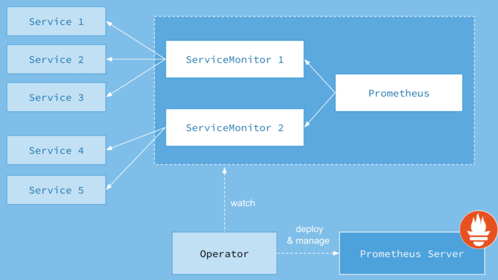

# Prometheus-Operator

Prometheus生态特别好：作为 Kubernetes 监控的事实标准，（几乎）所有 k8s 相关组件都暴露了 Prometheus 的指标接口，甚至在 k8s 生态之外，绝大部分传统中间件（比如 MySQL、Kafka、Redis、ES）也有社区提供的 Prometheus Exporter。


Prometheus Operator很好的解决了 Prometheus 不好管理的问题

```text
Operator就是contorller+CRD，举一个 Kubernetes 本身的例子：
k8s会通过controller来保证deployment对象的期望状态，比如保持几个副本数；如果我们想自己设计一些API对象，k8s提供了CRD(Custom Resource Definition)，允许我们定义新的 API 对象。但是k8s不知道怎么保证这些自定义对象的期望状态，这时就需要写对应的controller去实现。这种自定义API对象+自己写controller的模式就是Operator
```

## 安装

用Prometheus-Operator来进行Prometheus监控服务的安装，这也是我们生产中常用的安装方式。

Prometheus Operator的架构示意图：



新的对象有4种：

- Alertmanager：定义一个Alertmanager集群

  ```yaml
  apiVersion: monitoring.coreos.com/v1
  kind: Alertmanager #一个 Alertmanager 对象
  metadata:
    labels:
      alertmanager: main
    name: main
    namespace: monitoring
  spec:
    image: quay.io/prometheus/alertmanager:v0.20.0
    nodeSelector:
      kubernetes.io/os: linux
    replicas: 3 #定义该 Alertmanager 集群的节点数为 3
    securityContext:
      fsGroup: 2000
      runAsNonRoot: true
      runAsUser: 1000
    serviceAccountName: alertmanager-main
    version: v0.20.0
  ```

- Prometheus：定义一个 Prometheus “集群”，同时定义这个集群要使用哪些 `ServiceMonitor` 和 `PrometheusRule`

  ```yaml
  apiVersion: monitoring.coreos.com/v1
  kind: Prometheus
  metadata:
    labels:
      prometheus: k8s
    name: k8s
    namespace: monitoring
  spec:
    alerting:
      alertmanagers:
      - name: alertmanager-main #定义该 Prometheus 对接的 Alertmanager 集群名字为 main, 在 monitoring 这个 namespace 中;
        namespace: monitoring
        port: web
    image: quay.io/prometheus/prometheus:v2.15.2
    nodeSelector:
      kubernetes.io/os: linux
    podMonitorNamespaceSelector: {}
    podMonitorSelector: {}
    replicas: 2 #定义该 Proemtheus “集群”有两个副本，说是集群，其实 Prometheus 自身不带集群功能，这里只是起两个完全一样的 Prometheus 来避免单点故障;
    resources:
      requests:
        memory: 400Mi
    ruleSelector:
      matchLabels:
        prometheus: k8s #定义这个 Prometheus 需要使用带有 prometheus=k8s 且 role=alert-rules 标签的 PrometheusRule;
        role: alert-rules
    securityContext:
      fsGroup: 2000
      runAsNonRoot: true
      runAsUser: 1000
    serviceAccountName: prometheus-k8s
    serviceMonitorNamespaceSelector: {} #定义这些 Prometheus 在哪些 namespace 里寻找 ServiceMonitor，不声明则默认选择 Prometheus 对象本身所处的 Namespace;
    serviceMonitorSelector: {} #定义这个 Prometheus 需要使用带有哪些标签的 ServiceMonitor，不声明则会全部选中;
    version: v2.15.2
    additionalScrapeConfigs:
      name: additional-scrape-configs
      key: prometheus-additional.yaml
  ```

- ServiceMonitor：声明指定监控的服务，描述了一组被 Prometheus 监控的目标列表。该资源通过 Labels 来选取对应的 Service Endpoint，让 Prometheus Server 通过选取的 Service 来获取 Metrics 信息。

  ```yaml
  apiVersion: monitoring.coreos.com/v1
  kind: ServiceMonitor
  metadata:
    labels:
      app.kubernetes.io/name: node-exporter #这里不管是什么标签，都会被上面的Prometheus选中
      app.kubernetes.io/version: v0.18.1
    name: node-exporter
    namespace: monitoring
  spec:
    endpoints:
    - bearerTokenFile: /var/run/secrets/kubernetes.io/serviceaccount/token
      interval: 15s
      port: https
      relabelings:
      - action: replace
        regex: (.*)
        replacement: $1
        sourceLabels:
        - __meta_kubernetes_pod_node_name
        targetLabel: instance
      scheme: https
      tlsConfig:
        insecureSkipVerify: true
    jobLabel: app.kubernetes.io/name
    selector:
      matchLabels:
        app.kubernetes.io/name: node-exporter
        app.kubernetes.io/version: v0.18.1
  ```

- PrometheusRule: 定义一组 Prometheus 规则

  ```yaml
  apiVersion: monitoring.coreos.com/v1
  kind: PrometheusRule
  metadata:
    labels:
      prometheus: k8s #定义该 PrometheusRule 的 label, 显然它会被上面定义的 Prometheus 选中;
      role: alert-rules
    name: prometheus-k8s-rules
    namespace: monitoring
  spec:
    groups:
    - name: node-exporter.rules
      rules: #定义了一组规则，
      - expr: |
          count without (cpu) (
            count without (mode) (
              node_cpu_seconds_total{job="node-exporter"}
            )
          )
        record: instance:node_num_cpu:sum
  ```

串在一起，它们的关系如下:


地址：https://github.com/prometheus-operator/kube-prometheus

下载：

```shell
git clone -b release-0.5 --single-branch https://github.com/prometheus-operator/kube-prometheus.git
```

安装operator：

```shell
cd kube-prometheus/manifests/setup/
kubectl apply -f .

[root@k8s-master01 manifests]# kubectl get po -n monitoring
NAME                                   READY   STATUS    RESTARTS   AGE
prometheus-operator-6478d8fc6d-mqlf9   2/2     Running   0          2m43s

kubectl get svc -n monitoring
```

安装Prometheus：

```shell
cd ..
kubectl apply -f .

[root@k8s-master01 manifests]# kubectl get po -n monitoring
NAME                                   READY   STATUS    RESTARTS   AGE
alertmanager-main-0                    2/2     Running   0          28m
alertmanager-main-1                    2/2     Running   0          28m
alertmanager-main-2                    2/2     Running   0          28m
grafana-5d9d5f67c4-wrblp               1/1     Running   0          28m
kube-state-metrics-7fddf8779f-pxmsh    3/3     Running   0          28m
node-exporter-84l65                    2/2     Running   0          28m
node-exporter-9zpq8                    2/2     Running   0          28m
node-exporter-flppr                    2/2     Running   0          28m
node-exporter-pdrvv                    2/2     Running   0          28m
node-exporter-qrm4h                    2/2     Running   0          28m
prometheus-adapter-cb548cdbf-s7dcj     1/1     Running   0          28m
prometheus-k8s-0                       3/3     Running   1          28m
prometheus-k8s-1                       3/3     Running   0          28m
prometheus-operator-6478d8fc6d-mqlf9   2/2     Running   0          126m
```

创建ingress（之前已经部署了ingress-nginx）

```yaml
apiVersion: networking.k8s.io/v1
kind: Ingress
metadata:
  name: prom-ingresses
  namespace: monitoring
spec:
  ingressClassName: nginx
  rules:
  - host: alert.test.com
    http:
      paths:
      - path: /
        pathType: Prefix
        backend:
          service:
            name: alertmanager-main
            port: 
              number: 9093
  - host: grafana.test.com
    http:
      paths:
      - path: /
        pathType: Prefix
        backend:
          service:
            name: grafana
            port: 
              number: 3000
  - host: prom.test.com
    http:
      paths:
      - path: /
        pathType: Prefix
        backend:
          service:
            name: prometheus-k8s
            port: 
              number: 9090
```

把域名解析到ingress-nginx部署的节点的ip地址

## Prometheus Operator监控配置

### 容器相关的性能指标数据—cAdvisor

目前cAdvisor集成到了kubelet组件内，可以在kubernetes集群中每个启动了kubelet的节点使用cAdvisor提供的metrics接口获取该节点所有容器相关的性能指标数据。

在1.7.3以后版本中cadvisor的metrics被从kubelet的metrics独立出来了，在prometheus采集的时候变成两个scrape的job。

配置Prometheus来定期拉取cAdvisor的metrics：

```yaml
apiVersion: monitoring.coreos.com/v1
kind: ServiceMonitor
metadata:
  labels:
    k8s-app: kubelet
  name: kubelet
  namespace: monitoring
spec:
  endpoints:
  - bearerTokenFile: /var/run/secrets/kubernetes.io/serviceaccount/token
    honorLabels: true
    interval: 30s
    metricRelabelings:
    - action: drop
      regex: container_(network_tcp_usage_total|network_udp_usage_total|tasks_state|cpu_load_average_10s)
      sourceLabels:
      - __name__
    path: /metrics/cadvisor
    port: https-metrics
    relabelings:
    - sourceLabels:
      - __metrics_path__
      targetLabel: metrics_path
    scheme: https
    tlsConfig:
      insecureSkipVerify: true
  jobLabel: k8s-app
  namespaceSelector:
    matchNames:
    - kube-system
  selector:
    matchLabels:
      k8s-app: kubelet  
```

### 主机节点性能指标数据-----node-exporter

通过Kubernetes的DeamonSet可以在各个主机节点上部署有且仅有一个NodeExporter实例，实现对主机性能指标数据的监控

配置Prometheus来定期拉取node-exporter的metrics：

```yaml
apiVersion: monitoring.coreos.com/v1
kind: ServiceMonitor
metadata:
  labels:
    app.kubernetes.io/name: node-exporter
    app.kubernetes.io/version: v0.18.1
  name: node-exporter
  namespace: monitoring
spec:
  endpoints:
  - bearerTokenFile: /var/run/secrets/kubernetes.io/serviceaccount/token
    interval: 15s
    port: https
    relabelings:
    - action: replace
      regex: (.*)
      replacement: $1
      sourceLabels:
      - __meta_kubernetes_pod_node_name
      targetLabel: instance
    scheme: https
    tlsConfig:
      insecureSkipVerify: true
  jobLabel: app.kubernetes.io/name
  selector:
    matchLabels:
      app.kubernetes.io/name: node-exporter
      app.kubernetes.io/version: v0.18.1
```

### 源对象（Deployment、Pod等）的状态-----kube-state-metrics

kube-state-metrics是一个简单的服务，它监听Kubernetes API服务器并生成有关对象状态的指标。

配置Prometheus来定期拉取kube-state-metrics的metrics：

```yaml
apiVersion: monitoring.coreos.com/v1
kind: ServiceMonitor
metadata:
  labels:
    app.kubernetes.io/name: kube-state-metrics
    app.kubernetes.io/version: 1.9.5
  name: kube-state-metrics
  namespace: monitoring
spec:
  endpoints:
  - bearerTokenFile: /var/run/secrets/kubernetes.io/serviceaccount/token
    honorLabels: true
    interval: 30s
    port: https-main
    relabelings:
    - action: labeldrop
      regex: (pod|service|endpoint|namespace)
    scheme: https
    scrapeTimeout: 30s
    tlsConfig:
      insecureSkipVerify: true
  - bearerTokenFile: /var/run/secrets/kubernetes.io/serviceaccount/token
    interval: 30s
    port: https-self
    scheme: https
    tlsConfig:
      insecureSkipVerify: true
  jobLabel: app.kubernetes.io/name
  selector:
    matchLabels:
      app.kubernetes.io/name: kube-state-metrics
```

### 监控有metrics接口的应用

这种应用监控起来比较简单，可以先创建endpoint和service（如果没有的话），然后通过servicemonitor来监控到应用

Prometheus Operator 引入 ServiceMonitor 对象，它发现 Endpoints 对象并配置 Prometheus 去监控这些 Pods

#### 监控ingress-nginx

前面ingress-nginx服务是以daemonset形式部署的，并且映射了自己的端口到宿主机上，那么我可以直接用pod运行NODE上的IP来看下metrics

```shell
kubectl get service nginx-ingress-lb -n ingress-nginx --show-labels
NAME               TYPE        CLUSTER-IP      EXTERNAL-IP   PORT(S)                    AGE   LABELS
nginx-ingress-lb   ClusterIP   10.98.244.237   <none>        80/TCP,443/TCP,10254/TCP   18d   app=ingress-nginx
kubectl get ep nginx-ingress-lb -n ingress-nginx
NAME               ENDPOINTS                                                      AGE
nginx-ingress-lb   192.168.101.149:10254,192.168.101.149:443,192.168.101.149:80   18d

curl 192.168.101.149:10254/metrics
```

创建servicemonitor配置让Prometheus发现ingress-nginx的metrics

```yaml
cd k8s-apps/kube-prometheus/manifests
cp prometheus-serviceMonitor.yaml prometheus-serviceMonitoringress.yaml

# vim prometheus-serviceMonitoringress.yaml
apiVersion: monitoring.coreos.com/v1
kind: ServiceMonitor
metadata:
  labels:
    app: ingress-nginx
  name: nginx-ingress-scraping
  namespace: ingress-nginx
spec:
  endpoints:
  - interval: 30s
    path: /metrics
    port: metrics
  jobLabel: app
  namespaceSelector:
    matchNames:
    - ingress-nginx #目标服务的namespaces
  selector:
    matchLabels:
      app: ingress-nginx #目标服务的labels
      
kubectl apply -f prometheus-serviceMonitoringress.yaml 

# kubectl -n ingress-nginx get servicemonitors
NAME                     AGE
nginx-ingress-scraping   8s
```

但是指标一直没收集上来，看看proemtheus服务的日志，发现报错如下：

```shell
kubectl -n monitoring logs prometheus-k8s-0 -c prometheus |grep error
level=error ts=2022-05-14T07:29:26.404Z caller=klog.go:94 component=k8s_client_runtime func=ErrorDepth msg="/app/discovery/kubernetes/kubernetes.go:261: Failed to list *v1.Endpoints: endpoints is forbidden: User \"system:serviceaccount:monitoring:prometheus-k8s\" cannot list resource \"endpoints\" in API group \"\" in the namespace \"ingress-nginx\""

#因为我们用servicemonitor资源进行监听发现，该资源属于prometheus-operator的，所以我们变相使用的是prometheus-operator的用户和权限，通过报错可以发现prometheus-k8s用户权限不够
```

需要修改prometheus-k8s的clusterrole

```
#   kubectl edit clusterrole prometheus-k8s
#------ 原始的rules -------
rules:
- apiGroups:
  - ""
  resources:
  - nodes/metrics
  verbs:
  - get
- nonResourceURLs:
  - /metrics
  verbs:
  - get
#---------------------------

apiVersion: rbac.authorization.k8s.io/v1
kind: ClusterRole
metadata:
  name: prometheus-k8s
rules:
- apiGroups:
  - ""
  resources:
  - nodes
  - services
  - endpoints
  - pods
  - nodes/proxy
  verbs:
  - get
  - list
  - watch
- apiGroups:
  - ""
  resources:
  - configmaps
  - nodes/metrics
  verbs:
  - get
- nonResourceURLs:
  - /metrics
  verbs:
  - get
```

再到prometheus UI上看下，发现已经有了

```
ingress-nginx/nginx-ingress-scraping/0 (1/1 up) 
```

#### 监控二进制部署的ETCD集群

案例目的：监控非K8s集群服务

查看etcd暴露的哪些指标：

```
curl --cacert /etc/kubernetes/ssl/ca.pem --cert /etc/etcd/ssl/etcd.pem  --key /etc/etcd/ssl/etcd-key.pem https://10.0.1.201:2379/metrics
```

开始进行配置使ETCD能被prometheus发现并监控

```shell
# 首先把ETCD的证书创建为secret
kubectl -n monitoring create secret generic etcd-certs --from-file=/etc/etcd/ssl/etcd.pem   --from-file=/etc/etcd/ssl/etcd-key.pem   --from-file=/etc/kubernetes/ssl/ca.pem

# 接着在prometheus里面引用这个secrets
kubectl -n monitoring edit prometheus k8s
spec:
...
  secrets:
  - etcd-certs
  
# 保存退出后，prometheus会自动重启服务pod以加载这个secret配置，过一会，我们进pod来查看下是不是已经加载到ETCD的证书了
kubectl -n monitoring exec -it prometheus-k8s-0 -c prometheus  -- sh 
/prometheus $ ls /etc/prometheus/secrets/etcd-certs/
ca.pem        etcd-key.pem  etcd.pem
```

创建service、endpoints以及ServiceMonitor的yaml配置

```yaml
# vim prometheus-etcd.yaml 
apiVersion: v1
kind: Service
metadata:
  name: etcd-k8s
  namespace: monitoring
  labels:
    k8s-app: etcd
spec:
  type: ClusterIP
  clusterIP: None
  ports:
  - name: api
    port: 2379
    protocol: TCP
---
apiVersion: v1
kind: Endpoints
metadata:
  name: etcd-k8s
  namespace: monitoring
  labels:
    k8s-app: etcd
subsets:
- addresses:
  - ip: 10.0.1.201
  - ip: 10.0.1.202
  - ip: 10.0.1.203
  ports:
  - name: api
    port: 2379
    protocol: TCP
---
apiVersion: monitoring.coreos.com/v1
kind: ServiceMonitor
metadata:
  name: etcd-k8s
  namespace: monitoring
  labels:
    k8s-app: etcd-k8s
spec:
  jobLabel: k8s-app
  endpoints:
  - port: api
    interval: 30s
    scheme: https
    tlsConfig:
      caFile: /etc/prometheus/secrets/etcd-certs/ca.pem
      certFile: /etc/prometheus/secrets/etcd-certs/etcd.pem
      keyFile: /etc/prometheus/secrets/etcd-certs/etcd-key.pem
      #use insecureSkipVerify only if you cannot use a Subject Alternative Name
      insecureSkipVerify: true 
  selector:
    matchLabels:
      k8s-app: etcd
  namespaceSelector:
    matchNames:
    - monitoring
```

过一会，就可以在prometheus UI上面看到ETCD集群被监控了

```
monitoring/etcd-k8s/0 (3/3 up) 
```

接下来我们用grafana来展示被监控的ETCD指标

```
1. 在grafana官网模板中心搜索etcd，下载这个json格式的模板文件
https://grafana.com/dashboards/3070

2.然后打开自己先部署的grafana首页，
点击左边菜单栏四个小正方形方块HOME --- Manage
再点击右边 Import dashboard --- 
点击Upload .json File 按钮，上传上面下载好的json文件 etcd_rev3.json，
然后在prometheus选择数据来源
点击Import，即可显示etcd集群的图形监控信息
```

### Exporter

像mysql、redis这种应用没有metrics接口该怎么监控，可以通过exporter暴露metrics接口，然后再通过servicemonitor监控发现

#### 监控redis

redis应用

```shell
kubectl get po -n text --show-labels
NAME                                 READY   STATUS    RESTARTS   AGE    LABELS
redis-single-node-754c46848c-xg6zg   1/1     Running   0          101m   app=redis-single-node,pod-template-hash=754c46848c
```

创建redis-exporter deploy

```yaml
apiVersion: apps/v1
kind: Deployment
metadata:
  labels:
    app: redis-ec-exporter
    k8s.kuboard.cn/name: redis-ec-exporter
  name: redis-ec-exporter
  namespace: monitoring
spec:
  progressDeadlineSeconds: 600
  replicas: 1
  revisionHistoryLimit: 10
  selector:
    matchLabels:
      app: redis-ec-exporter
  strategy:
    rollingUpdate:
      maxSurge: 25%
      maxUnavailable: 25%
    type: RollingUpdate
  template:
    metadata:
      creationTimestamp: null
      labels:
        app: redis-ec-exporter
    spec:
      containers:
      - args:
        - -redis.addr
        - redis://redis-single-node:6379
        image: oliver006/redis_exporter:latest
        imagePullPolicy: ifNotPresent
        name: redis-ec-exporter
        ports:
        - containerPort: 9121
          name: http
          protocol: TCP
        resources: {}
        terminationMessagePath: /dev/termination-log
        terminationMessagePolicy: File
      dnsPolicy: ClusterFirst
      restartPolicy: Always
      schedulerName: default-scheduler
      securityContext: {}
      terminationGracePeriodSeconds: 30
```

创建redis-exporter service

```yaml
apiVersion: v1
kind: Service
metadata:
  name: redis-ec-exporter
  namespace: monitoring
  labels:
    app: redis-ec-exporter
    k8s.kuboard.cn/name: redis-ec-exporter
spec:
  type: ClusterIP
  ports:
  - port: 9121
    protocol: TCP
    name: http
  selector:
    app: redis-ec-exporter
```

创建servicemonitor

```yaml
apiVersion: monitoring.coreos.com/v1
kind: ServiceMonitor
metadata:
  labels:
    app: redis-ec-exporter
  name: redis-ec-exporter
  namespace: monitoring
spec:
  endpoints:
  - interval: 30s
    port: http
  jobLabel: app
  namespaceSelector:
    matchNames:
    - monitoring
  selector:
    matchLabels:
      app: redis-ec-exporter
```

再到prometheus UI上看下，发现已经有了

```shell
monitoring/redis-ec-exporter/0 (1/1 up)
```

### 通过blackbox-exporter采集应用的网络性能数据

 黑盒监控，主要**关注的现象**，一般都是正在发生的东西，例如出现一个告警，某文件系统不可写入，那么这种监控就是**站在用户的角度**能看到的监控，重点在于能对正在发生的故障进行告警。

白盒监控，主要**关注的是原因**，也就是**系统内部暴露的一些指标**，例如redis的info中显示redis slave down，这个就是redis info显示的一个内部的指标，重点在于原因，可能是在黑盒监控中看到redis down，而查看内部信息的时候，显示redis port is refused connection。


Blackbox Exporter 是 Prometheus 社区提供的官方黑盒监控解决方案，其允许用户通过：HTTP、HTTPS、DNS、TCP 以及 ICMP 的方式对网络进行探测。


下载blackbox.yaml:

https://github.com/prometheus/blackbox_exporter

创建configmap

```yaml
kubectl create cm blackbox-conf --from-file=blackbox.yaml -n monitoring
```

创建blackbox-exporter这个deployment

```yaml
apiVersion: v1
kind: Service
metadata:
  name: blackbox-exporter
  namespace: monitoring
spec:
  ports:
  - name: web
    port: 9115
    protocol: TCP
    targetPort: 9115
  selector:
    app: blackbox-exporter
  type: ClusterIP
---
apiVersion: apps/v1
kind: Deployment
metadata:
  labels:
    app: blackbox-exporter
  name: blackbox-exporter
  namespace: monitoring
spec:
  progressDeadlineSeconds: 600
  replicas: 1
  revisionHistoryLimit: 10
  selector:
    matchLabels:
      app: blackbox-exporter
  strategy:
    rollingUpdate:
      maxSurge: 1
      maxUnavailable: 0
    type: RollingUpdate
  template:
    metadata:
      creationTimestamp: null
      labels:
        app: blackbox-exporter
    spec:
      containers:
      - image: prom/blackbox-exporter:master
        args:
        - --config.file=/mnt/blackbox.yaml
        env:
        - name: TZ
          value: Asia/Shanghai
        - name: LANG
          value: C.UTF-8
        imagePullPolicy: IfNotPresent
        name: blackbox-exporter
        ports:
        - containerPort: 9115
          name: web
          protocol: TCP
        terminationMessagePath: /dev/termination-log
        terminationMessagePolicy: File
        volumeMounts:
        - mountPath: /usr/share/zoneinfo/Asia/Shanghai
          name: tz-config
        - mountPath: /etc/localtime
          name: tz-config
        - mountPath: /etc/timezone
          name: timezone
        - mountPath: /mnt
          name: config
      dnsPolicy: ClusterFirst
      restartPolicy: Always
      schedulerName: default-scheduler
      securityContext: {}
      terminationGracePeriodSeconds: 30
      volumes:
      - hostPath:
          path: /usr/share/zoneinfo/Asia/Shanghai
        name: tz-config
      - hostPath:
          path: /etc/timezone
        name: timezone
      - configMap:
          defaultMode: 420
          name: blackbox-conf
        name: configs
```

返回针对 baidu.com 的 HTTP 探测的指标

```shell
kubectl get svc blackbox-exporter -n monitoring
NAME                TYPE        CLUSTER-IP    EXTERNAL-IP   PORT(S)    AGE
blackbox-exporter   ClusterIP   10.96.47.27   <none>        9115/TCP   7d2h

curl "http://10.96.47.27:9115/probe?target=baidu.com&module=http_2xx"
```

由于集群是用的Prometheus Operator方式部署的，所以就以additional的形式添加配置。

用传统方式写一个配置文件

```yaml
vim prometheus-additional.yaml

- job_name: 'blackbox'
  metrics_path: /probe
  params:
    module: [http_2xx]  # Look for a HTTP 200 response.
  static_configs:
    - targets:
      - http://prometheus.io    # Target to probe with http.
      - https://prometheus.io   # Target to probe with https.
      - https://www.baidu.com # Target to probe with http on port 8080.
  relabel_configs:
    - source_labels: [__address__]
      target_label: __param_target
    - source_labels: [__param_target]
      target_label: instance
    - target_label: __address__
      replacement: blackbox-exporter:9115  # The blackbox exporter's real hostname:port.
```

生成一个secret文件并创建secret

```shell
kubectl create secret generic additional-scrape-configs --from-file=prometheus-additional.yaml --dry-run -oyaml > additional-scrape-configs.yaml

kubectl apply -f additional-scrape-configs.yaml -n monitoring
```

修改prometheus-prometheus.yaml文件

```yaml
apiVersion: monitoring.coreos.com/v1
kind: Prometheus
metadata:
  labels:
    prometheus: k8s
  name: k8s
  namespace: monitoring
spec:
  alerting:
    alertmanagers:
    - name: alertmanager-main
      namespace: monitoring
      port: web
  image: quay.io/prometheus/prometheus:v2.15.2
  nodeSelector:
    kubernetes.io/os: linux
  podMonitorNamespaceSelector: {}
  podMonitorSelector: {}
  replicas: 2
  resources:
    requests:
      memory: 400Mi
  ruleSelector:
    matchLabels:
      prometheus: k8s
      role: alert-rules
  securityContext:
    fsGroup: 2000
    runAsNonRoot: true
    runAsUser: 1000
  serviceAccountName: prometheus-k8s
  serviceMonitorNamespaceSelector: {}
  serviceMonitorSelector: {}
  version: v2.15.2
  #添加这几行内容
  additionalScrapeConfigs:
    name: additional-scrape-configs
    key: prometheus-additional.yaml
```

reload Prometheus

```shell
kubectl get svc -n monitoring -l prometheus=k8s
NAME             TYPE        CLUSTER-IP       EXTERNAL-IP   PORT(S)    AGE
prometheus-k8s   ClusterIP   10.107.186.102   <none>        9090/TCP   56d

curl -X POST "http://10.107.186.102:9090/-/reload"
```

访问http://prom.test.com/config，搜索blackbox可以看到配置文件已经加载过来了

到grafana官网下载模板：https://grafana.com/api/dashboards/5345/revisions/3/download

把模板导入grafana


## Prometheus传统配置监控

### cadvisor监控指标的采集

`cAdvisor` 的指标访问路径为 `https://ip/api/v1/nodes/<node_name>/proxy/metrics` ，

利用服务发现：

```yaml
    - job_name: 'kubernetes-sd-cadvisor'
      kubernetes_sd_configs:
        - role: node
      scheme: https
      tls_config:
        ca_file: /var/run/secrets/kubernetes.io/serviceaccount/ca.crt
        insecure_skip_verify: true
      bearer_token_file: /var/run/secrets/kubernetes.io/serviceaccount/token
      relabel_configs:
      - target_label: __address__
        replacement: 10.96.0.1
      - source_labels: [__meta_kubernetes_node_name]
        regex: (.+)
        target_label: __metrics_path__
        replacement: /api/v1/nodes/${1}/proxy/metrics/cadvisor
```

### 集群Service服务的监控指标采集

如果有100个服务，每个服务是不是都需要手动添加配置？

```yaml
    - job_name: 'kubernetes-sd-endpoints'
      kubernetes_sd_configs:
        - role: endpoints
```

实际上endpoint这个类型，目标是去抓取整个集群中所有的命名空间的Endpoint列表，然后使用默认的/metrics进行数据抓取

但是实际上并不是每个服务都已经实现了/metrics监控的，也不是每个实现了/metrics接口的服务都需要注册到Prometheus中，因此，我们需要一种方式对需要采集的服务实现自主可控。这就需要利用relabeling中的keep功能。


## 告警

### 配置文件

alertmanager.yaml

```yaml
# global块配置下的配置选项在本配置文件内的所有配置项下可见
global:
  # 在Alertmanager内管理的每一条告警均有两种状态: "resolved"或者"firing". 在altermanager首次发送告警通知后, 该告警会一直处于firing状态,设置resolve_timeout可以指定处于firing状态的告警间隔多长时间会被设置为resolved状态, 在设置为resolved状态的告警后,altermanager不会再发送firing的告警通知.
  resolve_timeout: 1h

  # 邮件告警配置
  smtp_smarthost: 'smtp.exmail.qq.com:25'
  smtp_from: 'dukuan@xxx.com'
  smtp_auth_username: 'dukuan@xxx.com'
  smtp_auth_password: 'DKxxx'
  # HipChat告警配置
  # hipchat_auth_token: '123456789'
  # hipchat_auth_url: 'https://hipchat.foobar.org/'
  # wechat
  wechat_api_url: 'https://qyapi.weixin.qq.com/cgi-bin/'
  wechat_api_secret: 'JJ'
  wechat_api_corp_id: 'ww'

  # 告警通知模板
templates:
- '/etc/alertmanager/config/*.tmpl'

# route: 根路由,该模块用于该根路由下的节点及子路由routes的定义. 子树节点如果不对相关配置进行配置，则默认会从父路由树继承该配置选项。每一条告警都要进入route，即要求配置选项group_by的值能够匹配到每一条告警的至少一个labelkey(即通过POST请求向altermanager服务接口所发送告警的labels项所携带的<labelname>)，告警进入到route后，将会根据子路由routes节点中的配置项match_re或者match来确定能进入该子路由节点的告警(由在match_re或者match下配置的labelkey: labelvalue是否为告警labels的子集决定，是的话则会进入该子路由节点，否则不能接收进入该子路由节点).
route:
  # 例如所有labelkey:labelvalue含cluster=A及altertname=LatencyHigh labelkey的告警都会被归入单一组中
  group_by: ['job', 'altername', 'cluster', 'service','severity']
  # 若一组新的告警产生，则会等group_wait后再发送通知，该功能主要用于当告警在很短时间内接连产生时，在group_wait内合并为单一的告警后再发送
  group_wait: 30s
  # 再次告警时间间隔
  group_interval: 5m
  # 如果一条告警通知已成功发送，且在间隔repeat_interval后，该告警仍然未被设置为resolved，则会再次发送该告警通知
  repeat_interval: 12h
  # 默认告警通知接收者，凡未被匹配进入各子路由节点的告警均被发送到此接收者
  receiver: 'wechat'
  # 上述route的配置会被传递给子路由节点，子路由节点进行重新配置才会被覆盖

  # 子路由树
  routes:
  # 该配置选项使用正则表达式来匹配告警的labels，以确定能否进入该子路由树
  # match_re和match均用于匹配labelkey为service,labelvalue分别为指定值的告警，被匹配到的告警会将通知发送到对应的receiver
  - match_re:
      service: ^(foo1|foo2|baz)$
    receiver: 'wechat'
    # 在带有service标签的告警同时有severity标签时，他可以有自己的子路由，同时具有severity != critical的告警则被发送给接收者team-ops-mails,对severity == critical的告警则被发送到对应的接收者即team-ops-pager
    routes:
    - match:
        severity: critical
      receiver: 'wechat'
  # 比如关于数据库服务的告警，如果子路由没有匹配到相应的owner标签，则都默认由team-DB-pager接收
  - match:
      service: database
    receiver: 'wechat'
  # 我们也可以先根据标签service:database将数据库服务告警过滤出来，然后进一步将所有同时带labelkey为database
  - match:
      severity: critical
    receiver: 'wechat'
# 抑制规则，当出现critical告警时 忽略warning
inhibit_rules:
- source_match:
    severity: 'critical'
  target_match:
    severity: 'warning'
  # Apply inhibition if the alertname is the same.
  #   equal: ['alertname', 'cluster', 'service']
  #
# 收件人配置
receivers:
- name: 'team-ops-mails'
  email_configs:
  - to: 'dukuan@xxx.com'
- name: 'wechat'
  wechat_configs:
  - send_resolved: true
    corp_id: 'ww'
    api_secret: 'JJ'
    to_tag: '1'
    agent_id: '1000002'
    api_url: 'https://qyapi.weixin.qq.com/cgi-bin/'
    message: '{{ template "wechat.default.message" . }}'
#- name: 'team-X-pager'
#  email_configs:
#  - to: 'team-X+alerts-critical@example.org'
#  pagerduty_configs:
#  - service_key: <team-X-key>
#
#- name: 'team-Y-mails'
#  email_configs:
#  - to: 'team-Y+alerts@example.org'
#
#- name: 'team-Y-pager'
#  pagerduty_configs:
#  - service_key: <team-Y-key>
#
#- name: 'team-DB-pager'
#  pagerduty_configs:
#  - service_key: <team-DB-key>
#  
#- name: 'team-X-hipchat'
#  hipchat_configs:
#  - auth_token: <auth_token>
#    room_id: 85
#    message_format: html
#    notify: true 
```

### 使用邮箱告警

https://prometheus.io/docs/alerting/latest/configuration/#email_config

```yaml
apiVersion: v1
kind: Secret
metadata:
  name: alertmanager-main
  namespace: monitoring
stringData:
  alertmanager.yaml: |-
    "global":
      "resolve_timeout": "5m"
      smtp_smarthost: 'smtp@163.com:465'
      smtp_from: 'kubernetes_guide@163.com'
      smtp_auth_username: 'kubernetes_guide@163.com'
      smtp_auth_password: 'DKxxx'
    "inhibit_rules":
    - "equal":
      - "namespace"
      - "alertname"
      "source_match":
        "severity": "critical"
      "target_match_re":
        "severity": "warning|info"
    - "equal":
      - "namespace"
      - "alertname"
      "source_match":
        "severity": "warning"
      "target_match_re":
        "severity": "info"
    "receivers":
    - "name": "Default"
      "email_configs":
      - to: 'kubernetes_guide@163.com'
        send_resolved: true
    - "name": "Watchdog"
      "email_configs":
      - to: 'kubernetes_guide@163.com'
        send_resolved: true
    - "name": "Critical"
      "email_configs":
      - to: 'kubernetes_guide@163.com'
        send_resolved: true
    "route":
      "group_by":
      - "namespace"
      "group_interval": "5m"
      "group_wait": "30s"
      "receiver": "Default"
      "repeat_interval": "12h"
      "routes":
      - "match":
          "alertname": "Watchdog"
        "receiver": "Watchdog"
      - "match":
          "severity": "critical"
        "receiver": "Critical"
type: Opaque
```

### 使用微信告警

在企业微信管理平台创建一个应用给Prometheus调用

修改配置文件

```yaml
apiVersion: v1
kind: Secret
metadata:
  name: alertmanager-main
  namespace: monitoring
stringData:
  alertmanager.yaml: |-
    "global":
      "resolve_timeout": "5m"
      #email
      smtp_smarthost: 'smtp@163.com:465'
      smtp_from: 'kubernetes_guide@163.com'
      smtp_auth_username: 'kubernetes_guide@163.com'
      smtp_auth_password: 'DKxxx'
      #wechat
      wechat_api_url: 'https://qyapi.weixin.qq.com/cgi-bin/'
      wechat_api_secret: 'xxxxxxxxx' #应用的secret，在企业微信管理界面有
      wechat_api_corp_id: 'xxxxxx' #企业id
    "inhibit_rules":
    - "equal":
      - "namespace"
      - "alertname"
      "source_match":
        "severity": "critical"
      "target_match_re":
        "severity": "warning|info"
    - "equal":
      - "namespace"
      - "alertname"
      "source_match":
        "severity": "warning"
      "target_match_re":
        "severity": "info"
    "receivers":
    - "name": "Default"
      "email_configs":
      - to: 'kubernetes_guide@163.com'
        send_resolved: true
    - "name": "Watchdog"
      "email_configs":
      - to: 'kubernetes_guide@163.com'
        send_resolved: true
    - "name": "Critical"
      "email_configs":
      - to: 'kubernetes_guide@163.com'
        send_resolved: true
    - name: 'wechat'
      wechat_configs:
      - send_resolved: true
        to_tag: '1' #部门id
        agent_id: '1000002' #应用id
    "route":
      "group_by":
      - "namespace"
      "group_interval": "5m"
      "group_wait": "30s"
      "receiver": "Default"
      "repeat_interval": "12h"
      "routes":
      - "match":
          "alertname": "Watchdog"
        "receiver": "wechat"
      - "match":
          "severity": "critical"
        "receiver": "Critical"
type: Opaque
```

自定义告警模板：

```yaml
apiVersion: v1
kind: Secret
metadata:
  name: alertmanager-main
  namespace: monitoring
stringData:
  alertmanager.yaml: |-
    "global":
    ...
    templates:
    - '/etc/alertmanager/config/*.tmpl'
    ...
    "receivers":
    - name: 'wechat'
      wechat_configs:
      - send_resolved: true
        to_tag: '1'
        agent_id: '1000002'
        message: '{{ template "wechat.default.message" . }}' #跟下面定义的告警模板名称一致
  wechat.tmpl: |-
    {{ define "wechat.default.message" }} #跟上面的message参数内容一致
    {{ if gt (len .Alerts.Firing) 0 -}}
    Alerts Firing:
    {{ range .Alerts }}
    告警级别: {{ .Labels.severity }}
    告警类型: {{ .Labels.alertname }}
    故障主机: {{ .Labels.instance }}
    Job名称: {{ .Labels.job }}
    告警主题: {{ .Annotations.summary }}
    告警详情: {{ .Annotations.description }}
    触发时间: {{ .StartsAt.Format "2006-01-02 15:04:05" }}
    {{- end }}
    {{- end }}
    {{ if gt (len .Alerts.Resolved) 0 -}}
    Alerts Resolved:
    {{ range .Alerts }}
    告警级别: {{ .Labels.severity }}
    告警类型: {{ .Labels.alertname }}
    故障主机: {{ .Labels.instance }}
    Job名称: {{ .Labels.job }}
    告警主题: {{ .Annotations.summary }}
    触发时间: {{ .StartsAt.Format "2006-01-02 15:04:05" }}
    恢复时间: {{ .EndsAt.Format "2006-01-02 15:04:05" }}
    {{- end }}
    {{- end }}
    告警链接:
    {{ template "__alertmanagerURL" . }}
    {{- end }}
type: Opaque
```

## 坑

不要使用nfs作为存储


尽早干掉维度过高的指标

Prometheus 里有 50% 以上的存储空间和 80% 以上的计算资源(CPU、内存)都是被那么两三个维度超高的指标用掉的。而且这类维度超高的指标由于数据量很大，稍微查得野一点就会 OOM 搞死 Prometheus 实例。

一个有效的办法是**用警报规则找出维度过高的坏指标，然后在 Scrape 配置里 Drop 掉导致维度过高的 label。**

```yaml
# 统计每个指标的时间序列数，超出 10000 的报警
count by (__name__)({__name__=~".+"}) > 10000
```

“坏指标”报警出来之后，就可以用 `metric_relabel_config` 的 `drop` 操作删掉有问题的 label（比如 userId、email 这些一看就是问题户），这里的配置方式可以查阅文档