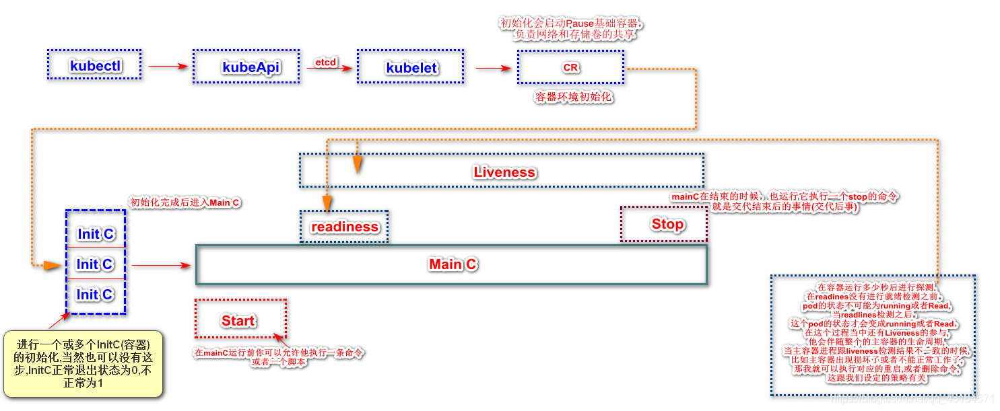

## Pod生命周期



## InitContainer

**init容器与普通容器的区别：**

- init容器会先于普通容器启动执行，直到所有init容器执行成功后，普通容器才会被启动
- 只有前一个init容器运行成功后才能运行下一个init容器
- init容器执行成功后就退出了


若init容器运行失败，那么k8s需要重启它直到成功完成。如果Pod的spec.restartPolicy字段值为”Never“，那么运行失败的init容器不会被重启。

如果pod重启，所有init容器都要重新执行

修改init容器的image字段才会使init容器重新执行，也相当于重启pod

init容器不能有探针

### 容器设计模型

假如现在有一个需求：要启动一个java应用，有一个 WAR 包需要把它放到 Tomcat 的 web APP 目录下面

方法一：把 WAR 包和 Tomcat 打包放进一个镜像里面，但这样无论更新war包还是tomcat都需要重做镜像

方法二：把war包挂载到tomcat容器，但是需要维护一套存储系统，因为容器可能下次重启可能就跑到别的宿主机了

所以我们可以采用Sidecar容器设计模型：

```yaml
apiVersion: v1
kind: Pod
metadata:
  name: javaweb-2
spec:
  #把 WAR 包从镜像里拷贝到一个 Volume 里面，它做完这个操作就退出了
  initContainers:
  - image: geektime/sample:v2
    name: war
    command: ["cp", "/sample.war", "/app"]
    volumeMounts:
    - mountPath: /app
      name: app-volume
  containers:
  - image: geektime/tomcat:7.0
    name: tomcat
    command: ["sh","-c","/root/apache-tomcat-7.0.42-v2/bin/start.sh"]
    volumeMounts:
    - mountPath: /root/apache-tomcat-7.0.42-v2/webapps
      name: app-volume
    ports:
    - containerPort: 8080
      hostPort: 8001 
  volumes:
  - name: app-volume
    emptyDir: {}
```

*什么是 Sidecar？就是说其实在 Pod 里面，可以定义一些专门的容器，来执行主业务容器所需要的一些辅助工作*

## pod hook

主容器启动之前有一个poststart hook（容器启动后钩子）和poststop hook（容器结束前钩子）：

- PostStart：这个钩子在**容器创建后立即执行**。如果钩子执行失败则该容器会被杀死。（**不能保证钩子在ENTRYPOINT之前执行**）

- **PreStop**：这个钩子**在容器terminate(终止)之前立即执行**。它是阻塞的，意味着它是同步的， 所以它必须在删除容器的调用发出之前完成。**主要用于优雅关闭应用程序**、通知其他系统等。不管执行的结果如何，都会发送一个SIGTERN信号给docker daemon来删除容器

  当用户请求删除含有 pod 的资源对象时（如Deployment等），K8S 为了让应用程序优雅关闭（即让应用程序完成正在处理的请求后，再关闭软件），K8S提供两种信息通知：

  - 默认：K8S 通知 node 执行`docker stop`命令，docker 会先向容器中`PID`为1的进程发送系统信号`SIGTERM`，然后等待容器中的应用程序终止执行，如果等待时间达到设定的超时时间，或者默认超时时间（30s），会继续发送`SIGKILL`的系统信号强行 kill 掉进程。
  - 使用 pod 生命周期（利用`PreStop`回调函数），它执行在发送终止信号之前。

  **默认所有的优雅退出时间都在30秒内。**kubectl delete 命令支持 `--grace-period=<seconds>`选项，这个选项允许用户用他们自己指定的值覆盖默认值。值'0'代表 强制删除 pod. 在 kubectl 1.5 及以上的版本里，执行强制删除时必须同时指定 `--force --grace-period=0`。


**SpringBoot在K8s下实现优雅停机**

在K8s中，当我们实现滚动升级之前，务必要实现应用级别的优雅停机。否则滚动升级时，还是会影响到业务。

1. 加入必要依赖

   ```xml
   <dependency>
           <groupId>org.springframework.boot</groupId>
           <artifactId>spring-boot-starter-web</artifactId>
   </dependency>
   <dependency>
       <groupId>org.springframework.boot</groupId>
       <artifactId>spring-boot-starter-actuator</artifactId>
   </dependency>
   ```

2. 配置springboot应用

   默认情况下，SpringBoot是直接关机的，所以，需要将优雅停机配置打开。在applicatoin.yaml中配置：

   ```yaml
   spring:
     application:
       name: demo
     # 停机过程超时时长设置了20s，超过20s，直接停机
     lifecycle:
       timeout-per-shutdown-phase: 20s
   
   server:
     port: 8080
     #  默认为IMMEDIATE，表示立即关机；GRACEFUL表示优雅关机
     shutdown: graceful
   
   management:
     server:
       address: 127.0.0.1
       port: 50000
     # 开启shutdown endpoint
     endpoint:
       shutdown:
         enabled: true
     endpoints:
       web:
         base-path: /private-url
         exposure:
           # 暴露shutdown endpoint
           include: health,shutdown
   ```

   这时我们只需要在发送停机请求告诉应用，即可优雅停机。发送指令为：`curl -XPOST 127.0.0.1:50000/private-url/shutdown`。

3. 集成到pod中

   ```yaml
       spec:
         containers:
         - images: springboot-demo:v1.10
           name: demo-container
           ports:
           - containerPort: 8080
           lifecycle:
             preStop:
               exec:
                 command: ["curl", "-XPOST", "127.0.0.1:50000/private-url/shutdown"]
   ```

   注意：

   前提是你的应用镜像中必须包含`curl`命令。

## 容器的健康检查和恢复机制

### k8s的默认健康检查机制

当容器内进程退出时返回状态码为非零，则会认为容器发生了故障，K8s就会根据restartPolicy来重启这个容器，以达到自愈的效果

模拟一个容器发生故障时的场景 :

```yaml
# vim testHealthz.yaml
apiVersion: v1
kind: Pod
metadata:
  creationTimestamp: null
  labels:
    run: busybox
  name: busybox
spec:
  containers:
  - image: busybox:latest
    imagePullPolicy: IfNotPresent
    name: busybox
    resources: {}
    args:
    - /bin/sh
    - -c
    - sleep 10; exit 1       # 并添加pod运行指定脚本命令，模拟容器启动10秒后发生故障，退出状态码为1
  dnsPolicy: ClusterFirst
  restartPolicy: OnFailure # 将默认的Always修改为OnFailure
status: {}
```

创建容器

```shell
# kubectl apply -f testHealthz.yaml 
pod/busybox created

# 观察几分钟，利用-w 参数来持续监听pod的状态变化
# kubectl  get pod -w
NAME                     READY   STATUS              RESTARTS   AGE
busybox                  0/1     ContainerCreating   0          4s
busybox                  1/1     Running             0          6s
busybox                  0/1     Error               0          16s
busybox                  1/1     Running             1          22s
busybox                  0/1     Error               1          34s
busybox                  0/1     CrashLoopBackOff    1          47s
busybox                  1/1     Running             2          63s
busybox                  0/1     Error               2          73s
busybox                  0/1     CrashLoopBackOff    2          86s
busybox                  1/1     Running             3          109s
busybox                  0/1     Error               3          2m
busybox                  0/1     CrashLoopBackOff    3          2m15s
busybox                  1/1     Running             4          3m2s
busybox                  0/1     Error               4          3m12s
busybox                  0/1     CrashLoopBackOff    4          3m23s
busybox                  1/1     Running             5          4m52s
busybox                  0/1     Error               5          5m2s
busybox                  0/1     CrashLoopBackOff    5          5m14s

上面可以看到这个测试pod被重启了5次，然而服务始终正常不了，就会保持在CrashLoopBackOff了，等待运维人员来进行下一步错误排查
注：kubelet会以指数级的退避延迟（10s，20s，40s等）重新启动它们，上限为5分钟
这里我们是人为模拟服务故障来进行的测试，在实际生产工作中，对于业务服务，我们如何利用这种重启容器来恢复的机制来配置业务服务呢，答案是`liveness`检测
```

### 探针种类

**LivenessProbe**（存活探针）：检测容器是否正常存活，**如果探测失败，则kubelet会杀死容器并重启容器（restartPolicy: Always）**

**ReadinessProbe**（就绪探针）：检测容器**是否准备好可以接收流量**，当我们上线的新版本发生程序错误时，Readiness会检测失败，Endpoint  Controller 会**把pod从service endpoint中剔除，从而不导入流量到pod内**，将服务的故障控制在内部，在生产场景中，建议这个是必加的，Liveness不加都可以，因为有时候我们需要保留服务出错的现场来查询日志，定位问题，告之开发来修复程序。

**StartupProbe**（启动探针）：k8s1.18版本新加的探测方式，用于判断容器内的应用程序是否已经启动，如果配置了StartupProbe，就**会先禁止其他的探针，直到它成功为止，成功后将不再进行探测**。（**程序启动慢可以配这个**）


PS：

**livenessprobe和readinessprobe的区别：**

两种检测的配置方法完全一样，支持的配置参数也一样。不同之处在于检测失败后的行为：Liveness 检测是重启容器；Readiness 检测则是将容器设置为不可用，不接收 Service 转发的请求。

Liveness 检测和 Readiness 检测是独立执行的，**二者之间没有依赖**，所以可以单独使用，也可以同时使用。

### 探针的检测方式

ExecAction：在容器内执行一个命令，如果返回值为0，则认为容器健康（类似linux的`echo $?`）

```yaml
          readinessProbe:
            #用于检测容器健康情况的探测命令
            exec:
              command:
              - sh
              - -c
              - "redis-cli ping"
            initialDelaySeconds: 5
            periodSeconds: 10
            timeoutSeconds: 1
            successThreshold: 1
            failureThreshold: 3
          livenessProbe:
            exec:
              command:
              - sh
              - -c
              - "redis-cli ping"
            initialDelaySeconds: 30
            periodSeconds: 10
            timeoutSeconds: 5
            successThreshold: 1
            failureThreshold: 3
```

TCPSocketAction：向容器发送一个TCP Socket，Kubelet将尝试在指定端口上打开容器的套接字。 如果可以建立连接，容器被认为是健康的，如果不能就认为是失败的。

```yaml
        readinessProbe:
          tcpSocket:
            port: 9092 #容器暴露的访问端口或端口名
          initialDelaySeconds: 15
          periodSeconds: 10
        livenessProbe:
          tcpSocket:
            port: 9092
          initialDelaySeconds: 15
          periodSeconds: 10
```

HttpGetAction：对指定端口和路径的容器IP进行HTTP Get请求，如果状态码在200~400之间则认为容器健康。

```yaml
          readinessProbe:  # 定义只有http检测容器6222端口请求返回是 200-400，则接收下面的Service web-svc 的请求
            #向容器发送一个HTTP Get请求
            httpGet:
              scheme: HTTP #协议
              path: /check #访问HTTP Server的路径
              port: 6222 #容器暴露的访问端口或端口名
            initialDelaySeconds: 10   # 容器启动后等待 10 秒开始探测，默认3秒
            periodSeconds: 5          # 每隔 5 秒探测一次，默认10秒
            timeoutSeconds: 5         # 探测超时时间，默认1秒
            successThreshold: 1       # 成功阈值，连续几次成功才算成功
            failureThreshold: 3       # 失败阈值，连续几次失败才算失败
          livenessProbe:  # 定义只有http检测容器6222端口请求返回是 200-400，否则就重启pod
            httpGet:
              scheme: HTTP
              path: /check
              port: 6222
            initialDelaySeconds: 10
            periodSeconds: 5
            timeoutSeconds: 5
            successThreshold: 1
            failureThreshold: 3
```

### 探针检查参数

```yaml
initialDelaySeconds: 10 #容器启动几秒后开始检测，一般会根据应用启动的准备时间来设置。比如某个应用正常启动要花 30 秒，那么 initialDelaySeconds 的值就应该大于 30。
timeoutSeconds: 2 #超时时间
periodSeconds: 10 #每几秒检测一次，K8s 如果连续执行 3 次 Liveness 检测均失败，则会杀掉并重启容器。
successThreshold: 1 #检查成功1次表示就绪
failureThreshold: 1 #检查失败1次表示未就绪
```

### 注意事项

选择合适的探针可以防止被误操作：

- 调大判断的超时阈值，防止容器在高压的情况出现偶发超时
- 调整判断次数的阈值，3次的默认值在短周期下不一定是最佳实践

### ExecAction例子

```yaml
apiVersion: v1
kind: Pod
metadata:
  labels:
    test: liveness
  name: test-liveness-exec
spec:
  containers:
  - name: liveness
    image: busybox
    args:
    - /bin/sh
    - -c
    - touch /tmp/healthy; sleep 30; rm -rf /tmp/healthy; sleep 600 #创建一个文件，30秒后再删掉
    livenessProbe:
      exec:
        command:
        - cat
        - /tmp/healthy
      initialDelaySeconds: 5 #健康检查在容器启动 5 s 后开始执行
      periodSeconds: 5 #5秒执行一次
```

30 s 之后，我们再查看一下 Pod 的 Events：

```shell
kubectl describe pod test-liveness-exec
 
Events:
  Type     Reason     Age                From               Message
  ----     ------     ----               ----               -------
  Warning  Unhealthy  47s (x3 over 56s)  kubelet            Liveness probe failed: cat: can't open '/tmp/healthy': No such file or directory
  Normal   Killing    47s                kubelet            Container liveness failed liveness probe, will be restarted
```

再次查看一下这个 Pod 的状态：

```shell
$ kubectl get pod test-liveness-exec
NAME           READY     STATUS    RESTARTS   AGE
liveness-exec   1/1       Running   1          1m
```

Pod 并没有进入 Failed 状态，而是保持了 Running 状态。从RESTARTS 字段 0 到 1 的变化，就能明白原因：这个异常的容器已经被 Kubernetes 重启了。在这个过程中，Pod 保持 Running 状态不变。

**需要注意的是：Kubernetes 中并没有 Docker 的 Stop 语义。所以虽然是 Restart（重启），但实际却是重新创建了容器。**

这个功能就是 Kubernetes 里的**Pod 恢复机制**，也叫 **restartPolicy**。它是 Pod 的 Spec 部分的一个标准字段（pod.spec.restartPolicy），**默认值是 Always**，即：任何时候这个容器发生了异常，它一定会被重新创建。

所以，假如一个 Pod 里只有一个容器，然后这个容器异常退出了。那么，只有当 restartPolicy=Never 时，这个 Pod 才会进入 Failed 状态。而其他情况下，由于 Kubernetes 都可以重启这个容器，所以 Pod 的状态保持 Running 不变。

而如果这个 Pod 有多个容器，仅有一个容器异常退出，它就始终保持 Running 状态，哪怕即使 restartPolicy=Never。只有当**所有容器也异常退出之后，这个 Pod 才会进入 Failed 状态。**

### 为什么用StartupProbe

startupProbe 和 livenessProbe 最大的区别就是**startupProbe在探测成功之后就不会继续探测了**，而**livenessProbe在pod的生命周期中一直在探测。**

假如配置了如下LivenessProbe

```yaml
livenessProbe:
  httpGet:
    path: /test
    prot: 80
#    tcpSocket:
#      port: 80
  failureThreshold: 1
  initialDelaySeconds: 10
  periodSeconds: 10
```

上面配置的意思是容器启动10s后每10s检查一次，允许失败的次数是1次。如果失败次数超过1则会触发restartPolicy。

但如果服务启动很慢的话比如60s，这个时候如果还是用上面的探针就会进入死循环，因为上面的探针10s后就开始探测，这时候我们服务并没有起来，发现探测失败就会触发restartPolicy。

如果改成如下配置

```yaml
livenessProbe:
  httpGet:
    path: /test
    prot: 80
  failureThreshold: 4
  initialDelay: 30
  periodSeconds: 10
```

确实这样pod能够启动起来了，但在后期的探测中，你需要10*4=40s才能发现这个pod不可用。

在这时候我们把`startupProbe`和`livenessProbe`结合起来使用就可以很大程度上解决我们的问题。

```yaml
livenessProbe:
  httpGet:
    path: /test
    prot: 80
  failureThreshold: 1
  initialDelay: 10
  periodSeconds: 10

startupProbe:
  httpGet:
    path: /test
    prot: 80
  failureThreshold: 10
  initialDelay: 10
  periodSeconds: 10
```

`startupProbe`配置的是10s\*10+10s，也就是说只要应用在110s内启动都是OK的，一旦启动探针探测成功之后，就会被livenessProbe接管，这样应用挂掉了10s就会发现问题。