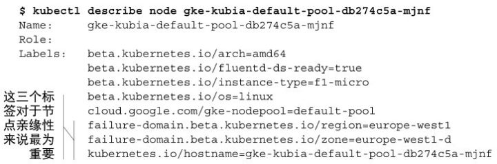

nodeName

指定pod运行在哪个具体node

```yaml
spec:
  nodeName: k8s-node01
```


**nodeSelector**

指定pod运行在哪个标签的node

给node打标签：

```shell
kubectl label no k8s-node01 disk=ceph
```

```yaml
spec:
  nodeSelector:
    disk: ceph
```


## 亲和性

在早期版本的Kubernetes中，初始的节点亲缘性机制，就是pod描述中的nodeSelector字段。节点必须包含所有pod对应字段中的指定label，才能成为pod调度的目标节点。

节点选择器实现简单，但是它不能满足你的所有需求。节点选择器最终会被弃用

与节点选择器类似，每个pod可以定义自己的节点亲缘性规则。这些规则可以允许你指定硬性限制或者偏好。如果指定一种偏好的话，你将告知Kubernetes对于某个特定的pod，它更倾向于调度到某些节点上，之后Kubernetes将尽量把这个pod调度到这些节点上面。如果没法实现的话，pod将被调度到其他某个节点上。


节点亲缘性根据节点的标签来进行选择，这点跟节点选择器是一致的。当你了解到如何使用节点亲缘性之后，让我们来检查下一个Google Kubernetes引擎集群（GKE）中节点的标签，来看一下它们默认的标签是什么，如以下代码清单所示



这三个标签的含义如下：

- [failure-domain.beta.kubernetes.io/region](http://link.zhihu.com/?target=http%3A//failure-domain.beta.kubernetes.io/region)表示该节点所在的地理地域。
- [failure-domain.beta.kubernetes.io/zone](http://link.zhihu.com/?target=http%3A//failure-domain.beta.kubernetes.io/zone)表示该节点所在的可用性区域（availability zone）。
- [kubernetes.io/hostname](http://link.zhihu.com/?target=http%3A//kubernetes.io/hostname)很显然是该节点的主机名。


Affinity分类：

- NodeAffinity（节点亲和力）
  - requiredDuringSchedulingIgnoredDuringExecution：硬亲和力
  - preferredDuringSchedulingIgnoredDuringExecution：软亲和力，尽量部署或不部署在满足条件的节点上
- PodAffinity（Pod亲和力）
  - requiredDuringSchedulingIgnoredDuringExecution：硬亲和力
  - preferredDuringSchedulingIgnoredDuringExecution：软亲和力，尽量将a应用和b应用部署在一块
- PodAntiAffinity（Pod反亲和力）
  - requiredDuringSchedulingIgnoredDuringExecution：硬亲和力
  - preferredDuringSchedulingIgnoredDuringExecution：软亲和力，尽量不要将a应用和b应用部署在一块

### 节点亲和力

节点默认的标签`kubernetes.io/hostname`

pod配置affinity，让pod部署在node01或node02，否则尽量部署在master01

```yaml
spec:
  template:
    spec:
      affinity:
        nodeAffinity:
          preferredDuringSchedulingIgnoredDuringExecution:
          - preference:
              matchExpressions:
              - key: kubernetes.io/hostname #master01标签的key
                operator: In
                values:
                - k8s-master01 #master01标签的value
            weight: 1
          requiredDuringSchedulingIgnoredDuringExecution:
            nodeSelectorTerms:
            - matchExpressions:
              - key: kubernetes.io/hostname #node01和node02标签的key
                operator: In # In：部署在符合条件的节点；NotIn：不部署；Exists：部署在有这个key的节点上，不需要写values；DoesNotExists：和Exists相反；Gt：大于指定条件，条件为number；Lt：小于指定条件
                values: 
                - k8s-node01 #node01标签的value
                - k8s-node02 #node02标签的value
```

可以看到pod都部署在node01

```shell
[root@k8s-master01 k8s-file]# kubectl get po -owide
NAME                    READY   STATUS    RESTARTS   AGE   IP               NODE         NOMINATED NODE   READINESS GATES
nginx-f588989b4-5rplt   1/1     Running   0          28s   172.161.125.53   k8s-node01   <none>           <none>
nginx-f588989b4-l5cvk   1/1     Running   0          28s   172.161.125.52   k8s-node01   <none>           <none>
nginx-f588989b4-mhlqx   1/1     Running   0          28s   172.161.125.51   k8s-node01   <none>           <none>
```

编辑depolyment `kubectl edit deploy nginx` 把node01的 `operator: In` 改成 `operator: NotIn` ，可以看到pod变成部署在master01上

```shell
[root@k8s-master01 k8s-file]# kubectl get po -owide
NAME                   READY   STATUS    RESTARTS   AGE   IP                NODE           NOMINATED NODE   READINESS GATES
nginx-dbc5bcff-672x7   1/1     Running   0          15s   172.169.244.193   k8s-master01   <none>           <none>
nginx-dbc5bcff-gr5f2   1/1     Running   0          15s   172.169.244.195   k8s-master01   <none>           <none>
nginx-dbc5bcff-t88pv   1/1     Running   0          15s   172.169.244.194   k8s-master01   <none>           <none>
```

### Pod亲和力

pod配置affinity，和namespace为 `kube-system` 且label为 `k8s-app=calico-kube-controllers` 的pod部署在同一个节点（严谨说是部署在同一拓扑域）

```yaml
spec:
  template:
    spec:
      affinity:
        podAffinity:
          requiredDuringSchedulingIgnoredDuringExecution:
          - labelSelector:
              matchExpressions:
              - key: k8s-app #pod标签的key
                operator: In
                values:
                - calico-kube-controllers #pod标签的value
             namespaces:
               - kube-system #pod的namespace
             topologyKey: kubernetes.io/hostname #拓扑域
```

可以看到pod部署到k8s-node02（calico-kube-controllers这个pod也在该节点）

### Pod反亲和力

不与指定的pod部署在同一个节点，在一些多副本的应用可以让每个副本分布在不同节点

**如何让多个pod均匀部署到各个节点：**

```yaml
spec:
  template:
    spec:
      affinity:
        podAntiAffinity:
          preferredDuringSchedulingIgnoredDuringExecution:
          - labelSelector:
              matchExpressions:
              - key: app
                operator: In
                values:
                - nginx
             namespaces:
             - default
             topologyKey: kubernetes.io/hostname
```


## 污点和容忍

节点选择器和节点亲缘性规则，是通过明确的在pod中添加的信息，来决定一个pod可以或者不可以被调度到哪些节点上。而污点则是在不修改已有pod信息的前提下，**通过在节点上添加污点信息，来拒绝pod在某些节点上的部署。**

### Taint污点

Node被设置上污点之后就和Pod之间存在了一种**相斥的关系**，可以让Node拒绝Pod的调度执行，甚至将Node已经存在的Pod驱逐出去。

一个节点可以打多个污点。


默认情况下，一个集群中的主节点需要设置污点，这样才能保证只有控制面板pod才能部署在主节点上。


**每个污点的组成如下：**
`<key>=<value>:<effect>`

每一个污点都可以关联一个效果（effect），effect支持如下三个选项：

- NoSchedule：表示k8s**不会将Pod调度**到具有该污点的Node上
- PreferNoSchedule：表示k8s将**尽量避免**将Pod调度到具有该污点的Node上，但是如果没有其他节点可以调度，pod依然会被调度到这个节点上
- NoExecute：表示k8s将不会将Pod调度到具有该污点的Node上，同时会将Node上已经存在的Pod**驱逐出去**


假设你有一个单独的Kubernetes集群，上面同时有生产环境和非生产环境的流量。其中最重要的一点是，非生产环境的pod不能运行在生产环境的节点上。可以通过在生产环境的节点上添加污点来满足这个要求

给master01节点（假设生产环境）打一个污点，现在没人能够随意地将pod部署到生产环境节点上了。

```shell
kubectl taint node k8s-master01 master-test=test:NoSchedule
```

查看k8s-master01节点的污点

```shell
kubectl describe node k8s-master01

...
Taints:             master-test=test:NoSchedule
                    node-role.kubernetes.io/master:NoSchedule
...
```

删除taint

```shell
#删除指定key所有的effect
kubectl taint node k8s-master01 master-test-
#删除指定key的指定effect
kubectl taint node node1 key1:NoExecute-
```

### Toleration容忍

要想pod可以调度到打了污点的节点，就要在pod配置容忍

节点可以拥有多个污点信息，而pod也可以有多个污点容忍度。污点可以只有一个key和一个效果，而不必设置value。**污点容忍度可以通过设置Equal操作符来指定匹配的value（默认情况下的操作符），或者也可以通过设置Exists操作符来匹配污点的key。**


在pod配置文件添加一个容忍

```yaml
spec:
  tolerations:
  - key: "master-test" #污点的key名称
    value: "test" #污点的value
    effect: "NoSchedule" #污点的effect
    operator: "Equal"
    
或
spec:
  tolerations:
  - key: "master-test"
    effect: "NoSchedule"
    operator: "Exists"

或
spec:
  tolerations:
  - key: "master-test"
    value: "test"
    effect: "NoExecute"
    operator: "Equal"
    tolerationSeconds: 60 #多少秒后驱逐pod
```

节点有多个taint的话，每个污点都要容忍才能部署