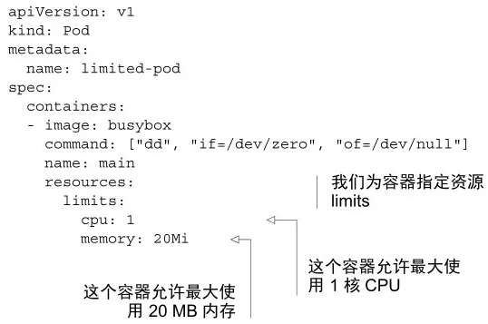
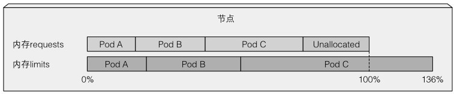
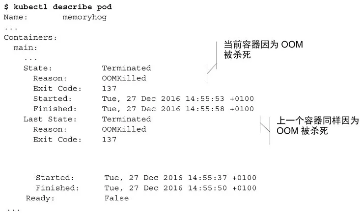

**CPU是一种可压缩资源**，意味着我们可以在不对容器内运行的进程产生不利影响的同时，对其使用量进行限制。而**内存明显不同 —— 是一种不可压缩资源**。一旦系统为进程分配了一块内存，这块内存在进程主动释放之前将无法被回收。这就是我们为什么需要限制容器的最大内存分配量的根本原因。

如果不对内存进行限制，工作节点上的容器（或者pod）可能会吃掉所有可用内存，会对该节点上所有其他pod和任何新调度上来的pod（记住新调度的pod是基于内存的申请量而不是实际使用量的）造成影响。单个故障pod或恶意pod几乎可以导致整个节点不可用。


创建一个带limits限制的pod：



**注意** 因为没有指定资源requests，它将被设置为与资源limits相同的值。


## 可超卖limits

与资源requests不同的是，资源limits不受节点可分配资源量的约束。**所有limits的总和允许超过节点资源总量的 100%**（见图 14.3）。换句话说，资源limits可以超卖。**如果节点资源使用量超过 100%，一些容器将被杀掉**，这是一个很重要的结果。



## 超过limits

当容器内运行的进程尝试使用比限额更多的资源时会发生什么呢？

我们已经了解了CPU是可压缩资源，当进程不等待IO操作时消耗所有的CPU时间是非常常见的。正如我们所知道的，对一个进程的CPU使用率可以进行限制，因此当为一个容器设置CPU限额时，该进程只会分不到比限额更多的CPU而已。

而内存却有所不同。当**进程尝试申请分配比限额更多的内存时会被杀掉**（我们会说这个容器被OOMKilled了，OOM是Out Of Memory的缩写）。如果pod的重启策略为Always 或 OnFailure，进程将会立即重启，因此用户可能根本察觉不到它被杀掉。但是如果它继续超限并被杀死，Kubernetes会再次尝试重启，并开始增加下次重启的间隔时间。这种情况下用户会看到pod处于 CrashLoopBackOff状态：

```shell
$ kubectl get po
```

CrashLoopBackOff 状态表示Kubelet还没有放弃，它意味着在**每次崩溃之后，Kubelet就会增加下次重启之前的间隔时间**。第一次崩溃之后，Kubelet立即重启容器，如果容器再次崩溃，Kubelet会等待 10 秒钟后再重启。随着不断崩溃，延迟时间也会按照 20、40、80、160 秒以几何倍数增长，最终收敛在 300 秒。**一旦间隔时间达到 300 秒，Kubelet将以 5 分钟为间隔时间对容器进行无限重启**，直到容器正常运行或被删除。

要定位容器crash的原因，可以通过查看pod日志以及 kubectl describe pod 命令：



OOMKilled 状态告诉我们容器因为内存不足而被系统杀掉了。上例中，容器实际上已经超过了内存限额而被立即杀死。

如果你不希望容器被杀掉，重要的一点就是不要将内存limits设置得很低。而容器有时即使没有超限也依然会被OOMKilled，后面会说原因，而现在让我们讨论一下在大多数用户首次指定limits时需要警惕的地方。


运行命令：

```shell
kubectl exec -it limited-pod top
```