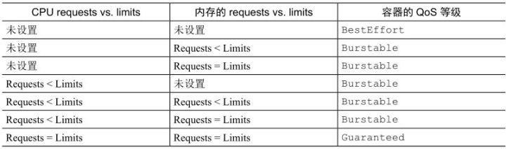
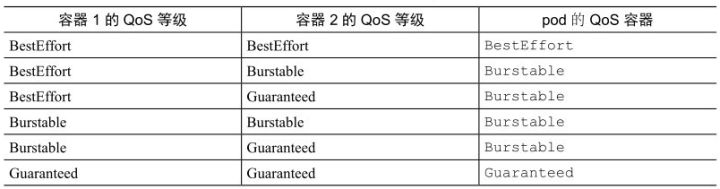

**CPU是一种可压缩资源**，意味着我们可以在不对容器内运行的进程产生不利影响的同时，对其使用量进行限制。而**内存明显不同 —— 是一种不可压缩资源**。一旦系统为进程分配了一块内存，这块内存在进程主动释放之前将无法被回收。这就是我们为什么需要限制容器的最大内存分配量的根本原因。

如果不对内存进行限制，工作节点上的容器（或者pod）可能会吃掉所有可用内存，会对该节点上所有其他pod和任何新调度上来的pod（记住新调度的pod是基于内存的申请量而不是实际使用量的）造成影响。单个故障pod或恶意pod几乎可以导致整个节点不可用。


创建一个带limits限制的pod：


**注意** 因为没有指定资源requests，它将被设置为与资源limits相同的值。


## 可超卖limits

与资源requests不同的是，资源limits不受节点可分配资源量的约束。**所有limits的总和允许超过节点资源总量的 100%**（见图 14.3）。换句话说，资源limits可以超卖。**如果节点资源使用量超过 100%，一些容器将被杀掉**，这是一个很重要的结果。


## 超过limits

当容器内运行的进程尝试使用比限额更多的资源时会发生什么呢？

我们已经了解了CPU是可压缩资源，当进程不等待IO操作时消耗所有的CPU时间是非常常见的。正如我们所知道的，对一个进程的CPU使用率可以进行限制，因此当为一个容器设置CPU限额时，该进程只会分不到比限额更多的CPU而已。

而内存却有所不同。当**进程尝试申请分配比限额更多的内存时会被杀掉**（我们会说这个容器被OOMKilled了，OOM是Out Of Memory的缩写）。如果pod的重启策略为Always 或 OnFailure，进程将会立即重启，因此用户可能根本察觉不到它被杀掉。但是如果它继续超限并被杀死，Kubernetes会再次尝试重启，并开始增加下次重启的间隔时间。这种情况下用户会看到pod处于 CrashLoopBackOff状态：

```shell
$ kubectl get po
```

CrashLoopBackOff 状态表示Kubelet还没有放弃，它意味着在**每次崩溃之后，Kubelet就会增加下次重启之前的间隔时间**。第一次崩溃之后，Kubelet立即重启容器，如果容器再次崩溃，Kubelet会等待 10 秒钟后再重启。随着不断崩溃，延迟时间也会按照 20、40、80、160 秒以几何倍数增长，最终收敛在 300 秒。**一旦间隔时间达到 300 秒，Kubelet将以 5 分钟为间隔时间对容器进行无限重启**，直到容器正常运行或被删除。

要定位容器crash的原因，可以通过查看pod日志以及 kubectl describe pod 命令：


OOMKilled 状态告诉我们容器因为内存不足而被系统杀掉了。上例中，容器实际上已经超过了内存限额而被立即杀死。

如果你不希望容器被杀掉，重要的一点就是不要将内存limits设置得很低。而容器有时即使没有超限也依然会被OOMKilled，后面会说原因，而现在让我们讨论一下在大多数用户首次指定limits时需要警惕的地方。

## 容器中的应用如何看待limits

运行命令：

```shell
kubectl exec -it limited-pod top
```

查看used和free内存量，这些数值远超出我们为容器设置的 20 MiB限额。

**在容器内看到的始终是节点的内存，而不是容器本身的内存**

对于Java程序来说这是个很大的问题，尤其是不使用-Xmx 选项指定虚拟机的最大堆大小时，JVM会将其设置为主机总物理内存的百分值。如果pod部署在拥有更大物理内存的生产系统中，JVM将迅速超过预先配置的内存限额，然后被OOM杀死。

也许你觉得可以简单地设置-Xmx 选项就可以解决这个问题，那么你就错了，很遗憾。-Xmx 选项仅仅限制了堆大小，并不管其他off-heap内存。好在新版本的Java会考虑到容器limits以缓解这个问题。

与内存完全一样，无论有没有配置CPU limits，**容器内也会看到节点所有的CPU**。将CPU限额配置为1，并不会神奇地只为容器暴露一个核。CPU limits做的只是限制容器使用的CPU时间。

因此如果一个拥有 1 核CPU限额的容器运行在 64 核CPU上，只能获得 1/64的全部CPU时间。而且即使限额设置为1 核，容器进程也不会只运行在一个核上，**不同时刻，代码还是会在多个核上执行。**

上面的描述没什么问题，对吧？虽然一般情况下如此，但在一些情况下却是灾难。

一些程序通过查询系统CPU核数来决定启动工作线程的数量。同样在开发环境的笔记本电脑上运行良好，但是部署在拥有更多数量CPU的节点上，程序将快速启动大量线程，所有线程都会争夺（可能极其）有限的CPU时间。同时每个线程通常都需要额外的内存资源，导致应用的内存用量急剧增加。

不要依赖应用程序从系统获取的CPU数量，你可能需要使用Downward API将CPU限额传递至容器并使用这个值。也可以通过cgroup系统直接获取配置的CPU限制，请查看下面的文件：

```shell
/sys/fs/cgroup/cpu/cpu.cfs_quota_us
/sys/fs/cgroup/cpu/cpu.cfs_period_us
```

## pod QoS等级

前面已经提到资源limits可以超卖，换句话说，一个节点不一定能提供所有pod所指定的资源limits之和那么多的资源量。

假设有两个pod,pod A使用了节点内存的 90%,pod B突然需要比之前更多的内存，这时节点无法提供足量内存，哪个容器将被杀掉呢？

这要分情况讨论，在一个超卖的系统，QoS等级决定着哪个容器第一个被杀掉，**Kubernetes将pod划分为3种QoS等级**：

- BestEffort（优先级最低）
- Burstable
- Guaranteed（优先级最高）


**BestEffort**

pod没有设置任何requests和limits，在这个等级运行的容器没有任何资源保证，在最坏情况下，它们分不到任何CPU时间，同时在需要为其他pod释放内存时，这些容器会第一批被杀死。不过因为BestEffort pod没有配置内存limits，当有充足的可用内存时，这些容器可以使用任意多的内存。

**Guaranteed**

pod的requests和limits相等，因为如果容器的资源requests没有显式设置，默认与limits相同，所以只设置所有资源（pod内每个容器的每种资源）的限制量就可以使pod的QoS等级为Guaranteed。这些pod的容器可以使用它所申请的等额资源，但是无法消耗更多的资源（因为它们的limits和requests相等）。

**Burstable**

Burstable QoS等级介于BestEffort和Guaranteed之间。其他所有的pod都属于这个等级。包括容器的requests和limits不相同的单容器pod，至少有一个容器只定义了requests但没有定义limits的pod，以及一个容器的requests和limits相等，但是另一个容器不指定requests或limits的pod。Burstable pod可以获得它们所申请的等额资源，并可以使用额外的资源（不超过limits）。


考虑一个pod应该属于哪个QoS等级足以令人脑袋快速运转，因为它涉及多个容器、多种资源，以及requests和limits之间所有可能的关系。如果一开始从容器级别考虑QoS（尽管它并不是容器的属性，而是pod的属性），然后从容器QoS推导出pod QoS，这样可能更容易理解。






**注意** 运行 kubectl describe pod 以及通过pod的YAML/JSON描述的status.qosClass 字段都可以查看pod的QoS等级。


**如何处理相同QoS等级的容器**

每个运行中的进程都有一个称为OutOfMemory（OOM）分数的值。系统通过比较所有运行进程的OOM分数来选择要杀掉的进程。当需要释放内存时，分数最高的进程将被杀死。

OOM分数由两个参数计算得出：进程已消耗内存占可用内存的百分比，与一个基于pod QoS等级和容器内存申请量固定的OOM分数调节因子。对于两个属于Burstable等级的单容器的pod，系统会杀掉内存实际使用量占内存申请量比例更高的pod。这就是图 14.5 中使用了内存申请量 90% 的pod B在pod C（只使用了70%）之前被杀掉的原因，尽管pod C比pod B使用了更多兆字节的内存。

