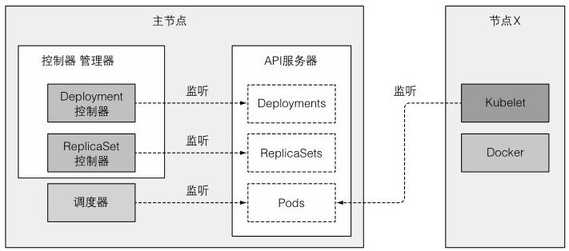
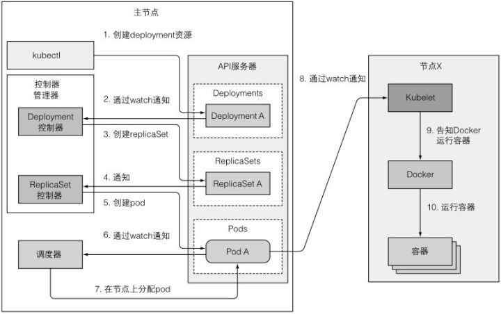

当一个pod资源被创建时会发生什么，因为一般不会直接创建pod，所以创建Deployment资源作为替代，然后观察启动pod的容器会发生什么。


### 了解涉及哪些组件

启动整个流程之前，控制器、调度器、Kubelet就已经通过API服务器监听它们各自资源类型的变化了。图中不包含etcd，因为它被隐藏在API服务器之后，可以想象成API服务器（实际是etcd）就是对象存储的地方。



### 事件链

准备包含**Deployment清单**的YAML文件，通过kubetctl提交到Kubernetes。kubectl通过HTTP POST请求**发送清单到Kubernetes API服务器**。API服务器检查Deployment定义，**存储到etcd**，返回响应给kubectl。



**Deployment控制器生成ReplicaSet**

当Deployment控制器检查到有一个新的Deployment对象时，会按照Deploymnet当前定义创建ReplicaSet。

**ReplicaSet控制器创建pod资源**

新创建的ReplicaSet由ReplicaSet控制器（通过API服务器创建、修改、删除ReplicaSet资源）接收。控制器会考虑replica数量、ReplicaSet中定义的pod选择器，然后检查是否有足够的满足选择器的pod。

然后控制器会基于ReplicatSet的pod模板创建pod资源（当Deployment控制器创建ReplicaSet时，会从Deployment复制pod模板）。

**调度器分配节点给新创建的pod**

新创建的pod目前保存在etcd中，它们还没有关联节点，它们的nodeName属性还未被设置，调度器会监控像这样的pod，发现一个，就会为pod选择最佳节点，并将节点分配给pod。

**Kubelet运行pod容器**

随着pod目前分配给了特定的节点，节点上的Kubelet终于可以工作了。**Kubelet通过API服务器监听pod变更**，发现有新的pod分配到本节点后，会去检查pod定义，然后命令Docker或者任何使用的**容器运行时来启动pod容器**，容器运行时就会去运行容器。

### 观察集群事件

控制平面组件和Kubelet执行动作时，都会发送事件给API服务器。发送事件是通过创建事件资源来实现的，事件资源和其他的Kubernetes资源类似。每次使用kubectl describe来检查资源的时候，就能看到资源相关的事件，也可以直接用 `kubectl get events` 获取事件。

可能是个人的感受，使用 `kubectl get` 检查事件比较痛苦，因为不是以合适的时间顺序显示的。当一个事件发生了多次，该事件只会被显示一次，显示首次出现时间、最后一次出现时间以及发生次数。幸运的是，利用--watch选项监听事件肉眼看起来更简单，对于观察集群发生了什么也更有用。

```shell
$ kubectl get events --watch
```

SOURCE列显示执行动作的控制器，NAME和KIND列显示控制器作用的资源。REASON列以及MESSAGE列（显示在每一项的第二行）提供控制器所做的更详细的信息。
