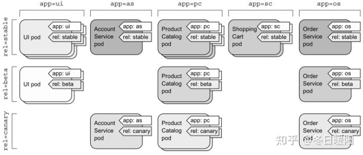

## 使用标签组织pod

对于微服务架构，部署的微服务数量可以轻松超过20个甚至更多。这些组件可能是副本（部署同一组件的多个副本）和多个不同的发布版本（stable、beta、canary等）同时运行。这样一来可能会导致我们在系统中拥有数百个pod，如果没有可以有效组织这些组件的机制，将会导致产生巨大的混乱

## label

**标签不仅可以组织pod，也可以组织所有其他的Kubernetes资源。**

通过给pod添加标签，可以得到一个更组织化的系统，以便我们理解。此时每个pod都标有两个标签：

- app，它指定pod属于哪个应用、组件或微服务。
- rel，它显示在pod中运行的应用程序版本是stable、beta还是canary。

通过添加这两个标签基本上可以将pod组织为两个维度（基于应用的横向维度和基于版本的纵向维度）




kubectl get pods命令默认不会列出任何标签，但我们可以使用--showlabels选项来查看：

```text
$ kubectl get po --show-labels
```

查看指定标签的pod

```shell
kubectl get po -A -l app=ui
```

标签也可以在现有pod上进行添加和修改。给pod添加标签

```shell
kubectl label po busybox creation_method=manual
```

现在，将pod上的env=prod标签更改为env=debug，在更改现有标签时，需要使用 `--overwrite` 选项。

```text
$ kubectl label po busybox env=debug --overwrite
```

删除pod的app标签

```shell
kubectl label po busybox app-
```

查看所有namespace的pod的标签：

```shell
kubectl get po -A --show-labels
```

## Label和Selector

标签要与标签选择器结合在一起，标签选择器允许我们选择标记有特定标签的pod子集，并对这些pod执行操作。


标签选择器根据资源的以下条件来选择资源：

包含（或不包含）使用特定键的标签

包含具有特定键和值的标签

包含具有特定键的标签，但其值与我们指定的不同


接下来我们使用标签选择器在之前创建的pod上进行操作，以观察我们手动创建的所有pod（用creation_method=manual标记了它们），并执行以下操作：

```text
$ kubectl get po -l creation_method=manual
NAME              READY   STATUS    RESTARTS   AGE
kubia-manual-v2   1/1     Running   0          13h
```

列出包含env标签的所有pod，无论其值如何：

```text
$ kubectl get po -l env
NAME              READY   STATUS    RESTARTS   AGE
kubia-manual-v2   1/1     Running   0          13h
```

同样列出没有env标签的pod：

```text
$ kubectl get po -l '!env'
NAME          READY   STATUS    RESTARTS   AGE
kubia-n7fvq   1/1     Running   0          3d23h
kubia-qrb4q   1/1     Running   0          3d20h
kubia-ww77s   1/1     Running   0          3d23h
```

**注意** 确保使用单引号来圈引！env，这样bash shell才不会解释感叹号（译者注：感叹号在bash中有特殊含义，表示事件指示器）。

同理，我们也可以将pod与以下标签选择器进行匹配：

`creation_method!=manual`  选择带有 `creation_method` 标签，并且值不等于manual的pod

`env in (prod,devel)` 选择带有env标签且值为prod或devel的pod

`env not in (prod,devel)` 选择带有env标签，但其值不是prod或devel的pod


在包含多个逗号分隔的情况下，可以在标签选择器中同时使用多个条件，此时资源需要全部匹配才算成功匹配了选择器。例如，如果我们只想选择product catalog微服务的beta版本pod，可以使用以下选择器：`app=pc,rel=beta`

## label与annotations的区别

label用于识别、匹配不同的对象，k8s集群会care所有对象的label，annotation不会被k8s集群内部使用和care，但是将annotations附着在object上肯定也是有用的，这些annotations会被外部的工具或库所使用。

对pod增加一个注解：

```shell
kubectl annotate pods nginx1 my-annotate='my annotate,ok'
```

修改已存在的注解：

```shell
kubectl annotate pods nginx1 my-annotate='my annotate,no' --overwrite
```

使用kubectl describe命令查看刚刚添加的注解