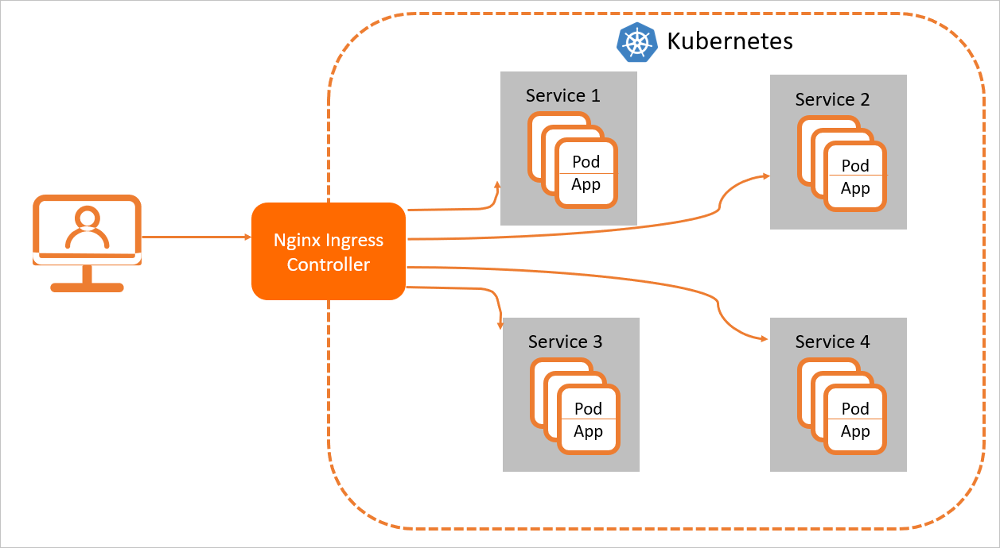

# Ingress

为什么用ingress:

- service可以使用nodeport暴露集群外访问端口，但是性能低下不安全
- 缺少七层的统一访问入口，可以负载均衡、限流等


Ingress只需要一个公网IP就能为K8s上所有的服务提供访问，**Ingress工作在7层（HTTP）**，**Ingress会根据请求的主机名以及路径来决定把请求转发到相应的服务**


Ingress-Nginx官方文档：[Introduction - NGINX Ingress Controller (kubernetes.github.io)](https://kubernetes.github.io/ingress-nginx/user-guide/nginx-configuration/)

## 原理

Nginx Ingress Controller收到请求，匹配Nginx Ingress转发规则转发到后端Service所对应的Pod，由Pod处理请求。Kubernetes中Service、Nginx Ingress与Nginx Ingress Controller有着以下关系：

- Service是后端真实服务的抽象，一个Service可以代表多个相同的后端服务。
- Nginx Ingress是**反向代理规则**，用来规定HTTP/HTTPS请求应该被转发到哪个Service所对应的Pod上。例如根据请求中不同的Host和URL路径，让请求落到不同Service所对应的Pod上。
- Nginx Ingress Controller是Kubernetes集群中的一个组件，负责**解析Nginx Ingress的反向代理规则**。如果Nginx Ingress有增删改的变动，Nginx Ingress Controller会及时更新自己相应的转发规则，当Nginx Ingress Controller收到请求后就会根据这些规则**将请求转发到对应Service的Pod上**。



## 安装ingress contoller

先安装Helm

https://helm.sh/docs/intro/install/

使用helm安装ingress：

```shell
helm repo add ingress-nginx https://kubernetes.github.io/ingress-nginx
```

查看repo源:

```shell
helm repo list
```

查看ingress-nginx的版本

```shell
helm search repo ingress-nginx
```

下载ingress的helm包至本地

```shell
helm pull ingress-nginx/ingress-nginx
#wget https://github.com/kubernetes/ingress-nginx/releases/download/ingress-nginx-3.6.0/ingress-nginx-3.6.0.tgz
```

更改对应的配置

```shell
[root@master01 ~]# mkdir temp

[root@master01 ~]# mv ingress-nginx-3.6.0.tgz temp/

[root@master01 ~]# cd temp/

[root@master01 temp]# tar xf ingress-nginx-3.13.0.tgz

[root@master01 temp]# cd ingress-nginx

[root@master01 ingress-nginx]# ls

CHANGELOG.md Chart.yaml ci OWNERS README.md templates values.yaml

[root@master01 ingress-nginx]#vim values.yaml
```

需要修改的位置

```yaml
controller.image.repository: registry.cn-beijing.aliyuncs.com/dotbalo/controller #需要将公网镜像同步至公司内网镜像仓库
controller.image.tag: "v0.40.2"

dnsPolicy: ClusterFirstWithHostNet

hostNetwork: true #设置为true,使用宿主机的端口

kind: DaemonSet

nodeSelector: ingress: "true"

type: ClusterIP

controller.admissionWebhook.patch.image.repository: registry.cn-beijing.aliyuncs.com/dotbalo/kube-webhook-certgen
controller.admissionWebhook.patch.image.tag: v1.3.0
```

给需要部署ingress的节点上打标签

```shell
kubectl label node k8s-node01 ingress=true
kubectl create ns ingress-nginx
helm install ingress-nginx -n ingress-nginx .
```

查看pod

```shell
kubectl get po -n ingress-nginx
NAME                             READY   STATUS    RESTARTS   AGE
ingress-nginx-controller-zwlwh   1/1     Running   0          2m6s
```

## 安装aliyun-ingress-controller

生产环境可以安装阿里云的ingress-controller

aliyun-ingress-controller有一个很重要的修改，就是它支持路由配置的动态更新，大家用过Nginx的可以知道，在修改完Nginx的配置，我们是需要进行nginx -s reload来重加载配置才能生效的，在K8s上，这个行为也是一样的，但由于K8s运行的服务会非常多，所以它的配置更新是非常频繁的，因此，如果不支持配置动态更新，对于在高频率变化的场景下，Nginx频繁Reload会带来较明显的请求访问问题：

1. 造成一定的QPS抖动和访问失败情况
2. 对于长连接服务会被频繁断掉
3. 造成大量的处于shutting down的Nginx Worker进程，进而引起内存膨胀

详细原理分析见这篇文章： https://developer.aliyun.com/article/692732

生产中在用的yaml配置：

```yaml
apiVersion: v1
kind: Namespace
metadata:
  name: ingress-nginx
  labels:
    app: ingress-nginx

---
apiVersion: v1
kind: ServiceAccount
metadata:
  name: nginx-ingress-controller
  namespace: ingress-nginx
  labels:
    app: ingress-nginx

---
apiVersion: rbac.authorization.k8s.io/v1beta1
kind: ClusterRole
metadata:
  name: nginx-ingress-controller
  labels:
    app: ingress-nginx
rules:
  - apiGroups:
      - ""
    resources:
      - configmaps
      - endpoints
      - nodes
      - pods
      - secrets
      - namespaces
      - services
    verbs:
      - get
      - list
      - watch
  - apiGroups:
      - "extensions"
      - "networking.k8s.io"
    resources:
      - ingresses
    verbs:
      - get
      - list
      - watch
  - apiGroups:
      - ""
    resources:
      - events
    verbs:
      - create
      - patch
  - apiGroups:
      - "extensions"
      - "networking.k8s.io"
    resources:
      - ingresses/status
    verbs:
      - update
  - apiGroups:
      - ""
    resources:
      - configmaps
    verbs:
      - create
  - apiGroups:
      - ""
    resources:
      - configmaps
    resourceNames:
      - "ingress-controller-leader-nginx"
    verbs:
      - get
      - update

---
apiVersion: rbac.authorization.k8s.io/v1beta1
kind: ClusterRoleBinding
metadata:
  name: nginx-ingress-controller
  labels:
    app: ingress-nginx
roleRef:
  apiGroup: rbac.authorization.k8s.io
  kind: ClusterRole
  name: nginx-ingress-controller
subjects:
  - kind: ServiceAccount
    name: nginx-ingress-controller
    namespace: ingress-nginx

---
apiVersion: v1
kind: Service
metadata:
  labels:
    app: ingress-nginx
  name: nginx-ingress-lb
  namespace: ingress-nginx
spec:
  # DaemonSet need:
  # ----------------
  type: ClusterIP
  # ----------------
  # Deployment need:
  # ----------------
#  type: NodePort
  # ----------------
  ports:
  - name: http
    port: 80
    targetPort: 80
    protocol: TCP
  - name: https
    port: 443
    targetPort: 443
    protocol: TCP
  - name: metrics
    port: 10254
    protocol: TCP
    targetPort: 10254
  selector:
    app: ingress-nginx

---
kind: ConfigMap
apiVersion: v1
metadata:
  name: nginx-configuration
  namespace: ingress-nginx
  labels:
    app: ingress-nginx
data:
  keep-alive: "75"
  keep-alive-requests: "100"
  upstream-keepalive-connections: "10000"
  upstream-keepalive-requests: "100"
  upstream-keepalive-timeout: "60"
  allow-backend-server-header: "true"
  enable-underscores-in-headers: "true"
  generate-request-id: "true"
  http-redirect-code: "301"
  ignore-invalid-headers: "true"
  log-format-upstream: '{"@timestamp": "$time_iso8601","remote_addr": "$remote_addr","x-forward-for": "$proxy_add_x_forwarded_for","request_id": "$req_id","remote_user": "$remote_user","bytes_sent": $bytes_sent,"request_time": $request_time,"status": $status,"vhost": "$host","request_proto": "$server_protocol","path": "$uri","request_query": "$args","request_length": $request_length,"duration": $request_time,"method": "$request_method","http_referrer": "$http_referer","http_user_agent":  "$http_user_agent","upstream-sever":"$proxy_upstream_name","proxy_alternative_upstream_name":"$proxy_alternative_upstream_name","upstream_addr":"$upstream_addr","upstream_response_length":$upstream_response_length,"upstream_response_time":$upstream_response_time,"upstream_status":$upstream_status}'
  max-worker-connections: "65536"
  worker-processes: "2"
  proxy-body-size: 20m
  proxy-connect-timeout: "10"
  proxy_next_upstream: error timeout http_502
  reuse-port: "true"
  server-tokens: "false"
  ssl-ciphers: ECDHE-RSA-AES128-GCM-SHA256:ECDHE-ECDSA-AES128-GCM-SHA256:ECDHE-RSA-AES256-GCM-SHA384:ECDHE-ECDSA-AES256-GCM-SHA384:DHE-RSA-AES128-GCM-SHA256:DHE-DSS-AES128-GCM-SHA256:kEDH+AESGCM:ECDHE-RSA-AES128-SHA256:ECDHE-ECDSA-AES128-SHA256:ECDHE-RSA-AES128-SHA:ECDHE-ECDSA-AES128-SHA:ECDHE-RSA-AES256-SHA384:ECDHE-ECDSA-AES256-SHA384:ECDHE-RSA-AES256-SHA:ECDHE-ECDSA-AES256-SHA:DHE-RSA-AES128-SHA256:DHE-RSA-AES128-SHA:DHE-DSS-AES128-SHA256:DHE-RSA-AES256-SHA256:DHE-DSS-AES256-SHA:DHE-RSA-AES256-SHA:AES128-GCM-SHA256:AES256-GCM-SHA384:AES128-SHA256:AES256-SHA256:AES128-SHA:AES256-SHA:AES:CAMELLIA:DES-CBC3-SHA:!aNULL:!eNULL:!EXPORT:!DES:!RC4:!MD5:!PSK:!aECDH:!EDH-DSS-DES-CBC3-SHA:!EDH-RSA-DES-CBC3-SHA:!KRB5-DES-CBC3-SHA
  ssl-protocols: TLSv1 TLSv1.1 TLSv1.2
  ssl-redirect: "false"
  worker-cpu-affinity: auto

---
kind: ConfigMap
apiVersion: v1
metadata:
  name: tcp-services
  namespace: ingress-nginx
  labels:
    app: ingress-nginx

---
kind: ConfigMap
apiVersion: v1
metadata:
  name: udp-services
  namespace: ingress-nginx
  labels:
    app: ingress-nginx

---
apiVersion: apps/v1
kind: DaemonSet
metadata:
  name: nginx-ingress-controller
  namespace: ingress-nginx
  labels:
    app: ingress-nginx
  annotations:
    component.version: "v0.30.0"
    component.revision: "v1"
spec:
  # Deployment need:
  # ----------------
#  replicas: 1
  # ----------------
  selector:
    matchLabels:
      app: ingress-nginx
  template:
    metadata:
      labels:
        app: ingress-nginx
      annotations:
        prometheus.io/port: "10254"
        prometheus.io/scrape: "true"
        scheduler.alpha.kubernetes.io/critical-pod: ""
    spec:
      # DaemonSet need:
      # ----------------
      hostNetwork: true
      # ----------------
      serviceAccountName: nginx-ingress-controller
      priorityClassName: system-node-critical
      affinity:
        podAntiAffinity:
          preferredDuringSchedulingIgnoredDuringExecution:
          - podAffinityTerm:
              labelSelector:
                matchExpressions:
                - key: app
                  operator: In
                  values:
                  - ingress-nginx
              topologyKey: kubernetes.io/hostname
            weight: 100
        nodeAffinity:
          requiredDuringSchedulingIgnoredDuringExecution:
            nodeSelectorTerms:
            - matchExpressions:
              - key: type
                operator: NotIn
                values:
                - virtual-kubelet
      containers:
        - name: nginx-ingress-controller
          image: registry.cn-beijing.aliyuncs.com/acs/aliyun-ingress-controller:v0.30.0.2-9597b3685-aliyun
          args:
            - /nginx-ingress-controller
            - --configmap=$(POD_NAMESPACE)/nginx-configuration
            - --tcp-services-configmap=$(POD_NAMESPACE)/tcp-services
            - --udp-services-configmap=$(POD_NAMESPACE)/udp-services
            - --publish-service=$(POD_NAMESPACE)/nginx-ingress-lb
            - --annotations-prefix=nginx.ingress.kubernetes.io
            - --enable-dynamic-certificates=true
            - --v=2
          securityContext:
            allowPrivilegeEscalation: true
            capabilities:
              drop:
                - ALL
              add:
                - NET_BIND_SERVICE
            runAsUser: 101
          env:
            - name: POD_NAME
              valueFrom:
                fieldRef:
                  fieldPath: metadata.name
            - name: POD_NAMESPACE
              valueFrom:
                fieldRef:
                  fieldPath: metadata.namespace
          ports:
            - name: http
              containerPort: 80
            - name: https
              containerPort: 443
          livenessProbe:
            failureThreshold: 3
            httpGet:
              path: /healthz
              port: 10254
              scheme: HTTP
            initialDelaySeconds: 10
            periodSeconds: 10
            successThreshold: 1
            timeoutSeconds: 10
          readinessProbe:
            failureThreshold: 3
            httpGet:
              path: /healthz
              port: 10254
              scheme: HTTP
            periodSeconds: 10
            successThreshold: 1
            timeoutSeconds: 10
#          resources:
#            limits:
#              cpu: "1"
#              memory: 2Gi
#            requests:
#              cpu: "1"
#              memory: 2Gi
          volumeMounts:
          - mountPath: /etc/localtime
            name: localtime
            readOnly: true
      volumes:
      - name: localtime
        hostPath:
          path: /etc/localtime
          type: File
      nodeSelector:
        ingress: "true"
      tolerations:
      - operator: Exists

      initContainers:
      - command:
        - /bin/sh
        - -c
        - |
          mount -o remount rw /proc/sys
          sysctl -w net.core.somaxconn=65535
          sysctl -w net.ipv4.ip_local_port_range="1024 65535"
          sysctl -w fs.file-max=1048576
          sysctl -w fs.inotify.max_user_instances=16384
          sysctl -w fs.inotify.max_user_watches=524288
          sysctl -w fs.inotify.max_queued_events=16384
        image: registry.cn-beijing.aliyuncs.com/acs/busybox:v1.29.2
        imagePullPolicy: Always
        name: init-sysctl
        securityContext:
          privileged: true
          procMount: Default

---
## Deployment need for aliyun'k8s:
#apiVersion: v1
#kind: Service
#metadata:
#  annotations:
#    service.beta.kubernetes.io/alibaba-cloud-loadbalancer-id: "lb-xxxxxxxxxxxxxxxxxxx"
#    service.beta.kubernetes.io/alibaba-cloud-loadbalancer-force-override-listeners: "true"
#  labels:
#    app: nginx-ingress-lb
#  name: nginx-ingress-lb-local
#  namespace: ingress-nginx
#spec:
#  externalTrafficPolicy: Local
#  ports:
#  - name: http
#    port: 80
#    protocol: TCP
#    targetPort: 80
#  - name: https
#    port: 443
#    protocol: TCP
#    targetPort: 443
#  selector:
#    app: ingress-nginx
#  type: LoadBalancer
```

给node02节点打上标签

```shell
kubectl label node k8s-node02 boge/ingress-controller-ready=true

kubectl -n ingress-nginx get pod -o wide
NAME                             READY   STATUS        RESTARTS   AGE     IP                NODE         NOMINATED NODE   READINESS GATES
nginx-ingress-controller-7m9pf   1/1     Running       0          5m45s   192.168.101.149   k8s-node02   <none>           <none>
```

创建一个nginx的相应服务资源，保存为nginx-deploy.yaml：

```yaml
apiVersion: v1
kind: Service
metadata:
  labels:
    app: nginx
  name: nginx
spec:
  ports:
  - port: 80
    protocol: TCP
    targetPort: 80
  selector:
    app: nginx

---
apiVersion: apps/v1
kind: Deployment
metadata:
  labels:
    app: nginx
  name: nginx
spec:
  replicas: 1
  selector:
    matchLabels:
      app: nginx
  template:
    metadata:
      labels:
        app: nginx
    spec:
      containers:
      - image: nginx
        name: nginx
        
kubectl apply -f nginx-deploy.yaml
```

创建一个ingress

```yaml
apiVersion: extensions/v1beta1
kind: Ingress
metadata:
  name: nginx-ingress
spec:
  rules:
    - host: nginx.chh.com
      http:
        paths:
          - backend:
              serviceName: nginx
              servicePort: 80
            path: /
          
kubectl apply -f nginx-ingress.yaml
```

本地hosts做解析

```shell
192.168.101.149	nginx.chh.com
```

访问域名

```shell
curl nginx.chh.com
```

在生产环境中，如果是自建机房，至少要在两个节点运行ingress-nginx的pod，然后用haproxy+keepalived做负载均衡；如果是在云上，只需要购买一个SLB，将运行有ingress-nginx的pod的节点服务器加到SLB的后端，然后将域名和SLB的公网ip做好解析

生产环境正常情况下大部分是一个Ingress对应一个Service服务

## 创建配置ingress对象

### 转发域名到后端service

创建一个ingress实例

```yaml
#之前集群有部署kuboard，我们创建个ingress让nginx转发到kuboard这个service
kubectl get svc -n kube-system
NAME             TYPE        CLUSTER-IP      EXTERNAL-IP   PORT(S)                  AGE
kuboard          NodePort    10.111.246.18   <none>        80:32567/TCP             98d

#创建一个ingress对象
vim ingress.yaml
apiVersion: networking.k8s.io/v1
kind: Ingress
metadata:
  name: ingress-kuboard #ingress名称
  namespace: kube-system #要和代理的后端service的namespace一样
spec:
  ingressClassName: nginx
  rules: #定义规则
  - host: kuboard.k8s.com #站点域名
    http:
      paths:
      - path: / #url
        pathType: Prefix
        backend:
          service:
            name: kuboard #url对应的后端service名称
            port: 
              number: 80 #后端service端口
              
#然后把kuboard.k8s.com解析到ingress的节点ip：192.168.101.148，就可以用域名访问kuboard

#进入ingress-nginx这个pod里可以看到nginx.conf里自动增加以下内容
server {
		server_name kuboard.k8s.com ;
		
		listen 80  ;
		
		location ~* "^/" {
			
			set $namespace      "kube-system";
			set $ingress_name   "ingress-kuboard";
			set $service_name   "kuboard";
			set $service_port   "80";
			set $location_path  "/";
			
		}
}
```

### 永久重定向

```yaml
apiVersion: networking.k8s.io/v1
kind: Ingress
metadata:
  annotations:
    nginx.ingress.kubernetes.io/permanent-redirect: https://www.baidu.com
  name: ingress-kuboard
  namespace: kube-system
spec:
  ingressClassName: nginx
  rules:
  - host: kuboard.k8s.com
    http:
      paths:
      - path: /
        pathType: Prefix
        backend:
          service:
            name: kuboard
            port:
              number: 80
              
#访问kuboard.k8s.com会跳转到https://www.baidu.com，浏览器地址也会改变
```

### 重写（rewrite）

kuboard.k8s.com/api → kuboard.k8s.com，浏览器地址不会变

```yaml
apiVersion: networking.k8s.io/v1
kind: Ingress
metadata:
  annotations:
    nginx.ingress.kubernetes.io/rewrite-target: /$2 #路径重写为/$2,$2就是path参数的(.*)
  name: ingress-kuboard
  namespace: kube-system
spec:
  ingressClassName: nginx
  rules:
  - host: kuboard.k8s.com
    http:
      paths:
      - path: /api(/|$)(.*)
        pathType: Prefix
        backend:
          service:
            name: kuboard
            port:
              number: 80
```

### SSL证书

创建secret

```shell
kubectl create secret tls ingress-kuboard-tls --key tls.key --cert tls.key -n kube-system
```

ingress

```yaml
apiVersion: networking.k8s.io/v1
kind: Ingress
metadata:
  name: ingress-kuboard
  namespace: kube-system
spec:
  ingressClassName: nginx
  rules:
  - host: kuboard.k8s.com
    http:
      paths:
      - path: /
        pathType: Prefix
        backend:
          service:
            name: kuboard
            port:
              number: 80
  tls:
    - hosts:
        - kuboard.k8s.com
      secretName: ingress-kuboard-tls
```

### 黑白名单

Annotations：只对指定ingress有效，适合配置白名单，其他ip访问会403

configmap：全局生效，适合配置黑名单

Annotations配置白名单

```yaml
nginx.ingress.kubernetes.io/whitelist-source-range: 172.10.0.1
```

Annotations配置黑名单

```yaml
    nginx.ingress.kubernetes.io/server-snippet: |-
        deny 192.168.0.1;
        deny 192.168.0.100;
        allow all;
```

configmap配置黑名单？

```yaml
vim nginx-blockcidrs.yaml
apiVersion: v1
kind: ConfigMap
metadata:
  name: nginx-blockcidrs
  namespace: kube-system
data:
  blockcidrs: 192.168.101.144
```

### 匹配请求头

```yaml
apiVersion: networking.k8s.io/v1
kind: Ingress
metadata:
  annotations:
    nginx.ingress.kubernetes.io/server-snippet: |-
        set $agentflag 0;
         
        if ($http_user_agent ~* "(Mobile)" ){
          set $agentflag 1;
        }

        if ( $agentflag = 1 ) {
          return 301 https://m.example.com;
        }
  name: ingress-kuboard
  namespace: kube-system
spec:
  ingressClassName: nginx
  rules:
  - host: kuboard.k8s.com
    http:
      paths:
      - path: /
        pathType: Prefix
        backend:
          service:
            name: kuboard
            port:
              number: 80
```

### 速率限制

```shell
#这些注释定义了对连接和传输速率的限制。这些可以用来减轻DDoS攻击。
 
nginx.ingress.kubernetes.io/limit-connections #单个IP地址允许的并发连接数。超出此限制时，将返回503错误。
nginx.ingress.kubernetes.io/limit-rps #每秒从给定IP接受的请求数。突发限制设置为此限制乘以突发乘数，默认乘数为5。当客户端超过此限制时，将 返回limit-req-status-code默认值： 503。
nginx.ingress.kubernetes.io/limit-rpm #每分钟从给定IP接受的请求数。突发限制设置为此限制乘以突发乘数，默认乘数为5。当客户端超过此限制时，将 返回limit-req-status-code默认值： 503。
nginx.ingress.kubernetes.io/limit-burst-multiplier #突发大小限制速率的倍数。默认的脉冲串乘数为5，此注释将覆盖默认的乘数。当客户端超过此限制时，将 返回limit-req-status-code默认值： 503。
nginx.ingress.kubernetes.io/limit-rate-after #最初的千字节数，在此之后，对给定连接的响应的进一步传输将受到速率的限制。必须在启用代理缓冲的情况下使用此功能。
nginx.ingress.kubernetes.io/limit-rate #每秒允许发送到给定连接的千字节数。零值禁用速率限制。必须在启用代理缓冲的情况下使用此功能。
nginx.ingress.kubernetes.io/limit-whitelist #客户端IP源范围要从速率限制中排除。该值是逗号分隔的CIDR列表。
```


```yaml
apiVersion: networking.k8s.io/v1
kind: Ingress
metadata:
  annotations:
    nginx.ingress.kubernetes.io/limit-rate: 100K #限制客户端每秒传输的字节数
    nginx.ingress.kubernetes.io/limit-whitelist: 10.1.10.100 #白名单中的IP不限速
    nginx.ingress.kubernetes.io/limit-rps: 1 #单个IP每秒的连接数
    nginx.ingress.kubernetes.io/limit-rpm: 30 #单个IP每分钟的连接数
  name: ingress-kuboard
  namespace: kube-system
spec:
  ingressClassName: nginx
  rules:
  - host: kuboard.k8s.com
    http:
      paths:
      - path: /
        pathType: Prefix
        backend:
          service:
            name: kuboard
            port:
              number: 80
```

### 灰度/金丝雀发布

Annotations 支持以下 4 种 Canary 规则实现不同场景下的灰度发布和测试：

```yaml
nginx.ingress.kubernetes.io/canary-by-header: 基于 Request Header 的流量切分，适用于灰度发布以及 A/B 测试。当 Request Header 设置为 always时，请求将会被一直发送到 Canary 版本；当 Request Header 设置为 never时，请求不会被发送到 Canary 入口；对于任何其他 Header 值，将忽略 Header，并通过优先级将请求与其他金丝雀规则进行优先级的比较。
nginx.ingress.kubernetes.io/canary-by-header-value: 要匹配的 Request Header 的值，用于通知 Ingress 将请求路由到 Canary Ingress 中指定的服务。当 Request Header 设置为此值时，它将被路由到 Canary 入口。该规则允许用户自定义 Request Header 的值，必须与上一个 annotation (即：canary-by-header）一起使用。
nginx.ingress.kubernetes.io/canary-weight: 基于服务权重的流量切分，适用于蓝绿部署，权重范围 0 - 100 按百分比将请求路由到 Canary Ingress 中指定的服务。权重为 0 意味着该金丝雀规则不会向 Canary 入口的服务发送任何请求。权重为 100 意味着所有请求都将被发送到 Canary 入口。
nginx.ingress.kubernetes.io/canary-by-cookie: 基于 Cookie 的流量切分，适用于灰度发布与 A/B 测试。用于通知 Ingress 将请求路由到 Canary Ingress 中指定的服务的cookie。当 cookie 值设置为 always时，它将被路由到 Canary 入口；当 cookie 值设置为 never时，请求不会被发送到 Canary 入口；对于任何其他值，将忽略 cookie 并将请求与其他金丝雀规则进行优先级的比较。 定义两个版本的代码。
```

把以上的四个 annotation 规则可以总体划分为以下两类：

- 基于权重


- 基于用户请求


再创建一个ingress，实现百分之五十访问kuboardv1，百分之五十访问kuboardv2

```yaml
apiVersion: networking.k8s.io/v1
kind: Ingress
metadata:
  annotations:
    nginx.ingress.kubernetes.io/canary: "true" #可以使用两个相同域名
    nginx.ingress.kubernetes.io/canary-weight: "50" #百分之五十流量到金丝雀版本
    nginx.ingress.kubernetes.io/canary-by-header: always
    nginx.ingress.kubernetes.io/canary-by-header-value: canary #如果请求头的always等于canary就只会访问到金丝雀版本，用curl -H "always:canary" http://kuboard.k8s.com测试
    nginx.ingress.kubernetes.io/canary-by-cookie: always #?cookie值为always时只会访问到金丝雀版本，curl -b "canary-cookie=always" http://kuboard.k8s.com
  name: ingress-kuboardv2
  namespace: kube-system
spec:
  ingressClassName: nginx
  rules:
  - host: kuboard.k8s.com
    http:
      paths:
      - path: /
        pathType: Prefix
        backend:
          service:
            name: kuboardv2
            port:
              number: 80
```

优先级：

```yaml
canary-by-header -> canary-by-cookie -> canary-weight
```

### 自定义错误页面

annotations配置

```yaml
apiVersion: networking.k8s.io/v1
kind: Ingress
metadata:
  annotations:
    nginx.ingress.kubernetes.io/rewrite-target: /$2
    nginx.ingress.kubernetes.io/server-snippet: |-
        error_page 404 https://...;
  name: ingress-kuboard
  namespace: kube-system
spec:
  ingressClassName: nginx
  rules:
  - host: kuboard.k8s.com
    http:
      paths:
      - path: /api(/|$)(.*)
        pathType: Prefix
        backend:
          service:
            name: kuboard
            port:
              number: 80
```

configmap全局配置

```yaml
apiVersion: v1
kind: ConfigMap
metadata:
  name: nginx-blockcidrs
  namespace: kube-system
data:
  custom-http-errors: 404,403
  
修改ingress-nginx配置403默认访问的后端
spec:
  template:
    spec:
      containers:
      - args:
        - --default-backend=<namespace>/<pod-name>
```

### 基本认证

