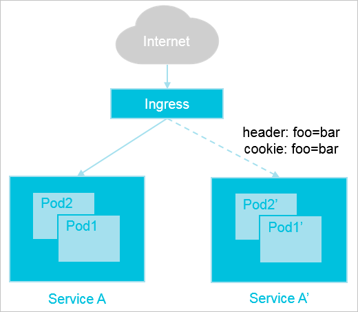
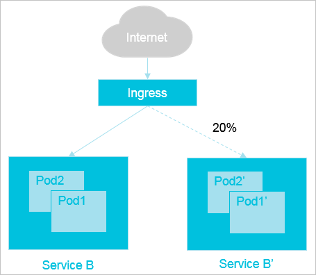

灰度发布是在不影响老版本的前提下，按照一定的规则把部分流量切换到新版本，当新版本试运行一段时间没有问题后，将用户的全量流量从老版本迁移至新版本。

不同灰度方式的优先级由高到低为：

```
canary-by-header`>`canary-by-cookie`>`canary-weight
```

## 应用场景

**基于客户端请求的流量切分场景**

假设当前线上环境，您已经有一套服务Service A对外提供7层服务，此时上线了一些新的特性，需要发布上线一个新的版本Service A'。但又不想直接替换Service A服务，而是希望将请求头中包含`foo=bar`或者Cookie中包含`foo=bar`的客户端请求转发到Service A'服务中。待运行一段时间稳定后，可将所有的流量从Service A切换到Service A'服务中，再平滑地将Service A服务下线。



**基于服务权重的流量切分场景**

假设当前线上环境，您已经有一套服务Service B对外提供7层服务，此时修复了一些问题，需要发布上线一个新的版本Service B'。但又不想将所有客户端流量切换到新版本Service B'中，而是希望将20%的流量切换到新版本Service B'中。待运行一段时间稳定后，再将所有的流量从Service B切换到Service B'服务中，再平滑地将Service B服务下线。



**部署服务**

创建deploy和service

```yaml
apiVersion: apps/v1
kind: Deployment
metadata:
  name: old-nginx
spec:
  replicas: 2
  selector:
    matchLabels:
      run: old-nginx
  template:
    metadata:
      labels:
        run: old-nginx
    spec:
      containers:
      - image: registry.cn-hangzhou.aliyuncs.com/acs-sample/old-nginx
        imagePullPolicy: Always
        name: old-nginx
        ports:
        - containerPort: 80
          protocol: TCP
      restartPolicy: Always
---
apiVersion: v1
kind: Service
metadata:
  name: old-nginx
spec:
  ports:
  - port: 80
    protocol: TCP
    targetPort: 80
  selector:
    run: old-nginx
  sessionAffinity: None
  type: NodePort
```

创建ingress

```yaml
#1.19版本之前的ack
apiVersion: networking.k8s.io/v1beta1
kind: Ingress
metadata:
  name: gray-release
spec:
  rules:
  - host: www.example.com
    http:
      paths:
      # 老版本服务。
      - path: /
        backend:
          serviceName: old-nginx
          servicePort: 80


#1.19版本后的ack
apiVersion: networking.k8s.io/v1
kind: Ingress
metadata:
  name: gray-release
spec:
  rules:
  - host: www.example.com
    http:
      paths:
      # 老版本服务。
      - path: /
        pathType: ImplementationSpecific
        backend:
          service: 
            name: old-nginx
            port:
              number: 80
```

测试访问

```shell
curl -H "Host: www.example.com"  http://<EXTERNAL_IP>
old
```

**灰度发布新版本**

部署新版本的Deployment和Service

```yaml
apiVersion: apps/v1
kind: Deployment
metadata:
  name: new-nginx
spec:
  replicas: 1
  selector:
    matchLabels:
      run: new-nginx
  template:
    metadata:
      labels:
        run: new-nginx
    spec:
      containers:
      - image: registry.cn-hangzhou.aliyuncs.com/acs-sample/new-nginx
        imagePullPolicy: Always
        name: new-nginx
        ports:
        - containerPort: 80
          protocol: TCP
      restartPolicy: Always
---
apiVersion: v1
kind: Service
metadata:
  name: new-nginx
spec:
  ports:
  - port: 80
    protocol: TCP
    targetPort: 80
  selector:
    run: new-nginx
  sessionAffinity: None
  type: NodePort
```

- 设置满足特定规则的客户端才能访问新版本服务。以下示例仅请求头中满足`foo=bar`的客户端请求才能路由到新版本服务。

创建新版服务的ingress

```yaml
#1.19版本前的ack
apiVersion: networking.k8s.io/v1beta1
kind: Ingress
metadata:
  name: gray-release-canary
  annotations:
  # 开启Canary。
  nginx.ingress.kubernetes.io/canary: "true"
  # 请求头为foo。
  nginx.ingress.kubernetes.io/canary-by-header: "foo"
  # 请求头foo的值为bar时，请求才会被路由到新版本服务new-nginx中。
  nginx.ingress.kubernetes.io/canary-by-header-value: "bar"
spec:
  rules:
  - host: www.example.com
    http:
      paths:
      # 新版本服务。
      - path: /
        backend:
          serviceName: new-nginx
          servicePort: 80


#1.19版本后的ack
apiVersion: networking.k8s.io/v1
kind: Ingress
metadata:
  name: gray-release-canary
  annotations:
  # 开启Canary。
  nginx.ingress.kubernetes.io/canary: "true"
  # 请求头为foo。
  nginx.ingress.kubernetes.io/canary-by-header: "foo"
  # 请求头foo的值为bar时，请求才会被路由到新版本服务new-nginx中。
  nginx.ingress.kubernetes.io/canary-by-header-value: "bar" 
spec:
  rules:
  - host: www.example.com
    http:
      paths:
      # 新版本服务。
      - path: /
        pathType: ImplementationSpecific
        backend:
          service: 
            name: new-nginx
            port:
              number: 80
```

查看访问情况

```shell
curl -H "Host: www.example.com"  http://<EXTERNAL_IP>
old

curl -H "Host: www.example.com" -H "foo: bar" http://<EXTERNAL_IP>
new
```

- 在特定规则未被满足时，再按照一定比例将请求路由到新版本服务中。以下示例要求请求头中满足`foo=bar`的客户端请求，若不包含该请求头，再将50%的流量路由到新版本服务中。

修改ingress

```yaml
#1.19版本前的ack
apiVersion: networking.k8s.io/v1beta1
kind: Ingress
metadata:
  name: gray-release-canary
  annotations:
  # 开启Canary。
  nginx.ingress.kubernetes.io/canary: "true"
  # 请求头为foo。
  nginx.ingress.kubernetes.io/canary-by-header: "foo"
  # 请求头foo的值为bar时，请求才会被路由到新版本服务new-nginx中。
  nginx.ingress.kubernetes.io/canary-by-header-value: "bar"
  # 若不满足上述匹配规则，将50%的流量路由到新版本服务new-nginx中。
  nginx.ingress.kubernetes.io/canary-weight: "50"
spec:
  rules:
  - host: www.example.com
    http:
      paths:
      # 新版本服务。
      - path: /
        backend:
          serviceName: new-nginx
          servicePort: 80


#1.19版本后的ack
apiVersion: networking.k8s.io/v1
kind: Ingress
metadata:
  name: gray-release-canary
  annotations:
  # 开启Canary。
  nginx.ingress.kubernetes.io/canary: "true"
  # 请求头为foo。
  nginx.ingress.kubernetes.io/canary-by-header: "foo"
  # 请求头foo的值为bar时，请求才会被路由到新版本服务new-nginx中。
  nginx.ingress.kubernetes.io/canary-by-header-value: "bar" 
  # 若不满足上述匹配规则，将50%的流量路由到新版本服务new-nginx中。
  nginx.ingress.kubernetes.io/canary-weight: "50"
spec:
  rules:
  - host: www.example.com
    http:
      paths:
      # 新版本服务。
      - path: /
        pathType: ImplementationSpecific
        backend:
          service: 
            name: new-nginx
            port:
              number: 80
```

查看访问情况

```shell
curl -H "Host: www.example.com"  http://<EXTERNAL_IP>
old

curl -H "Host: www.example.com" -H "foo: bar" http://<EXTERNAL_IP>
new
```

重复执行以上命令。可以看到，仅请求头中满足`foo=bar`的客户端请求，且只有50%的流量才能路由到新版本服务。

- 设置一定比例的请求被路由到新版本服务中，以下示例中仅50%的流量被路由到新版本服务中。

修改ingress

```yaml
#1.19版本前的ack
apiVersion: networking.k8s.io/v1beta1
kind: Ingress
metadata:
  name: gray-release-canary
  annotations:
  # 开启Canary。
  nginx.ingress.kubernetes.io/canary: "true"
  # 仅允许50%的流量会被路由到新版本服务new-nginx中。
  nginx.ingress.kubernetes.io/canary-weight: "50"
spec:
  rules:
  - host: www.example.com
    http:
      paths:
      # 新版本服务。
      - path: /
        backend:
          serviceName: new-nginx
          servicePort: 80


#1.19版本后的ack
apiVersion: networking.k8s.io/v1
kind: Ingress
metadata:
  name: gray-release-canary
  annotations:
  # 开启Canary。
  nginx.ingress.kubernetes.io/canary: "true"
  # 仅允许50%的流量会被路由到新版本服务new-nginx中。
  nginx.ingress.kubernetes.io/canary-weight: "50"
spec:
  rules:
  - host: www.example.com
    http:
      paths:
      # 新版本服务。
      - path: /
        pathType: ImplementationSpecific
        backend:
          service: 
            name: new-nginx
            port:
              number: 80
```

查看访问情况

```shell
curl -H "Host: www.example.com" http://<EXTERNAL_IP>
```

重复执行以上命令，可以看到仅50%的流量路由到新版本服务。

**删除老版本服务**

系统运行一段时间后，当新版本服务已经稳定并且符合预期后，需要下线老版本的服务 

修改旧版service指向新版本服务

```yaml
apiVersion: v1
kind: Service
metadata:
  name: old-nginx
spec:
  ports:
  - port: 80
    protocol: TCP
    targetPort: 80
  selector:
    # 指向新版本服务。
    run: new-nginx
  sessionAffinity: None
  type: NodePort
```

查看路由访问情况

```shell
curl -H "Host: www.example.com" http://<EXTERNAL_IP>
new
```

删除Canary Ingress资源`gray-release-canary`

```shell
kubectl delete ingress gray-release-canary
```

删除旧版本的Deployment和新版本的Service

```shell
kubectl delete deploy old-nginx
kubectl delete svc new-nginx
```

