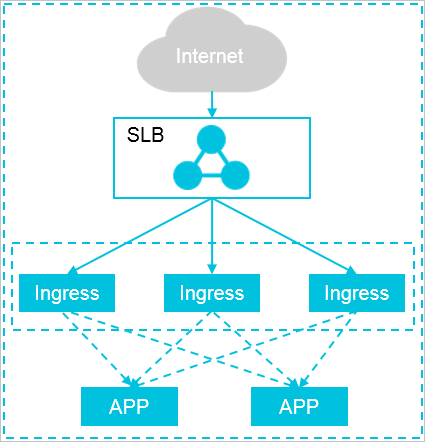

如果您对Ingress Controller有较高稳定性要求，建议系统采用一个Ingress服务独占一个Ingress节点的方式。

建议您不要为Nginx Ingress Controller设定资源限制，避免OOM所带来的流量中断。如果确实有限制的需要，建议资源限制CPU不低于1000 Milicore（YAML配置里格式为`1000m`）和内存不低于2 GiB



当成功创建一个ack集群后，默认情况集群内部已经部署了一套拥有2个Pod副本的Nginx Ingress Controller服务，其前端挂载在一个公网SLB实例上

```shell
kubectl -n kube-system get pod | grep nginx-ingress-controller
nginx-ingress-controller-8648ddc696-2bshk                    1/1     Running   0          3h
nginx-ingress-controller-8648ddc696-jvbs9                    1/1     Running   0          3h

kubectl -n kube-system get svc nginx-ingress-lb
NAME               TYPE           CLUSTER-IP    EXTERNAL-IP      PORT(S)                      AGE
nginx-ingress-lb   LoadBalancer   172.XX.XX.XX   118.XX.XX.XX   80:32XXX/TCP,443:31XXX/TCP   21d
```

## 部署高可靠的Ingress接入层

随着集群业务规模的逐渐扩大，系统需要扩容Ingress接入层，以保证集群接入层的高性能高可用

**方法一：增加Pod副本数量**

将Pod副本数量扩容到3个

```shell
kubectl -n kube-system scale --replicas=3 deployment/nginx-ingress-controller

kubectl -n kube-system get pod | grep nginx-ingress-controller

nginx-ingress-controller-8648ddc696-2bshk                    1/1     Running   0          3h
nginx-ingress-controller-8648ddc696-jvbs9                    1/1     Running   0          3h
nginx-ingress-controller-8648ddc696-xqmfn                    1/1     Running   0          33s
```

**方法二：在指定的高配置节点上部署Ingress服务**

查看当前集群的节点情况

```shell
kubectl get node
NAME                                 STATUS   ROLES    AGE   VERSION
cn-hangzhou.i-bp11bcmsna8d4bp****   Ready    master   21d   v1.11.5
cn-hangzhou.i-bp12h6biv9bg24l****   Ready    <none>   21d   v1.11.5
cn-hangzhou.i-bp12h6biv9bg24l****   Ready    <none>   21d   v1.11.5
cn-hangzhou.i-bp12h6biv9bg24l****   Ready    <none>   21d   v1.11.5
cn-hangzhou.i-bp181pofzyyksie****   Ready    master   21d   v1.11.5
cn-hangzhou.i-bp1cbsg6rf3580z****   Ready    master   21d   v1.11.5
```

给两个节点添加标签，添加标签的节点数量要大于等于集群Pod副本数，从而避免多个Pod运行在同一个节点上

```shell
kubectl label nodes cn-hangzhou.i-bp12h6biv9bg24lmdc2o node-role.kubernetes.io/ingress="true"
kubectl label nodes cn-hangzhou.i-bp12h6biv9bg24lmdc2p node-role.kubernetes.io/ingress="true"
```

更新Deployment，增加nodeSelector配置

```shell
kubectl -n kube-system patch deployment nginx-ingress-controller -p '{"spec": {"template": {"spec": {"nodeSelector": {"node-role.kubernetes.io/ingress": "true"}}}}}'
```

查看Ingress Pod已部署在添加了标签`node-role.kubernetes.io/ingress="true"`的集群节点上

```shell
kubectl -n kube-system get pod -o wide | grep nginx-ingress-controller
```

