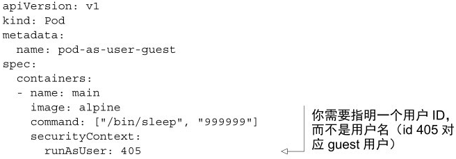
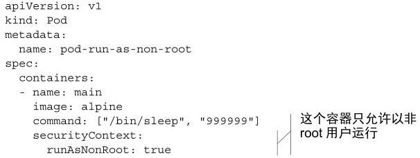
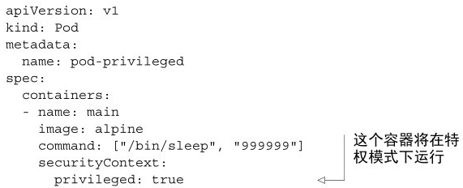
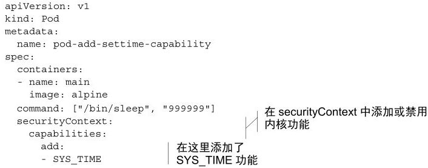
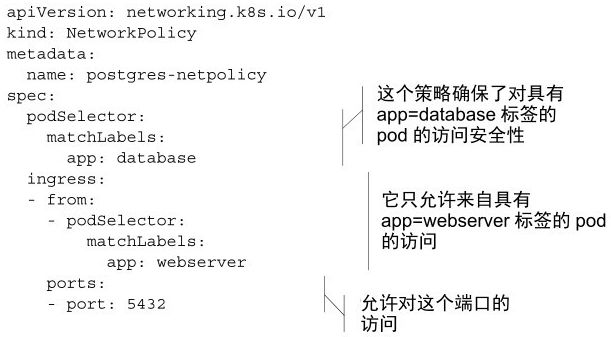
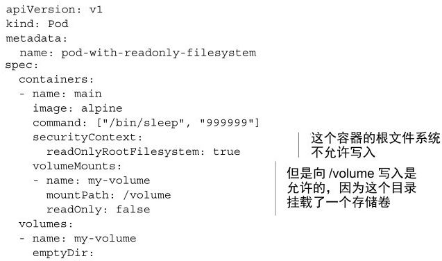
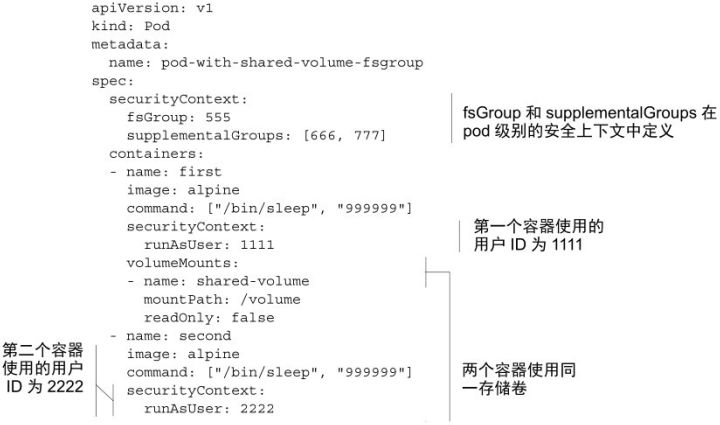
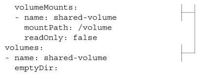

# 配置节点的安全上下文

除了让pod使用宿主节点的Linux命名空间，还可以在pod或其所属容器的描述中通过security-Context选项配置其他与安全性相关的特性。这个选项可以运用于整个pod，或者每个pod中单独的容器。


**安全上下文中可以配置的内容**

指定容器中运行进程的用户（用户ID）。

阻止容器使用root用户运行（容器的默认运行用户通常在其镜像中指定，所以可能需要阻止容器以root用户运行）。

使用特权模式运行容器，使其对宿主节点的内核具有完全的访问权限。

与以上相反，通过添加或禁用内核功能，配置细粒度的内核访问权限。

设置SELinux（Security Enhaced Linux，安全增强型Linux）选项，加强对容器的限制。

阻止进程写入容器的根文件系统。


### 使用指定用户运行容器

为了使用一个与镜像中不同的用户ID来运行pod，需要设置该pod的 `securityContext.runAsUser` 选项。可以通过以下代码清单来运行一个使用guest用户运行的容器，该用户在alpine镜像中的用户ID为405。



查看runAsUser选项的效果：

```shell
$ kubectl exec pod-as-user-guest id
```

### 阻止容器以root用户运行

如果你不关心容器是哪个用户运行的，只是希望阻止以root用户运行呢？

使pod中的容器以非root用户运行，如以下的代码清单所示。



### 使用特权模式运行pod

有时pod需要做它们的宿主节点上能够做的任何事，例如操作被保护的系统设备，或使用其他在通常容器中不能使用的内核功能。

这种pod的一个样例就是kube-proxy pod，修改宿主机的iptables规则来让Kubernetes中的服务规则生效。



```shell
$ kubectl exec -it pod-privileged ls /dev
```

### 为容器单独添加内核功能

相比于让容器运行在特权模式下以给予其无限的权限，一个更加安全的做法是只给予它使用真正需要的内核功能的权限。Kubernetes允许为特定的容器添加内核功能，或禁用部分内核功能，以允许对容器进行更加精细的权限控制，限制攻击者潜在侵入的影响。

例如，一个容器通常不允许修改系统时间（硬件时钟的时间）。可以在容器的capbilities里add一项名为CAP_SYS_TIME的功能



**注意** Linux内核功能的名称通常以 `CAP_` 开头。但在pod spec中指定内核功能时，必须省略 `CAP_` 前缀。

在新的容器中运行同样的命令，可以成功修改系统时间：

```shell
$ kubectl exec -it pod-add-settime-capability -- date +%T -s "12:00:00"

$ kubectl exec -it pod-add-settime-capability -- date
```

**警告** 自行尝试时，请注意这样可能导致节点不可用

### 在容器中禁用内核功能

例如，默认情况下容器拥有CAP_CHOWN权限，允许进程修改文件系统中文件的所有者。

为了阻止容器的此种行为，需要如以下代码清单所示，在容器的securityContext.capabilities.drop列表中加入此项，以禁用这个修改文件所有者的内核功能。



### 阻止对容器根文件系统的写入

因为安全原因，你可能需要阻止容器中的进程对容器的根文件系统进行写入，仅允许它们写入挂载的存储卷。


假如你在运行一个有隐藏漏洞，可以允许攻击者写入文件系统的PHP应用。这些PHP文件在构建时放入容器的镜像中，并且在容器的根文件系统中提供服务。由于漏洞的存在，攻击者可以修改这些文件，在其中注入恶意代码。

这一类攻击可以通过阻止容器写入自己的根文件系统（应用的可执行代码的通常储存位置）来防止。可以如以下代码清单所示，将容器的securityContext.readOnlyRootFilesystem设置为true来实现。




这个pod中的容器虽然以root用户运行，拥有/目录的写权限，但在该目录下写入一个文件会失败：

```shell
$ kubectl exec -it pod-with-readonly-filesystem touch /new-file
```

另一方面，对挂载的卷的写入是允许的：

```shell
$ kubectl exec -it pod-with-readonly-filesystem touch /volume/newfile
$ kubectl exec -it pod-with-readonly-filesystem -- ls -al /volume/newfile
```

如以上例子所示，如果容器的根文件系统是只读的，你很可能需要为应用会写入的每一个目录（如日志、磁盘缓存等）挂载存储卷。

**提示** 为了增强安全性，请将在生产环境运行的容器的readOnlyRootFilesystem选项设置为true。

**设置pod级别的安全上下文**

以上的例子都是对单独的容器设置安全上下文。这些选项中的一部分也可以从pod级别设定（通过pod.spec.securityContext属性）。它们会作为pod中每一个容器的默认安全上下文，但是会被容器级别的安全上下文覆盖。下面将会介绍pod级别安全上下文独有的内容。

### 容器使用不同用户运行时共享存储卷

第6章中已经介绍了如何使用存储卷在pod的不同容器中共享数据。可以顺利地在一个容器中写入数据，在另一个容器中读出这些数据。

但这只是因为两个容器都以root用户运行，对存储卷中的所有文件拥有全部权限。现在假设使用前面介绍的runAsUser选项。你可能需要在一个pod中用两个不同的用户运行两个容器（可能是两个第三方的容器，都以它们自己的特定用户运行进程）。如果这样的两个容器通过存储卷共享文件，它们不一定能够读取或写入另一个容器的文件。

因此，Kubernetes允许为pod中所有容器指定supplemental 组，以允许它们无论以哪个用户ID运行都可以共享文件。这可以通过以下两个属性设置：

- fsGroup
- supplementalGroups

解释它们的效果的最好方法是使用例子说明，下面来看一下如何在pod中使用它们，以及它们效果。以下代码清单描述了一个拥有两个共享同一存储卷的容器的pod。







创建这个pod之后，进入第一个容器查看它的用户ID和组ID：

```shell
$ kubectl exec -it pod-with-shared-volume-fsgroup -c first sh /
```

id命令显示，这个pod运行在ID为1111的用户下，它的用户组为0（root），但用户组555、666、777也关联到了该用户下。

在pod的定义中，将fsGroup设置成了555，因此，存储卷属于用户组ID为555的用户组：

```shell
$ ls -l / | grep volume
```

该容器在这个存储卷所在目录中创建的文件，所属的用户ID为1111（即该容器运行时使用的用户ID），所属的用户组ID为555：

```shell
$ echo foo > /volume/foo
$ ls -l /volume
```

这个文件的所属用户情况与通常设置下的新建文件不同。在通常情况下，某一用户新创建文件所属的用户组ID，与该用户的所属用户组ID相同，在这种情下是0。在这个容器的根文件系统中创建一个文件，可以验证这一点：

```shell
$ echo foo > /tmp/foo
$ ls -s /tmp
```

如你所见，安全上下文中的fsGroup属性当进程在存储卷中创建文件时起作用，而supplementalGroups属性定义了某个用户所关联的额外的用户组。