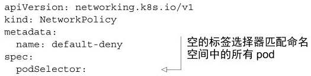
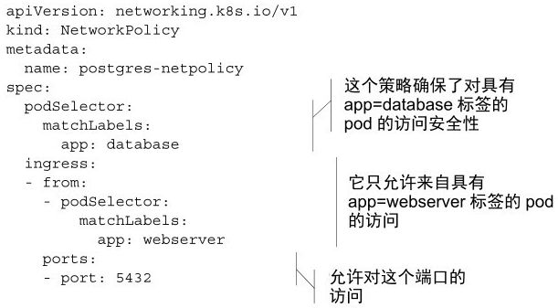
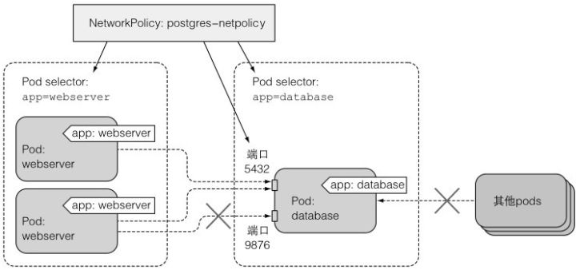
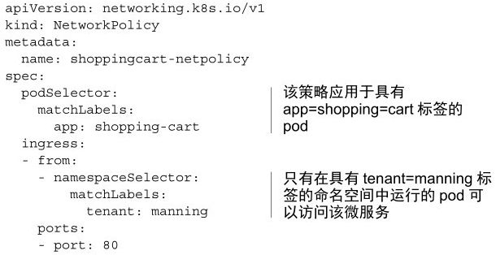
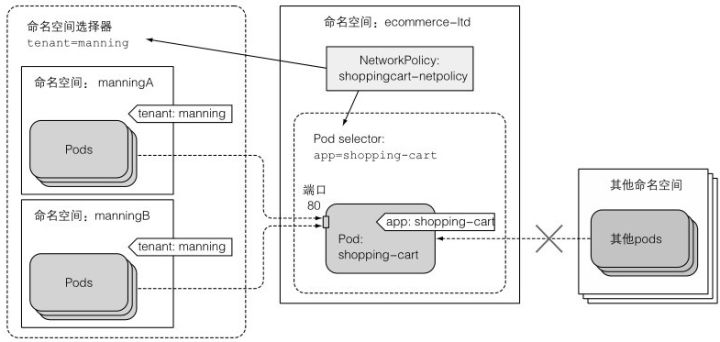
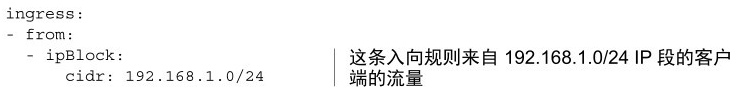
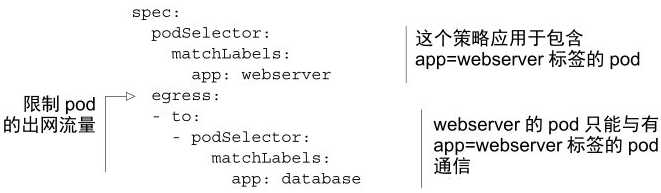

# 隔离pod网络

如何通过限制pod可以与其他哪些pod通信，来确保pod之间的网络安全。

是否可以进行这些配置取决于集群中使用的容器网络插件。如果网络插件支持，可以**通过NetworkPolicy资源配置网络隔离**。

一个NetworkPolicy会应用在匹配它的标签选择器的pod上，指明允许访问这些pod的源地址，或这些pod可以访问的目标地址。

### 在一个命名空间中启用网络隔离

在默认情况下，某一命名空间中的pod可以被任意来源访问。在任一命名空间创建一个default-deny NetworkPolicy，它会阻止任何客户端访问该命名空间的pod。

**注意** 集群中的CNI插件或其他网络方案需要支持NetworkPolicy，否则NetworkPolicy将不会影响pod之间的可达性。

### 仅允许匹配podSelector的pod访问特定的pod

为了允许同一命名空间中的客户端pod访问该命名空间的pod，需要指明哪些pod可以访问。

假设在foo namespace中有一个pod运行PostgreSQL数据库，以及一个使用该数据库的网页服务器pod，其他pod也在这个命名空间中运行，然而你不允许它们连接数据库。为了保障网络安全，需要在数据库pod所在的命名空间中创建一个如以下代码清单所示的NetworkPolicy资源。

例子中的NetworkPolicy允许具有app=webserver标签的pod访问具有app=database的pod的访问，并且仅限访问5432端口

客户端pod通常通过Service而非直接访问pod来访问服务端pod，但这对结果没有改变。NetworkPolicy在通过Service访问时仍然会被执行。

### 仅允许匹配namespaceSelector的命名空间的pod访问特定的pod

以上NetworkPolicy保证了只有具有tenant=manning标签的命名空间中运行的pod可以访问标签为app=Shopping Cart的pod

### 允许某个网段的pod访问指定的pod

除了通过在pod 选择器或命名空间选择器定义哪些pod可以访问NetworkPolicy资源中指定的目标pod，还可以通过CIDR表示法指定一个IP段。例如，为了允许IP在 `192.168.1.1` 到 `192.168.1.255` 范围内的客户端访问之前提到的shoppingcart的pod，可以在入向规则中加入如以下代码清单所示的代码。

### 限制pod的对外访问流量

在之前的所有例子中，已经通过入向规则限制了进入pod的访问流量。然而，也可以通过出向规则限制pod的对外访问流量。以下代码清单展示了一个例子。

以上的NetworkPolicy仅允许具有标签app=webserver的pod访问具有标签app=database的pod，除此之外不能访问任何地址（不论是其他pod，还是任何其他的IP，无论在集群内部还是外部）。