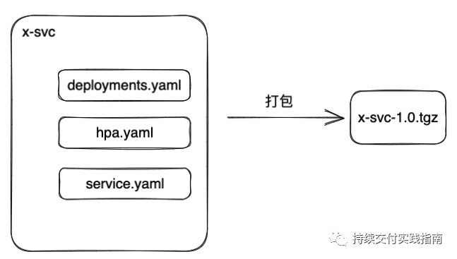
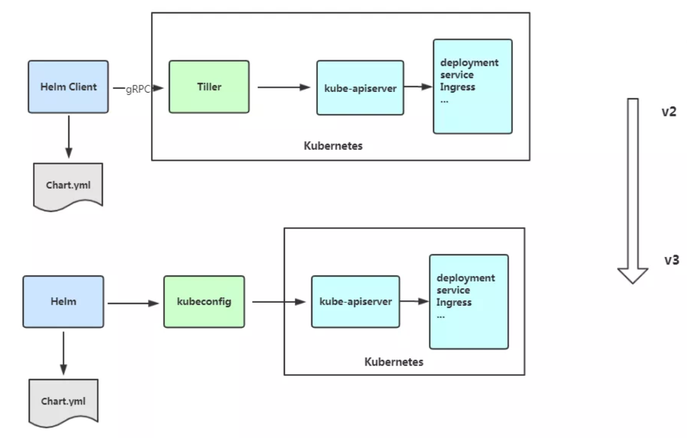
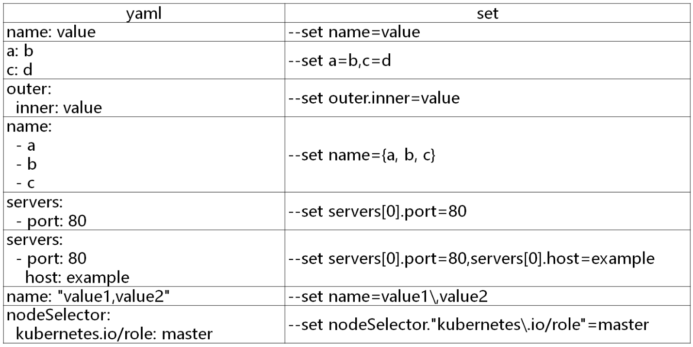
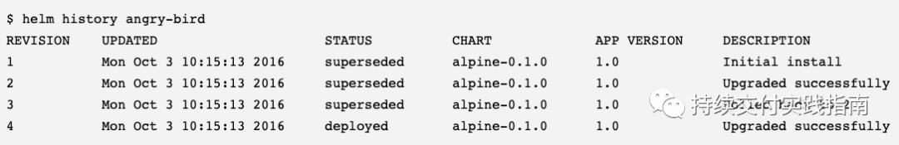

# Helm

## Helm安装

K8s 版本支持的各个 helm 版本对照表：

https://helm.sh/zh/docs/topics/version_skew/

Helm安装文档

[Helm | Installing Helm](https://helm.sh/docs/intro/install/)

Helm安装包

[Releases · helm/helm (github.com)](https://github.com/helm/helm/releases)


```
wget https://get.helm.sh/helm-v3.0.0-linux-amd64.tar.gz
tar zxvf helm-v3.0.0-linux-amd64.tar.gz 
mv linux-amd64/helm /usr/bin/
```

## 为什么用helm

**传统服务部署到k8s集群的流程**：拉去代码-打包编译-构建镜像-准备一堆相关的yaml文件（如deployment、service、ingress等）-kubectl apply部署到k8s集群

**传统方式部署引发的问题**：

随着引用的增多，需要维护大量的yaml文件；

不能根据一套yaml文件来创建多个环境，比如一般环境分为dev、预生产、生产环境，部署完dev后面再部署预生产和生产，还需要复制出两套并手动修改才行


## k8s包管理本质

如果在没有包管理的场景下部署资源，就需要一个一个文件手动执行`kubectl apply -f`，卸载资源又要手动执行`kubectl delete -f`

所以每次发布，你都必须有一个发布记录，记录下哪些YAML要执行apply，哪些yaml要执行delete。而且delete后，你还要记得将那个文件从文件夹中删除。


所以k8s的包管理器其实就两个核心功能：

1. 自动化执行资源更新
2. 跟踪资源更新记录

## helm是如何实现包管理

假如存在一个微服务x，我们将其部署到Kubernetes中，需要准备Deployment、HPA、Service的这三种资源的YAML文件。这三个文件，统一放在一个文件夹中。

**Helm本身是一个命令行工具**。通过package子命令`helm package x-service --version 1.0`，可以将整个文件夹打包成一个tgz的压缩包。



这个tgz包，我们称之为**Chart包**，本质上就是一堆k8s资源文件的集合。我们可以将Chart包上传到Nexus这类制品管理工具进行版本化控制。

在有了Chart包以后，我们可以通过命令 `helm install <release> <chart路径>`将svc安装到指定的Kubernetes集群上。

**release**：用chart包部署一个实例，每执行一次helm install，就会创建一个唯一的release。通常我们使用应用名作为发布名。release这个概念在资源变更跟踪中环节非常重要。

## 模板

实际工作中，我们还会有y-svc、z-svc……n个服务。我们是不是每个服务要创建一个Chart？另外，每个服务都将被部署到三个环境中，那么，是不是每个环境还要单独又创建一个Chart？

helm通过模板解决这个问题，就是将chart中资源文件中容易变化的部分抽离出来变成变量，不变的部分变成模板

变量部分配置统一放在Chart包中的values.yaml文件中

对于Chart中不变的部分，Helm使用gotemplate模板语言进行描述。就是说我们可以在deployments.yaml中直接写gotemplate模板语言了

在写Helm的gotemplate模板时，建议不要写太复杂的逻辑，代码宁可重复，甚至另创建一个新的Chart。 

## Helm v3的变化

1. 架构变化：移除了tiller组件，直接使用kubeconfig和apiserver通信

   

2. `Release`名称可以在不同命名空间重用

3. 支持将 Chart 推送至 Docker 镜像仓库中  

4. 使用JSONSchema验证chart values  

5. 其他

   1）为了更好地协调其他包管理者的措辞 `Helm CLI `个别更名

   ```
   helm delete 更名为 helm uninstall
   helm inspect 更名为 helm show
   helm fetch 更名为 helm pull
   ```

   但以上旧的命令当前仍能使用。

   2）移除了用于本地临时搭建 `Chart Repository `的 `helm serve` 命令。

   3）自动创建名称空间

   在不存在的命名空间中创建发行版时，Helm 2创建了命名空间。Helm 3遵循其他Kubernetes对象的行为，如果命名空间不存在则返回错误。

   4） 不再需要`requirements.yaml`, 依赖关系是直接在`chart.yaml`中定义。 

## Helm常用命令

| **命令**   | **描述**                                                     |
| ---------- | ------------------------------------------------------------ |
| create     | 创建一个chart并指定名字                                      |
| dependency | 管理chart依赖                                                |
| get        | 下载一个release。可用子命令：all、hooks、manifest、notes、values |
| history    | 获取release历史                                              |
| install    | 安装一个chart                                                |
| list       | 列出release                                                  |
| package    | 将chart目录打包到chart存档文件中                             |
| pull       | 从远程仓库中下载chart并解压到本地  # helm pull stable/mysql --untar |
| repo       | 添加，列出，移除，更新和索引chart仓库。可用子命令：add、index、list、remove、update |
| rollback   | 从之前版本回滚                                               |
| search     | 根据关键字搜索chart。可用子命令：hub、repo                   |
| show       | 查看chart详细信息。可用子命令：all、chart、readme、values    |
| status     | 显示已命名版本的状态                                         |
| template   | 本地呈现模板                                                 |
| uninstall  | 卸载一个release                                              |
| upgrade    | 更新一个release                                              |
| version    | 查看helm客户端版本                                           |

## 使用

### 配置chart仓库

- 微软仓库（http://mirror.azure.cn/kubernetes/charts/）这个仓库强烈推荐，基本上官网有的chart这里都有。
- 阿里云仓库（https://kubernetes.oss-cn-hangzhou.aliyuncs.com/charts  ）

```shell
#先添加常用的chart源
helm repo add stable http://mirror.azure.cn/kubernetes/charts

#查看chart源列表
helm repo list
NAME      	URL                                                   
stable      	http://mirror.azure.cn/kubernetes/charts

#查看安装的charts
helm list -n ingress-nginx
NAME         	NAMESPACE    	REVISION	UPDATED                                	STATUS  	CHART              	APP VERSION
ingress-nginx	ingress-nginx	2       	2022-02-20 22:32:33.553648308 +0800 CST	deployed	ingress-nginx-3.6.0	0.40.2

#删除存储库
helm repo remove aliyun
```

### helm在线部署一个应用

```shell
#查找chart
helm search repo
helm search repo mysql

#查看chart信息：
helm show chart stable/mysql

#安装包
helm install db stable/mysql
#调试，只看看能不能运行不部署
helm install <release名称> --dry-run .

#查看发布状态：
helm status db
```

### 安装前自定义chart配置选项

上面部署的mysql并没有成功，这是因为并不是所有的chart都能按照默认配置运行成功，可能会需要一些环境依赖，例如PV。

所以我们需要自定义chart配置选项，安装过程中有两种方法可以传递配置数据：

- --values（或-f）：指定带有覆盖的YAML文件。这可以多次指定，最右边的文件优先
- --set：在命令行上指定替代。如果两者都用，--set优先级高

```shell
# cat config.yaml 
persistence:
  enabled: true
  storageClass: "managed-nfs-storage"
  accessMode: ReadWriteOnce
  size: 8Gi
mysqlUser: "k8s"
mysqlPassword: "123456"
mysqlDatabase: "k8s"

helm install db -f config.yaml stable/mysql
helm install db --set persistence.storageClass="managed-nfs-storage" stable/mysql
```

把chart包下载下来查看详情：

```shell
helm pull stable/mysql --untar #将nginx包从创库拉到当前目录
#查看结构
[root@master charts]# tree nginx/
nginx/ #chart包的名称
├── Chart.yaml #Chart的基本信息，包括chart版本，名称等
├── charts #存放这个chart依赖的所有子chart
├── README.md
├── templates #存放应用一系列 k8s 资源的 yaml 模板
│   ├── deployment.yaml
│   ├── _helpers.tpl #下划线开头，定义一些可重用的模板片断，放了一些templates目录下这些yaml都有可能会用的一些模板
│   ├── ingress.yaml
│   ├── NOTES.txt #用于介绍Chart帮助信息
│   ├── server-block-configmap.yaml
│   ├── servicemonitor.yaml
│   ├── svc.yaml
│   └── tls-secrets.yaml
└── values.yaml #用于渲染模板的文件，定义template目录下的yaml文件可能引用到的变量

2 directories, 13 files
```

values yaml与set使用：



### 构建一个Helm Chart

```shell
helm create mychart #chart包名称为mychart
Creating mychart

tree mychart/
mychart/
├── charts
├── Chart.yaml
├── templates
│   ├── deployment.yaml
│   ├── _helpers.tpl
│   ├── ingress.yaml
│   ├── NOTES.txt
│   └── service.yaml
└── values.yaml
```

创建Chart后，接下来就是将其部署：

```shell
helm install web mychart/ #release名称：web，指定chart包：mychart
```

查看部署好的release信息：

```shell
helm get manifest web
```

列出创建的实例名：

```shell
helm list|grep web
```

删除release：

```shell
helm uninstall web
helm list|grep web
```

也可以打包推送的charts仓库共享别人使用。

```shell
helm package mychart/
mychart-0.1.0.tgz
```

### 升级、回滚和删除

发布新版本的chart时，或者当您要更改发布的配置时，可以使用该`helm upgrade` 命令。

```
# helm upgrade --set imageTag=1.17 web mychart
# helm upgrade -f values.yaml web mychart
```

如果在发布后没有达到预期的效果，则可以使用`helm rollback release名 版本号 `回滚到之前的版本。

```shell
#将应用回滚到上一个版本
helm rollback web
#将应用回滚到第一个版本，版本号可以用<helm history release名称>查看
helm rollback web 1 
```

卸载发行版，请使用以下`helm uninstall`命令：

```
# helm uninstall web
```

查看历史版本配置信息

```
# helm get --revision 1 web
```


1. 当首次部署时，使用install，这时，Helm会直接在指定命名空间（默认是default）下，创建一个helm.sh/release类型的secret。secret的名称定义为：sh.helm.release.v1.release.v1。secret的内容是这次执行的所有的Kubernetes资源的YAML内容。
2. 当使用upgrade更新时，Helm从sh.helm.release.v1.release.v1的secret取出所有的YAML资源内容与本次将要执行更新的YAML资源内容进行对比，计算出本次更新需要执行的操作，是删除，变更。
3. 当upgrade执行成功，Helm会创建名为sh.helm.release.v1.release.v2的secret。当你看到这个v2的时候，你就已经知道了。Helm是通过结合secret的名称约定和secret的内容来记录下每一次发布的。当下次upgrade时，Helm会取v2的secret，然后执行更新，并创建v3的secret。以此类推。

为了展示的更友好，Helm把这些底层都隐藏下来了，所以，当你执行history指令时，你看到的将是：


