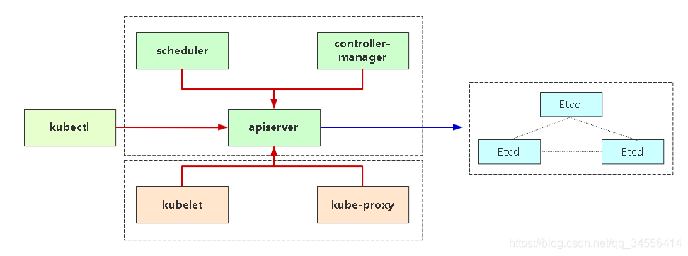

• 管理节点：如果是kubeadm部署则自动生成，如果是二进制部署一般由cfssl或者openssl生成。

• 工作节点：工作节点主要是指kubelet连接apiserver所需的客户端证书，这个证书由controller-manager组件自动颁发，默认是一年，如果到期，kubelet将无法使用过期的证书连接apiserver，从而导致无法正常工作，日志会给出证书过期错误（x509: certificate has expired or is not yet valid）（工作节点容易忽略掉证书有效期）


kubeadm部署的两套证书都放在这里

```shell
ll /etc/kubernetes/pki/
total 76
-rw-r--r-- 1 root root 1281 Nov 13  2021 apiserver.crt
-rw-r--r-- 1 root root 1135 Nov 13  2021 apiserver-etcd-client.crt
-rw------- 1 root root 1679 Nov 13  2021 apiserver-etcd-client.key
-rw------- 1 root root 1679 Nov 13  2021 apiserver.key
-rw-r--r-- 1 root root 1143 Nov 13  2021 apiserver-kubelet-client.crt
-rw------- 1 root root 1679 Nov 13  2021 apiserver-kubelet-client.key
-rw-r--r-- 1 root root 1066 Nov 13  2021 ca.crt
-rw------- 1 root root 1675 Nov 13  2021 ca.key
drwxr-xr-x 2 root root  162 Nov 13  2021 etcd
-rw-r--r-- 1 root root 1078 Nov 13  2021 front-proxy-ca.crt
-rw------- 1 root root 1679 Nov 13  2021 front-proxy-ca.key
-rw-r--r-- 1 root root 1103 Nov 13  2021 front-proxy-client.crt
-rw------- 1 root root 1679 Nov 13  2021 front-proxy-client.key
-rw------- 1 root root 1679 Nov 13  2021 sa.key
-rw------- 1 root root  451 Nov 13  2021 sa.pub
```


 Apiserver也是需要https去访问，etcd也一样，包括从etcd当中读写数据都要携带证书去访问



红线：K8s自建证书颁发机构（CA），需携带由它生成的客户端证书访问apiserver

蓝色：Etcd自建证书颁发机构（CA），需携带由它生成的客户端证书访问etcd

如果Kube-apiserver controller-manager scheduler这三个组件部署在一块，那么都是使用非安全端口去访问，也就是apiserver提供了两个端口（对本地127.0.0.1:8080,对外的就是ip:6443）


## 证书续签

不管你是kubeadm安装的还是二进制安装的，管理节点不管证书有效期有多长5年，10年，工作节点证书有效期限都是1年， 就会出现证书过期的情况。

**容易过期的是ca证书派发出来的证书文件**，这里的过期时间是客户端的证书。（因为ca证书有效期是10年，足够用了，主要过期的是ca派发出来的证书）


先看 下kubeadm 客户端证书过期时间：

```shell
[root@k8s-master01 ~]# kubeadm alpha certs check-expiration
Command "check-expiration" is deprecated, please use the same command under "kubeadm certs"
[check-expiration] Reading configuration from the cluster...
[check-expiration] FYI: You can look at this config file with 'kubectl -n kube-system get cm kubeadm-config -o yaml'

CERTIFICATE                EXPIRES                  RESIDUAL TIME   CERTIFICATE AUTHORITY   EXTERNALLY MANAGED
admin.conf                 Nov 13, 2022 07:40 UTC   126d                                    no      
apiserver                  Nov 13, 2022 07:40 UTC   126d            ca                      no      
apiserver-etcd-client      Nov 13, 2022 07:40 UTC   126d            etcd-ca                 no      
apiserver-kubelet-client   Nov 13, 2022 07:40 UTC   126d            ca                      no      
controller-manager.conf    Nov 13, 2022 07:40 UTC   126d                                    no      
etcd-healthcheck-client    Nov 13, 2022 07:40 UTC   126d            etcd-ca                 no      
etcd-peer                  Nov 13, 2022 07:40 UTC   126d            etcd-ca                 no      
etcd-server                Nov 13, 2022 07:40 UTC   126d            etcd-ca                 no      
front-proxy-client         Nov 13, 2022 07:40 UTC   126d            front-proxy-ca          no      
scheduler.conf             Nov 13, 2022 07:40 UTC   126d                                    no      

CERTIFICATE AUTHORITY   EXPIRES                  RESIDUAL TIME   EXTERNALLY MANAGED
ca                      Nov 11, 2031 07:40 UTC   9y              no      
etcd-ca                 Nov 11, 2031 07:40 UTC   9y              no      
front-proxy-ca          Nov 11, 2031 07:40 UTC   9y              no
```

手动更新证书：

```shell
kubeadm alpha renew all
systemctl restart kubelet
```

自动续签：

1、配置kube-controller-manager 组件，从新为kubelet客户端证书颁发（如果已配置请忽略）
2、开启kubelet 证书轮转